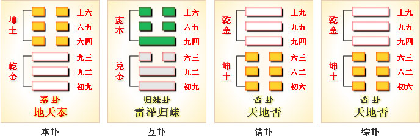
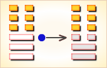

# 泰 ䷊


泰（tài）卦展示“泰”形势下各种变化的可能性。

“泰”是安定的意思。泰卦的代号是`7:0`，主卦是乾卦，卦象是天，阳数是`7`；客卦是坤卦，卦象是地，阳数是`0`。

主方应当利用当前全面和谐的好形势，给于客方实惠，从而取得更多利益。

内阳而外阴，内健而外顺，内君子而外小人，君子道长，小人道消也。

- 卦序：11

> 泰，小往大來，吉亨。
>《彖》曰：泰，小往大來，吉亨，則是天地交而萬物通也，上下交而其志同也。內陽而外陰，內健而外順，內君子而外小人。君子道長，小人道消也。
>《象》曰：天地交，泰。后以財成天地之道，輔相天地之宜，以左右民。

> 初九，拔茅茹，以其彙，征吉。
>《象》曰：拔茅征吉，志在外也。

> 九二，包荒，用馮河，不遐遺，朋亡，得尚于中行。
>《象》曰：包荒，得尚于中行，以光大也。

> 九三，无平不陂，无往不復。艱貞，无咎。勿恤其孚，于食有福。
>《象》曰：无往不復，天地際也。

> 六四，翩翩，不富以其鄰，不戒以孚。
>《象》曰：翩翩不富，皆失實也；不戒以孚，中心願也。

> 六五，帝乙歸妹，以祉元吉。
>《象》曰：以祉元吉，中以行願也。

> 上六，城復于隍，勿用師。自邑告命，貞吝。
>《象》曰：城復于隍，其命亂也。

### 概述

泰卦下面的三条爻是主卦，代表主方的状态；上面的三条爻是客卦，代表客方的情况。图中，红色的爻表示当位的爻，就是说，从主方的角度考虑，阴阳属性对主方有利；天蓝色的爻表示不当位的爻，就是说，该爻的阴阳属性对主方不利。图中的箭头表示爻之间的有应关系，有应表示主卦与客卦的相应一对爻是一阴一阳，阴阳和谐；不然，不有应，不和谐。图的左边是爻辞，爻辞是说明爻的，与爻一一对应，顺序是由下到上。图的下边，泰是卦名，其后是卦辞。卦辞是从总体上说明卦的含义。

图中有三个箭头，表示主卦和客卦的三对爻全部和谐，其中，两对爻的起端和终端都是当位的爻，当位而又有应，是对主方有利因素，主方应当坚持下去。有一个箭头的起端和终端是不当位的爻，不当位而有应是对主方不利因素。这对不当位而有应的爻是主卦和客卦的中爻，代表主方和客方的素质。主卦中爻是阳爻，表示主方素质良好，有可能在与客方的交往中受到损失；客卦中爻是阴爻，表示客方素质不佳，需要从主方取得补益。正好主方良好素质满足客方需要，主方将不可避免地在与客方交往中受到损失，所以说这是对主方不利因素。

然而，从总体上考虑，由于主方积极进取，客方消极被动，主方态度强硬，客方态度随和，主方可以依靠良好素质，在满足客方需要的同时，逼使客方按主方意图行事，从而主方可以得到更多利益，所以卦辞说“小往大来”，给于客方一些利益，这是“小往”，取得更多利益，这是“大来”。其结果对主方非常有利，“吉”。主方的进展可以很顺利，“亨”。

泰卦的爻辞具体地说明主方如何可以做到“小往大来”。删去判断词，爻辞就是一首完整的关于如何做到“小往大来”的大纲。下面是其译文：

```
像是拔柔软的小草，将草叶汇聚在一起。（维持统一）
包括荒凉的原野，越过河川，不遗漏遥远地方，
广阔无与伦比，公正的行为得到尊崇。（处事公正）
没有平坦而不坡斜的地方，没有往前而不反复的路，
不用担忧他们的信任，给予食物就有福气。（给于基本福利）
轻快地行事，不以取得邻居的利益而富裕，
以诚恳取得信任，他们不再戒备。（取信于民）
像帝乙出嫁妹妹，以此得到他们的福佑。（亲密沟通）
他们的城墙倒复在城壕中，不需用兵，他们来报告国情。
```

## 卦辞解释
```
〖原文〗小往大来，吉，亨。
〖译文〗付出小，收益大，吉祥，顺利。
〖解说〗这是泰卦卦辞，综合说明当前形势。
主卦的卦象是天，天有无穷威力；
客卦卦象是地，地对天无限顺从。
因此，整个形势对主方有利。
“小往大来”，交往中主方付出小，收益大。
“吉”，形势对主方吉利。“亨”，进展顺利。
```

### 一阳
```
〖原文〗拔茅茹，以其汇，征吉。
〖译文〗拔柔软小草的时候，将草叶会合在一起拔；出征吉利。
〖解说〗这是泰卦第一爻爻辞，
代表主方的行动，阳，
表示主方积极主动地谋取和扩大自己的利益，
比如说，创新、创业、投资、进攻、求职、示爱，等等。
“茅”（máo），草本植物。
“茹”（rú），柔软：柔茹而寡断。
“汇”（huì），会合。主方与客方的利益像草一样缠合在一起。

第四爻是阴爻，客方被动，因此，客方依附于主方。
如果主方主动，吉利。在主方采取积极主动的时候，
须要考虑客方利益，并且协同客方一起行动，“拔茅茹，以其汇”。
爻辞没有说不主动就不吉利的意思。
因此，“出征”，可以更广义地解释为对客方采取主动行动，
不一定非得要采取进攻形式。

〖结构分析〗第一爻是主卦上爻，
其位置是阳位，这条爻是阳爻，
阳爻在阳位，当位，并且与四阴有应。
当位，表明主方积极主动，可能有利于发展，
从而取得更多利益，是潜在的对主方有利因素；
有应，表明客方消极被动，是主方发展的好机会，
这潜在因素成了真正的对主方有利因素，所以爻辞说“征吉”。
```

### 二阳
```
〖原文〗包荒，用冯河，不遐遗；朋亡，得尚于中行。
〖译文〗包括荒凉的原野，越过河川，
不遗漏遥远地方，广阔无与伦比，公正的行动得到尊崇。
〖解说〗这是泰卦第二爻爻辞，这是阳爻，表示主方素质是阳，
比如说，主方有资金、有地位、有权力、有实力、有技术，等等。
“包荒”中“包”（bāo）指包括，无所不包。
“荒”（huāng），荒野，落荒而逃。
“冯”（píng）指涉水。“遐”（xiá）是远，遐方。
“朋”（péng）是比，伦比，硕大无朋。
“尚”（shàng）是尊崇，高尚。
主方良好素质是对积极主动行动的有力支持，
主方应当充分发挥自己力量，
用自己的力量强化主客双方关系，“包荒，用冯河”。
“中行”，不左不右地走中间。
在广泛的范围内，主方处事不偏不向，公正公平，取得客方尊重。

〖结构分析〗第二爻是主卦中爻，其位置是阴位，
这条爻是阳爻，阳爻在阴位，不当位，不过，和五阴有应。
不当位，表明主方良好素质有可能在与客方交往中遭受损失；
有应，表明客方素质不佳，需要从主方取得补益，
这潜在因素成了真正的对主方不利因素。
然而，由于主方积极主动，客方消极被动，
以及主方态度强硬，客方态度随和，
主方有可能依靠良好素质，
逼使客方按自己的意图行事，这实际上对主方有利。
不过主方应当处事公平，取得客方尊重，
这样主方的良好素质才能真正发挥作用，所以爻辞强调“得尚于中行”。
```

### 三阳
```
〖原文〗无平不陂，无往不复；
艰贞无咎，勿恤其孚，于食有福。
〖译文〗没有平坦而不坡斜的地方，没有往前而不反复的路，
艰苦坚持就无所怪罪，不用担忧他们的信任，给予食物就有福气。
〖解说〗这是泰卦第三爻爻辞，阳爻，表示主方态度强硬。
“恤”（xù）是忧虑。在与客方交往中，可能会有许多问题，
许多反复，主方态度不宜过分强硬，
应当比较灵活而柔和地处理双方关系中的各种问题，
要认识到，“无平不陂，无往不复”，
如果艰苦地坚持下去，就无所怪罪。
不用担心客方是否信任主方，
如果主方为客方做些实事，主方就有福气，“于食有福”。

〖结构分析〗第三爻是主卦上爻，其位置是阳位，
这条爻是阳爻，阳爻在阳位，当位，又与六阴有应。
当位，表明主方强硬态度可能有助于主方制约客方，
是潜在的对主方有利因素；
有应，表明客方态度随和，接受主方制约，
这潜在因素成了真正的对主方有利因素。
不过，第三爻是对第二爻的补充，这两条爻都是阳爻，
表明主方素质非常好，实力极强，
这样就可能对客方过于强硬，从而引起客方不信任。
为了取得客方信任，主方应当态度强硬适当，
不能过度，还要以自己良好素质，
为客方做实事，所以爻辞强调“艰贞无咎”，“于食有福”。
```

### 四阴
```
〖原文〗翩翩，不富以其邻，不戒以孚。
〖译文〗轻快地行事，不以取得邻居的利益而富裕，
以诚恳取得信任，他们不再戒备。
〖解说〗这是泰卦第四爻爻辞，阴性。
“翩”（piān），很快地飞，翩翩，轻快地飞舞。
这条爻表示客方行动被动，客方顺从主方，
为主方的积极行动创造了良好条件。
结合主客形势，这条爻辞的意思是：
主方轻快地进入客方利益领域；
主方不损伤客方利益，对待客方诚意，使客方不加戒备。
主方不宜依仗自己的实力损害客方利益，“翩翩，不富以其邻”，
而应当与客方协同，在协同合作中，
以诚信取得客方信任，通过发展与开拓，取得自己的利益。

〖结构分析〗第四爻是客卦下爻，
其位置是阴位，这条爻是阴爻，
阴爻在阴位，当位，并且和一阳有应。
当位，表明客方消极被动有可能为主方发展提供方便，
是潜在的对主方有利因素；
有应，表明主方积极主动，正好利用客方提供的机会，
这潜在因素成了真正的对主方有利因素。
不过，主方应当尊重客方利益，取得客方信任，
才有利于主方发展，所以爻辞强调“不戒以孚”。
```

### 五阴
```
〖原文〗帝乙归妹，以祉元吉。
〖译文〗像帝乙出嫁妹妹，以此得到他们的福佑，非常吉利。
〖解说〗这是泰卦第五爻爻辞，
阴，表示客方素质不佳，
比如说，资金缺乏、地位底下、实力薄弱、教育程度低，等等。
“祉”（zhǐ），福。“帝乙归妹”是历史典故，
这里用历史典故说明主方与客方建立亲善关系。
“妹”指少女，“归妹”指嫁女。
主方素质良好，主方以自己良好素质帮助客方，像帝乙归妹那样，
主方与客方建立亲善关系，以此主方受益，非常吉利。

〖结构分析〗第五爻是客卦中爻，其位置是阳位，
这条爻是阴爻，阴爻在阳位，
不当位，然而与二阳有应。
不当位，表明客方素质不佳，
有可能向主方索取利益，是潜在的对主方不利因素；
有应，表明主方素质良好，有可能满足客方需要，对主方不利因素。
然而，由于主方积极主动，客方消极被动，以及主方制约客方，
主方有可能给于客方实惠而同时获得更多利益，
这种情况对主方非常有利，所以爻辞说“元吉”。
```

### 六阴
```
〖原文〗城复于隍，勿用师；自邑告命，贞吝。
〖译文〗他们的城墙倒复在城壕中，
不需用兵，他们来报告国情，坚持下去就过分。
〖解说〗这是泰卦第六爻爻辞，
阴，表示客方态度随和。
“复”（fù），翻倒。“隍”（huáng），没有水的城壕。
“邑”（yì），都城，古时指诸侯国国家。
这里，“邑”指客方。“告命”，报告情况。
《左传》有段说：“宋不告命，故不书。”
意思是：宋国没有报告情况，所以不写入春秋。
“城复于隍”形象地指客方态度随和，
“勿用师”指主方不需要对客方采取强硬措施。
“自邑告命”，从这个诸侯国有使者来报告情况了，
以此为比喻，说明客方服从主方了。

〖结构分析〗第六爻是客卦上爻，
其位置是阴位，
这条爻是阴爻，阴爻在阴位，
当位，又与三阳有应。
当位，表明客方态度随和，
可能有利于主方按自己的意图行事，
是潜在的对主方有利因素；
有应，表明主方态度强硬，
正好可以利用客方的随和态度按自己的意图办事，
这潜在因素成了真正的对主方有利因素。
然而，第六爻是对第五爻的补充，这两条爻都是阴爻，
表示客方素质很差，力量极薄弱，而相比之下，主方实力极强，
主方有可能对客方过于粗暴和傲慢，这种情况对主方不利，
所以爻辞强调“贞吝。”主方的态度不宜过分强硬。
```

### 地天泰 应时而变 中中卦

学文满腹入场闱，三元及第得意回，从今解去愁和闷，喜庆平地一声雷。

《象》曰：学文满腹入场闱，三元及第得意回，从今解去愁和闷，喜庆平地一声雷。

### 另解1
```
泰：小往大来，吉，亨。
【白话】《泰卦》象征通达：“小往”指坤到了外面（外卦），
“大来”指乾到了里面（内卦），吉祥，亨通。
《象》曰：天地交，泰；
后以财成天地之道，辅相天地之宜，以左右民。
【白话】《象传》说：
《泰卦》的卦象为乾（天）下坤（地）上，
地气上升，乾气下降，
为地气居于乾气之上之表象，
阴阳二气一升一降，互相交合，顺畅通达；
君主这时要掌握时机，善于裁节调理，以成就天地交合之道，
促成天地化生万物之机宜，护佑天下百姓，使他们安居乐业。

初九，拔茅茹，以其汇，征吉。
【白话】初九，拔起了一把茅草，
它们的根相连在一起，真是物以类聚，共同往前行进是吉祥的。
《象》曰：拔茅征吉，志在外也。

九二，包荒，用冯河，不遐遗；朋亡，得尚于中行。
《象》曰：“包荒”，“得尚于中行”，以光在也。
【白话】《象传》说：“有包容大川似的宽广胸怀”，
“能够辅佐公正有道德的君主”，说明自己光明正大，道德高尚。

九三，无平不陂，无往不复；
艰贞无咎，勿恤其孚，于食有福。
【白话】九三，没有都是平地而没有山坡的，
没有只出去不回来的，坚守正道总是会有艰难的，
但这样能够避免过失，不要忧虑诚信的作用，自可有盛宴福庆。
《象》曰：“无往不复”，天地际也。

六四，翩翩，不富以其邻，不戒以孚。
【白话】六四，像飞鸟连翩下降，虚怀若谷，
这样与邻居相处，不互相戒备，彼此以诚相见，讲求信用。

六五，帝乙归妹，以祉元吉。
【白话】六五，像帝乙出嫁妹妹，
以此得到他们的福佑，非常吉利。

上六，“城复于隍”；勿用师，自邑告命，贞吝。
【白话】上六，城墙倒塌在久已干涸的护城壕沟里；
这时不可进行战争，要发布自行贬责文告，
即使坚持正道也难免灾祸。

《象》曰：城复于隍，其命乱也。
【白话】《象传》说：“城墙倒塌在久已干涸的护城壕沟里”，
说明形势已经向错乱不利的方面转化，其前景是不大美妙的。
```

### 另解2
```
初九，拔茅茹，以其汇，征吉。
【白话】初九，拔起了一把茅草，
它们的根相连在一起，真是物以类聚，
所以找它时要以其种类而识别，往前行进是吉祥的。
《象》曰：拔茅征吉，志在外也。

九二，包荒，用冯河，不遐遗；朋亡，得尚于中行。
【白话】九二，有包容大川似的宽广胸怀，
可以徒步涉过大河急流；
礼贤下士，对远方的贤德之人也不遗弃；
不结成小团体，不结党营私，能够辅佐公正有道德的君主。
《象》曰：“包荒”，“得尚于中行”，以光在也。
【白话】《象传》说：“有包容大川似的宽广胸怀”，
“能够辅佐公正有道德的君主”,说明自己光明正大，道德高尚。

九三，无平不陂，无往不复；
艰贞无咎，勿悔恤其孚，于食有福。
【白话】九三，没有平地不变为陡坡的，
没有只出去不回来的，
处在艰难困苦的环境中坚守正道就没有灾害，
不要怕不能取信于人，安心享用自己的俸禄是很有福分的。
《象》曰：“无往不复”，天地际也。
【白话】《象传》说：
“没有只出去而不回来的”，
叶落归根，人回故乡，
事物的正反两个方面往往互相转化，
表明此时正在天地交合的边沿，处于变化之中。

六四，翩翩不富，以其邻不戒以孚。
【白话】六四，像飞鸟连翩下降，虚怀若谷，
这样与邻居相处，不互相戒备，彼此以诚相见，讲求信用。
《象》曰：“翩翩不富”，皆失实也；“不戒以孚”，中心愿也。
【白话】《象传》说：“像飞鸟从高处连翩下降，虚怀若谷”，
说明此时不以个人的殷实富贵为念；
“与邻居相处，不互相戒备，彼此以诚相见，讲求信用”，
因为这是大家内心共同的意愿。

六五，帝乙归妹，以祉元吉。
《象》曰：“以祉元吉”，中以行愿也。
【白话】《象传》说：
“帝乙把女儿嫁给贤德而又富裕的人家，
因此获得了深厚的福分，是在吉在利的事”，
说明因为实现了长期以来心中祈求的意愿，
所以结果是吉祥的。

上六，“城复于隍”；勿用师，自邑告命，贞吝。
【白话】上六，城墙倒塌在久已干涸的护城壕沟里；
这时决不可进行战争，应减少繁琐的政令，
以防止可能出现的土崩瓦解的局面。

“泰”，通畅、平安的意思，这是泰卦总体形势的特征。

《序卦传》中说：
“履而泰，然后安，故受之以泰。泰者，通也。”
泰卦紧接着履卦发展而来。
履卦的卦象上天下泽，乾阳在上，兑阴在下，
象征辨别上下之分的等级秩序，所以说“履者礼也”，
履卦的总体形势就是遵守这种等级秩序的规定，循礼而行。
泰卦的卦象与履卦恰恰相反，乾阳在下，坤阴在上，
看来是颠倒了上下之分的等级秩序，违背了循礼而行的原则，
但也正是由于这种表面形式上的颠倒违背，
才使得总体形势通畅平安，
形成“天地交而万物通”、“上下交而其志同”的和谐。
所谓“履而泰，然后安”，“而”是连词，
一方面表示由履而泰是一种前后相因自然而然的生成系列，
同时也表示此二者虽然看起来相反，
而实际上却是互相依赖，互相促成。
```

### 其他释义

泰，上三人，下水，意人们脱离水而在水上。古代山东水患多，在高处可避水患，于是泰本意为避水患而得平安的意思。
儒家一贯强调，“礼之用，和为贵，先王之道斯为美”。这个命题包含两层意思。

一层意思是说，礼之运用，贵在能和，社会人际关系的融洽和谐是循礼而行的宗旨所在和趋向目标。另一层意思是说，美的理想应该是礼与和的有机的统一，单有礼的节制而无和的融洽不能叫美，反过来看，单有和的融洽而无礼的节制，也不能叫美。《周易》站在阴阳哲学的高度对儒家的这个理想进行理论上论证，依据履卦的卦象阐明秩序性的原理，依据泰卦的卦象阐明和谐性的原理，明确指出，阴阳两类势力由秩序发展而为和谐，关键在于此二者结成了一种交通往来的关系，而不是上下隔绝，否塞不通。

从泰卦的卦象看，乾为天，坤为地，天本在上而来居于下，地本在下而往居于上，这种天尊地卑的位置的互换有利于阴阳二气交通畅达，往来无阻，促使万物生长发育，这是宇宙自然所普遍遵循的规律。社会人事的情形也同样如此，作为统治者的君主高高在上，作为被统治者的臣民卑处于下，如果把这种等级之分的秩序僵化固定起来而不交通往来，就会使二者的关系矛盾对立，相互斗争，永无宁日。整个社会缺乏共同的组织目标，无法形成“上下交而其志同”的和谐整体，所以必须进行位置的互换，君主屈尊就下以体察下情，臣民地位上升以使下情得以上达。这种位置的互换是一个“小往大来”的动态的过程。“小”指坤阴，“大”指乾阳，“往”是向外，“来”是向内，乾之三爻由上而下居于内卦的位置，坤之三爻由下而上居于外卦的位置，乾为健，坤为顺，阳代表君子，阴代表小人，所以说“内阳而外阴，内健而外顺，内君子而外小人”。这种“小往大来”的动态的过程之所以吉祥亨通，是因为总体上呈现出一种“君子道长，小人道消”的发展趋势。

从《周易》的阴阳消长之理的角度看，一个社会群体不能只有君子而无小人，也不能只有小人而无君子，此二者作为对立的两极相互依存，相互消长，共同生活于社会的统一体中，乃古今之常道，天理之本然。如果君子道长，小人道消，善的积极因素居于支配地位，则能合理处理二者的关系，促进社会的和谐融洽，此之谓治世。反之，如果小人道长，君子道消，恶的消极因素居于支配地位，就会激化社会的冲突意识，破坏社会的和谐融洽，争夺不已，相互伤害，而成为乱世，因此，泰卦由“小往大来”而形成的总体形势，具有阳刚之德的君子在内健于行事，秉承阴柔之质的小人在外顺以听命，正是“君子道长，小人道消”的治世，其发展前景吉祥亨通，也就是理所当然了。

### 其他含义

《象》曰：天地交，泰。后以财成天地之道，辅相天地之宜，以左右民。

天是最大的阳，地是最大的阴，“天地交”是说阴阳二气交通往来，双向互动，由此而促使万物生长发育，调适畅达、永葆蓬勃的生机，这是宇宙自然所遵循的普遍规律，称之为“天地之道”，“天地之宜”。社会人事的经营管理也应该遵循这种普遍规律，以“天地交泰”作为最高的理想目标，从事“天工人其代之”的努力。“后以财成天地之道，辅相天地之宜”，“后”指君主，“财”即裁，“财成”，通过裁断决定而使之成就，“辅相”，辅助参赞，全句是说，君主是国家管理的最高决策者，从泰卦的卦象中领悟到“天地之道”与“天地之宜”的普遍规律，制定一系列的政策措施，进行“财成”、“辅相”的工作。正是由于主观的人事努力遵循了客观的自然规律，所以才能做出准确的判断从而作出正确的决策，发挥领导的功能，左右民生，治理天下。

### 彖传解释
```
《彖传》说：泰的卦象征了亨通太平，
阴柔之气离去，阳刚之气到来，故吉祥顺利。
表明了天地的阴阳交合，才有万物的生养畅通；
君臣上下的交流沟通，方能志同道合。
内心刚阳而外表阴柔，对内刚健而对外柔顺，
内养为君子而外现是小人。
君子德行之道发扬光大，小人卑劣之道路尽途穷。
```

### 新解
```
泰①：小往大来②。
初九：拔茅茹③，以其汇④。征，吉。
九二：包荒⑤，用冯河⑥，不遐遗⑦。
朋亡，得尚于中行⑧。
九三：无平不陂⑨，无往不复。
艰贞⑩，无咎。勿恤，其孚⑪于食，有福。
六四：翩翩⑫，不富以其邻⑬，不戒以孚⑭。
六五：帝乙归妹⑮，以祉⑯，元吉。
上六：城复于隍⑰，勿用师，自邑告命。贞吝。

①泰是本卦标题。泰的意思是交通和畅，
卦象为表示地的“坤”和表示天的“乾”相叠加，
以示阴阳交通和畅。全卦内容主要讲对立面的相互转化。
②小往大来：失去的小，得到的大。
③茅茹：一种可作红色染料的草。
④汇：种类。
⑤包：用作“枹”，指枹瓜。荒：空。
包荒：将枹 瓜挖空（用来绑在身上渡河）。
⑥冯（píng）用作“淜”，徒步过河叫淜。
⑦不遐：不至于。遗：下落，下沉。
⑧得尚：得到帮助。中行： 中途，半路上。
⑨陂：斜坡。
⑩艰：通“旱”。艰贞：占问旱灾。
⑪孚：相信。其孚于食：相信粮食不成问题。
⑫翩翩：用作“谝谝”， 意思是巧言善辩，说大话。
⑬富：用作“福”。不富：遭殃。以：连累。
⑭戒：警惕。孚：俘虏。
⑮帝乙：殷代最后第二个帝王，纣王的父亲。归：嫁。妹：少女。
⑯祉（zhǐ）：福。以祉：有福，得福；
⑰隍：没有水的护城濠（有水的护城濠叫池）。

【译文】
泰卦：由小利转为大利，吉利亨通。
初九：拔掉茅茄草，按它的种类特征来分辨。
前进，吉利。
九二：把匏瓜挖空，用它来渡河，不至于下沉。
财物损失了，半路上又得到别人帮助。
九三：平地总会变成起伏的斜坡，
外出离开终归要返回。
占问旱情，没有灾难。
不用担心，相信会有粮食吃，会有福份。
六四：骗人说大话，使邻近的人一同遭殃，
没有提防，还有人成了俘虏。
六五：殷王帝乙把女儿嫁给周文王，
因此得福，大吉大利。
上六：城墙被攻破，倒塌在城濠中。
从邑中传来命令，要停止进攻。
占问得到不吉利的征兆。

【读解】
中国传统思想注重对立面的相互转化，
在《周易》中已初露 端倪。
以后的历代思想家不断谈到这方面的问题，
将这方面的思想不断深化光大。
老子就是一个突出代表。
对立面的相互转化，核心就是一个彼此沟通、转移的问题。
天与地、自然与人类、国家与国家、
一群人同另一群人、国君与臣民、丈夫与妻子，
都存在相互联系和沟通的问题。
通则畅，畅则和，和则万物兴旺繁盛。
对立、对抗，只能导致敌意、矛盾冲突，以至暴力战争。
现代社会中的人们，已越来越认识到了相互沟通与和谐发展的重要性。
古人谈论对立面转化的立足点在一个“和”字，
向他们更看重的是双方的转化：
由生到死，由盛到衰，由好变坏，由大到小，由福到祸。
转化过程就是一个运动和变化的过程，
这表明他们是用动态的观点来看待万事万物的存在。
其中既有来源于真实生活的切身体悟（“包荒，用冯河，不遐遗。”），
也有理性抽象的思辨 （“无平不陂，无往不复。”），应该说是相当深刻。
我们更进一 步认识到，对立转化需要一定的条件，
比如由量变到质变 比如使用技术手段或政治、军事手段，
而我们始终不应忘记的是古 人早已阐明了的道理：万物顺遂和畅就是泰。
```

### 《哲学易经》之《泰卦》

泰：小往大来，吉，亨。《彖》日：“泰：小往大来，吉，亨。”则是天地交而万物通也，上下交而其志同也。内阳而外阴，内健而外顺，内君子而外小人。君子道长，小人道消也。《象》曰：天地交，泰。后以财成天地之道，辅相天地之宜，以左右民。

只有不断地履行天下，从而才能开泰万物和造就一切，故受之《泰》。泰，达也，通达也。“条条大路通罗马”，一切没有走不通的路和完不了的志向。故只要理论是正确的符合发展观的就当坚定自己的信仰履行自己的志向，则必能创造出举世瞩目的功绩。是以小往而大来，吉祥而亨通也。

《彖传》说：泰，达也，通达了。万物开泰，事事通达，是以小往而大来，吉祥而亨通也。原因是天和地由于不断交相感应，从而化通了万物。上层组织和下层组织不断地交相合作，从而才能志向得以一统。因此如能交相合作，相互感应，共同和通，它的品德它内阳而外阴，内健而外顺，内君子而外小人。故君子之道当行通顺和泰之道，则天下甚安，万民甚幸，无不和谐而小人之道消矣。

《象传》说：天地交感则万物化生，这是《泰》之象。是故先古的君主观之思天地交感则万物化生，从而以货币和财物的形式来等价物品交换，形成一个相互联系的不可分割的社会经济体系。原因是只有以一定的某种形式来联系人们之间的关系，才能通和民志利欲民心，使民无不劝而天下治矣。《资本论》上说，“货币已经把各个生产者的全部经济生活不可分割地联系成一个整体了。”而事实证明社会的发展就需要以一定的某种形式来联系人们之间的关系，使利益得以维护，个体得以张扬，社会得以发展。

1. 初九：拔茅茹，以其汇，征吉。《象》曰：拔茹征吉，志在外也。茅，茅草也。茅之为物，根茎蔓延，拔之以食，根系相牵，能带动一大片也。故君子所动当思影响之深远，若能一呼而百应则无往不利，是以征吉也。故君子有所动当一切要合乎人心所和向社会所需。合乎人心所向社会所需则一乎而百应，何事而不成。是以拔茹征吉，当志在其外也。
2. 九二：包荒，用冯河，不遐遗。朋亡，得尚于中行。《象》曰：包荒，得尚于中行，以光大也。荒，荒芜也。田荒则仓虚，因此要开垦荒芜疏通冯河从不间断地努力，不遗弃也。因为只有自我实现才能有正面回馈。故虽丢失了财物投入了不少的精力，但从此就会归入到良性循环，行为中正而高尚也。因此，眼前的利益算不了什么，主要是结果如何。万物开泰贵在正确的路线，如只贪图眼前利益何以长足发展。是以《象传》说，“包荒，得尚于中行，以光大也。”
3. 九三：无平不陂，无往不复，艰贞无咎。勿恤其孚，于食有福。《象》曰：无往不复，天地际也。所有平地来之于陂地的开垦，所有回报来之于不断的投入，只有艰辛的努力才能通向成功的大道，没有什么不吉利的。因此不要计较眼前的得失，只要对自己有利就是最大的回报和福份。故人心一真，其利断金，是以无往不复，天地可际矣。也就是说，无所往何来复，有投入才会有回报，这是不灭的真理。
4. 六四：翩翩不富。以其邻，不戒以孚。《象》曰：翩翩不富，皆失实也。不戒以孚，中心愿也。翩翩，飞上飞下，浮夸而不实也。做事无诚恳念头，就建立不起信任关系。因此当不戒其孚，殷实而为，才能得到他人帮助而志向得以实现。若把一切看得太重，甚至是一毛不拔又怎能获得他人的帮助。因此这充分说明着要想成功就得全情投入，就得不断地注入情感和物力。
5. 六五：帝亿归妹以祉，元吉。《象》曰：以祉元吉，中以行愿也。帝亿归妹以祉，成人之美也。君子成人之美，则必受人以敬。受人以敬则何事而不成，是以“以祉元吉，中以行愿也。”故君子之德当一心为民谋福祉，只有一心为民谋福祉的人才能树立起崇高的品德，才能受到人民的爱戴和拥护，是以又有什么不可通达的地方。
6. 上六：城复于隍，勿用师，自邑告命，贞吝。《象》曰：城复于隍，其命乱也。城复于隍（城墙建在城池内），以为安也；勿用师，以为泰也；自邑告命，自相庆也；如此而行则必见其吝。原因是“世移则事异，事异则备变。”隔绝外界就会坐井观天，就会无法惯通外界的发展，因此关起门来搞革命是行不通的，也只能充分说明着它的脆弱和无能，甚至是自傲和自负。



### 《断易天机》解

泰卦坤上乾下，为坤宫三世卦。此卦所失者小，所得者大，若是占得此卦，将会失小而得大。

### 北宋易学家 邵雍 解

小往大来，通泰吉祥；泰极转否，事宜固守。

得此卦者，否极泰来，鸿运当头，诸事皆顺，但须防乐极生悲。

### 台湾国学家 傅佩荣 解

- 时运：一切顺利，居安思危。
- 财运：买卖均宜，买入较佳。
- 家宅：盛但须防衰，婚嫁大吉。
- 身体：运动合宜。

### 传统解卦
```
这个卦是异卦，下乾上坤，相叠。乾为天，为阳；
坤为地，为阴，阴阳交感，上下互通，天地相交，万物纷纭。
反之则凶，万事万物，皆对立，转化，
盛极必衰，衰而转盛，故应时而变者泰（通）。

《象传》：天地阴阳之气相交感，上下和睦，流通无阻。
```

运势：诸事吉祥顺利，凡事宜内求，不宜外求，防乐极生悲。

- 事业：坚持由小而大，循序渐进的原则，事业已达到顺利的境地，更应小心从事，居安思危，积极寻求、开拓新的事业，方可继续前进，若因循守旧，不思进取，必遭失败。
- 经商：顺利。务必注意市场动向，开拓新的领域，展开新的竞争。为此，要密切与他人进行合作，争取各方面的帮助，但需谦虚谨慎，警惕巧言令色的小人。
- 求名：具有成功的条件，但一定得更加努力，刻苦追求，最忌聪明反被聪明误。
- 婚恋：美满姻缘。谈恋爱却不可不认真对待。
- 决策：吉祥如意。适应能力强，各项事业能成功。能谋善断，长于人际关系，能团结他人共创业绩，灵活机动，很能适应形势的变化，不断向新的领域迈进。但在人生途中必须兢兢业业，尤其不可麻痹大意，在择朋选友方面更应慎重，切防小人倒运。

### 台湾 张铭仁 解卦
```
泰：表示三阳开泰，万事亨通。吉卦之象，诸事皆顺。

解释：否极泰来，鸿运当头。

特性：交游广泛，包容性大，
有雅量，个性开朗，乐观，积极，主动。
又能接受他人意见，心胸开阔。
```

运势：诸事如意吉祥，前途事业均顺利。切不可骄傲或任意从事，亦宜自惕勿太活跃，始能免于灾难。凡事宜求内在之实，不求外在之虚，否则有破。

- 家运：家庭和合，有通亨之象，凡事宜检点得失，不可胡为，否则招灾不利。
- 疾病：久病不利，注意肠肺及头部之症。
- 胎孕：生贵子。安而无灾。生女亦均无碍。
- 子女：亲子和睦，幸福圆满。留心教养，勿使太任性，否则沦于不幸之破运。
- 周转：可成。
- 买卖：交易有益，得利。
- 等人：会来。
- 寻人：在朋友或亲戚家里，有信息也。可寻。
- 失物：不会出现。
- 外出：一帆风顺。
- 考试：上榜有望，宜再努力勿懈。
- 诉讼：是非由小事化大，终可和解。
- 求事：吉利亨通。
- 改行：吉。
- 开业：开业者吉利之象。

### 初九爻辞

初九。拔茅茹，以其汇，征吉。

《象》曰：拔茅征吉，志在外也。

### 白话文解释

初九：连根拨掉茅草，及其同类。征伐敌人，吉利。

《象传》说：连根拔掉茅草，彻底征服敌人，吉利，说明志在讨伐敌国。

### 北宋易学家 邵雍 解

吉：得此爻者，志同合谋，财利日增。做官的会逐步升迁。

### 台湾国学家 傅佩荣 解

- 时运：因人成事，逐步升迁。
- 财运：合伙有成，货财会聚。
- 家宅：团圆平安。
- 身体：相约运动。

### 初九变卦：地天泰 变卦 地风升


初九爻动变得[第46卦：地风升](e58d87sheng_cn.md)。

这个卦是异卦，下巽上坤，相叠。

坤为地、为顺；巽为木、为逊。

大地生长树木，逐渐成长，日渐高大成材，喻事业步步高升，前程远大，故名“升”。

### 九二爻辞

九二。包荒，用冯河，不遐遗，朋亡，得尚于中行。

《象》曰：包荒，得尚于中行，以光大也。

### 白话文解释

九二：用挖空的瓠瓜绑在身上渡河，不至于沉没。钱币丢失了，在半路上得到别人的帮助。

《象传》说：其人度量弘大，深得同路人的赏识，这是由于他光明正大呀。

### 北宋易学家 邵雍 解

吉：得此爻者，会有好运，必遇尊贵，但要防长上有损，言语有伤。做官的会身居高位，功名显达。

### 台湾国学家 傅佩荣 解

- 时运：功名显达，海外亦宜。
- 财运：行商有利，国际贸易。
- 家宅：勿信仆从。
- 身体：疾病难治。

### 九二变卦：地天泰 变卦 地火明夷


九二爻动变得[第36卦：地火明夷](e6988ee5a4b7mingyi_cn.md)。

这个卦是异卦，下离上坤，相叠。

离为明，坤为顺；离为日；坤为地。

日没入地，光明受损，前途不明，环境困难。

宜遵时养晦，坚守正道，外愚内慧，韬光养晦。

### 九三爻辞

九三。无平不陂，无往不复。艰贞无咎。勿恤其孚，于食有福。

《象》曰：无往不复，天地际也。

### 白话文解释

九三：平地终将变成坡地，离去必定复返。卜问艰难之事，爻象显示必能渡过难关，不要担心被人虏去，而且在饮食上尚有口福。

《象传》说：离去必定复返，这是天地间的法则。

### 北宋易学家 邵雍 解

平：得此爻者，须谨慎自持，宜保守，则安，不然会犯小人，事事遇阻。做官的会比较艰难，须防小人和别人的妒忌。

### 台湾国学家 傅佩荣 解

- 时运：谨慎保守，逸乐亡身。
- 财运：眼前失意，后有大利。
- 家宅：谨守先业。
- 身体：小孩没事，老人不吉。

### 九三变卦：地天泰 变卦 地泽临



九三爻动变得[第19卦：地泽临](e4b8b4lin_cn.md)。

这个卦是异卦，下兑上坤，相叠。

坤为地，兑为泽，地高于泽，泽容于地。

喻君主亲临天下，治国安邦，上下融洽。

### 六四爻辞

六四。翩翩不富，以其邻，不戒以孚。

《象》曰：翩翩不富，皆失实也；不戒以孚，中心愿也。

### 白话文解释

六四：巧言欺人，将给邻邑带来灾难；不加警戒，即将遇难被虏。

《象传》说：巧言欺人，祸及邻人，是说同受损失。不加警戒，遇难被虏，这是因为心地太忠厚了。

### 北宋易学家 邵雍 解

平：得此爻者，营谋失利，退守可平安。做官的进取难成，宜退守。

### 台湾国学家 傅佩荣 解

- 时运：朋友同心，诸事可谋。
- 财运：外强中干，同业相助。
- 家宅：亲友相助，暂时无虞。
- 身体：不必担心。

### 六四变卦：地天泰 变卦 雷天大壮


六四爻动变得[第34卦：雷天大壮](e5a4a7e5a3aedazhuang_cn.md)。

这个卦是异卦，下乾上震，相叠。

震为雷；乾为天。乾刚震动。

天鸣雷，云雷滚，声势宏大，阳气盛壮，万物生长。

刚壮有力故曰壮。大而且壮，故名大壮。

四阳壮盛，积极而有所作为，上正下正，标正影直。

### 六五爻辞

六五。帝乙归妹，以祉元吉。

《象》曰：以祉元吉，中以行愿也。

### 白话文解释

六五：殷帝乙嫁女于周文王，因而得福，大吉大利。

《象传》说：得福大吉，因为六五之爻居上卦中位，像人行事得中正之道，所行必遂。

### 北宋易学家 邵雍 解

吉：得此爻者，会得到别人的赏识和抬举，或结婚生子，幸福安乐。做官的或能升迁，或有喜事。

### 台湾国学家 傅佩荣 解

- 时运：谦虚待人，万事皆吉。
- 财运：国际贸易，甚为有利。
- 家宅：有贤内助；远嫁远娶。
- 身体：必得神佑。

### 六五变卦：地天泰 变卦 水天需


六五爻动变得[第5卦：水天需](e99c80xu_cn.md)。

这个卦是异卦，下乾上坎，相叠。

下卦是乾，刚健之意；上卦是坎，险陷之意。

以刚逢险，宜稳健之妥，不可冒失行动，观时待变，所往一定成功。

### 上六爻辞
上六。城复于隍，勿用师。自邑告命，贞吝。

《象》曰：城复于隍，其命乱也。

### 白话文解释

上六：城墙攻破倒塌在护城濠里。“停止进攻”，从邑中传来命令。卜问得不祥之兆。

《象传》说：城墙攻破倒塌在护城濠里（本应乘势攻击，反命停止进攻），这是邑中传来的命令错乱了。

### 北宋易学家 邵雍 解

凶：得此爻者，会有破损，有疾病，谨慎厚道者可免祸。做官的会被贬职。

### 台湾国学家 傅佩荣 解

- 时运：谨慎自守，须防小人。
- 财运：小试手气，等待时机。
- 家宅：小心守业。
- 身体：小心摔跤。

### 上六变卦：地天泰 变卦 山天大畜


上六爻动变得[第26卦：山天大畜](e5a4a7e89384daxu_cn.md)。

这个卦是异卦，下乾上艮，相叠。

乾为天，刚健；艮为山，笃实。

畜者积聚，大畜意为大积蓄。

为此不畏严重的艰难险阻，努力修身养性以丰富德业。

# [Tài ䷊](e6b3b0tai.md)
