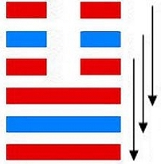

# 泰 ䷊ tài

- No.11

> 泰，小往大來，吉亨。
>《彖》曰：泰，小往大來，吉亨，則是天地交而萬物通也，上下交而其志同也。內陽而外陰，內健而外順，內君子而外小人。君子道長，小人道消也。
>《象》曰：天地交，泰。后以財成天地之道，輔相天地之宜，以左右民。

> 初九，拔茅茹，以其彙，征吉。
>《象》曰：拔茅征吉，志在外也。

> 九二，包荒，用馮河，不遐遺，朋亡，得尚于中行。
>《象》曰：包荒，得尚于中行，以光大也。

> 九三，无平不陂，无往不復。艱貞，无咎。勿恤其孚，于食有福。
>《象》曰：无往不復，天地際也。

> 六四，翩翩，不富以其鄰，不戒以孚。
>《象》曰：翩翩不富，皆失實也；不戒以孚，中心願也。

> 六五，帝乙歸妹，以祉元吉。
>《象》曰：以祉元吉，中以行願也。

> 上六，城復于隍，勿用師。自邑告命，貞吝。
>《象》曰：城復于隍，其命亂也。

乾坤二象，合为一运，天入地交泰，万物生焉。小往大来，阳长阴危，金土二气交合。《易》云：“泰者，通也”。通于天地，长于品汇。阳气内进，阴气升降，升降之道，成于泰象。与乾为飞伏。
> 甲辰土，乙卯木。

三公立九三为世，上六宗庙为应候。建始丁酉至壬寅，
> 秋分，立春。

积筭起壬寅至辛丑，周而复始。
> 金土位上起积筭吉凶。

五星从位起镇星，
> 土星入卦。

轸宿从位降甲辰，分气候二十八。
> 积筭起二十八数，于甲辰位。

地下有天，阳道浸长，不可极，极则否成。
> 三阳务上，坤顺而往，往而不已，否道至。

存泰之义，在于六五，阴居阳位，能顺于阳，阴阳相纳，二气相感，终于泰道。外卦纯阴，阳来刚柔，成于震象。阴降阳升，居乾上，成大壮。
> 次降阴升阳，入雷天大壮卦。

# [Tài ䷊](e6b3b0tai.md)
