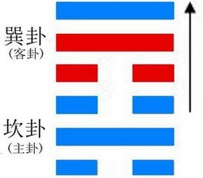
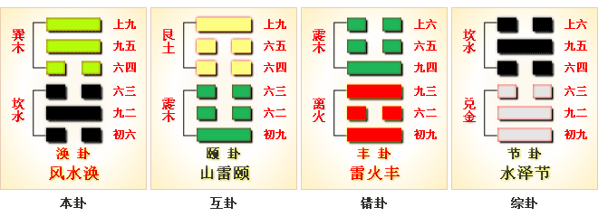

# 涣 ䷺



涣（huàn）是`2:3`卦的卦名，代号是`2:3`。“涣”：散开，涣散。

`2:3`卦的主卦是`2`卦坎卦，卦象是水，特性是危险和困难；客卦是`3`卦巽卦，卦象是风，特性是顺从。

水流到那里都没有阻挡，客方顺从主方，让水到处流，从而，水到处泛滥。风水涣，拯救涣散。

这个卦是异卦，下坎上巽，相叠。风在水上行，推波助澜，四方流溢。涣，水流流散之意。

象征组织和人心涣散，必用积极的手段和方法克服，战胜弊端，挽救涣散，转危为安。

图中，红色表示当位的爻，天蓝色表示不当位的爻，箭头表示有应。

- 卦序：59

> 渙，亨，王假有廟，利涉大川，利貞。
>《彖》曰：渙亨，剛來而不窮，柔得位乎外而上同。王假有廟，王乃在中也。利涉大川，乘木有功也。
>《象》曰：風行水上，渙，先王以享于帝，立廟。

> 初六，用拯馬壯，吉。
>《象》曰：初六之吉，順也。

> 九二，渙奔其机，悔亡。
>《象》曰：渙奔其机，得願也。

> 六三，渙其躬，无悔。
>《象》曰：渙其躬，志在外也。

> 六四，渙其群，元吉。渙有丘，匪夷所思。
>《象》曰：渙其群，元吉，光大也。

> 九五，渙其汗，大號，渙王居，无咎。
>《象》曰：王居无咎，正位也。

> 上九，渙其血，去逖出，无咎。
>《象》曰：渙其血，遠害也。

### 起卦

《涣》卦并不是历来易学界注释的“涣散”，而乃“涣涣然”之义，它谈的是如何发展壮大自己。它里面谈了如何用“拯马”来补救自己，如何不失时机的“涣奔其机”，以及如何“涣其躬”、“涣其群”、“涣汗其大号”、“涣王居”诸问题。从某种意义上来讲，可以说《涣》卦与《丰》卦没有多大区别，也即皆言盛大无比之状；所区别的是，《涣》卦探讨的是如何通盘壮大强盛自己，而《丰》卦则着重于用武力去侵伐吞并其它邻国。

起卦前需要客观地、全面地、准确地分析主方和客方情况，至少符合下列条件之一，此卦才有参考价值：

1. 主方与水很相似，客方与风很相似。
2. 主卦阳数是`2`，客卦阳数是`3`。
3. 主方的行动是阴，素质是阳，态度是阴；客方的行动、素质和态度是阴、阳和阳。

切勿用任何随机数方式起卦，否则此卦不能用作决策工具。

### 结构和卦爻辞

图中，主卦的三条爻全是天蓝色，表示这三条爻全部不当位，都是潜在的主方不利因素。客卦中有两条爻当位，以红色表示，是潜在的对主方有利因素。还有一个箭头，从第四爻到第六爻，表示有一种和谐关系存在于主卦和客卦的态度之间，这两条爻既不当位又有应，是真正的对主方不利因素。为了摆脱当前困境，主方首先应当从潜在的不利因素着手，扭转被动，并且隐藏和保护自己的良好素质，在此基础上灵活应对客方的强硬态度，不宜过分随和，得机会打击客方，就给他一次利害。不得机会，只得随和，与客方保持互不侵犯，避免冲突，互利共处。

涣卦的六条爻中五条都有“涣”。卦爻辞以大水泛滥形象地比拟当前的双方关系。

爻辞的核心是一首以“涣”为主题的散文诗，下面是其译文：

```
强壮的马啊，快来救我。
洪水来了，人都爬上了大树。
洪水快要淹了我。
洪水冲散人群，幸亏有一座山丘。
洪水呼啸，淹了王府。
洪水冲刷了血迹，冲向遥远的地方。
```

这是一首完整的诗。爻辞编撰者巧妙地按照爻的状态，加上了判断词。

卦辞阐述在“涣”这样的形势下，主方应当作的事。

### 全卦内容

此卦由水下风上组成。

卦辞的“涣：亨。王假有庙，利涉大川，利贞”，是说作为发展壮大自己的《涣》卦，它本身亨通。
当此之时，只要君王亲自到祖庙里去祭祀一下，就可以率领王师去争夺天下，这样做，也宜于君王之贞正。
1. “初六”爻辞的“用拯马壮，吉”，是说为了壮大自己，不妨用壮马补助自己的不足，这样更利于发展壮大，这样很吉祥。
2. “九二”爻辞的“涣奔其机，悔亡”，是说发展壮大自己，一定要抓住时机，不要错过机遇，这样才会消除悔恨。这里就是今天说的时不可失，机不再来的含义。
3. “六三”爻辞的“涣其躬，无悔”，是说发展壮大自己，首先要壮大自身，含有君王勤于军政大事之义，只有这样，才能无有悔恨。
4. “六四”爻辞的“涣其群，元吉；涣有丘，匪夷所思”，是说君王为了发展壮大自己，不仅要壮大自身，壮大自己一个人，也要壮大整个群体，只有涣壮其群体，才能壮大无比；如果涣壮其群体，就象形成一个小土山那样，到了这时，其壮大之势，就不是一般人所能想象的那样了。
5. “九五”爻辞的“涣汗其大号，涣王居，无咎”，是说为了发展壮大自己，除了涣壮自己，涣其群体，还不妨更换其爵号，扩修其王宫，这样也属涣壮之例，它也没有什么灾祸。
6. “上九”爻辞的“涣其血去逖出，无咎”，这一爻有很浓的血腥气味，也就是在以上几爻的基础上对外进行征伐了。这一爻是说在发展壮大自己，特别是在对外进行战争时，就难免有鲜血远远流出，这样虽然残酷，亦战争 之必然，这也不算什么罪过。

### 卦辞
```
〖原文〗亨，王假有庙，利涉大川，利贞。
〖译文〗亨：祭祀，洪水到来，君王到宗庙祭祖祈祷。
有利于渡过大江大河。吉利的占问。
〖解说〗主方有良好的素质，比如说，
富有、健康或者地位高，并且客方消极被动，
给于了主方发展机会，“亨”。
王指客方，因为客方比主方强。
王到庙宇中来是拜佛的，有所祈求，
主方应当利用当前机会发展自己，“利涉大川”。
“利贞”紧接在“利涉大川”之后，强调坚持“涉大川”的开拓精神。
```

### 解释
```
涣：亨，王假有庙，利涉大川，利贞。
《涣卦》象征涣散：顺畅亨通，
贤明的君主去祠庙祭祀神灵以祈求保佑，
利于渡过大川河流，利于坚守中正之道。
《象》曰：风行水上，“涣”；先王以享于帝立庙。
《象传》说：《涣卦》的卦象是坎（水）下，巽（风）上，
为风行水上之表象，象征涣散、离散。
先代君王为了收合归拢人心便祭祀天帝，修建庙宇。

涣：亨。 王假有庙，利涉大川，利贞。
涣卦木漂于水，水面起风，船行于水上。
涣散，离散。但随波顺行，王到了宗庙，
利出外跋涉大川，只要贞正是有利的。
《象传》：这一卦，下卦“坎”是水，上卦“巽”是风，
风吹水上，形成水波离散的现象，所以称作涣卦，
象征喜悦使郁闷涣散。“涣”是冰融解破裂，离散的意思。

《涣》卦的传统说法是救散治乱，但这并不准确。
实际上，《涣》卦讲的是教化问题。
所谓教化，就是面向全社会的思想道德教育。
卦中六爻都是实施教化的主体，
他们或者清刷自己，或者铲除阻力，或者与惩办相合。
总之，要像风行无阻、水流畅通那样，
把统治阶级的思想输送到天下，
以培养平民大众的道德意识，
提高其精神系素质，从而巩固政权。
```

### 一阴
```
〖原文〗用拯马壮，吉。
〖译文1〗借助健壮的好马，
来弥补力量的不足，可以获得吉祥。
〖译文2〗用以拯救的马强壮，吉利。
〖解说〗第一爻是主卦下爻，
代表主方的行动，阴，表示主方消极被动，
比如说，防守、退却、不想冒险、
不想探索或开辟新的发展领域、只求保持现状，等等。
主方消极被动以致陷入困境。
主方应对扭转被动状态，采取主动。
有了积极主动，
就如同有一匹强壮的马来拯救主方，对主方吉利。
“拯”（zhěng），援救，救助：拯救。

〖结构分析〗第一爻位置是阳位，
这条爻是阴爻，阴爻在阳位，
不当位，并且和四阴不有应。
不当位，表明主方消极被动，
有可能难以保护和发展自己的利益，是潜在的对主方不利因素；
不有应，表明客方也是消极被动，主方不一定受到侵犯，
那潜在因素没有成为真正的对主方不利因素。
尽管如此，消极被动仍然是阻碍主方发展的主要因素，
是造成主方陷入困境的主要原因，如果主方能够扭转被动状态，
就能够利用客方消极被动的机会取得发展，所以爻辞说，“吉”。

【象传】初六之吉，顺也。
《象传》说：第一位（初六）之所以是吉祥的，
这是由于它能顺承阳刚的缘故。
```

### 二阳
```
〖原文〗涣奔其机，悔亡。
〖译文1〗处在涣散之时，要迅速脱离险境，
转移到安全的地方，悔恨便会消失。
〖译文2〗大水泛滥的时候往树奔，悔恨消失。
〖解说〗第二爻是主卦中爻，
代表主方素质，阳，表示主方素质良好，
比如说，有资金、有地位、
有权力、有实力、有技术，等等。
在困境中，主方应当不失机遇，
发挥素质良好的优势，这样就没有悔恨。
“机”（jī），木名，桤木树。

〖结构分析〗第二爻位置是阴位，
这条爻是阳爻，阳爻在阴位，
不当位，并且与五阳不有应。
不当位，表明主方素质良好，
有可能被客方夺取，是潜在的对主方不利因素；
不有应，表明客方素质也良好，不需要伤害主方，
那潜在因素没有成为真正的对主方不利因素。
在这困难时候，主方应当依靠自己的良好素质，
积极主动地谋取利益，如同“涣奔其机”。

【象传】“涣奔其机”，得愿也。
《象传》说：“涣散之时，要迅速脱离险境，转移到安全的地方”，
脱离了危险，消失了悔恨，实现了自己的愿望。
```

### 三阴
```
〖原文〗涣其躬，无悔。
〖译文1〗宁愿自身受到损失，因此没有什么悔恨。
〖译文2〗大水泛滥到自己身边，没有悔恨。
〖解说〗第三爻是主卦上爻，
代表主方态度，阴，表示主方的态度随和。
当前像大水泛滥的形势是客观形成的，自己没有悔恨。
“躬”（gōng），自身，亲自：反躬自问。

〖结构分析〗第三爻位置是阳位，
这条爻是阴爻，阴爻在阳位，
不当位，并且而与六阳有应。
不当位，表明主方的随和态度有可能被客方利用，
是潜在的对主方不利因素；
有应，表明客方态度强硬，客方利用主方的随和态度，
压抑主方，那潜在因素成了真正的对主方不利因素，
如同“涣其躬”，洪水淹到自己。
第三爻是对第二爻的补充，表示主方有力量，
但不是很强，弱于客方，主方不得不对客方随和。
主方应当随机应变，以柔克刚，“无悔”。

【象传】“涣其躬”，志在外也。
《象传》说：“宁愿自身受到损失”，说明志向在外。
```

### 四阴
```
〖原文〗涣其群。元吉，涣有丘，匪夷所思。
〖译文1〗大水泛滥到众人聚集在一起的地方。
很吉利，大水泛滥的地方有山丘，这真是难以想象的。
〖译文2〗尽散朋党，因而有大的吉祥；
同时，它又能化解小群，
而聚成山丘一般大的群体，这不是常人所能想到的。
〖解说〗第四爻是客卦下爻，
代表客方的行动，阴，表示客方的行动是消极被动。
主客双方都消极被动，使得当前双方关系很涣散，
如同大水泛滥到群众居住区，
这种情况促使各方有所行动来共同解决问题，
对主方很有利，就像是在洪水中有座山丘，真正是难以想象的。
“匪夷所思”指言谈行动离奇古怪，不是一般人根据常情所能想象的。

〖结构分析〗第四爻位置是阴位，
这条爻是阴爻，阴爻在阴位，
当位，然而一阴不有应。
当位，表明客方消极被动，
是主方发展的良机，是潜在的对主方有利因素，
爻辞说，“元吉”；
不有应，表明主方也是消极被动，不能利用这良机，
那潜在因素没有能够成为真正的对主方有利因素。
主方应当变被动为主动，如果主方能够扭转被动，
采取主动，则如同“涣有丘，匪夷所思”。

【象传】“涣其群元吉”，光大也。
《象传》说：“涣其群元吉”，表明无自私自利之心，品行光明正大。
```

### 五阳
```
〖原文〗涣汗其大号，涣王居，无咎。
〖译文1〗洪水中发出强大的呼喊声，
洪水泛滥到王所居住的地方，无所怪罪。
〖译文2〗像挥发身上的汗水一样发布重大的命令，
同时亦能疏散君王的积蓄用以聚拢民心，
这样做一定不会有什么祸患。
〖解说〗第五爻是客卦中爻，
代表客方素质，阳，客方素质良好。
同时，主方素质也良好，在当前双方关系状态下，
双方的良好素质都发挥不了作用，
双方都强烈地要求改善关系，“涣汗其大号”。
“王居”指客方素质。
客方良好素质发挥不了作用，主方不应当受到怪罪。

〖结构分析〗第五爻位置是阳位，
这条爻是阳爻，阳爻在阳位，
当位，然而二阳不有应。
当位，表明客方良好素质是主方得益的好机会，
是潜在的对主方有利因素；
不有应，表示主方素质也良好，
主方需要以自己的良好素质谋取发展，而不是依靠客方，
那潜在因素没有成为真正的对主方有利因素。
主方依靠自己的良好素质是正确的，“无咎”。

【象传】“王居无咎”，正位也。
《象传》说：“疏散君王的积蓄以聚拢民心，
这样做一定不会有什么祸患”，是因为九五爻居于正位，行事端正。
```

### 六阳爻
```
〖原文〗涣其血，去逖出，无咎。
〖译文1〗洪水把血冲走了，
人被冲到很远的地方才出来，无所怪罪。
〖译文2〗摆脱伤害，远远地避开它，
不再接近它，不会有什么祸患。
〖解说〗第六爻是客卦上爻，
代表客方态度，阳，客方态度强硬。
在当前的双方关系状态下，强硬态度解决不了关键问题，
使得双方都遭受严重损失，“涣其血，去逖出”。
“血”指关键问题。“去逖出”指损失。
主方的态度随和，顺从于客方，
主方不应当受到怪罪。“逖”（tì），远。

〖结构分析〗第六爻位置是阴位，
这条爻是阳爻，阳爻在阴位，
不当位，然而与三阴有应。
不当位，表明客方态度强硬，
有可能制约主方，是潜在的对主方不利因素；
有应，表明主方态度随和，接受客方制约，
那潜在因素成了真正的对主方不利因素。
第六爻是对第五爻的补充，这两条爻都是阳爻，
表示客方实力非常强大，主方弱于客方，
不得不接受客方制约，“无咎”。
关键是，主方要扭转消极被动状态，“用拯马壮”。

【象传】“涣其血”，远害也。
《象传》说：摆脱伤害，这就是避祸之道。
```

### 详细解释
```
涣①：亨。王假有庙②，利涉大川，利贞。
初六，用拯马壮③，吉。
九二，涣奔其机④，悔亡。
六三，涣其躬⑤，无悔。
六四，涣其群⑥，元吉；涣有丘⑦，匪夷所思⑧。
九五，涣汗其大号⑨，涣王居⑩，无咎。
上九，涣其血去逖出⑪，无咎⑫。

①涣：六十四卦卦名之一。
乃论如何发展壮大自己之卦。
②王假有庙：“假”（gé 格），至。
君王到祖庙里去祭祀。
③用拯马壮：“拯”，辅助。用强壮的马来辅助自己。
④涣奔其机：“涣”，壮大。“机”，时机。
此句为壮大自己要抓住时机。
⑤涣其躬：“躬”，自身。此句为壮大自身。
⑥涣其群：“群”，群体。此句为壮大自己的群体。
⑦涣有丘：“丘”，小土山。壮大得似一座小土山。
⑧匪夷所思：非常人所能想得到。
⑨涣汗其大号：指更换其爵号。
⑩涣王居：重新修建其宫廷。
⑪涣其血去逖出：“逖”（tì 替），远。“逖出”，远远流出。
“涣其血去逖出”，此处有《尚书.武成》中的“血流漂杵”的含义，
是说君王为了发展壮大，在进行战争时，
被杀戮的鲜血远远流出，亦犹今之“血流成河” 一语。
⑫无咎：此处当按无有罪过讲。
```

### 白话解析
```
涣①：亨，王叚②于庙，利涉大川，利贞。
【注释】
①涣：卦名，涣散，离异，引申为洪水泛滥。
②叚：假借为“假”，到达。问吉凶。
【白话】筮得涣卦，亨通顺畅，君王到达宗庙，
利于渡越大河，利于贞问吉凶。

初六：撜马①，吉，悔亡。
【注释】①撜马：蹬马，引申为骑马。
【白话】筮得涣卦，占得初六爻，
蹬马外出，吉善美好，悔恨消失。
【讲解】初六爻当涣散的开始，
其涣散的程度还不很大，
位在最下，不急于行走，
因而可以从容顺道慢行，所以吉善而悔恨消失。

九二：涣贲其①阶，悔亡。
【注释】①贲：读为“奔”。其：代宗庙。
【白话】筮得涣卦，占得九二爻，
洪水奔流到宗庙的台阶上，但悔恨消失。
【讲解】九二阳刚之爻居于阴柔中位，
上与九五阳刚相敌不应，因此有悔，
但九二阳刚能与初六阴柔亲比相合，
所以能安居乐业，因而悔恨消失。

六三：涣其躬①，无悔。
【注释】①其：代君王。躬：假借为“躬”，身也。
【白话】筮得涣卦，占得六三爻，
洪水冲到君王的身边，但没有恨惜。
【讲解】六三阴柔之爻居阳刚之位，不中不正，
所以有悔，但能与尚九阴阳相应，因而有悔变成了无悔。
王弼说：“涣之为义，内险而外安者也。
散躬志外，不固所守，与刚合志，故得无悔也。”

六四：涣其群①，元吉，涣有丘②，非娣所思。
【注释】
①群：军队的车子。这里指君王卫队的车子。
②涣有丘：洪水又涨到了小丘上来了。有：假借为“又”。
【白话】筮得涣卦，占得六四爻，
洪水冲到了君王的车子旁边，但没有出问题，
所以大吉，洪水冲到了山丘，
姐姐想出了防洪措施，而妹妹却想不到。
【讲解】六四阴柔之爻居阴柔之位，处于巽顺之下，
顺从九五之尊，为忠臣之象，
所以能够帮助九五以救济天下的离散之心，
而成就天下聚合的大功业。

九五：涣其①肝，大号，涣王居，无咎。
【注释】①其：代指君王。
【白话】筮得涣卦，占得九五爻，
洪水冲到君王身上，大声呼叫，
洪水冲到了君王的居所，但没有灾难。
【讲解】九五阳刚之爻居阳刚之位，得正处中，
为涣卦的卦主，是大有作为的君主的象征。
王弼说：“处尊履正，居巽之中，散汗大号，以荡险阨者也。
为涣之主，唯王居之，乃得无咎也。”

尚九：涣其，血去汤出①。
【注释】①血去：恤去，忧愁消失。汤出：惕出，恐惧心消失。
【白话】筮得涣卦，占得尚九爻，
洪水消失，忧愁心消失，恐惧心也没有了。
【讲解】这一卦可能是讲大禹治水的过程。
```



### 《断易天机》解

涣卦巽上坎下，为离宫五世卦。涣即涣散，表示恶事离身，患难将消，利涉大川，出入无阻，乃是吉卦。

### 北宋易学家 邵雍 解

离散解消，灾害涣散；乘机观变，养威蓄锐。

得此卦者，初有不顺，但终可解困，凡事宜小心则百事亨通，忌任性放纵。

### 台湾国学家 傅佩荣 解

- 时运：时来运转，水到渠成。
- 财运：神明保佑，财源流通。
- 家宅：祈神得福；自成佳偶。
- 身体：病情严重，恐难回天。

### 传统解卦
```
这个卦是异卦，下坎上巽，相叠。
风在水上行，推波助澜，四方流溢。
涣，水流流散之意。
象征组织和人心涣散，必须用积极的手段和方法克服，
战胜弊端，挽救涣散，转危为安。

《象传》：风吹在水面上，流动四散，又有春风吹散严寒，令冰雪消解。
```

运势：虽有忧患，但终可解困，百事亨通，忌任性散慢。

- 事业：处于比较困难的地步，主要是因为人心不齐。要采取强有力的办法，求得安定团结。其中，最为重要的是坚持正道，秉持大公无私的精神，收人心以聚涣散。
- 经商：市场状况混乱，方向不明，适当的冒险是完全必要的。但必须公正无私，克制私欲，争取有实力的合作者和支援也是完全有必要的。
- 求名：必须静下心来努力学习和提高知识水平，增加才干。涣散的形势必须进行治理，这需要多方面的人才。前途是光明的，关键取决于个人的努力。
- 婚恋：只要双方都抱着纯正的目的，一定美满成功。
- 决策：为了开拓事业，必须使用积极的手段，克服和战胜内部不团结的弊病。首先自己要除私心，牺牲小我，完成大我。切莫介入是非争端之中。这样，可以重新获得安定的局面。在良好的环境里，各项事业前途光明。

### 台湾 张铭仁 解卦
```
涣：表示涣散之象，主凶象。
心神不宁、精神不佳，
人事向心力均已离散，有颓废不振的运势。
事业、感情、婚姻根基开始有所松动。
自身情绪不稳定，
若能稳定情绪、定下心神，应会再恢复以往的神采风光。

解释：涣散。

特性：喜追求变化，缺乏耐性，
工作不稳定，理财能力差，爱旅行外出，变换住所。
对朋友热心，桃花运也多。
```

运势：初有小损，但终可解困而心悦，凡事小心则百事亨通，任性放纵必败。

- 家运：起初有损，有波折且困，但可渐入佳境。
- 疾病：幼年体弱多病，长大后渐康 ，注意血液、内分泌。
- 胎孕：临产妇无碍。
- 子女：双亲百般劳苦为子女，而子女深知父母养育教导之恩，多得良好配偶，并有才艺之象。
- 周转：目标准确则有利，否则波折多亦难成。
- 买卖：虽难成，客户会再回来，但忍耐些时日可有利。
- 等人：不一定会来。
- 寻人：难寻。
- 失物：不能寻回。
- 外出：平安无事，水路更顺利。
- 考试：尚可，宜再加油。
- 诉讼：凡事宜大事化小，小事化无，诉讼可解。
- 求事：虽有挫折，但可成。宜耐心。
- 改行：择时视势而行，不必急于一时。
- 开业：开业可，初时有小挫折，勿惊。

### 初六爻辞

初六。用拯马壮，吉。

《象》曰：初六之吉，顺也。

### 白话文解释

初六：洪水突来，因而乘马逃避，匆促跌伤，幸免淹亡之祸，吉利。

《象传》说：初六爻辞讲的吉利，是因为初六阴爻居九二阳爻之下，有阴柔顺从阳刚之意。像马顺从人意。

### 北宋易学家 邵雍 解

吉：得此爻者，得尊上提举，营谋皆遂。做官的会受到重用，有望晋升。

### 台湾国学家 傅佩荣 解

- 时运：险中得救，必有后福。
- 财运：同事相助，可以得利。
- 家宅：新厦可居。
- 身体：急治为宜。

### 初六变卦：风水涣卦 变卦 风泽中孚


初六爻动变得[第61卦：风泽中孚](e4b8ade5ad9azhongfu_cn.md)。

这个卦是异卦，下兑上巽，相叠。

孚本义孵，孵卵出壳的日期非常准确，有信的意义。

卦形外实内虚，喻心中诚信，所以称中孚卦。这是立身处世的根本。

### 九二爻辞

九二。涣奔其机，悔亡。

《象》曰：涣奔其机，得愿也。

### 白话文解释

九二：洪水奔涌，冲毁房基。性命无虞。不幸中之万幸。

《象传》说：荡涤冲刷其污垢，正是心中所愿。

### 北宋易学家 邵雍 解

平：得此爻者，谋望有成，或会成家。做官的有实权。

### 台湾国学家 傅佩荣 解

- 时运：运势顺利，心想事成。
- 财运：货物贸易，如愿以偿。
- 家宅：先散后聚；女长于男。
- 身体：愁眉不展，良医可治。

### 九二变卦：风水涣卦 变卦 风地观

 

九二爻动变得[第20卦：风地观](e8a782guan_cn.md)。

这个卦是异卦，下坤上巽，相叠。风行地上，喻德教遍施。

观卦与临卦互为综卦，交相使用。

在上者以道义观天下；在下者以敬仰瞻上，人心顺服归从。

### 六三爻辞

六三。涣其躬，无悔。

《象》曰：涣其躬，志在外也。

### 白话文解释

六三：洪水冲到身上，幸免于难，尚可庆幸。

《象传》说：冲刷他的身体，说明其人志在教育他人，治理国家。

### 北宋易学家 邵雍 解

平：得此爻者，常人获利。做官的出外就职。

### 台湾国学家 傅佩荣 解

- 时运：勇于赴难，值得尊敬。
- 财运：重财轻命，自讨苦吃。
- 家宅：出外免祸；守节之志。
- 身体：转危为安。

### 六三变卦：风水涣卦 变卦 巽为风


六三爻动变得[第57卦：巽为风](e5b7bdxun_cn.md)。

这个卦是同卦，下巽上巽，相叠。

巽为风，两风相重，长风不绝，无孔不入。

巽亦为顺、谦逊的态度和行为，可无往不利。

### 六四爻辞

六四。涣其群，元吉。涣有丘，匪夷所思。

《象》曰：涣其群，元吉，光大也。

### 白话文解释

六四：洪水冲向人群，然而十分幸运，因为人群聚集在山丘上，洪水只能淹到山脚，否则其后果是平常难以想像的。

《象传》说：冲刷大众百姓，说明君王德教广施，教化大行。

### 北宋易学家 邵雍 解

吉：得此爻者，先凶后吉，谋望和合，求利可获。做官的会身居要职。

### 台湾国学家 傅佩荣 解

- 时运：大运亨通，脱困成业。
- 财运：散财济危，自成天地。
- 家宅：自有可观。
- 身体：凝聚元气，病体自愈。

### 六四变卦：风水涣卦 变卦 天水讼


六四爻动变得[第6卦：天水讼](e8aebcsong_cn.md)。

这个卦是异卦，下坎上乾，相叠。

同需卦相反，互为“综卦”。

乾为刚健，坎为险陷。

刚与险，健与险，彼此反对，定生争讼。

争讼非善事，务必慎重戒惧。

### 九五爻辞

九五。涣汗其大号，涣王居，无咎。

《象》曰：王居无咎，正位也。

### 白话文解释

九五：洪水横溢，淹没国都，淹及王宫，牵好人员早巳撤走，没有大的灾难。

《象传》说：王宫没有遭遇灾难，因为九五阳爻居上卦中位，位尊且正，自然无灾难。

### 北宋易学家 邵雍 解

吉：得此爻者，正当好运，事事皆吉，求利者遂。做官的会升迁。

### 台湾国学家 傅佩荣 解

- 时运：中正之位，诸事皆吉。
- 财运：言行中庸，利润自来。
- 家宅：富贵之家；必得贵婿。
- 身体：大汗可愈。

### 九五变卦：风水涣 变卦 山水蒙


九五爻动变得[第4卦：山水蒙](e89299meng_cn.md)。

这个卦是异卦，下坎上艮，相叠。

艮是山的形象，喻止；坎是水的形象，喻险。

卦形为山下有险，仍不停止前进，是为蒙昧，故称蒙卦。

但因把握时机，行动切合时宜，因此，具有启蒙和通达的卦象。

### 上九爻辞

上九。涣其血，去逖出，无咎。

《象》曰：涣其血，远害也。

### 白话文解释

上九：洪水退去，忧患消除，但仍须警惕，加强防范，这样就没有灾难。

《象传》说：有血光之灾，走开，远远地走开，这样就可远离灾害。

### 北宋易学家 邵雍 解

平：得此爻者，先难后易，运势好转。做官的外出就职者会有灾难。

### 台湾国学家 傅佩荣 解

- 时运：运势通达，无须忧心。
- 财运：贸易顺利，财源自来。
- 家宅：避免冲突；远嫁之象。
- 身体：气血郁积，疏通即治。

### 上九变卦：风水涣 变卦 坎为水


上九爻动变得[第29卦：坎为水](e59d8ekan_cn.md)。

这个卦是同卦，下坎上坎，相叠。

坎为水、为险，两坎相重，险上加险，险阻重重。

一阳陷二阴。

所幸阴虚阳实，诚信可豁然贯通。

虽险难重重，却方能显人性光彩。

# [Huàn ䷺](e6b6a3huan.md)
