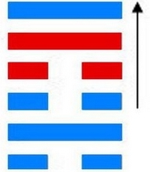

# 涣 ䷺ huàn

- No.59

> 渙，亨，王假有廟，利涉大川，利貞。
>《彖》曰：渙亨，剛來而不窮，柔得位乎外而上同。王假有廟，王乃在中也。利涉大川，乘木有功也。
>《象》曰：風行水上，渙，先王以享于帝，立廟。

> 初六，用拯馬壯，吉。
>《象》曰：初六之吉，順也。

> 九二，渙奔其机，悔亡。
>《象》曰：渙奔其机，得願也。

> 六三，渙其躬，无悔。
>《象》曰：渙其躬，志在外也。

> 六四，渙其群，元吉。渙有丘，匪夷所思。
>《象》曰：渙其群，元吉，光大也。

> 九五，渙其汗，大號，渙王居，无咎。
>《象》曰：王居无咎，正位也。

> 上九，渙其血，去逖出，无咎。
>《象》曰：渙其血，遠害也。

水上见木，涣然而合，
> 涣者散也。

内外健而顺，纳实居中正，互见动而上，
> 虚舟行也。

阴阳二象，资而益也。风行水上，处险非溺也。
> 木浮于水也。

九五履正思顺，非偪也。与巽为飞伏。
> 辛巳火，己未土。

九五居尊，大夫应。
> 九二爻也。

建始癸丑至戊午，
> 大寒，芒种。

积筭起戊午至丁巳，周而复始。火土入坎巽。
> 火土二象入坎巽，配火宫涣卦起筭。

五星从位起岁星，
> 木星入火宫本象。

昴宿从位降辛巳火，
> 二十八宿，分昴宿入涣九五辛巳火位上。

分气候其数二十八。
> 起筭从二十八位上推六爻吉凶，岁月日时为候。

内卦坎中满，一阳居中，积实于内，风在外行，虚声外顺。吉凶之位，考乎四序；盛衰之道，在乎机要。阴阳死于位，生于时；死于时，生于位。进退不可诘，正盛则衰来，正衰则盛来。《易》曰：“积善之家必有余庆，积不善之家必有余殃。”八卦始终，六虚反复，游魂生巽入乾，为天水讼卦。

# [Huàn ䷺](e6b6a3huan.md)
