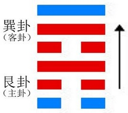
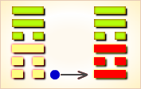
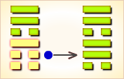
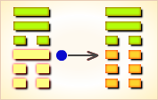
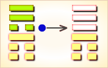
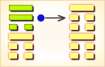
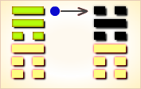

# 渐 ䷴



渐（jiàn）卦，由山下风上组成。

渐是`1:3`卦的卦名，`1:3`是渐卦的代号。“渐”（jiàn），慢慢地，一点一点地：逐渐。

`1:3`卦的主卦是艮卦，卦象是山，特性是被动和阻止；客卦是巽卦，卦象是风，特性是顺从。
主方像山一样静止不动，阻止游移不定的客方，而客方则顺从形势，逐渐变化状态。

卦辞的“渐：女归，吉，利贞”，是说作为循序渐进的《渐》卦，它有如同女子出嫁一样，如能按照女子出嫁程序那样一步一步走，那就很吉祥，也宜于贞正。

图中，红色表示当位的爻，天蓝色表示不当位的爻，箭头表示有应。

- 卦序：53

> 漸，女歸吉，利貞。
>《彖》曰：漸之進也，女歸吉也。進得位，往有功也。進以正，可以正邦也。其位剛得中也。止而巽，動不窮也。
>《象》曰：山上有木，漸，君子以居賢德善俗。

> 初六，鴻漸于干。小子厲，有言，無咎。
>《象》曰：小子之厲，義无咎也。

> 六二，鴻漸于磐，飲食衎衎，吉。
>《象》曰：飲食衎衎，不素飽也。

> 九三，鴻漸于陸，夫征不復，婦孕不育，凶，利禦寇。
>《象》曰：夫征不復，離群醜也；婦孕不育，失其道也；利用禦寇，順相保也。

> 六四，鴻漸于木，或得其桷，无咎。
>《象》曰：或得其桷，順以巽也。

> 九五，鴻漸于陵，婦三歲不孕，終莫之勝，吉。
>《象》曰：終莫之勝，吉，得所願也。

> 上九，鴻漸于陸，其羽可用為儀，吉。
>《象》曰：其羽可用為儀，吉，不可亂也。

### 初六
```
爻辞的“鸿渐于干，小子厉；有言，无咎”，
这一爻，我们固然不能说它是一个残缺不全的句子，但却容易造成误会。
比如说一些人便将“鸿渐于干，小子厉”
理解为“鸿雁飞起来逐渐前进到水涯旁边，落伍离群，显得不安；
象征着年幼无知的孩子有危难”。
实际上，这一爻的前半句要完整，应该写成“鸿渐于干，君子吉，小子厉”。
如其不然，《渐》卦本身象征着吉祥；
鸿鸟又落到它应该去的涯岸水边，那又何来“厉”一辞呢？
这里的“厉”，它只能说此爻对“小子”“厉”，
它如同《遯》卦的“好遯，君子吉”一语。
这一爻的上半句是说鸿鸟渐渐飞到它常去觅食的涯岸水边，
这很吉祥，但这只能对君子吉，对“小子”也即小人就凶厉了。
下半句是说由于鸿鸟渐渐地飞到它应该去的地方，
自然遭到一些人的“有言”攻击，但“有言”归有言，
鸿鸟飞到它应该去的地方，这将会是无灾祸的。
这里的“有言”，颇有些《鼎》卦的“鼎有实，我仇有疾”的用法。
```

### 六二
```
爻辞的“鸿渐于磐，饮食衎衎，吉”，
此爻是说鸿鸟渐渐地飞到它本应觅食的涯岸水边的巨石上，
在悠然地觅食，这就很吉祥。
```

### 九三
```
爻辞的“鸿渐于陆，夫征不复，妇孕不育，凶；利御寇”，
前半句是说鸿鸟渐渐地飞到它不该去的土山上，
那将如同丈夫出征不能复回，也如同孕妇怀孕却又难产，这样将很凶险；
后半句是说鸿鸟飞落到大土山上，却能远眺，这倒利于防止敌寇侵袭。
```

### 六四
```
爻辞的“鸿渐于木，或得其桷，无咎”，
是说鸿鸟在涯岸水边觅足食之后，渐渐地飞到它常去栖息的树木之上，
或者能落到一个的平直的树杈上，这将无有灾祸。
```

### 九五
```
爻辞的“鸿渐于陵，妇三岁不孕；终莫之胜，吉”，
前半句是说鸿鸟渐渐地飞到它不该去的丘陵上，
这如同一个妇女三岁不能怀孕一样；
后半句是说，但是女人终究还是要怀孕的，
这是无法战胜的，不过要耐心等待，
不要急于求成，这样结果将是吉祥的。
这里的“终莫之胜”，除了指妇女怀孕之外，
也包括“渐”于丘陵之上的鸿鸟还会离开丘陵而去这一终局。
```

### 上九
```
爻辞的“鸿渐于陆，其羽可为仪，吉”，
可以说这是一个不成功的爻辞：
此爻为“吉”，与《渐》的卦义倒也吻合，无可非议；
鸿鸟羽毛可作礼品，也当吉祥，亦无可非议；
但此爻却用鸿鸟渐渐地飞落到它不该去的大土山上，
而且其羽毛被人猎取，这于人“吉”，
对于渐渐的飞鸿来说，却非“吉”兆。
这一爻辞，其作者突出于类似“九五”爻的“鸿渐于陵”，
而又“终莫之胜”的动机，但此爻辞却并不周全。
此爻要改一下，当改为“鸿渐于陆，
终仍渐于干、磐、木，无咎；其说（脱）羽可为仪，吉”。
即是说鸿鸟渐渐地飞落到它不该去的大土山上，
但它终究还是要渐渐地飞到涯岸水边或树杈之上，
因为那是觅食和栖息的地方；
在土山上捡回鸿鸟脱落下来的羽毛，
把它当作为贺仪奠礼，这很吉祥。
```

### 风山渐 上巽下艮
```
渐，女归吉。利贞。
巽上艮下，卦名称作「风山渐」。
「序卦传」说：「物不可以终止，故受之以渐；渐者进也。」；
意思是事物不可总是停止不前，
所以在表示止的艮卦之後接著是渐卦。
「渐」是水浸透，有渐渐进的含义。
这一卦，下卦「艮」是止，上卦「巽」是顺，
柔顺的停停进进，有渐进的意义。
当女子出嫁时，必须经过一切婚嫁的礼节，当然也是渐进。
这一卦，由「六二」到「九五」，各爻都得正，
象徵出嫁的女子品德纯正，当然吉祥；
但这一纯正，必须坚持，才会有利。

渐的覆卦就是归妹，「归」是女子出嫁，「归妹」就是嫁妹，
所以《杂卦》说渐是女子等待出嫁。
虞翻说：「否三之四。」意为，
渐卦是由否卦变来，否卦的六三上升到四位就变为渐卦。
三爻与四爻换位。彖辞提示说「进得位」，
指的是六四柔爻进居四的柔位，得位。虞氏的说法与彖传合。

渐，女归吉。利贞。
渐卦，女子出嫁吉祥。利於正固。
彖曰：渐之进也，女归吉也。
进得位，往有功也。进以正，可以正邦也。
其位刚得中也。止两巽，动不穷也。
逐渐而进，女子出嫁吉祥。
进而取得正位，前往有功。
按正道前进，可以正邦国。
渐卦的位是刚夭居中。
能停下随顺地等待，行动起来就没有困穷。
《象》曰：山上有木，渐。君子以居贤德善俗。
山上长有树木就是渐卦，君子从中得到启示，
要居於安德，改善风俗。
这一爻，说明不可勉强，应量力渐进。

六二：鸿渐于磐，饮食衎衎，吉。
《象》曰：饮食衎衎，不素饱也。
「磐」是大石。「衎衎」是和乐状。
「素饱」与素餐同，不劳而食的意思。
「初六」是在水边徘徊的鸿雁，
「六二」已渐进到磐石，坚固平坦，是落脚最安稳的场所。
「六二」柔顺中正，与上方的「九五」相应，
所以说是磐石，可以在上面和乐的饮食。
「二」是臣位，「五」是君位，
又有「九五」赐给俸禄，使「六二」和乐饮食。
但「六二」并不是尸位素餐，
具备中正的德性，能够辅佐君王，地位安定，所以吉祥。
这一爻，说明渐进应稳当踏实。

九三：鸿渐于陆，夫征不复，
妇孕不育，凶﹔利御寇。
《象》曰：夫征不复，离群丑也。
妇孕不育，失其道也。利用御寇，顺相保也。
「九三」在下卦的最上方，源雁已渐渐的走上陆地。
「九三」与「上九」，同是阳爻，不相应，
祇好与情意不合的「六四」阴爻相亲。
丈夫指「九三」，因为情意不合，不去不回；
妇指「六四」，也因为不正常的婚姻，
怀孕生下的婴儿，不能养育；所以凶险。
不过，「九三」刚爻刚位，极为坚强；
因而，防御外敌有利。
这一爻，说明渐进不可刚强过度，
以致离群，刚强只适於防御外敌。

六四：鸿渐于木，或得其桷，无咎。
《象》曰：或得其桷，顺以巽也。
「桷」是角材，房屋的椽木。
「六四」更进一步，鸿雁落到树上。
但鸿雁的爪，不适於抓握树枝，以致不安定，
要在平面的角材上，才能站稳。
角材指下方的「九三」；
通常，柔在刚上，会有不安定的现象，
但「九三」与「六四」亲近，所以没有问题。
这一爻，说明渐进应当因应状况，才能安全。

九五：鸿渐于陵，妇三岁不孕，终莫之胜，吉。
《象》曰：终莫之胜，吉﹔得所愿也。
鸿雁渐渐前进到高陵上，「九五」是尊位，相当於高陵。
但「九五」虽然与「六二」相应；
可是，中间有「九三」与「六四」阻挡，
尤其是「九三」，采取防御外寇的姿态，
使「六二」无法与「九五」相聚，以致三年都没有怀孕。
不过，「九五」与「六二」都中正，是正当的配偶，
邪终於不能胜正，「九五」与「六二」得以聚首，
达成宿愿，因而吉利。
这一爻，说明在渐进中，
也难免不会有障碍，但邪不能胜正。

上九：鸿渐于逵，其羽可用为仪，吉。
《象》曰：其羽可用为仪，吉；不可乱也。
「逵」是四通八达的道路，
与大畜卦「上九」的「何天之衢」相同，
指云在天上的往来无阻的通路。
「上九」在这一卦的最上位，鸿雁飞到高山上，
此时它的羽毛可以用作洁美的仪布，这是吉祥的。
「象传」说：这是以鸿雁的羽毛，比拟隐士的志节，不可以扰乱。
这一爻，说明超脱於世俗之外，即可进退由心。

渐卦，阐释由停顿的状态，迈步向前时，应采取渐进的原则。
前进才能建功，前进当然要刚毅，但也要把握中庸原则。
不可以勉强，不可以冒进，应当稳当，
依据状况，把握时机，脚踏实地，一步步的循序向前迈进，
动静顺乎自然，才能安全，行动不会穷困。
如果刚强过度，不停的冒进，就有脱离群众的危险。
当然，在渐进中，会有阻碍，
但邪不胜正，必须以正当的方式突破。
超脱於世俗之外，不为名利所累，则可进退由心，可以说是进的极致。

上巽下艮，中存坎离，有日月之明，
聪明光华，水行於险，艮又止之，风和日暖，
适当其时，可使雨水施布，以滋生长之功，
万物受利，自此有成，君子得之，则为有渐之象。
渐者进也，乃艮宫之末卦，名曰归魂卦，卦中缺妻财，
以艮卦第五爻子水妻财，伏于本卦第五爻巳火之下，
巳火是飞神，子水是伏神，水绝在巳，谓之伏神绝于飞爻也。
```

### 起卦

起卦前需要客观地、全面地、准确地分析主方和客方情况，至少符合下列条件之一，此卦才有参考价值：

1. 主方与山很相似，客方与风很相似。
2. 主卦阳数是`1`，客卦阳数是`3`。
3. 主方的行动是阴，素质是阴，态度是阳；客方的行动、素质和态度是阴、阳和阳。

切勿用任何随机数方式起卦，否则此卦不能用作决策工具。

### 结构和卦爻辞

渐卦中，下部的三条爻是主卦，代表主方，上部的三条爻是客卦，代表客方。

主卦下爻是阴爻，天蓝色表示这条爻不当位，也就是说，阴爻在阳位，不当位。为什么第一爻的位置是阳位呢？这需要从爻的意义考虑。主卦下爻代表主方的行动，阳代表天的属性，天运动不息，主方应当像天一样运动不息，这样才能够开拓进取，创造利益，所以第一条爻的位置是阳位。这条爻是阴爻而不是阳爻，阴代表地的属性，按古人的感受，地是静止不动的，阴爻代表主方消极被动，这就不能开拓进取，不能创造利益。所以，阴爻在阳位不当位。不过，不能创造利益并不等于一定遭受损失；不是有利并不等于不利。不当位只是一个潜在的对主方不利因素，是不是真地对主方不利，还要看客方的行动。如果客方积极主动，主方可能遭受损失，这潜在因素就变成了真正的对主方不利因素。客方也是消极被动，因此，这条阴爻只是一个潜在的对主方不利因素。

主卦中爻也是阴爻，然而，是红色而不是天蓝色，第二爻的位置是阴位，阴爻在阴位，当位。为什么第二爻的位置是阴位呢？因为主卦中爻代表主方素质，阳代表天的属性，天给予地光和热，是施主，而阴代表地的属性，地接收天的光和热，是受者。阴代表地，有可能受惠于客方，所以，第二爻的位置是阴位。因此，阴爻在阴位，当位，是潜在的对主方有利因素。说是“潜在的”，因为如果没有施主，受者无从受惠。卦的右边有一个箭头，从第二爻指向第五爻，表示，这两条爻之间有和谐关系，对应于第二爻，第五爻是阳爻，正好，主方可以从客方受惠，那潜在的有利因素成了一个真正的对主方有利因素。也就是说，当位而有应是对主方有利因素。

主卦上爻是阳爻，红色，这是一条当位的爻。因为上爻代表态度，天至高无上，像天一样，以强硬态度对待客方，有利于抑制客方，所以第三爻的位置是阳位。因此，阳爻在阳位，当位，是潜在的对主方有利因素。在客卦方面，三条爻的位置是阴还是阳，其情况完全与主卦的三条爻的位置相反。这是因为，卦是从主方的角度分析形势，对客方有利就是对主方不利，反之，对客方不利就是对主方有利。

综合起来，从渐卦的结构看，主方应当扭转被动状态，坚持对客方的强硬态度，伺机从客方获取利益。

图的右边是渐卦的卦爻辞，爻辞与卦的爻一一对应。渐卦的爻辞中有“夫”与“妇”，“妇”是呆在家中的妻子，应当是主方，因为主卦卦象是山，山是不动的；“夫”是当兵的丈夫，应当是客方，因为客卦卦象是风，风游移不定。每条爻辞都有“鸿”，大雁，对照第三爻的爻辞，可以看出，这大雁是客方的象征。爻辞以大雁形象地比喻客方，描述夫妇双方从恋爱到结婚，到丈夫随军出征不归，妻子孤苦守待三年，丈夫像大雁一样逐渐回到家乡。爻辞形象地说明在各种情况下主方的处境，六条爻辞就是一首完整的围绕主题“渐”的散文诗，下面是其译文：

```
大雁落在河边，厉害的小伙子来了，
有流言蜚语，无所怪罪。
大雁落于山石上，（与他）和适自得地吃饭，吉利。
大雁落在大陆上，丈夫出征不复归，妻子怀孕不能养育，
应当抵御（他）这个盗匪。
大雁落在树上，有时找到平直的树枝，（他像只大雁到处飞）
无所怪罪。
大雁落于山陵，夫人三年没有怀孕；终于不能取得对她的胜利，
（他回来了）吉利。
大雁落于大陆，它的羽毛可以用作装饰，（共享和谐安乐）吉利。
```

卦辞阐述在这种双方关系中主方应当作的事。

### 卦辞
```
〖原文〗女归吉，利贞。
〖译文〗女子出嫁吉利。利于坚持下去。
〖解说〗在这个别卦中，中爻是唯一的一对有应的爻，
而且第二爻是阴爻，第五爻是阳爻，表明主方是受惠着，
客方是给于者，在双方关系中，主方受益于客方，“女归吉”。
“归”（guī），古代称女子出嫁。
卦辞以女子出嫁比喻当前的双方关系，
实际上，双方关系不一定指婚姻关系。
由于客方游移不定，主方需要耐心等待客方，“利贞”。
```

### 解释
```
渐进蓄德。
上上卦，《象》曰：
俊鸟幸得出笼 中，脱离灾难显威风，一朝得意福力至，东西南北任意行。

《渐》卦谈的是办事不要急于求成，而要循序渐进。
《渐》卦为了阐述此理用“女归”、“妇孕”和“飞鸿”作了例子。
在研究此卦时，要弄清几个问题，
一是办事要循序渐进，不要超越常规；不然则有欲速则不达之义。
二是用飞鸿作例说明办事循序渐进到它应该去的地方；
并不是渐进到它不应该去的地方。
三是当境况不佳时，要耐心等待， 切莫操之过急；
对这一事用“妇三岁不孕，终莫之胜”作了说明。
实际上，此一卦与下一卦《归妹》卦用义基本相同：
此一卦在言循序渐进之利；下一卦在谈急于求成之弊。
```

### 一阴
```
〖原文〗鸿渐于干，小子厉，有言，无咎。
〖译文〗大雁落在河边，小伙子危险，有流言，无所怪罪。
〖解说〗第一爻是主卦下爻，
代表主方的行动，阴，表示主方消极被动。
主方像是一条静静的小河，客方像是一只大雁，落到河边。
双方都是消极被动的，有冲突，主方担心客方不可靠，听信流言蜚语。
这是自然的，无所怪罪。
客方“鸿”（hóng），大雁：鸿雁。
“干”（gān），涯岸，水边：“河之干兮”。

〖结构分析〗第一爻位置是阳位，
这条爻是阴爻，阴爻在阳位，
不当位，并且和四阴不有应。
不当位，表明主方消极被动是潜在的对主方不利因素；
不有应，表明客方也是消极被动，
那潜在因素没有成为真正的对主方不利因素，
所以爻辞说，“无咎”。
主方应当尽快扭转被动为主动，趁客方被动之机，发展自己。
反之，如果继续消极被动，等待客方主动起来，情况就会对主方不利。
```

### 二阴
```
〖原文〗鸿渐于磐，饮食衎衎，吉。
〖译文〗大雁落于山石上，和适自得地吃饭，吉利。
〖解说〗第二爻是主卦中爻，
代表主方素质，阴，表示主方素质不佳，
比如说，资金缺乏、地位底下、实力薄弱、教育程度低，等等。
而同时，第五爻是阳爻，两条爻相应，
主客双方共享资源，“鸿渐于磐，饮食衎衎”。
就如同这位妇女与这男子结婚了，共享和乐生活，这对于主方吉利。
“磐”（pán），大石，纡回层迭的山石：磐石。
“衎”（kàn），快乐，安定，和适自得的样子。
“衎衎”，和乐貌，刚直从容貌。

〖结构分析〗第二爻位置是阴位，
这条爻是阴爻，阴爻在阴位，当位，又与五阳有应。
当位，表明主方素质不佳，
有可能从客方受惠，是潜在的对主方有利因素；
有应，表明客方素质良好，正好可以让主方受惠，
那潜在因素成了真正的对主方有利因素，所以，爻辞说“吉”。
```

### 三阳
```
〖原文〗鸿渐于陆，夫征不复，妇孕不育，凶；利御寇。
〖译文〗大雁落在大陆上，丈夫出征不复归，
妻子怀孕不能养育，凶险，利于抵御盗匪。
〖解说〗第三爻是主卦上爻，
代表主方态度，阳，表示主方态度强硬，
同时，第六爻也是阳爻，
客方态度也强硬，双方有冲突，对主方不利。
“鸿渐于陆”，大雁落在广阔的大地上，可能在很远的地方。
“夫征不复，妇孕不育”，形象地比喻双方不协调状态。
这种状态对主方不利，“凶”；主方应当保护自己，“利御寇”。
“陆”（lù），高出水面的土地：陆地。
“寇”（kòu），盗匪，侵略者，亦指敌人：盗寇。

〖结构分析〗第三爻位置是阳位，
这条爻是阳爻，阳爻在阳位，
当位，然而与六阳不有应。
当位，表明主方强硬态度有可能有利于保护主方利益，
是潜在的对主方有利因素；
不当位，表明客方态度也强硬，与主方有冲突。
因为客方态度强硬，所以爻辞说“凶”。
这条爻是当位的，主方不应当屈服，
而应当坚持强硬态度与客方斗争，“利御寇”。
```

### 四阴
```
〖原文〗鸿渐于木，或得其桷，无咎。
〖译文〗大雁落在树上，有时找到平直的树枝，无所怪罪。
〖解说〗第四爻是客卦下爻，
代表客方的行动，阴，表示客方消极被动，
这与主方的消极被动冲突。
“鸿渐于木，或得其桷”形象地比喻一种很不舒适的状态，
大雁是很难停在树枝上的，它们的脚与一般的鸟不同，有蹼。
这种状态由不得主方，对于主方无所怪罪。
“桷”（jué），方形的椽子，指平直如桷的树枝。

〖结构分析〗第四爻位置是阴位，
这条爻是阴爻，阴爻在阴位，当位，然而与一阴不有应。
当位，表明客方消极被动有可能是主方发展的好机会，
是潜在的对主方有利因素；
不有应，表明主方也消极被动，不能利用这个好机会，
那潜在因素没有成为真正的对主方有利因素。
扭转被动局面需要一定的力量，
而主方力量薄弱，很难扭转被动局面，“无咎”。
```

### 五阳
```
〖原文〗鸿渐于陵。妇三岁不孕；终莫之胜，吉。
〖译文〗大雁落于山陵，夫人三年没有怀孕；
终于不能取得对她的胜利，吉利。
〖解说〗第五爻是客卦中爻，
代表客方素质，阳，表示客方素质良好。
“鸿渐于陵”，形象地比喻客方离主方很远。
第二爻是阴爻，代表主方素质不佳，
主方需要客方帮助，“妇三岁不孕”。
“终莫之胜”中的“之”指三年不孕的“妇”，
终于这男子没有胜这位妇人，要回来了。
这对于主方吉利，“吉”。
“陵”（líng），大土山：山陵。

〖结构分析〗第五爻位置是阳位，
这条爻是阳爻，阳爻在阳位，当位，并且和二阴有应。
当位，表明客方良好素质有可能让主方受益，
是潜在的对主方有利因素；
有应，表明主方素质不佳，需要客方帮助，
那潜在因素成了真正的对主方有利因素，所以爻辞说，“吉”。
```

### 六阳
```
〖原文〗鸿渐于陆，其羽可用为仪，吉。
〖译文〗大雁落于大陆，它的羽毛可以用作装饰，吉利。
〖解说〗第六爻是客卦上爻，
代表客方态度，阳，表示客方的态度强硬。
同时，主方态度也强硬，双方有冲突。
爻辞从双方关系总体上指出结果对主方是有利的，
大雁又落在大陆上，飞回来了，落下来许多羽毛，定居不走了。
“其羽可用为仪”，大雁留下的羽毛可以作装饰，指其妇人将享受安乐。
“仪”（yí），人的外表或举动：仪态。

〖结构分析〗第六爻位置是阴位，
这条爻是阳爻，阳位在阴位，
不当位，并且和三阳不有应。
不当位，表明客方强硬态度是潜在的对主方不利因素；
不有应，表明主方态度也强硬，
主方抗衡客方的强硬态度，保护主方利益，
那潜在因素并没有成为真正的对主方不利因素，
所以，爻辞说“吉”。
就是说，主方应当坚持强硬态度，
不要屈服于客方压力，其结果对主方吉利。
```

### 爻辞解释
```
渐①：女归②，吉，利贞。
初六，鸿渐于干③，小子厉④；有言，无咎。
六二，鸿渐于磐⑤，饮食衎衎⑥，吉。
九三，鸿渐于陆⑦，夫征不复⑧，妇孕不育⑨，凶；利御寇。
六四，鸿渐于木⑩，或得其桷⑪，无咎。
九五，鸿渐于陵⑫，妇三岁不孕⑬；终莫之胜⑭，吉。
上九，鸿渐于陆，其羽可用为仪⑮，吉。

①渐：六十四卦卦名之一。
乃论述办事循序渐进之卦。
②女归：“归”，古谓女子出嫁曰“归”。
“女归”，谓女子出嫁。
③鸿渐于干：“干”，古指涯边、水边，亦通“涧”。
此句是说鸿鸟渐渐飞到涯岸、水边或山涧。
④小子厉：此处“小子”有小人的蔑称之义。
言下之义对君子吉，对小人凶厉。
⑤鸿渐于磐：“磐”（pán 盘），厚而大的石头，亦即巨石。
此句为鸿鸟渐渐飞到涯岸山涧的巨石之上。
⑥饮食衎衎：“衎衎（kàn 看）”，和乐貌。
此句形容鸿鸟在水边磐石的觅食悠闲貌。
⑦鸿渐于陆：“陆”，古亦指大土山。
此句为鸿鸟渐渐飞到大土山上。
⑧夫征不复：丈夫出征一去再也不复回。
⑨妇孕不育：犹言孕妇难产。
⑩鸿渐于木：鸿鸟渐渐飞到树上。
⑪或得其桷：“桷”（jué 觉），古本指方正的椽子，
此引伸为平直的树杈。此句指鸿鸟落到一个平直的树杈之上。
⑫鸿渐于陵：“陵”，丘陵。此句为鸿鸟渐渐的飞到丘陵之上。
⑬妇三岁不孕：一个妇女三年怀不上身孕。
⑭终莫之胜：但终究有一天会怀孕。
⑮仪：古指送与别人作祝贺或祭奠的礼品。
```

### 白话解析
```
渐①：女归②，吉，利贞。
【注释】
①渐：卦名，逐渐，缓慢。
②归：女子出嫁。
【白话】筮得渐卦，嫁女吉善美好，利于贞问。
【讲解】渐卦下体艮为山为止，上体巽为顺。
山上生长树木，为渐进之象。象征君子进德修业循序渐进。
《彖传》说：“渐之进也，女归吉也。进得位，往有功也。
进以正，可以正邦也。其位，刚得中也。止而巽，动不穷也。”

初六：鴻①渐于渊，小子疠②，有言无咎。
【注释】
①鴻：鸿鸟，水鸟。
②疠：不治的病。
【白话】筮得渐卦，占得初六爻，
鸿鸟慢慢地进入渊薮，小家伙生了不治的病，
有人说还有救，不会有灾难。
【讲解】初六阴柔之爻居阳刚之位，
为一卦的开始，前进由下而上。
鸿鸟适合这种前进的方式，因而作为渐进的比喻。
开始前进而位于穷困的下方，又没有阴阳相应的阳刚相应，
如果走在干道上，是危不可以安的象兆。
因而困于小子谗谀之言，但没有伤及君子之义，所以无有灾咎。

六二：鴻渐于坂①，酒食衍衍②，吉。
【注释】
①坂：阪坡，泽障，泽陂，池塘。
②衍衍：犹徐徐，舒缓貌。
【白话】水鸟在池塘里戏游，人们在慢慢地饮酒，吉善美好。
【讲解】六二爻阴柔得正处中，上有九五阴阳相应，
象征君子如同鸿鸟一样，站得稳当，又有酒食慢饮，所以吉善美好。

九三：鴻渐于陆，夫正①不复，妇绳②不育，凶，利所寇。
【注释】
①正：假借为“征”。
②绳：假借为“孕”。
【白话】筮得渐卦，占得九三爻，
鸿鸟在陆地上闲走，丈夫远征还没有回来，
妇女怀孕而未生育，有凶灾，利于强盗前来掠夺。
【讲解】九三阳刚之爻居于阳刚之位，
过于刚强，又不得中位，加上上九与之相敌无应，
有冒进之义，失渐进的原则，所以凶多吉少。

六四：鴻渐于木，或直①其寇，棄②，无咎。
【注释】
①直：假借为“值”。
②棄：放弃。
【白话】筮得渐卦，占得六四爻，
鸿鸟飞到树木上戏玩，但正好碰到了一群强盗，
弃而不追（穷寇勿追），没有灾难。
【讲解】六四阴柔之交逆乘阳刚，不得安居，
但六四爻以柔顺之质居于巽体之下则又可安，因而没有灾咎。

九五：鴻渐于陵①，妇三岁不绳，终莫之胜②，吉。
【注释】
①陵：山岭。
②胜：假借为“陵”，欺侮。
【白话】筮得渐卦，占得九五爻，鸿鸟飞到山岭上，
妇女结婚已三年还没有怀孕，却一直没有受到欺侮，因此吉善美好。
【讲解】九五阳刚之爻居于阳刚之位，
而且得中处尊，尊位高高在上，所以比之为山陵。

尚九：鴻渐于陆，其羽可用为宜①，吉。
【注释】①宜：假借为“仪”，文舞。
【白话】筮得渐卦，占得尚九爻，
鸿鸟飞到陆地上闲走，
它那漂亮的羽毛可以用来装饰轻歌慢舞的道具，因而吉善美好。
【讲解】上九阳刚之爻居阴柔之位，有引退之象。
上九在下无阴阳相应之爻，处于巽顺的终点，
虽然处位最高，但不乱渐进的原则，
故以鸿鸟引退为喻，告诫人们隐遁无名以保平安吉祥。
```

### 上互卦：离 下互卦：坎 婚姻卦

《周易》中有五个卦是取自男女婚姻关系（爻辞不计），这五个卦是咸、恒、姤、渐、归妹。五个卦同是讲夫妇、男女关系，又各有不同的侧重。
这五个婚姻卦的特点分别是：咸卦是自然属性，恒卦是道德属性，姤卦是失德属性，渐卦是礼仪属性，归妹是制度属性。

1. 咸卦是自由恋爱卦，是婚姻的自然属性、动物属性。咸卦下为少男，上为少女，象征青春男女的爱情，《彖》曰：“咸，感也。柔上而刚下，二气感应以相与，止而说，男下女，是以亨”，咸即感，是男女爱情感应的自然表现，此时少女的地位高于少男的地位（动物界也大都如是），故咸卦下艮而上兑。
2. 恒卦是夫妇家庭永恒之道。《序卦传》曰：“夫妇之道不可以不久，故受之以恒。恒者，久也。”父系社会男尊女卑，男主外、女主内，所以恒卦下巽长女上震长男，成家的男女双方是成熟的青年，所以区别于咸卦的少男、少女，而代之长男、长女。咸卦为《周易》第31卦，恒卦为《周易》第32卦，32为《周易》64卦之中，是六十四卦的中心。男女相感而生爱，因爱而有婚姻，这符合天地自然法则。
3. 姤卦为男女关系的失德属性。《彖》曰：“姤，遇也，柔遇刚也。勿用取女，不可与长也。”在六十四卦卦序中，姤卦代表日食之初日月相遇，月为柔，日为刚，当日食发生时，很象月亮主动与太阳相遇，故曰“柔遇刚”。因为日食（日蚀）是日月阴阳婚遘，但却是阴气侵蚀阳气，而日食的持续时间不过一个时辰，这就像闪电结婚又闪电离婚，故言“勿用取女，不可与长也”。姤，古本作遘。楚简《周易》作“敂”。帛书《易》作“狗”，帛书《衷》篇作“坸”、“句”。后之“苟合”、“媾合”、“邂逅”词语来源就是姤卦。帛书《易》写作“狗”，似乎是为了强调姤卦男女关系的失德属性（“狗男女”）。姤卦下巽上乾，乾在上为主，乾代表成功男人，乾为君、为金，或为贵人，或为富人。社会上失德的“苟合”往往是成功男人的婚外恋。姤卦卦辞“女壮，勿用取女。”“女壮”，女子强壮实为女子之病也，巽为“近利市三倍”，此“女壮”乃见利而失身也。
4. 渐卦是男女婚姻的礼仪属性。渐为有次序的行进。古代女子出嫁，男方家要经过纳彩、问名、纳吉、纳征、请期、亲迎六个步骤循序渐进地进行。故《杂卦传》云：“渐，女归待男行也。”渐卦下艮上巽，先儒以为下艮为少男，不确。渐卦为古代贵族的正妻制，《周官》“令男三十而娶，女二十而嫁。”男子不可能是不足十五岁的未冠小子。渐卦上卦为外，巽长女为正妻，女子以夫家为家，内卦艮为止为归，正是长女之夫家也。渐卦也可以称为“女归”，上卦巽为女，下卦艮为归也。
5. 归妹卦是古代婚嫁中的侄娣制度。《仪礼·士昏礼》记载：“古者嫁女，必娣侄从之，谓之媵。”《公羊传·庄公十九年》：“媵者何？诸侯娶一国，以侄娣从，侄者何？兄之子也。娣者何？弟也。”这是说女子出嫁，嫁到夫家作正妻，随嫁的有“侄和娣”（即“媵”），“侄”为出嫁女子兄长的女儿，“娣”为出嫁女子的妹妹。她们过去只能作为庶妻，年龄不够，结婚三个月后回母国等待几年，到十五岁，再送归夫家。归妹卦反映的这种侄娣制度为当时社会所认可。归妹卦下兑为少女，就是随嫁的“侄和娣”（“媵”），因为年龄尚小为少女，故称为“妹”，上震代表娶妻与媵的长男。归妹卦属于当时的婚姻制度，与渐卦女子在外等待男方婚前六礼的正妻制不同，归妹之少女是陪嫁媵妾制，不待六礼而嫁，直接随从正妻（相当于陪嫁）送至夫家，故兑卦在内，震卦在外。归妹卦名直接取自卦象，上卦震长男是娶妻之主，下卦兑为陪嫁之妹也。此所以归妹与渐为互覆卦。

<img src="shapes/53.11渐卦巽上艮下，为艮宫归魂卦。渐为渐进，筮遇此卦，女嫁则吉，举事有利。

循序渐进，积少成多；渐进即利，性急即败。

得此卦者，逐步开运，凡事宜循序渐进，则谋事可成，不宜急进，性急则败。

- 时运：时来运转，可以得意。
- 财运：逐渐得利，多行善事。
- 家宅：君子居之；贤女可妻。
- 身体：安居调养。

```
这个卦是异卦，下艮上巽，相叠。
艮为山，巽为木。山上有木，逐渐成长，山也随着增高。
这是逐渐进步的过程，所以称渐，渐即进，渐渐前进而不急速。

《象传》：山上种有树木，逐渐生长，比喻循序渐进。

运势：逐渐走向光明前途，凡事宜打根基，
可得吉庆，但须防色情之难及文书错失。
```

- 事业：在经过一个相对静止的时期后，重新开始了事业的新阶段。这时最怕的是急躁冒进，务必循序上进，脚踏实地。同时注意品德修养，以沉着、谦逊的态度对待事业，可无往而不利。
- 经商：正处在稳步向前发展的阶段，要把握时机，既不可盲目乐观，也不要停步不前，而应采取逐步前进的策略，量力而行。遵守商业道德，以良好的服务，开拓市场。
- 求名：效法树木植根山上，逐渐生长的精神。在品德和学业两个方面，扎扎实实地提高自己。同时，肩负起改善社会风俗的责任。求名应以渐进为宜，切不可急进。
- 婚恋：不可操之过急。幸福、美满，夫妻白头和谐。
- 决策：时来运转的时刻已经到来，切莫错过良机。务必小心谨慎，渐进有益有利。以谦和的态度处世，可以得到强有力的支持，会获得重大成功。

```
渐：表示循序渐进，不可心急之意，主吉象。
好事慢慢在进行中，一切遵循正理常规即可，事业投资均能有收益。
感情婚姻，更是结果收成，欢喜结局之时。

解释：逐渐好转。

特性：感觉细腻，思想敏锐，
重品味，讲情调之人，爱追求变化的事物，口才佳。
反应快，为人热心，财运丰厚。
```

运势：逐渐顺利，光明开运之象。凡事务必掌握时机，循序渐进，可得吉庆。须防款项交易之差错及色情之灾。

- 家运：渐曙光明、幸福之象，诸事宜以顺乎自然为吉，反则有克也。
- 疾病：恶化之象，注意胃、肠、背痛等。
- 胎孕：无碍。
- 子女：儿女多坚强笃实，态度温顺，将来有成就。
- 周转：不成亦勿放弃，久调可成。
- 买卖：渐进有利，过急不利，欲速则不达。
- 等人：迟到。
- 寻人：在东南或东北二方，过些时日可寻得。
- 失物：多数不能寻回。
- 外出：准备充分，从容外出，一路平安。
- 考试：会取得好成绩。
- 诉讼：宜进不宜退，据理力争可胜。
- 求事：可寻得良好工作。
- 改行：吉利。
- 开业：吉利，渐有发展之象。

### 初六爻辞

初六。鸿渐于干，小子厉。有言，无咎。《象》曰：小子之厉，义无咎也。


初六：鸿雁走进了山涧。筮遇此爻，警惕小孩顽皮，遭遇危险，应该加以谴责，则没有灾难。

《象传》说：小孩顽皮遭遇危险，因为有家长呵责制止，理应不会出事故。

凶：得此爻者，运气不佳，谋为不利。

- 时运：初行好运，要有耐心。
- 财运：有约在先，宜防小人。
- 家宅：尚无大碍；女长男少。
- 身体：大人没事，小孩就医。

### 初六变卦：风山渐 变卦 风火家人



初六爻动变得[第37卦：风火家人](e5aeb6e4babajiaren_cn.md)。

这个卦是异卦，下离上巽，相叠。

离为火；巽为风。

火使热气上升，成为风。

一切事物皆应以内在为本，然后伸延到外。

发生于内，形成于外。喻先治家而后治天下，家道正，天下安乐。

### 六二：鸿渐于磐，饮食衎衎，吉。《象》曰：饮食衎衎，不素饱也。


六二：鸿雁走上水边高地，饱饮饱食，自得喜乐。筮遇此爻，吉利。

《象传》说：饱饮饱食，自得喜乐，喻指其人，自食其力，从不白吃白喝。

吉：得此爻者，无往不利，随处皆安。

- 时运：嘉宾安乐，名利皆有。
- 财运：日益增加，稳若磐石。
- 家宅：和乐相处；百年偕老。
- 身体：饮食过度之症。

### 六二变卦：风山渐 变卦 巽为风



六二爻动变得[第57卦：巽为风](e5b7bdxun_cn.md)。

这个卦是同卦，下巽上巽，相叠。

巽为风，两风相重，长风不绝，无孔不入。

巽亦为顺、谦逊的态度和行为，可无往不利。

### 九三：鸿渐于陆，夫征不复，妇孕不育，凶。利御寇。《象》曰：夫征不复，离群丑也。妇孕不育，失其道也。利用御寇，顺相保也。


九三：鸿雁走到旱地上。筮遇此爻，丈夫出征可能不再回返，妇女怀孕可能流产，这是凶险之兆。但有利于抵御敌寇。

《象传》说：丈夫出征不再回返，说明其人掉队遇险。妇女怀孕而流产，说明其人失其保胎之道。利于抵御敌寇，说明国人能够同心同德，保家卫国。

凶：得此爻者，多惊扰，人情不睦，盗贼侵害。做官的上进有阻力，有被贬之忧。

- 时运：运势不正，须防有祸。
- 财运：不易得利，防有盗贼。
- 家宅：不利生产，须防离散。
- 身体：生产时恐难两全。

### 九三变卦：风山渐 变卦 风地观



九三爻动变得[第20卦：风地观](e8a782guan_cn.md)。

这个卦是异卦，下坤上巽，相叠。

风行地上，喻德教遍施。

观卦与临卦互为综卦，交相使用。

在上者以道义观天下；在下者以敬仰瞻上，人心顺服归从。

### 六四。鸿渐于木，或得其桷，无咎。《象》曰：或得其桷，顺以巽也。


六四：鸿雁飞到树木上，有的停息在河边堆放的桷木上。筮遇此爻，没有灾难。

《象传》说：有的鸿雁停息在河边堆放的桷木上之所以没有灾难，因为六四阴爻居于九五阳爻之下，像人有驯服而又谦逊之德。

平：得此爻者，利于修造，自给自足。做官的须随遇而安，升迁无定。

- 时运：随遇而安，可以免咎。
- 财运：利润甚微，保本即可。
- 家宅：可能寡居。
- 身体：肝火过盛。

### 六四变卦：风山渐 变卦 天山遁



六四爻动变得[第33卦：天山遁](e981afdun_cn.md)。

这个卦是异卦，下艮上乾，相叠。

乾为天，艮为山。

天下有山，山高天退。

阴长阳消，小人得势，君子退隐，明哲保身，伺机救天下。

### 九五：鸿渐于陵，妇三岁不孕，终莫之胜，吉。《象》曰：终莫之胜，吉，得所愿也。


九五：鸿雁走到山陵上。筮遇此爻，妻子多年不能怀孕，但始终不会被人取代，吉利。

《象传》说：始终没有被人取代，吉利，妻子实现了与其丈夫和谐白头的愿望。

吉：得此爻者，先难后易，做官的多招诽谤，先暗后明。

- 时运：运势中正，三年必成。
- 财运：眼前平平，三年大发。
- 家宅：可以安居；得子稍迟。
- 身体：三年可愈。

### 九五变卦：风山渐 变卦 艮为山



九五爻动变得[第52卦：艮为山](e889aegen_cn.md)。

这个卦是同卦，下艮上艮，相叠。

艮为山，二山相重，喻静止。

它和震卦相反。

高潮过后，必然出现低潮，进入事物的相对静止阶段。

静止如山，宜止则止，宜行则行。

行止即动和静，都不可失机，应恰到好处，动静得宜，适可而止。

### 上九：鸿渐于陆，其羽可用为仪，吉。《象》曰：其羽可用为仪，吉，不可乱也。


上九：鸿雁走到山头上，它的羽毛可用来编织舞具。这是吉利之兆。

《象传》说：鸿雁的羽毛可用来编织舞具，这是吉利之兆，编织舞具的羽毛应该纯而不杂，像人心志不乱。

吉：得此爻者，得人荐举，谋望有成，祸患不侵，多福多利。做官的大运来到，会得到重用。读书人会取得好成绩。

- 时运：大运来到，谋望有成。
- 财运：货美价高，自然获利。
- 家宅：辉煌可观；婚姻吉祥。
- 身体：健康活泼。

### 上九变卦：风山渐 变卦 水山蹇



上九爻动变得[第39卦：水山蹇](e8b987jian_cn.md)。

这个卦是异卦，下艮上坎，相叠。

坎为水，艮为山。

山高水深，困难重重。

人生险阻，见险而止，明哲保身，可谓智慧。蹇，跋行艰难。

# [Jiàn ䷴](e6b890jian.md)
