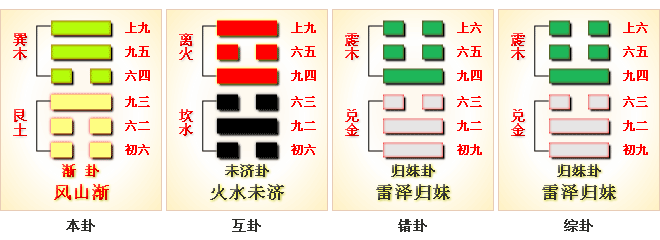

# 渐 ䷴ jiàn

- No.53

> 漸，女歸吉，利貞。
>《彖》曰：漸之進也，女歸吉也。進得位，往有功也。進以正，可以正邦也。其位剛得中也。止而巽，動不窮也。
>《象》曰：山上有木，漸，君子以居賢德善俗。

> 初六，鴻漸于干。小子厲，有言，無咎。
>《象》曰：小子之厲，義无咎也。

> 六二，鴻漸于磐，飲食衎衎，吉。
>《象》曰：飲食衎衎，不素飽也。

> 九三，鴻漸于陸，夫征不復，婦孕不育，凶，利禦寇。
>《象》曰：夫征不復，離群醜也；婦孕不育，失其道也；利用禦寇，順相保也。

> 六四，鴻漸于木，或得其桷，无咎。
>《象》曰：或得其桷，順以巽也。

> 九五，鴻漸于陵，婦三歲不孕，終莫之勝，吉。
>《象》曰：終莫之勝，吉，得所願也。

> 上九，鴻漸于陸，其羽可用為儀，吉。
>《象》曰：其羽可用為儀，吉，不可亂也。

阴阳升降，复本曰归魂之象。巽下见艮，阴长阳消，柔道将进，
> 艮变八卦终于渐，渐终降纯阴入坤，分长女，三阴之兆也，柔道行也。

与兑为飞伏。
> 丙申金，丁丑土。

九三三公居世，宗庙为应。建始己亥至甲辰，
> 小雪清明。

积筭起甲辰至癸卯，周而复始。
> 土木见运入卦，筭吉凶。

五星从位起太白，
> 太白，西方之卦，定吉凶。

柳宿从位降丙申，
> 二十八宿，柳宿入卦定吉凶。

分气候二十八。
> 定数配吉凶，入卦起筭。

上木下土，风入艮象，渐退之象也。互体见离，主中文明。九五传位，得进道明也。
> 九五处互体卦之上，进文明也。

六二阴柔得位，应至尊。《易》云：“鸿渐于磐，饮食衎衎。”
> 贤人进位也。

阴阳升降，八卦将尽；六十八爻，阴阳相杂，顺道进退，次于时也。少男之位，分于八卦，终极阳道也。阳极则阴生，柔道进也，降入坤宫八卦。
> 阳卦三十二宫为阳，乾、震、坎、艮也。

# [Jiàn ䷴](e6b890jian.md)
