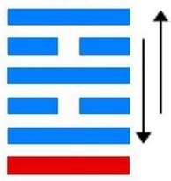
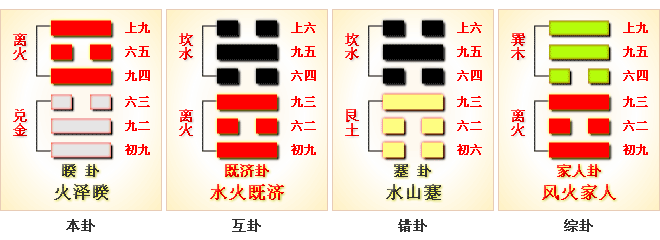

# 暌 ䷥ kuí

- No.38

> 睽，小事吉。
>《彖》曰：睽，火動而上，澤動而下，二女同居，其志不同行。說而麗乎明，柔進而上行，得中而應乎剛，是以小事吉。天地睽而其事同也，男女睽而其志通也，萬物睽而其事類也，睽之時用大矣哉。
>《象》曰：上火下澤，睽，君子以同而異。

> 初九，悔亡，喪馬勿逐，自復。見惡人，无咎。
>《象》曰：見惡人，以辟咎也。

> 九二，遇主于巷，无咎。
>《象》曰：遇主于巷，未失道也。

> 六三，見輿曳，其牛掣，其人天且劓，无初有終。
>《象》曰：見輿曳，位不當也。无初有終，遇剛也。

> 九四，睽孤，遇元夫，交孚，厲无咎。
>《象》曰：交孚无咎，志行也。

> 六五，悔亡，厥宗噬膚，往何咎。
>《象》曰：厥宗噬膚，往有慶也。

> 上九，睽孤，見豕負塗，載鬼一車。先張之弧，後說之弧。匪寇婚媾，往遇雨則吉。
>《象》曰：遇雨之吉，群疑亡也。

火泽二象，气运。
> 一作转。

非合。阴消阳长，取象何比。惟阳是从。阴阳动静，刚柔分焉。先睽后合，其消通也。文明上照，幽暗分矣。
> 兑处下，为积阴暗之象也；离在上，为明照于下。

《易》云：“见豕负涂，载鬼一车，先张之弧，后说之弧。遇雨则吉。群疑亡也。”
> 先疑，暗也；后说，明也。

与离为飞伏。
> 己酉金，丙戌土。

诸侯立九四为世，初元士为应。建始甲午至己亥，
> 芒种小雪。

积筭起己亥至戊戌。
> 水土入卦。

五星从位起岁星，
> 岁木星入卦。

参宿从位降己酉，
> 二十八宿配参宿，入卦己酉土。

分气候三十六。
> 起数积筭。

金火二运合土宫，配吉凶于岁时。六五阴柔处文明，九二四得立权臣。

阴阳相荡，六位逆迁，变离入乾。健于外象，坎入履。
> 阴阳推迁，变化六爻。吉凶之兆，着于要之爻。如臣事君，近多忧也。

次降入天泽履卦。[䷉](e5b1a5lv_cn.md)
　　　　　　　　　　　　　　　　　　　　　　　　　　　　　　　　　
# [Kuí ䷥](e79dbdkui.md)
