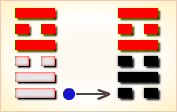
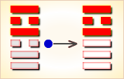
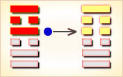

# 暌 ䷥


睽（kuí）卦是离上兑下的卦名。

睽卦代号是`6:5`，其主卦是`6`卦兑卦，卦象是泽，特性是愉快；客卦是`5`卦离卦，卦象是火，特性是光明而依赖。

阳数比是`6:5`。茂盛的河泽地带，燃起了一堆火，斜视一眼，挺别扭。主客双方关系很别扭，这是睽卦对当前形势的描述。

图中，红色表示当位的爻，天蓝色表示不当位的爻，箭头表示有应”。

- 卦序：38

> 睽，小事吉。
>《彖》曰：睽，火動而上，澤動而下，二女同居，其志不同行。說而麗乎明，柔進而上行，得中而應乎剛，是以小事吉。天地睽而其事同也，男女睽而其志通也，萬物睽而其事類也，睽之時用大矣哉。
>《象》曰：上火下澤，睽，君子以同而異。

> 初九，悔亡，喪馬勿逐，自復。見惡人，无咎。
>《象》曰：見惡人，以辟咎也。

> 九二，遇主于巷，无咎。
>《象》曰：遇主于巷，未失道也。

> 六三，見輿曳，其牛掣，其人天且劓，无初有終。
>《象》曰：見輿曳，位不當也。无初有終，遇剛也。

> 九四，睽孤，遇元夫，交孚，厲无咎。
>《象》曰：交孚无咎，志行也。

> 六五，悔亡，厥宗噬膚，往何咎。
>《象》曰：厥宗噬膚，往有慶也。

> 上九，睽孤，見豕負塗，載鬼一車。先張之弧，後說之弧。匪寇婚媾，往遇雨則吉。
>《象》曰：遇雨之吉，群疑亡也。

### 起卦

睽是`6:5`卦的卦名，`6:5`是睽卦的代号。“睽”（kuí），不顺，乖离：睽孤（乖离而独处）。
`6:5`卦的主卦是`6`卦兑卦，卦象是泽，特性是愉快；客卦是`5`卦离卦，卦象是火，特性是光明而依赖。
茂盛的河泽地带，燃起了一堆火，斜视一眼，挺别扭。主客双方关系很别扭，这是睽卦对当前形势的描述。

起卦前必须客观地、全面地、准确地分析主方和客方的情况，必须至少符合下列条件之一，此卦才有参考价值：

1. 主方与河泽很相似，客方与火很相似。
2. 主方的阳数是`6`，客方的阳数是`5`。
3. 主方的态度是阳，素质是阳，行动是阴；客方的态度是阳、素质是阴和行动也是阳。

切勿用任何随机数方式起卦，否则此卦不能用作决策工具。

睽卦下部三条爻是主卦，代表主方；上部三条爻是客卦，代表客方。黑色的爻是当位的爻，对主方有利；灰色的爻是不当位的爻，对主方不利。

客卦三条爻全不当位，表明主方的困难主要来自客方。客卦的下爻，也就是第四爻，是阳爻，表示客方积极主动，与其对应的主卦下爻也是阳爻，主方也是积极主动，客方与主方激烈竞争，是潜在的对主方不利的因素。因为主方也在积极主动地谋求发展，主方在维护和扩充自己的利益，客方不一定能赢主方，所以这种不利因素只是潜在的。客卦的中爻是阴爻，表示客方素质不佳，图中一个箭头从客卦中爻指向主卦中爻，主卦中爻是阳爻，表示主方素质良好，素质不佳的客方依赖主方，从主方取得补益，是真正的对主方不利的因素。客卦上爻是阳爻，表示客方态度强硬，图中有一个箭头从客卦上爻指向主卦上爻，主卦上爻是阴爻，表示主方态度随和，态度强硬的客方制约态度随和的主方，是真正的对主方不利的因素。尽管客卦的行动、素质和态度三方面都对主方不利，但是主方不能改变它，只能期望它发生变化，并且及时恰当应对。

主卦下爻是阳爻，表示主方积极主动，主方积极发展开拓，有利于维护和增加自己的利益，应当坚持下去。主卦中爻是阳爻，表示主方素质良好，虽然在与客方交往中可能遭受损失，但是，主方可以利用客方对主方的依赖，获取更多利益，实际上还是对主方有利的，这是主方的实力，主方应当坚持维护和加强。主卦的上爻是阴爻，表示主方态度随和，受到态度强硬的客方制约，对主方不利。可是，上爻是对中爻的补充，主方的态度随和是由于主方的素质还不是非常好，实力还不是非常强。主方应当做的是更积极主动，争取在竞争中获胜。

根据当前情况，主方或者客方做任何变化，都是非常规变化，不可预测。同时，也需要考虑常规变化，常规变化是事物自身的发展变化，按阳数，其规律是4、5、6、7、3、2、1和0。主方可能发生的变化是从兑卦变到乾卦，这与上述的增强积极主动争取胜利是一致的。客方可能发生的变化是从离卦变到兑卦，如果这种变化发生，对主方不一定不利。

总之，主方面对这样一个看起来别扭的竞争者，应当更积极主动，争取在竞争中取胜。

爻辞删去判断词，是一首完整的围绕主题“睽”的散文诗，下面是其译文：

```
丢了马不要去找，马会自己回来；见到了恶人，
（他们）在小巷中遇到了主人。
见到牛拉着的车，赶车人的额头上刺了字，
别扭，（他们）遇到了善良的人，诚恳相交。
见到了宗派的人，亲密如同互咬皮肤。
别扭，见到了涂满泥土的猪，
车辆载了一车鬼，先欲张弓射鬼，后来放下了弓；
不是强盗，而是求婚的。
```

### 火泽睽 异中求同 下下卦《象》曰：此卦占来运气歹，如同太公作买卖，贩猪牛快贩羊迟，猪羊齐贩断了宰。

### 卦辞解释

睽者，彼此相违之义。卦德上离明、下兑悦，悦生于内，明用于外，悦非所悦，明非所明，悦明不当，故谓睽。此阴阳相隔，和缓调理之卦，承上明夷而来。明夷者，真明有昧之义。真明有昧，假明即出，识神用事，顺其所欲，明于外而不明于内，性乱命摇，与道相隔，此睽之所由来也。然睽则睽矣。又有致合之道，特以明虽在外，若能虚其心，可以返明于内。欲虽起内，若能实其腹，可以扫欲于外。明返欲扫，神定情忘，则阴阳隔碍潜通，睽者亦可以致合，故小事吉也。小事者，阴之事。人心用事已久，道心埋没，大事已去，今欲致合，必先去人心而后生道心，道心复后，大事方吉。正在睽中，求其人心不坏，其事足矣。安敢望其大事之吉乎。试就小事吉者论之。

1. 初九，在睽之初，道心方去，人心方来，若能刚而守正，不为人心所惑，道心自复，有悔者可以悔亡，如丧马勿逐自复也。然必见恶人无咎者，恶人即人心，人心俱有五贼，足以败道，不见人心，不知五贼作祸，见人心而顺其所欲，渐次导引，五贼不得张狂，所以避害耳。此济睽于方睽之时也。
2. 九二，当阴阳正睽之时，邪气盛而正气弱，道心未易相遇。然刚以柔用，从小道中进步，借人心生道心，如遇主于巷，本有咎者，即能无咎。此济睽于正盛之时也。
3. 六三，愚而自用，顺其所欲，如舆曳而牛掣也。不悦于内而悦于外，未得于彼，早失于己，如天头而劓鼻也。如此之人，务外伤内，认假失真，到头一着，穷无所归，始悔自错，故无初有终也。但不能悔于初，而悔于终，悔之无益。此不睽而自致其睽也。
4. 九四，阳在阴中，道心为人心所陷，人心惟危，道心惟微，孤阳无依，是睽孤也。然道心虽微，若能敏而好学，不耻下问，交孚抱道之君子，彼此资益，人心日去，道心日增，久之人心化，道心存。阴阳混合，孤者可以不孤，有咎者可以无咎。此以尊交卑，能济其睽也。
5. 六五，柔顺虚心，居二阳之中。既明其我家纯阴，又明其他家有阳，虚人心而求道心，本有悔者，而悔可以亡矣。夫道心者，人心之宗，厥取道心之宗，点化人心之假，如噬肤之易，以是往而行道，有何睽之咎乎？此以虚求实，能济其睽也。
6. 上九，处睽之极，道心埋没已久，人不反顾，是睽孤也。道心埋没，人心用事，习染成性，疑虑百出，如豕负涂，载鬼一车矣。若欲复道心，须先明人心，但明之贵于见之，见豕见鬼，实见的人心为害甚大。既能见得，即能明得，先不明而用心，如先张之弧也。后能明而复道心，如后说之弧也。无人心而不见道心，无道心而难知人心，借人心复道心。

### 卦象

人心虽罪之魁，亦功之首，匪寇而实婚媾也。人心既见，道心即复，于是虚人心，振道心，往而济睽，则阴阳和合，如遇其雨，洗去一切旧染之污，仍是当年圆成无亏之物，其吉为何如乎。此睽终必合，乘时而济睽也。

六爻俱有睽而致合之道，仅得免其阴阳不睽，而不能阴阳有济，故彖曰：“小事吉。”然小事能吉，大事即能吉，睽终而合，阴阳相通，至此而求，大事未有不致吉者。修道者，可不先求其小事之吉乎。

### 卦辞释义
```
〖原文〗小事吉。
〖译文〗作小事吉利。
〖解说〗睽卦的主卦是兑卦，主方已经取得成功，
仍然可以继续发展，客方的素质不佳，依赖主方的帮助。
同时，客方在积极主动地谋求自己的发展，
对主方表现出强硬的态度，粗暴或者傲慢。
客方很难取得主方的信任，主方担心客方过于贪婪，
也担心客方的挑战，所以，主方谨慎小心，只能作些小事，
保护自己的利益，避免与客方发生冲突，
“小事吉”。卦辞暗示，作大事不一定吉利。
```

### 一阳
```
〖原文〗悔亡；丧马勿逐，自复；
见恶人，无咎。
〖译文〗悔恨消失；丢了马不要去找，马会自己回来；
见到恶人，无所怪罪。
〖解说〗第一爻是主卦的下爻，
代表主方的行动，阳，
表示主方积极主动地谋取和扩大自己的利益，
比如说，创新、创业、投资、进攻、求职、示爱，等等。
主方积极主动取得了成功，“悔亡”；
在与客方的关系中受到了损失，“丧马”；
主方的态度随和，不去寻求挽回损失，“勿逐”；
采取灵活态度，等待丢失的马自己回来，“自复”。
“恶人”指客方。客方的行为由不得主方，
“见恶人”不能怪罪主方，“无咎”。
爻辞的重点是“悔亡”、“勿逐”和“无咎”，
主方应当随其自然，
“丧马”、“自复”和“见恶人”都是客观存在。

〖结构分析〗第一爻的位置是阳位，
这条爻是阳爻，阳爻在阳位，
当位，然而与四阳不有应。
当位表明主方积极主动谋求发展，
有可能维护和扩充自己的利益，
是潜在的对主方有利的因素，所以爻辞说“悔亡”；
不有应表明客方也是积极主动，是主方发展的障碍，
这潜在因素没有成为真正的对主方有利的因素。
由于这种潜在因素的存在，
主方有可能伺机采取恰当行动，爻辞说“无咎”。
```

### 二阳
```
〖原文〗遇主于巷，无咎。
〖译文〗在小巷中遇到主人，无所怪罪。
〖解说〗这里的“主”指主方，
“巷”指当前主客双方关系。
第二爻是主卦的中爻，代表主方的素质，
阳，表示主方素质良好，比如说，
主方有资金、有地位、有权力、有实力、有技术，等等。
主方素质良好，而客方素质不佳，
主方正好可以满足客方的需要，“遇主于巷”，
这情况不是主方故意造成的，
而是现实就是如此，主方不应当受到怪罪。

〖结构分析〗第二爻的位置是阴位，
这条爻是阳爻，阳爻在阴位，不当位，和五阴有应。
不当位表明主方素质良好，
有可能受到客方侵害，是潜在的对主方不利的因素；
有应表明客方素质不佳，
正好可以从主方的良好素质受益，
这潜在因素成了真正的对主方不利的因素。
不过，主方可以利用客方对主方的依赖取得更大发展，
所以爻辞说“无咎”。
```

### 三阴
```
〖原文〗见舆曳，其牛掣；
其人天且劓，无初有终。
〖译文〗看到牛拉着的车，
赶车人的额头上刺了字，没有起初有终了。
〖解说〗这是第三爻的爻辞，
阴，表示主方的态度是阴，主方的态度随和。
“掣”（chè），拉，拽：掣肘。
“天”（tiān），古代在额头上刺字的刑罚。
“劓”（yì），古代割掉鼻子的一种酷刑。
车和赶车的人，指积极主动、素质不佳，
而态度强硬的客方，描绘了一幅悲惨的形象。
由于主方和客方相遇突然，所以“无初”。
主方能够灵活妥善处理，“有终”，由于主方态度随和，
灵活应对客方的挑衅，使得形势有所好转。

〖结构分析〗第三爻的位置是阳位，
这条爻是阴爻，阴爻在阳位，
不当位，然而与六阳有应。
不当位表明主方态度随和，
有可能受到客方制约，是潜在的对主方不利的因素；
有应表明客方态度强硬，正好制约态度随和的主方，
这潜在因素成了真正的对主方不利的因素。
由于主卦上爻是对中爻的补充，
态度随和是素质不是非常好的表现，
主方正在积极主动地谋求发展，随着素质的改善，
态度会变得强硬起来，从而不再受客方制约，
所以爻辞说“无初有终”。
```

### 四阳
```
〖原文〗睽孤；遇元夫，交孚，厉无咎。
〖译文〗乖离而孤独；
遇到善良的人，诚恳相交，严厉，无所怪罪。
〖解说〗“睽孤”，乖离而孤独。
“元夫”（yuán fū），犹善士。
第四爻是客卦的下爻，代表客方的行动，
阳，表示客方积极主动地谋取和扩大自己的利益，
比如说，创新、创业、投资、进攻、求职、示爱，等等。
同时，主方也是积极主动地谋取自己的利益，
客方与主方冲突，“睽孤”。
“元夫”指主方。主方的素质良好，
客方遇到主方，“遇元夫”。
“交”指主方的交往行动，主方诚恳地对待客方，“交孚”。
客方的态度强硬，对于主方来说，“厉”。
尽管情况严厉，主方努力而为，“无咎”。

〖结构分析〗第四爻的位置是阴位，
这条爻是阳爻，阳爻在阴位，不当位，又和一阳不有应。
不当位表明客方积极主动谋求发展，
有可能损害主方利益，是潜在的对主方不利的因素；
不有应表明主方也是积极主动，主方维护自己的利益，
这潜在因素没有成为真正的对主方不利的因素。
所以爻辞说“厉无咎”。
```

### 五阴
```
〖原文〗悔亡，厥宗噬肤，往何咎？
〖译文〗悔恨消亡，他的宗派亲密接近，
往前发展，有何可以怪罪？
〖解说〗“厥”（jué），其，他的，她的。
“噬肤”（shì fū），比喻关系亲近。
第五爻是客卦的中爻，代表客方的素质，
阴，表示客方的素质不佳，
比如说，资金缺乏、地位底下、实力薄弱、教育程度低，等等。
主方没有悔恨地帮助客方，与客方亲密相处，不应当受到怪罪。

〖结构分析〗第五爻的位置是阳位，
这条爻是阴爻，阴爻在阳位，不当位，并且和二阳有应。
不当位表明客方素质不佳，
有可能谋求从主方获益，是潜在的对主方不利的因素；
有应表明主方素质良好，正好可以满足客方需要，
这潜在因素成了真正的对主方不利的因素。
换一个角度考虑，由于客方依赖主方，
主方可以利用客方的依赖取得更多利益，
所以爻辞说“悔亡”，“往何咎”。
```

### 六阳
```
〖原文〗睽孤，见豕负涂，载鬼一车，
先张之弧，后说之弧；匪寇，婚媾；往遇雨则吉。
〖译文〗乖离而孤独，看到涂满泥土的猪，
车辆载了一车鬼，先欲张弓射鬼，后来放下了弓；
不是强盗，而是求婚的；往前走遇到雨则吉利。
〖解说〗第六爻是客卦的上爻，
代表客方的态度，阳，表示客方态度强硬。
由于主客双方都是积极主动，双方有冲突，“睽孤”。
客方的素质不佳，而且态度强硬，
主方看客方，是“见豕负涂，载鬼一车”。
起初，由于不了解客方，主方准备攻击客方，“先张之弧”；
后来主方对客方有所了解，放弃攻击客方，“后说之弧”。
客方对主方并无恶意，“匪寇，婚媾”。
误会消除了，对主方有益，“往遇雨则吉”。

〖结构分析〗第六爻的位置是阴位，
这条爻是阳爻，阳爻在阴位，
不当位，然而与三阴有应。
不当位表明客方态度强硬，
有可能制约主方，是潜在的对主方不利的因素；
有应表明主方态度随和，正好客方可以制约主方，
这潜在因素成了真正的对主方不利的因素。
由于客方素质不佳，实力薄弱，强硬的态度没有实力支持，
而主方素质良好，实力雄厚，主方可能柔中有刚，
利用客方僵硬的态度取得有利效果，
所以爻辞说“往遇雨则吉”。
```

### 彖传解释
```
《彖传》说：
睽，乖离与相对，
就像燃烧的火焰总是往上飘行，流动的水泽总是往下渗入。
又好像两个女子同居一室，因志向不同而行为各异。
下卦的水泽附丽于上卦的火焰而显得明亮，
阴柔顺进向上直行，得居中正地位而与阳刚者呼应，
因此说“小心谨慎地做事可获吉祥”。
天和地相互为乖离与相对，天下万物的所为情理却都相同无异，
如世间的男女所为各不一样，但交感求和的心志却也相同，
天下万物的形态各异，但禀受天地阴阳之气的表象却也相似，
乖离之时有待适用的范围是多么广大！
```

### 新解
```
睽①：小事吉。
初九：悔亡：丧马，勿逐，
自复②见恶人，无咎。 
九二：遇主于巷，无咎。 
六三：见舆曳③，其牛掣④，
其人天且劓⑤。无初有终。
九四：睽孤⑥，遇无夫⑦，交孚⑧。厉，无咎。 
六五：悔亡。厥宗噬肤⑨。往，何咎？
上九：睽孤，见豕负涂⑩，载鬼一车⑪，
先张之弧⑫，后说之弧⑬。
匪寇，婚媾。往，遇雨则吉。

①睽（kuí）是本卦的标题。
睽的意思是相违，矛盾，反目等。
全卦记述旅人出行途中所见所闻，像一篇旅行日记。
作标题的“睽”字与内容有关。
②复： 返回。 
③舆：大车。曳：拖拉，摇摆。
④掣：意思是牛角一俯 一仰，形容牛拉车很吃力的样子。
⑤天：用作“颠”，意思是额部，这里专指一种在额上刺字的刑罚。
劓（yì）：割掉鼻子（一种刑罚）。
⑥睽：乖 离，这里指外出的旅人。睽孤的意思是说旅人孤单行路。
⑦元夫：元用 作“兀”，元夫就是跛子。
⑧交：一起，全部。
⑨厥：其，这里指代 旅人。
厥宗：跟他同宗族的人。噬：吃。肤：这里指肉。
⑩豕：猪。涂：泥巴。负涂：背上有泥。
⑪鬼：这里指用图腾打扮的人。
⑫张：拉 开。弧：弓。
⑬说：用作“脱”，这里的意思是放下。

【译文】 
睽卦：小事吉利。
初九：没有悔恨。马跑掉了，不必去追，它自己会回来。
途中遇到容貌丑陋的人，没有灾祸。
九二：刚进小巷就遇到主人接待，没有灾祸。
六三：看到一辆拉货的车，拉车的牛很吃力，
一步一使劲，牛角一俯一仰的，
赶车的人是个被烙了额、割掉鼻的奴隶。
开始时拉不动，最后拉走了。
九四：旅人孤身赶路，遇到一个踱子，同他一起被抓住。
危险，结果却没有灾难。 
六五：没有悔恨。看见同宗族的人在吃肉。
往前走去，哪有什么灾祸？
上九：旅人孤身赶路，看到一头猪满身是泥，
一辆大车载满了图腾打扮的人。
他们起初拿起弓箭要射，后来放下了。
这些人不是来抢劫，而是去订婚。
旅人继续前行，虽然遇到下雨，但平 安吉利。

【读解】
我们不知道这位旅行者姓甚名谁，
更不知道他此行的目的和终点。
他给我们的感觉是心情悠闲轻松，虽有心情紧张的时候，
但大体上是无忧无虑的，自在的，并且一路顺利。
因此，他才有闲情逸致记下所见所闻。他边走边看，像旁观者。
他也像导游或电影导演，通过他的眼睛的选择，
引领我们同他一起去观看旅途的景象：
丢失马匹，容貌丑陋的人，投宿顺利，拉车的牛和赶车的奴隶，
弧身赶路被俘，同族人吃肉，
满身是泥的猪，订婚的一群人，遇雨却平安。
这里没有文学夸张，更没有潜台词和微言大义；
匆宁说，它简直像二次大战后电影中的新现实主义所用的长镜头，
跟踪一桩生活中发生的事件，力图真实地记录下来。
看不少作者的倾向性，没有任何评点、议论，朴实得如同生活本身。
好处和价值也正在这里。让我们自己去感受，
用自己的生活体验去充实其中的细节，
去揣度人物的心理，去体味古人的生存状况。
因此，它比诗更有诗意，比散文更精炼。
同时，我们不要忘了，
悠闲的心境和细致的体察，是产生这篇日记的关键因素。
```


睽卦离上兑下，为艮宫四世卦。睽象征乖离、乖异，筮遇此卦，大事不吉，小事顺利。

人心外向，背道而驰；难以成事，不宜大举。得此卦者，运气不佳，水火不容，相互矛盾，诸事难成。

- 时运：上下不通，以正处之。
- 财运：人弃我取，尚有小利。
- 家宅：迁避为宜；择而娶之。
- 身体：上火下湿，实在难治。

```
这个卦是异卦，下兑上离，相叠。离为火；兑为泽。
上火下泽，相违不相济。克则生，往复无空。
万物有所不同，必有所异，相互矛盾。睽即矛盾。

《象传》：离火向上，兑泽则向下，
一上一下，两相乖违，又二女同居，不得正之象。
```

运势：气运欠佳，诸事难成，有水火不容之象，宜处变不惊。

- 事业：事业开创困难，处境艰辛。如能志同道合，相互信任，目的可以达到。但起初成功的多是小事，小事积累可成大事。事成于协力合作，败于众志相异。应加强团结，委曲以求相通，最忌内部相互猜疑。
- 经商：应以心平气和的态度投入市场竞争，求大同而存小异。对竞争对手不应敌视，可和而不流，群而不党。尤其不能惹起纠纷，极力避免灾祸。
- 求名：以真诚的心努力上进。对于恶人必要时亦不可完全不交往，应采取宽大包容的态度，适度往来。对志同道合者也不必完全一致，可异中求同。
- 婚恋：双方必须真诚相待。否则，第三者极易介入，夫妻相疑则家破。
- 决策：处于矛盾、对应状态。必须注意以宽宏大度、平和、柔顺的态度对待人生。这样才能心平气和，柔而上进。认清合必有离，离必有合；同中有异，异中有同的道理。否则，刚极暴躁，明极生疑。暴疑皆可致命。

```
睽：表示乖危、叛逆、背离之象，主凶象。
意见不合，彼此争斗、任性、不协调。
事事均不顺，且有被出卖的危险，注意犯小人。

解释：防小人。

特性：经常事与愿违，个性敏锐，理想化，
感情与理智容易矛盾冲突，易生孤独感，宜往专技艺术发展。
```

运势：水火不相容，则气运不通，势行低落，诸事难成。凡事有违叛之时，若能处变不惊，不逞强出头，尚可转危为安。有家内不和，亲友疏散之情。宜力持温和，忍耐去克服困难，始可渡危。

- 家运：困苦离亲之象，不和睦之情。家运衰颓，虽可得小利，但也入不敷出。
- 疾病：轻症宜速就医，重症则危，更防断症错误，注意心脏，寒热失调之症。
- 胎孕：无碍。
- 子女：子女不和，有骨肉无情之不幸，且其子女六亲缘薄无靠。
- 周转：难以如愿。
- 买卖：多阻碍，难成，若成者亦必损。
- 等人：不会来。
- 寻人：因口角负气出走，其志不同故不易寻。
- 失物：不能找回。有失窃的可能。
- 外出：顺利。途中可以得到善人相助。
- 考试：落榜。
- 诉讼：宜速求和解，迟则理屈辞穷。
- 求事：无希望。
- 改行：不宜。
- 开业：不利。

### 初九：悔亡，丧马勿逐，自复。见恶人，无咎。《象》曰：见恶人，以辟咎也。

不必悔恨，丢失了马匹，不必寻找，它自会回来，途中碰见坏人，也不会有灾祸。《象传》说：遇见坏人之所以无灾祸，意在消除恶人的恶意。

平：得此爻者，营谋先失而后得，人事先离而后合，谨防凶恶之灾患。做官的闲职者复职，被贬者复升。

- 时运：好运初至，顺其自然。
- 财运：不必多虑，后必大亨。
- 家宅：平顺无咎；耐心等待。
- 身体：没有大碍。

### 初九变卦：火泽睽 变卦 火水未济



初九爻动变得[第64卦：火水未济](e69caae6b58eweiji_cn.md)。

这个卦是异卦，下坎上离，相叠。离为火，坎为水。火上水下，火势压倒水势，救火大功未成，故称未济。《周易》以乾坤二卦为始，以既济、未济二卦为终，充分反映了变化发展的思想。

### 九二。遇主于巷，无咎。《象》曰：遇主于巷，未失道也。

遇着了热情好客的主人，没有灾难。《象传》说：遇着了热情好客的主人，这说明没有迷失道路。

平：得此爻者，会得知己，营谋遂意。做官的会遇到明主，升迁有望。

- 时运：风云际会，勇往直前。
- 财运：遭遇财主，共同经营。
- 家宅：贵人来访；小心私情。
- 身体：得遇良医。


九二爻动变得[第21卦：火雷噬嗑](e599ace59791shike_cn.md)。

这个卦是异卦，下震上离，相叠。离为阴卦；震为阳卦。阴阳相交，咬碎硬物，喻恩威并施，宽严结合，刚柔相济。噬嗑为上下颚咬合，咀嚼。

### 六三：见舆曳，其牛掣。其人天且劓，无初有终。《象》曰：见舆曳，位不当也；无初有终，遇刚也。

看见一辆拉货的车，拉车的牛一俯一仰拉得很费劲，赶车的人是一个烙了额，割了鼻的奴隶。起初车子陷着不动，后来终于拉动了。《象传》说：看见一个烙额割鼻的奴隶在拉车，爻象表明：六三阴爻而居于阳位，所处不当，像人落入了悲苦的境地。起初不顺，结局倒好，因为六三阴爻上进遇到九四阳爻，像人得到强者的帮助。

凶：得此爻者，谋望有阻，险中求安，先迷后顺。不良者有骨肉刑伤之厄。做官的须防小人的谗言。

- 时运：恐有刑伤，苦撑三年。
- 财运：人和不易，无利可图。
- 家宅：朝西为宜；先疑后释。
- 身体：面上有疮，久后自愈。



六三爻动变得[第14卦：火天大有](e5a4a7e69c89dayou_cn.md)。

这个卦是异卦，下乾上离，相叠。上卦为离，为火；下卦为乾，为天。火在天上，普照万物，万民归顺，顺天依时，大有所成。

### 九四：睽孤，遇元夫。交孚，厉无咎。《象》曰：交孚无咎，志行也。

旅人孤单地行路，遇上一个跛子，一同被抓住，情形危险，但终无灾祸。《象传》说：交相信任，必无灾难，说明其志得行，目的达到。

平：得此爻者，能得到朋友的帮助，转危为安，求婚者必配。做官的会得到同僚的推荐，升迁有机。

- 时运：孤僻个性，朋友相助。
- 财运：进退两难，旧友帮忙。
- 家宅：四周荒凉。
- 身体：目疾求医。



九四爻动变得[第41卦：山泽损](e68d9fsun_cn.md)。

这个卦是异卦，下兑上艮，相叠。艮为山；兑为泽。上山下泽，大泽浸蚀山根。损益相间，损中有益，益中有损。二者之间，不可不慎重对待。损下益上，治理国家，过度会损伤国基。应损则损，但必量力、适度。少损而益最佳。

### 六五：悔亡，厥宗噬肤，往何咎。《象》曰：厥宗噬肤，往有庆也。

没有悔恨。瞧见同族宗人在吃肉，孤单的旅人欣然结伴同行，一路平安无事。《象传》说：同族宗人在吃肉，前往，必有喜庆之事。

平：得此爻者，经营获利，抬举有人。不良者，亲朋怨恶，骨肉刑伤，官司牵连。做官的会获得成就与名望，读书人会取得佳绩。

- 时运：同宗相助，可以放心。
- 财运：须防合伙，自己端正。
- 家宅：旧屋可居；亲上加亲。
- 身体：皮肤毛病，不难治好。


六五爻动变得[第10卦：天泽履](e5b1a5lv_cn.md)。

这个卦是异卦，下兑上乾，相叠。乾为天，兑为泽，以天喻君，以泽喻民。原文：“履（踩）虎尾，不咥（咬）人”。因此，结果吉利。君上民下，各得其位。兑柔遇乾刚，所履危。履意为实践，卦义是脚踏实地的向前进取的意思。

### 上九：睽孤，见豕负涂，载鬼一车。先张之弧，后说之弧，匪寇婚媾。往遇雨则吉。《象》曰：遇雨之吉，群疑亡也。

旅人孤单地行路，见一头大猪伏在路上，又遇上一辆大车，上面满载着打扮得奇形怪状的人。旅人搭弓欲射，后来又放下弓箭。因为这伙人不是强盗，而是去订婚的。旅人照常行进，遇上大雨，但一切平安。《象传》说：上九爻辞讲的旅人途遇婚媾之人，开始相互猜疑，几致动武，后来相安无事，照常旅行。这是因为双方疑惧消失了。

平：得此爻者，遭污受诬，先损后益。做官的须防被诽谤之忧。

- 时运：运转之时，正心诚意。
- 财运：秋雨之后，方可获利。
- 家宅：防有作祟；婚姻终和。
- 身体：因疑成病，解疑无碍。


上九爻动变得[第54卦：雷泽归妹](e5bd92e5a6b9guimei_cn.md)。

这个卦是异卦，下兑上震，相叠。震为动、为长男；兑为悦、为少女。以少女从长男，产生爱慕之情，有婚姻之动，有嫁女之象，故称归妹。　
　　　　　　　　　　　　　　　　　　　　　　　　　　　　　　　　　
# [Kuí ䷥](e79dbdkui.md)
