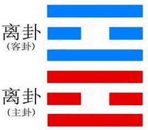
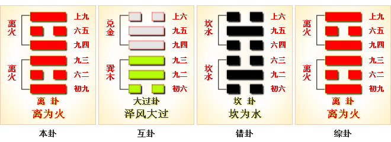
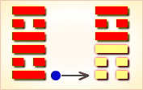
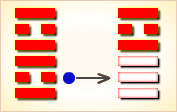
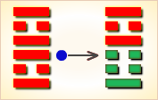
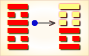
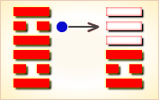

# 离 ䷝



离（lí）卦是上离下离的卦名，代号是`5:5`。

离为火（离卦）附和依托。主卦和客卦都是`5`卦离卦，卦象是火。这个卦是同卦（下离上离）相叠。

阐释依附的原则：主客双方如同两对燃烧的火，互相照亮，互相竞争，看谁的火焰更光亮，看谁照射的时间更长，主方应当尽量发出光辉。

当在险难中，必然就要攀附，找到依托才能安全。应把握中正的原则，不可偷机取巧。
应觉悟升沉生死是自然常理，知天乐命，才不会因得不到依附而自寻苦恼。
依附不可乘人之危，采取胁迫的手段，以免招祸。依附强者，应柔顺中庸，时刻警觉，才能化险为夷。
图中，红色表示当位的爻，天蓝色表示不当位的爻，离卦的各条爻之间没有有应。

- 组成：上离、下离（同卦）
- 运势：中上卦
- 卦象：火
- 含义：附和依托。
- 卦序：30

## 结构和卦爻辞

离卦下部三条爻是主卦，代表主方；上部三条爻是客卦，代表客方。主卦与客卦完全一样，对应的爻都相同，要么都是阳爻，要么都是阴爻，没有一阴一阳的和谐状态，都是对立。两条阳爻对立而有冲突，两条阴爻对立而无冲突。由于阴阳趋向于和谐是事物变化的基本规律，和谐状态是比较稳定的状态，不和谐状态是比较不稳定的状态，因此离卦的六条爻所代表的因素都不稳定，对于主方来说，都是潜在因素，潜在的有利因素，或者潜在的不利因素。黑色的爻是潜在的有利因素，是当位的爻；灰色的爻是潜在的不利因素，是不当位的爻。

主卦的三条爻全部当位，都是潜在的对主方有利的因素，主方应当极力保持不变。下爻是阳爻，表示主方积极主动谋求发展，有可能改善主方素质，是潜在的对主方有利的因素，应当继续坚持。中爻代表主方的素质，表示素质不佳，是寻求发展的动力，是潜在的对主方有利的因素，应当坚持继续保持低姿态，即使素质得到改善，也不要满足。上爻代表主方的态度，阳爻表示态度强硬，有利于制约客方，是潜在的对主方有利的因素，也应当继续保持。

客卦的三条爻全部不当位，由于对主客双方利害不同，卦是从主方角度考虑的，如果从客方角度考虑，这三条爻代表的状态都有利，都应当继续保持，但是，从主方角度来说，则都是对主方不利，所以都是不当位的爻，主方希望它们发生变化。客卦的状态决定于客方，主方不能改变客卦的爻，但是，可以关注这三条爻所代表的情况，及时应对其变化。

如果这种状态持续下去，主客双方都继续保持状态不变，久而久之，可能发生常规变化。按阳数，常规变化的规律是4、5、6、7、3、2、1和0，双方的阳数都是5，会自然而然地从5增加到6，从5卦离卦变到6卦兑卦。不大可能主客双方同时变到兑卦，总有一方先变。一旦有一方变了，整个形势将改变。主方应当积极主动地争取先变，赢得这场竞争。

总之，主方应当继续保持积极主动和强硬的态度，并且密切注意客方动态，采取应对措施，不可怠慢，不可错过时机，争取在与客方的竞争中取胜。

图的底部是卦名和卦辞，卦辞从总体上对主方提出建议。
图右是爻辞，与爻一一对应，从下往上数。
删去判断辞，就可以看出六条爻辞是一首完整的围绕主题“离”的散文诗。下面是其译文：

```
小心地踏步前进，尊敬对方，
像熊熊的火焰，发射出黄色光辉，
（切不要）像日落时的晚霞，
如果不击鼓而歌，则留下衰老的叹惜。
（客方）突如其来，像燃烧，像死亡，又像消失了，
泪水滂沱而下，空空悲叹。
（这是）国王用兵出征，
奖励杀死敌人的将士，俘虏很多土匪。
```

下面逐条说明卦爻辞。

### 阐释原则

离卦，阐释依附的原则。当在险难中，必然就要攀附，找到依托才能安全。但寻求依附，首先应认清目标，必须谨慎选择。应把握中正的原则，不可投机取巧。应觉悟升沉生死是自然常理，知天乐命，才不会因得不到依附而自寻苦恼。依附不可乘人之危，采取胁迫的手段，以免招祸。依附强者，应柔顺中庸，时刻警觉，才能化险为夷。附着的目的在团结；因而，破坏分子，应当断然扫除，但也要宽大，祇铲除首恶，附从则不予深究。

内外皆离，中存兑巽，上下皆明，天下之人，悦其照耀，光辉盛美，又为顺而从之，事皆昭彰，令誉显着，君子得之，则为离明之象。离者丽也，乃离卦之首卦，名八纯卦，卦内财官父兄子俱全，为本宫下七卦之伏神也。起卦中的遇卦，离卦，五行属火，方向为南方，性别为中年女性。中女：次女，第二个女孩，或长女后非最小的女孩。

匹配的内容不同，所解释的意义不同。如下离卦上坎，坎为水，下火上水，必然烧开锅，某个事件上其意马到成功，也可以在某种事件上形容为水必灭火。 如果下坎上离，那就可能一事无成，水往下流、火往上烧，谁也不干涉谁。
如下离卦上震，震为雷，在某种意义上，很可能是一发不可收拾的地步。雷火冲天，惊天动地的事情即将发生。

因此，在起卦中是因人而论，因事而议，因果轮回的。周易包含万物也取自万物的自然规律，也需要对自然的渗透力，觉察力和理解力。

### 应用条件

起卦前必须客观地、全面地、准确地分析主方和客方的情况，必须至少符合下列条件之一，此卦才有参考价值：

1. 主方与火很相似，客方也与火很相似。
2. 主方的阳数是`5`，客方的阳数也是`5`。
3. 主方的行动是阳，素质是阴，态度是阳；客方的行动、素质和态度也是阳、阴和阳。

切勿用任何随机数方式起卦，否则此卦不能用作决策工具。

### 卦辞
```
〖原文〗利贞，亨；畜牝牛吉。

〖译文〗利于坚持，顺利；蓄养牝牛吉利。

〖注释〗：离：卦名。帛《易》作“罗”。
古“离”、“罗”二字通，引申为捕捉、分离。
离又通“丽”，有附著，经历，光明等意。
畜牝牛：畜养母牛。畜，养。牝，母。

〖解说〗这是5:5卦的卦辞。
这个卦是同卦（下离上离）相叠。
离者丽也，附着之意，一阴附丽，
上下二阳，该卦象征火，内空外明。
离为火、为明、太阳反复升落，运行不息，柔顺为心。
“牝”（pìn），雌性的鸟或兽，与“牡”相对：牝牛。
“牝牛”，这里指客方。主方积极主动，
态度坚定地改善自己的素质，应当坚持如此，“利贞”。
客方的素质不佳，尽管也积极主动，并且态度强硬，
然而，不至于对主方有碍，
主方的事务仍然可以顺利进行，“亨”。
要注意妥善处理和客方的关系，不要对客方过于粗暴，
如果能够让客方像温顺的牝牛一样，
蓄养着这样的牝牛，对于主方来说是吉利的。
反之，如果态度过于粗暴，激怒客方，
客方成了一头凶猛的公牛，对于主方来说，就不吉利了。
朱熹《周易本义》曰：“离”，丽也。
阴丽于阳，其象为火，体阴而用阳也。物之所丽，贵乎得正。
“牝牛”，柔顺之物也，故占者能正则“亨”，而“畜牝牛”则“吉”也。

象曰：官人来占主高升，庄农人家产业增，
生意买卖利息厚，匠艺占之大亨通。
```

### 彖传
```
离，丽也；
日月丽乎天，
百谷草木丽乎土，
重明以丽乎正，
乃化成天下。
柔丽乎中正，故亨，
是以畜牝牛吉也。
```

### 大象传
```
明两作，离；大人以继明照于四方。
```

## 爻辞释义
### 初九
```
履错然，敬之，无咎。

〖译文〗在开始行事时，由于急于求成而出现错乱，
后来能恭敬慎重且未轻举妄动，结果没有发生什么灾祸。

注释：错然敬之：
帛《易》作“礼昔然敬之”，帛《易》“履”作“礼”、
“错”作“昔”，古“错”、“昔”二字互假。
“昔”字作始解，依帛《易》此爻指行礼开始即应崇敬。
朱熹《周易本义》曰：以刚居下而处明体，志欲上进，
故有“履错然”之象，“敬之”则“无咎”矣。戒占者宜如是也。
象曰：履错之敬，以辟咎也。
```

### 六二
```
黄离，元吉。

〖译文〗有黄色附着，就可以获得大吉大利。
（在古人的审美观念中黄是最美好的颜色。）

注释：黄离，元吉。用黄色网猎取禽兽，开始即吉。
离为网。商周时代尚黄色故吉。
朱熹《周易本义》曰：“黄”，中色。柔离乎中而得其正。
象曰：黄离元吉，得中道也。
```

### 九三
```
日昃之离，不鼓缶而歌，则大耋之嗟，凶。

〖译文〗夕阳西下，好比人生已入老年，
这时如果不能敲着瓦器伴唱高歌地欢度晚年，
就难免会有春蚕将死、蜡炬成灰的哀叹，这样必然遭遇凶险。

注释：日昃之离：日斜张网（捕禽兽）。
昃，日过中午。不鼓缶而歌：不敲击缶而唱歌。
缶，瓦盆，可作为乐器之用。鼓，敲打。
大耋之嗟：老人发出叹息。
耋（dié），老年人的通称。
古人称老年人为“耋年”。嗟，叹息。
朱熹《周易本义》曰：重离之间，前明将尽。
故有“日昃”之象。不安常以自乐，则不能自处而“凶”矣。
象曰：日昃之离，何可久也？
```

### 九四
```
突如其来如，焚如，死如，弃如。

〖译文〗遇到了突如其来的事情，脾气发得犹如燃烧的烈火，
但顷刻之间又烟消云散、不复存在，落得个被抛弃的下场。

注释：不孝之子返家，
（人们因不孝）将他焚烧，置于他死地，抛弃他。
突，来，返回家。
焚、死、弃，是家人施于不孝之子的刑罚。
亦有解“突”为烟囱者，
然而九三爻“大耋之嗟”思之，似解“突”为不孝子为胜。
朱熹《周易本义》曰：
后明将继之时，而九四以刚迫之，故有此象。
象曰：突如其来如，无所容也。
```

### 六五
```
出涕沱若，戚嗟若，吉。

〖译文〗泪流如雨的样子，忧伤叹息，
居安思危到了这种程度，吉利。

注释：出涕沱若，戚嗟若：
泪如雨下，忧戚叹息。
沱若，滂沱状。喻游戏泪满面如雨。
若，样子。戚，忧伤。嗟，叹息。
朱熹《周易本义》曰：
以阴居尊，柔丽乎中，然不得其正而迫于上下之阳，
故忧惧如此，然后得“吉”。戒占者宜如是也。
象曰：六五之吉，离王公也。
```

### 上九
```
王用出征，用嘉折首，获匪其丑，无咎。

〖译文〗君王用兵出征，下令嘉奖折服敌群，斩杀敌首的人，
因为获得的俘虏不一定是敌首的随从者，
所以要恰当处理，才能没有灾咎。

注释：王用出征，有嘉折首，获匪其丑：
君王用兵出征，有令嘉奖能折服首恶的人，执获的不是一般随从者。
嘉，嘉奖。折，折服。匪，非。丑，同类，随从者。
朱熹《周易本义》曰：
刚明及远，威震而刑不滥，“无咎”之道也，故其象占如此。
象曰：王用出征，以正邦也。
```

### 白话解析
```
离：白话称之为罗。
罗①：利贞，亨，畜牝牛②，吉。

【白话】筮得罗卦，利于贞问，
办事亨通顺畅，畜养母牛，吉善美好。

【注释】
① 罗：卦名，捕捉飞鸟用的网，引申为捕捉。
② 牝牛：母牛。

【讲解】罗，通行本作离。
离有附在上面和光明等含义。
卦象取太阳、火光等阳性物质。
离卦之所以为离卦，是以阴柔为正，
所以必须先正而后乃亨通，故卦辞说“利贞亨”。
离卦卦形，阴柔处于阳刚之内，而履正中，牝母之善也。
外表刚强内心柔顺，是牛的美德。
离卦的本质是以柔顺为主的，
所以不可畜养刚猛的动物，而吉善就在于畜养母牛。

初九：礼昔①然敬之，无咎。

【白话】筮得罗卦，占得初九爻，
天下开始施行礼节然后修养敬爱之心，没有灾难。

【注释】① 礼：仪礼。昔：开始施行。
昔，始，过去。假借为“措”。

【讲解】昔然，通行本作“错然”。
初九阳刚之爻居于罗（离）卦的开始，
光明照耀的时候，必须有所敬慎，
所以在第一爻爻辞便告诫人们，
礼仪一开始就必须敬慎，才能避免灾咎。
王弼说：“错然者，警慎之貌也。
处离之始，将进而盛，未在既济，
故宜慎其所履，以敬为务，辟其咎也。”

六二：黄罗①，元吉。

【白话】筮得罗卦，占得六二爻，
美好的罗网，大吉大善。

【注释】① 黄：美好。罗：罗网。

【讲解】六二阴柔之爻，居中得位，
以阴柔之爻居于阴柔之位，履文明之盛极，
而且得到了中位，所以爻辞说：“黄罗，元吉”。

九三：日昃①之罗，不鼓珤②而歌，即大绖③之嗟，凶。

【白话】筮得罗卦，占得九三爻，
太阳过中偏西的时候设网捕鸟，不敲鼓奏乐而唱歌，
则有穿大麻带丧服的嗟叹，所以凶险。

【注释】
① 日昃：日昃，太阳过中偏画。
② 珤：“缶”字的异体字，鼓的一种（土鼓）。
③ 大绖：古代丧服中的大麻带。

【讲解】九三阳刚之爻居于阳刚之位，
处罗（离）之终点。
象征太阳偏西，不可长久。
《象传》说：“日昃之离，何可久也？”

九四：出如、来如、纷①如、死如、弃如。

【白话】筮得罗卦，占得九四爻，
宿鸟被赶出了巢，飞来落在罗网上，
拚命地挣扎，气力耗尽死于罗网之上，抛弃于地上。

【注释】① 纷：挣扎。

【讲解】这条爻辞讲的是罗鸟的过程，描写得活灵活现。
又九四阳刚之爻居于阴柔之位，处于明道开始变化的时候，
昏暗变为明亮，没落变为出头，所以爻辞说“出如，来如”。
其光明开始出现，其炎热开始加盛，所以说“纷如”。
九四逼近至尊六五，阳爻居阴位，
想达到鼎盛阶段，以炎其上，命运必然不能终结。
所以说“死如”。违背了罗（离）的意义，
九四与初九不能阴阳相应，九四又不是阴爻承继阳爻，
实为众爻所不容，因而“弃如”。

六五：出涕沱若①，戚②嗟若，吉。

【白话】筮得罗卦，占得六五爻，
为飞鸟的惨死而悲患交织泪流满面，
嗟叹不已，最后终于吉善美好。

【注释】
① 出涕：流眼泪。沱若：眼泪很多的样子。
② 戚：忧虑悲伤。

【讲解】六五阴柔之爻居于阳刚之位，
履的不是自己应该履的位置，不能胜任所履的位置。
用阴柔之爻乘阳刚之爻，不能控制下属。
下面阳刚前进，必将前来伤害自己。
忧伤的程度，达到流泪的地步。
但是附丽在尊位，九四为叛逆的首犯，六五忧伤到了极点，
得到了众爻的同情和帮助，所以最终获得吉善美好。

上九：王出正①，有嘉②折首，获不讨③，无咎。

【白话】筮得罗卦，占得尚九，君王出兵征伐，
有嘉国的君王被砍了头，打了大胜仗，不再讨伐了，没有灾难。

【注释】
① 出正：出征。
② 有嘉：有嘉国。
③ 讨：假借为讨伐的“讨”。

【讲解】尚九阳刚之爻居于阴柔之位，
并且处全卦的终点，象征光明达到了极点，
如果用这样锐不可挡的军队出兵打仗，必然会杀伤太多，所以戒之。
```

### 新解
```
【原文】
（离下离上）离①；利贞，亨。畜牝牛，吉。 
初九：履错然②，敬之③，无咎。 
六二：黄离④，元吉。 
九三：日昃之离⑤，不鼓缶而歌⑥，则大耊之嗟⑦。凶。
九四：突如其来如，焚如，死如，弃如⑧。
六五：出涕沱若⑨，威嗟若⑩。吉。 
上九：王用出征，有嘉折首⑪，获匪其丑⑫。无咎。

【注释】 
① 离是本卦的标题。离的意思是“罹”，即遭遇灾祸。
全卦内容主要讲战 祸，标题与内容有关。
② 履：步履，这里指脚步声。错然：杂乱的样子。
③ 敬；用作“儆”，意思是警戒。
④ 离：这里用作“螭”，意思是龙，
指天上像龙形的云、虹，即霓。黄离就是黄霓。
⑤ 昃（zè）：太阳偏西。
⑥ 缶：陶制的乐器。
⑦ 大耊（dié）：老头儿。七十岁叫耊。
⑧ 弃：使……变成废墟。
⑨ 涕：眼泪。沦若：泪如雨下的样子。
⑩ 戚： 忧伤。嗟：叹息。
⑪ 有嘉：周代的小国嘉。折首；意思是斩首。
⑫ 匪：用作“彼”。丑：众，这里指敌方。

【译文】 
离卦：吉利的卜问，亨通。饲养母牛，吉利。
初九：听到错杂的脚步声，马上警惕戒备，没有灾祸。
六二：天空中出现黄霓，是大吉大利的征兆。
九三：黄昏时天空出现虹霓，人们齐声高叫，
没有唱歌时的乐器伴奏，老人们悲哀叹息。这是凶兆。
九四：敌人突然袭击，见房就烧，
见人就杀，使这里变成一片废墟。
六五：泪如雨下，忧伤叹息。吉利。
上九：在王的率领下反击敌人，
将有嘉国君斩首，抓获了很多俘虏。没有灾祸。

【读解】
这里描述的是一场自卫反击战，从保持警惕，敌人突然袭击，
到国王率众反击，大获全胜。天象显然是战争中的重要因素，
吉、凶征兆交替出现，似乎是天意的显现，结果也应验了预兆。
其次是战争的残酷。发动突然袭击的敌人是强悍的，
并且毫不留情地烧光、杀光、抢光；罹难的民众虽然难以抵挡强敌，
却也演出了一出悲壮的场面，齐声高叫，泪如雨下，忧心叹息；
再次是国王的英明勇敢，消灭了敌国，铲除了心腹之患。
一场残酷的战斗似平显得那么简单：
没有挖空心思的谋略，没有复杂的战略战术，
也没有相持不下的反复争夺。
但是，那浓厚的血腥味却是透过了纸背久久不散，
凭借的是体力的强悍，而不是复杂的计谋和精良的武器，
还有古人笃信的上天的意向。
比较之下，现代战争无论在哪个方面都发生了翻天覆地的变化。
没有变的是血腥和残酷，以及用它们来换取自己的利益。
```
  
### 代表事物

### 离中虚（兑卦易象）

1. 易象：离卦所代表的上下两爻为阳爻，中间是阴爻的事物，表示由中心向外发展的趋势。外刚健。而内柔顺。外动内静。与内部进行交换，如火一样，向外部施放能量。火烛火苗外部可以烧毁其他东西，但火的核心确是冷的，没有毁灭性质。而火附着燃烧物上，一但燃烧起来，火必离其原火种，故离卦的正像为火，有离散之意。
2. 概念：美丽，热情，热烈，火热，光明，干燥，盛大，上，明了，文字，文饰，装饰，表现，竞争，中虚，移动，戒备，包围，网，进升，虚荣，外强中干，焦躁，煽动，文章，影象，文件，表章，明察，排斥，抗拒，否定，批判，流行，记录，检举，侦察，美人，轻浮，显示，示威，花言巧语，撒谎，学问，文学，艺术，美术，发明，华丽，鲜艳，医学，文科，依附，文明，磊落，干枯，聪明，鉴定，发现，扩展，漫延，礼仪。
3. 卦德：离卦卦德为明亮，美丽。离为火。为日，为电。故有照耀之意，所以为明亮。阳刚在外表示一种向外施放能量，由内向外的发展趋势，由于外刚在不断的发展变化（运动），故美丽。日照而万物茁壮而生长，千姿百态，故丽。“离者，明也，万物皆相见。”“离，丽也。日月丽乎天，百谷草木丽乎土”。
4. 方位： 正南（后天八卦）。 正东（先天八卦）。
5. 数字：二、三、七、九。
6. 时间：中午（上午十一时至下午一时），共两小时。每天日中时。
7. 干支：十干为丙，丁。十二支为巳，午。五行为火。纳甲为己。
8. 人物：离卦一般表示中年妇女，也可引伸为中间层次，中间人物。离为文，表示为文学，艺术，医学等职业。离为兵戈，故引伸为军队，法警等职业。中女、美人、贵族、文人、学者、艺术家、演员、明星、博士、判官、猎人、革命者、军人、美容师、引人注目之人、女主人公、多情者、幻想者、说假话者、抗上的人、被软禁的人、中层干部、虚伪者、想法很多的人、编辑、画家、财务人员、银行职员、记者、作家、监查人员、纪检人员、警卫、侦察员、分析人员、战士等。
9. 人体：眼，心脏，视力，红血球，乳房，上焦，头首膺喉，小肠。
10. 动物：鸟，孔雀，凤，鹑等羽毛美丽的鸟类，金鱼，热带鱼，变色龙，蟹，螺，贝类，龟，飞鸟，萤火虫。
11. 物体：字，画等美术品，报纸，书刊，杂志，地图，契约，合同书，信，课本，印章，影视等电器产品，照相机，摄影机，录像机，电视机，复印机，货币，望远镜，照明用具，广告，奖状，化妆品，(花)瓶，装饰用品，火柴，打火机，火炉，空船，窗户，玻璃门窗，带眼，带孔之物，武器，燃具，遥感，绘图设备，屏风，幕，帘子，旗帜，烧烤物品，胡芦，瓜瓢，供神用品，火车，电车，车厢，轿车，焊枪，花，枫，霓虹灯。
12. 场所：朝阳的土地，名胜地，圣地，教堂，华丽的大街，火山，喷火口，火灾场所，凉台，大会堂，博物馆，图书馆，画廊，画店，印刷厂，部队军营，派出所，教会，学校，医院，厨房，窑，炉冶厂所，仓库，空屋，桥梁，立交桥，棚子，火车站，监视塔，电视台，广告塔，公安局，法院，检察院，广场，影剧院，证券交易所，银行，展览馆，猎场，钓鱼场所，殿堂。
13. 形状：美的，明亮的，发光的，热的，干燥的，可燃的，中柔的，独具慧眼的，空大的，带壳的，外实内虚的，外硬内软的，随和的，依附的，飞升的，开花的，鲜艳的，闪灼的，胖的，中间洼陷的，冒火的，向上移动的，升发的，膨胀的，纲状的。
14. 大象： 晴天，热天，酷暑，烈日，旱天，虹，霓，霞光，闪电，太阳。
15. 季节：夏至（阳历六，七月之交）。
16. 味道：苦。
17. 颜色：红，花色。
18. 病象：眼病，心脏疾病，幻觉幻视病，烫伤，日照病，放射性疾病，乳房疾病，充血性炎症，热性病，发烧，小便黄，血液病，妇科病，囊肿，扩散性疾病，肥大病（前列腺肥大，乳腺增生，心脏肥大等）。

### 全新译文
```
离：利贞，亨。畜牝牛，吉。
译文：光明盛大，正义，畅达。利于纳妾蓄婢。

初九：履错然，敬之，无咎。
译文：意外的来了一群急匆匆的陌生人，
礼敬之，不要去挑事，不会有什么麻烦的。

六二：黄离，元吉。
译文：天空出现了黄色的光彩，在理论上 这肯定是吉兆。

九三：日昃之离，不鼓缶而歌，则大耋之嗟，凶。
译文：黄色的光彩居然持续到了下午，这就有点不正常了。
还偶有异常的声音传来。这是凶来之兆！

九四：突如其来如，焚如，死如，弃如。
译文：敌袭！敌人杀人放火 无恶不作，百姓们争先逃窜！

六五：出涕沱若，戚嗟若，吉。
译文：接到地方奏报，满朝文武无不悲伤愤慨，而同仇敌忾。

上九：王用出征，有嘉折首，获匪其丑，无咎。
译文：君主毅然决定发兵报复，并且进展异常顺利，
不但斩杀了敌军首领，还俘虏的他的一众妻妾家人，
这里并不存在什么不利因素。
```



### 《断易天机》解

离卦离上离下，为离宫本位卦。离可取光明、美丽、离散之意，利文章而不利出师。

### 北宋易学家 邵雍 解

附丽光明，谦虚缓进；公正柔和，顺守则吉。

得此卦者，宜谦虚谨慎，稳步进取，则前途光明。急进及意气用事者必有所损失。

### 台湾国学大儒 傅佩荣 解

- 时运：努力修德，前途光明。
- 财运：与火有关，皆有所得。
- 家宅：贵人之屋；可得继室。
- 身体：热病严重，小心大去。

### 传统解卦
```
这个卦是同卦（下离上离）相叠。
离者丽也，附着之意，一阴附丽，上下二阳，该卦象征火，内空外明。
离为火、为明，太阳反复升落，运行不息，柔顺为心。

大象：两离火相重，上下通明之象，
火有气，但无形，主不实不定之意。
```

运势：外观极盛，烈日当空之象，凡事不宜急进及意气用事。

- 事业：已快进入顶点，盛极而衰，务必总结经验教训，趋善避邪，以顺自养，居危知危，激励志气，切勿妄动。尤应求助中正的人援助，以期重振事业。
- 经商：不要急于求成，宜兢兢业业，忧深虑远，考察市场行情，公平竞争，不可投机取巧，争取与他人密切合作。
- 求名：方向未确定之前，不可到处乱撞，应持之以恒，执意追求，虚心向有才德的长者请教。
- 婚恋：自己寻找对象恐怕有困难，最好请可靠的朋友、长辈帮忙，不得急躁。双方应相互尊敬，最忌生邪念。
- 决策：乐天知命，顺应自然，年轻时急于上进，未能实现理想，但坚持中正、谦和，可无灾祸，时常警觉，更可化险为夷。在危难时要寻求依托，但要慎重选择对象。晚年应知天命，尤不可不顾时势而轻举妄图动。

### 台湾 张铭仁 解卦
```
火：表示智慧、明亮、温暖。六冲卦、纯卦，
主大吉大凶、大好大坏之象，也表虚象不实之意。

解释：变动，突发火光。

特性：喜欢与人竞争，冲动，
自尊心强，不服输，容易遭人排斥反对。
依赖自己努力，他人助力较少。
```

运势：虽然目前外观极盛一切顺利，可能为假象、虚象，而且双火之燃，其内部、内情已有所损，又双火之烈，如烈日中天，故凡事宜守之，勿太急进，待人以谦和、理性，否则必有所损失。宜顺从长辈，勿因急躁而妄动或意气用事，则可欣欣向荣也。

- 家运：富有幸福之运，必须保持仁和谦恭，骄傲自大者易招致失败，宜谦逊处世。
- 疾病：急病可解，久病则凶，宜耐心调养、为心脏眼科血疾。
- 胎孕：胎有不安。产母不宜出外游。
- 子女：子女幸福，但有娇生惯养之嫌，勿疏于教导为上。
- 周转：可得到上辈的帮助渡过难关。
- 买卖：交易必得利，忌用不法手段。
- 等人：一定会来。
- 寻人：此人因受到诱惑或煽动而出走。南方可寻，且小有是非。
- 失物：动作快，可寻回。
- 外出：可行动，事先应准备充分，不可仓促上路。
- 考试：成绩不错。
- 诉讼：只宜人侵己，不宜己侵人，主动者不利。
- 求事：尊重长辈安排。待时机可获良好事业。
- 改行：可极力推展。
- 开业：开业者吉象。

## 初九爻详解
### 初九爻辞

初九。履错然，敬之，无咎。

象曰：履错之敬，以辟咎也。

### 白话文解释

初九：听到纷来沓至的脚步声，立时警惕戒备，可以无灾难。

《象辞》说：听到纷至沓来的脚步声，立时警惕戒备，可以避免灾难。

### 北宋易学家 邵雍 解

平：得此爻者，须防无妄之灾，宜谨慎，或有足疾。做官的宜安守。

### 台湾国学大儒 傅佩荣 解

- 时运：临事而惧，得助而成。
- 财运：暂无大利，但可无咎。
- 家宅：大道之旁。
- 身体：走路小心。

### 初九变卦：离为火 变卦 火山旅



初九爻动变得[第56卦：火山旅](e69785lv_cn.md)。

这个卦是异卦（下艮上离）相叠。

此卦与丰卦相反，互为“综卦”。

山中燃火，烧而不止，火势不停地向前蔓延。

如同途中行人，急于赶路。因而称旅卦。

## 六二爻详解
### 六二爻辞

六二。黄离，元吉。

象曰：黄离元吉，得中道也。

### 白话文解释

六二：天空出黄霓，大吉大利。

《象辞》说：黄色附丽于身，大吉大利，因为六二之爻居下卦中位，像人得中正之道。

### 北宋易学家 邵雍 解

吉：得此爻者，财利可获。做官的会受到重用。读书人会取得佳绩。

### 台湾国学大儒 傅佩荣 解

- 时运：文明在外，功名必显。
- 财运：利在土木，中规中矩。
- 家宅：振起家声；可成佳偶。
- 身体：郁热之症。

### 六二变卦：离为火 变卦 火天大有



六二爻动变得[第14卦：火天大有](e5a4a7e69c89dayou_cn.md)。

这个卦是异卦（下乾上离）相叠。

上卦为离，为火；下卦为乾，为天。

火在天上，普照万物，万民归顺，顺天依时，大有所成。

## 九三爻详解
### 九三爻辞

九三。日昃之离。不鼓缶而歌，则大耋之嗟，凶。

象曰：日昃之离，何可久也。

### 白话文解释

九三：黄昏时分有霓虹出现在天空，这是凶兆，人们居然不击鼓唱歌禳除它，老人感到悲哀，灾殃快要来了。

《象辞》说：黄昏时分的霓虹，怎么会长留不散。

### 北宋易学家 邵雍 解

凶：得此爻者，乐中生悲，吉中生愁，险难迭生。做官的告休。

### 台湾国学大儒 傅佩荣 解

- 时运：老大无成，心思涣散。
- 财运：留连夜市，必伤正业。
- 家宅：老人不安；难望偕老。
- 身体：早睡早起。

### 九三变卦：离为火 变卦 火雷噬嗑



九三爻动变得[第21卦：火雷噬嗑](e599ace59791shike_cn.md)。

这个卦是异卦（下震上离）相叠。

离为阴卦；震为阳卦。

阴阳相交，咬碎硬物，喻恩威并施，宽严结合，刚柔相济。

噬嗑为上下颚咬合，咀嚼。

## 九四爻详解
### 九四爻辞

九四。突如其来如，焚如，死如，弃如。

象曰：突如其来如，无所容也。

### 白话文解释

九四：灾难突然降临，敌人见房屋就烧，见人就杀，此处变成一片废墟。

《象辞》说：灾难来得如此突然，人们无处藏身逃命。

### 北宋易学家 邵雍 解

凶：得此爻者，时运不济，困难重重，或和长辈不睦，或遭官灾。

### 台湾国学大儒 傅佩荣 解

- 时运：为免灾祸，不如隐退。
- 财运：人财两亡，小心避开。
- 家宅：逆子之罪；婚姻不吉。
- 身体：命在危局。

### 九四变卦：离为火 变卦 山火贲



九四爻动变得[第22卦：山火贲](e8b4b2bi_cn.md)。

这个卦是异卦（下离上艮）相叠。

离为火为明；艮为山为止。

文明而有节制。

贲卦论述文与质的关系，以质为主，以文调节。贲，文饰、修饰。

## 六五爻详解
### 六五爻辞

六五。出涕沱若，戚嗟若，吉。

象曰：六五之吉，离王公也。

### 白话文解释

六五：灾难过后，人们痛哭，人们悲叹，然而吉利。

《象辞》说：六五爻辞所讲的吉利，因为爻象表明，六五之爻处于上九之下，像人们能够附丽于王公而得救。

### 北宋易学家 邵雍 解

平：得此爻者，不宜进取，宜守常。做官的在位者得志，退职者多险危。

### 台湾国学大儒 傅佩荣 解

- 时运：位高权重，慎谋能断。
- 财运：辛苦经营，公家生意。
- 家宅：婚事主贵；先泣后笑。
- 身体：又哭又叹，但仍无妨。

### 六五变卦：离为火 变卦 天火同人



六五爻动变得[第13卦：天火同人](e5908ce4babatongren_cn.md)。

这个卦是异卦（下离上乾）相叠，

乾为天，为君；离为火，为臣民百姓。

上天下火，火性上升，同于天，上下和同，同舟共济，人际关系和谐，天下大同。

## 上九爻详解
### 上九爻辞

上九。王用出征，有嘉。折首，获匪其丑，无咎。

象曰：王用出征，以正邦也。

### 白话文解释

上九：国王出征，反击敌人，将有嘉国的国君斩首，抓到了许多俘虏，无灾无难。

《象辞》说：君王出兵反击，以安定邦国。抓到了许多俘虏，是说大获胜仗。

### 北宋易学家 邵雍 解

吉：得此爻者，时运佳，多喜事，经营获利。做官的会功成名就，读书人会取得好成绩。

### 台湾国学大儒 傅佩荣 解

- 时运：与人为善，必受重用。
- 财运：上等货品，才可获利。
- 家宅：旅行在外。
- 身体：可能归天。

### 上九变卦：离为火 变卦 雷火丰


上九爻动变得[第55卦：雷火丰](e4b8b0feng_cn.md)。

这个卦是异卦（下离上震）相叠，

电闪雷鸣，成就巨大，喻达到顶峰，如日中天。

告戒：务必注意事物向相反方面发展，盛衰无常，不可不警惕。

# [Lí ䷝](e7a6bbli.md)
