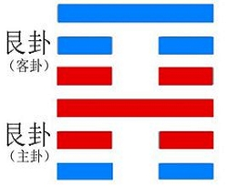
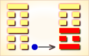
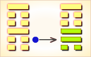
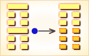
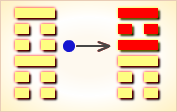
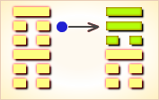
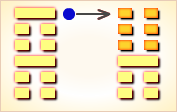

# 艮 ䷳



艮（gèn）卦展示“艮”形势下各种变化的可能性。艮，代表山。

艮卦的代号是`1:1`，主卦和客卦都是艮卦，卦象是山，阳数是`1`。

两座山不可能合并成一座山，但是，主客双方在一起相处，不能不相互影响，不能不相互往来。
主方应当在可能的情况下采取适当主动措施改善双方关系，同时保持强硬态度，耐心地等待客方变化。

图中，红色表示当位的爻，天蓝色表示不当位的爻。艮卦的爻没有有应关系。

艮卦谈的乃是如何抑止自己言行的卦。也即是当行则行，当止则止；
当说则说，不当说则不说，一切必须审慎抑止为是。除此之外，没有别的。

- 卦序：52

> 艮其背，不獲其身。行其庭，不見其人，无咎。
>《彖》曰：艮，止也，時止則止，時行則行，動靜不失其時，其道光明。艮其止，止其所也。上下敵應，不相與也，是以不獲其身。行其庭不見其人，无咎也。
>《象》曰：兼山，艮，君子以思不出其位。

> 初六，艮其趾，无咎，利永貞。
>《象》曰：艮其趾，未失正也。

> 六二，艮其腓，不拯其隨，其心不快。
>《象》曰：不拯其隨，未退聽也。

> 九三，艮其限，列其夤，厲熏心。
>《象》曰：艮其限，危薰心也。

> 六四，艮其身，无咎。
>《象》曰：艮其身，止諸躬也。

> 六五，艮其輔，言有序，悔亡。
>《象》曰：艮其輔，以中正也。

> 上九，敦艮，吉。
>《象》曰：敦艮之吉，以厚終也。

### 全卦内容

此卦由山下山上组成。

卦辞的“艮：艮其背，不获其身；行其庭，不见其人，无咎”，是说作为抑止自己行动的《艮》卦，要做到好像走到别人身后能够突然停止，但还不至于碰到别人身上；象进入别人家院而突破停止，却还没有进入别人家室看见别人家里的人，这样恰到好处的及时的抑止自己，那将不会有什么灾祸。此卦辞颇有些立即停止，化险为夷之义。

1. “初六”爻辞的“艮其趾，无咎；利永贞”。是说一个人要抑止自己的行动，应该从脚下开始，不要只停留在口头上或犹犹豫豫，这样将无灾祸；这样做也利于永远坚持贞正。
2. “六二”爻辞的“艮其腓，不拯其随；其心不快”，此爻有接上爻“ 艮其趾”之义，是说要抑止自己的行动，应该放在脚下，不应该放在腿肚上，若不从脚下抑止自己的行动，而是从小腿肚上抑止自己的行动，这样是抑止不了自己的行动的；这种企图从小腿肚上抑止自己的行动只能带来心中的不愉快。
3. “九三”爻辞的“艮其限，列其夤；厉，薰心”是说脚步已到了迈进门槛的时候，才想起了抑止自己的行动，这样的抑止实际上是控制不住的，它会裂断脊背上的肉的；这样做是很凶厉的，它有如火烧薰心一样难受。
4. “六四”爻辞的“艮其身，无咎”，是说一个人要抑止自己的行动，要从全身做起，这样才免于灾祸。
5. “六五”爻辞的“艮其辅，言有序，悔亡”，是说一个人不仅在该抑止 自己行动时去抑止自己的行动，也要抑止自己的言语，要把住牙关，要做到不随便说话，要做到说话有条不紊，这样后悔才能消亡。这一爻辞颇有些孔子《系辞》中说的“乱之所生也，则言语以为阶”的含义，只不过是孔子注错了地方。
6. “上九”爻辞的“敦艮，吉”，是说要抑止自己的言行，必须要有敦厚的德行才行，只有敦厚诚实的抑止，才会吉祥；不然则会变为小人的投机取巧，既害人，又害己。

### 结构和卦爻辞

艮卦中的主卦与客卦相同，相应的爻也相同，因此没有阴阳和谐，只有矛盾。矛盾有二种，一种是阴爻对阴爻，因为双方都是阴爻，没有进攻性，只有对立，没有冲突，如主卦和客卦的下爻和中爻。另一种是阳爻对阳爻，双方都有进攻性，不仅对立，而且冲突，如主卦和客卦的上爻。六条爻中，有当位的，也有不当位的。当位的以红色表示，是潜在的对主方有利因素；不当位的以天蓝色表示，是潜在的对主方不利因素。由于没有有应的爻，这六条爻代表的都是潜在因素，没有真正的对主方有利或者不利因素。所以，当前状态对于主方来说，不需要作大的改变，即使改变了，也不一定会有好效果。

如果要改变，在主卦方面，可以考虑改变第一爻，这条爻不当位，代表主方消极被动。这消极被动状态是主方衰落的结果，衰落到艮卦这个程度，已经很难恢复到往日积极上升的状态，不过可以阴中有阳，在可能范围内，采取一些主动措施。如果主方积极主动，正好可以利用客方的消极被动，改进主客双方关系，从而自己也有所收益。

第二爻与第三爻都是当位的爻，主方应当保持，而不是改变这两个因素，特别是应当保持强硬态度，否则，形势对于主方来说将更不利。至于客卦的情况，主方是不可能改变的，只有期待客方发生变化，特别是期待客方态度发生变化，如果客方态度由强硬变得随和，则对主方有利。这种变化可能是客方自己作出的，也可能是自然发生的。从经卦的艮卦到坤卦是一种常规变化，很可能自然发生，只是主方要有耐心等待。总起来说，主方应当在可能情况下采取适当的主动措施改善双方关系，同时保持强硬态度，耐心等待客方变化。

卦辞和六条爻辞全部有“艮”，除第六爻以外，“艮”后都有“其”，“艮”当动词用。“艮”的本来意思是“食物不易咬动或嚼烂”，也可以指“止，静止”，如今作动词用，其意思就是“使止”，对于身体的各个部位来说，应当是“抱住”，“抓住”，或者“握住”。卦辞和爻辞分别讲述握住客方身体的各个部位，这些都是形象比喻。如果删去判断辞，再略去爻的名称，可见卦爻辞形象地完整地讲述了当前主方关系的状态：

```
抱住他的背部，得不到他的身体；
行走在他的庭院里，见不到他这个人（双方关系的现状）
抓住他的脚趾，抓住他的腿肚子，
他不能随意活动，他的心中不愉快。
抱着他的腰，撕裂了他的夹脊肉，疼痛像火烧心。
抱住他的身体。摁住了他的面颊，言谈有序。
（上面的强行都没有效果，还是交谈沟通重要）
诚恳地阻止他走开。（诚恳才是最重要的）
```

### 卦辞
```
〖原文〗艮其背，不获其身；
行其庭，不见其人，无咎。
〖译文〗抱住他的背部，得不到他的身体；
行走在他的庭院里，见不到他这个人，无所怪罪。
〖解说〗卦的六条爻中没有有应，
表示在当前状态下即使主方主动地与客方联系，
也得不到客方响应。
不过，主方还是应当主动联系客方，如果主方主动联系客方，
尽可能地改善双方关系，主方不应当受到怪罪；
反之，主方则应当受到怪罪。
```

### 初六
```
〖原文〗艮其趾，无咎，利永贞。
〖译文〗抓住他的脚趾，无所怪罪，利于永久坚持。
〖解说〗第一爻是主卦下爻，
代表主方的行动，
阴，表示主方消极被动。
爻辞建议主方采取主动，“艮其趾”。
脚趾只是身体的一小部分，
抓主脚趾并不能阻止客方的行动，
不过，这是尝试，主方这么做无所怪罪，
利于永远采取主动，“利永贞”。

〖结构分析〗第一爻位置是阳位，
这条爻是阴爻，阴爻在阳位，不当位，并且和四阴不有应。
不当位，表明主方消极被动有可能受到客方攻击而遭受损失，
这是潜在的对主方不利因素；不有应，客方也是消极被动，
那潜在因素没有成为真正的对主方不利因素。
主方消极被动是长期衰落的结果，
不是主方的不当造成的，所以说“无咎”。
这种情况继续下去对主方没有危害，
可以保持下去，爻辞说“利永贞”。
```

### 六二
```
〖原文〗艮其腓，不拯其随，其心不快。
〖译文〗抓住他的腿肚子，
他不能随意活动，他的心中不愉快。
〖解说〗第二爻是主卦的中爻，
代表主方的素质，阴，表示主方的素质不佳，比如说，
资金缺乏、地位底下、实力薄弱、教育程度低，等等。
同时，第五爻也是阴爻，表示客方素质也不佳。
双方素质都不佳，都不能指望从对方得到什么好处。
所以，尽管主方采取了主动，
但是，主方的主动是有限的，
当主方试图拉动客方时，
客方觉得没有能够按自己的意愿行动，
反而感到不愉快。
“腓”（féi），腓肠肌，胫骨后的肉，俗称“腿肚子。
“拯”（zhěng），援救，救助：拯救。

〖结构分析〗第二爻位置是阴位，
这条爻是阴爻，阴爻在阴位，
当位，然而与五阴不有应。
当位，表明主方素质不佳，
有可能从客方得到补益，是潜在的对主方有利因素；
不有应，表明客方素质也不佳，
那潜在因素没有成为真正的对主方有利因素。
所以爻辞中没有加判断辞。
```

### 九三
```
〖原文〗艮其限，列其夤，厉熏心。
〖译文〗抱着他的腰，
撕裂了他的夹脊肉，疼痛像火烧心。
〖解说〗第三爻是主卦上爻，
代表主方态度，阳，表示主方态度强硬。
同时，第六爻也是阳爻，客方态度也强硬。
双方严重冲突。主方不让客方离开，“艮其限”。
客方坚持不依，“列其夤”。
剧烈的疼痛使得客方感到很难受，“厉熏心”。
“限”（xiàn），指定的范围：期限。这里应当是指腰。
“夤”（yín），通“璌”，夹脊肉。

〖结构分析〗第三爻位置是阳位，
这条爻是阳爻，阳爻在阳位，
当位，然而与六阳不有应。
当位，表明主方强硬态度有可能制约客方，
保护主方利益，是潜在的对主方有利因素；
不有应，表明客方态度也强硬，
那潜在因素没有成为真正的对主方有利因素，
所以爻辞没有加判断辞。
由于第三爻和第六爻都是阳爻，
双方有激烈冲突，爻辞形容为“列其夤，厉熏心”。
```

### 六四
```
〖原文〗艮其身，无咎。
〖译文〗抱住他的身体，无所怪罪。
〖解说〗第四爻是客卦下爻，
代表客方的行动，阴，表示客方消极被动。
比如说，防守、退却、不想冒险、
不想探索或开辟新的发展领域、只求保持现状，等等。
主方采取了积极行动，阻止客方离开，
为了维护双方关系，避免双方之间的关系进一步恶化，
主方尽了力，无所怪罪。

〖结构分析〗第四爻位置是阴位，
这条爻是阴爻，阴爻在阴位，
当位，然而与一阴不有应。
当位，表明客方消极被动有可能是主方发展的好机会，
是潜在的对主方有利因素；
不有应，表明主方也消极被动，
那潜在因素没有成为真正的对主方有利因素。
这是双方长期衰落的结果，
不是主方此时的过失，所以爻辞说“无咎”。
```

### 六五
```
〖原文〗艮其辅，言有序，悔亡。
〖译文〗摁住了他的面颊，
言谈有序，悔恨消失。
〖解说〗第五爻是客卦中爻，
代表客方素质，阴，表示客方素质不佳，比如说，
资金缺乏、地位底下、实力薄弱、教育程度低，等等。
客方需要主方帮助，在主方采取主动与客方沟通的时候，
双方能够把问题谈开、主方做到如此程度，没有悔恨了。
“辅”（fǔ），人的颊骨：辅车相依（“车”，指牙床，喻互相依存）。

〖结构分析〗第五爻位置是阳位，
这条爻是阴爻，阴爻在阳位，
不当位，并且和二阴不有应。
不当位，表明客方素质不佳，
客方有可能从主方谋取利益，
是潜在的对主方不利因素；
不有应，表明主方素质也不佳，
没有可能让客方得益，
那潜在因素没有成为真正的对主方不利因素，
所以爻辞说“悔亡”。
```

### 上九
```
〖原文〗敦艮，吉。
〖译文〗诚恳地阻止他走开，吉利。
〖解说〗第六爻是客卦上爻，
代表客方态度，阳，表示客方态度强硬。
主方诚恳地阻止双方关系进一步恶化，对于主方是吉利的。
这吉利是有条件的，主方必须诚恳地采取主动，
“敦艮”中包含了诚恳与主动的意思。

〖结构分析〗第六爻位置是阴位，
这条爻是阳爻，阳爻在阴位，
不当位，并且和三阳不有应。
不当位，表明客方的强硬态度有可能使主方受到制约，
是潜在的对主方不利因素；
不有应，表明主方态度也强硬，
主方不接受客方制约，
那潜在因素没有成为真正的对主方不利因素。
爻辞说“吉”，这吉利不是说客方的强硬态度对主方吉利，
而是说如果主方诚恳地对待客方，
着力改善双方关系，“敦艮”，这样做对于主方来说，是吉利的。
```

### 艮为山 动静适时 中下卦《象》曰：财帛常打心头走，可惜眼前难到手，不如意时且忍耐，逢着闲事休开口。

```
艮①：艮其背，不获其身②；
行其庭，不见其人③，无咎。
初六，艮其趾④，无咎；利永贞。
六二，艮其腓⑤，不拯其随⑥；其心不快。
九三，艮其限⑦，列其夤⑧；厉，薰心⑨。
六四，艮其身⑩，无咎。
六五，艮其辅⑪，言有序⑫，悔亡。
上九，敦艮⑬，吉。

①艮：六十四卦卦名之一。
乃论述抑止自己言行之卦。
②艮其背，不获其身：
走到别人背后，突然抑止，还没有靠着别人身体。
③行其庭,不见其人：
走进别人庭院,突然抑止,还没有看见别人家中之人。
④艮其趾：从脚步上抑止自己。
⑤艮其腓：“腓”（feí 肥），小腿肚。从小腿上抑止自己。
⑥不拯其随：无法拯救其行动。
⑦艮其限：“限”，门槛。指快到门槛时抑止自己。
⑧列其夤：“夤”（yín 银），通“胂”（shèn 慎），夹脊肉。
“列其夤”指裂断了脊背的肉。
⑨薰心：“薰”（xūn 勋），熏的异体字。
“薰心”，指烈火烧薰其心。
⑩艮其身：要抑止自己，当全身抑止。
⑪艮其辅：“辅”，牙床；此处为口舌言语。
“艮其辅”，指把紧牙关， 抑止言语。
⑫言有序：说话有条有理，滴水不漏。
⑬敦艮：敦厚诚实的抑止。

【译文】
注意保护背部而不保护全身，
就像一座大园宅没有人居住一样。没有灾祸。
初六：注意保护脚。没有灾祸。有利于长久吉利的占间。
六二：注意保护腿肚，却不保护腿部肌肉，心中不愉快。
九三；注意保护腰部，但胁间的肉已裂开了，危险，使人心焦。
六四：注意保护胸腹部。没有灾祸。
六五：注意保护面部，注意说话有分寸。没有悔恨。
上九：注意保护头部。吉利。

【读解】
这一卦专讲养身，讲到不要太劳累，
注意保护身体各部位，便可以免除灾祸。
这些看法至少说明，古人很珍惜自己的生命，
并且已经具备了相当的医学知识，
卦中虽然未述及具体的保养方法， 
却有一个主导思想：以静养动。
这也算是传统保养观的特色之一吧。
正如文武之道是相互补充的一样，动与静也是相互补充的。
一张一弛，一紧一松，身心在其中得到调节息养，保持着活力。
这种观或的灵感，大概得自于自然，得自于自然万物运动变化的节律。
它一方面以生命体验为基础，一方面又深得内心感悟的启迪，
从而得出保持生命本身的自然节律便是最好的保养的看法。
由此出发，过度的紧张或过度的歇息，
都是对生命运动节律的破坏，都必须加以调节。
肉体（命）本身的平衡，心理（性）本身的平衡，
两者之间的平衡，便是调节所要达到的度。
```

### 白话解析
```
艮：白话中读作“根”。
根①：其北②，不濩③其身。
行其廷，不见其人。无咎。
【注释】
①根：卦名，假借为艮。艮，止，注意。
②北：古背字。
③濩：污。
【白话】筮占得根卦，注意背部，不要弄脏了身体。
行走在宫廷之中，却又没有被人发现。占断为“无咎”。
【讲解】根卦，通行本作艮。根、艮，双声、叠韵。
根卦上卦为根，下卦也是根。根为山，为止。
山上山下，是坚定不移的象征。

初六：根其止①，无咎，利永贞。
【注释】①其止：自己的行止。
其，代词，指自我。止：脚止，引申为行为。
【白话】筮得根卦，占得初六，
注意自己的行为步伐，不但没有灾咎，而且利于长久占问。
【讲解】注意自己的行为非常重要，
自己的行为关系到自己的前途命运。
认识自我造就自我必须从“根其止”做起。

六二：根其肥①，不登其隋②，其心不快。
【注释】
①肥：发胖。
②不登：不增加。登：升高。隋：裂肉。
不登其隋：不增加肉。应该减肥。
【白话】筮得根卦，占得六二，
注意自己不要发胖，不要让自己的体重增加，
因为发胖会引起心烦不悦。
【讲解】本爻爻辞提出了一个如何使人们的身心健康的问题，
首先是要减肥，其次是要保持精神愉快。

九三：根其限①，戾其肥②，厉，薰心③。
【注释】
①限：风度。
②戾：裂。肥：疑是“肥”字。肥：多肉。
③薰心：心中芳香。
【白话】筮得根卦，占得九三，
注意自己的风度，减去身上多余的脂肪，虽然危厉，终归心悦愉怡。
【讲解】这条爻辞涉及到了精神和肉体的关系，
要使精神和肉体都能升华，必须经受一个痛苦的过程。

六四：根其窮①。
【注释】①窮：字书无此字，通行本作“身”。
【白话】筮得根卦，占得六四，注意自己的身体。
【讲解】古人对身体非常重视，反复强调要注意。

六五：根其𦙶①，言有序②，悔亡。
【注释】
①𦙶：字书无此字，通行本作辅，辅车相依，话从口出。
②序：分寸。
【白话】筮得根卦，占得六五，
注意自己的言语，讲话要有分寸，就不会有灾咎，就能避祸消灾。
【讲解】这一爻爻辞要求人们不要随便说话，教诲人们讲话要有分寸。
俗话说：祸从口出。言有序，则悔去祸亡，幸福降临。

尚九：敦①根，吉。
【注释】①敦：厚，引申为注重。
【白话】筮得根卦，占得尚九，着重注意自身的修养，就吉善。
【讲解】根卦卦爻辞提出了人们自我身心修养的问题，
告诫人们注意减肥、注意言语、注意行为。至今仍有借鉴意义。
```

<img src="shapes/52.11艮卦艮上艮下，为艮宫本位卦。艮为停止的意思，为钱财散失之象，需谨慎提防。

停留阻止，无可再进；随份勿贪，不可强求。

得此卦者，前路受阻，不宜妄进，宜守待机。

- 时运：运势平平，不宜妄进。
- 财运：守好本业，不可贪财。
- 家宅：不宜改造；命由前定。
- 身体：带病延年。

```
这个卦是同卦，下艮上艮，相叠。
艮为山，二山相重，喻静止。它和震卦相反。
高潮过后，必然出现低潮，进入事物的相对静止阶段。
静止如山，宜止则止，宜行则行。
行止即动和静，都不可失机，
应恰到好处，动静得宜，适可而止。

《象传》：两重高山并峙，故宜止不宜进，阻塞之象。
```

运势：凡事不宜妄动，前路受阻，只好待机而动。

- 事业：在经过一段发展后，应进行调整，暂时停止行动，总结经验教训。不可因贪名利而妄进。自我克制，自我约束，谨言慎行，不要盲目追求他人。经过休整后，在适当时机到来时，再大显身手。
- 经商：进入停滞不前的状态，切勿盲目冒进，而宜适时停止，进入安静退守，不要受外界干扰，尤其是应该保持内心和理智上的宁静，更不要轻易与他人合作。等待时机，必有光明前途。
- 求名：应保持纯正的目的，静守正道。勿为功名诱惑，秉守忠厚，可得成功。
- 婚恋：重感情，彼此以诚相待，可白头到老。
- 决策：性格沉静、内向，不喜好活动，也不善于交际，为人忠诚老实，讲信义。注意听取他人的建议，明哲保身。机遇不到，不宜积极活动，该止则止，勿抱不切实际的想法。

```
山：表示停止、退守之意，
六冲纯卦，主大好大坏之象。
凡事应当知进退、量力而为。
有如登山越岭般，需充分审视自己的体能，和山上的情势，
绝不可强行逞能，适时的休息，方能平安度过。
得此卦时应有大事或障碍、不顺阻挡在前，
若能保守、修身养性则安，反则为凶。

解释：不动，自己改变。

特性：耐性佳，保守经营，
努力奋斗，老成持重，有偏财运，
精于计划分析，处事有条理，公私分明，择善固执。
```

运势：应当洁身自爱，依赖心不要太重，否则不利。凡事不可轻举妄动，诸事宜守，相辅得吉。儒家有言：『静亦定，动亦定』，此非言死等，宜中正德行，固守贞常之道，凡事有定之理也。

- 家运：不和，家运停滞不发，改正自己以谋求开运之道，内有动荡、困境。
- 疾病：难治，注意肠胃血管硬化及结核病。
- 胎孕：难产之虞。
- 子女：子女多有不和、不相辅之数。
- 周转：难成。
- 买卖：有些小是非，失利之象，但可成。
- 等人：不会来。
- 寻人：西南方，难寻。
- 失物：可以寻回，但要等一段时间。藏在家中、旅馆、寺院、山中某处。
- 外出：慎重为好，宜另择佳日。
- 考试：落榜。
- 诉讼：因小事而化大，宜速求和，忌土姓人。
- 求事：固守本份为宜。
- 改行：不利。
- 开业：开业不宜，须再待时。

### 初六：艮其趾，无咎。利永贞。《象》曰：艮其趾，未失正也。


初六：歇脚养息，不要轻举妄动，自然无灾难，这是长期吉利的贞兆。

《象传》说：歇脚养息，不要轻举妄动，远离不义，不失正道，自然永远吉利。

平：得此爻者，宜守本份，不要纵欲。做官的保守己职者无失。

- 时运：初交好运，退守无咎。
- 财运：知足常乐，多行善事。
- 家宅：可以长住；百年好合。
- 身体：足疾就医。

### 初六变卦：艮为山 变卦 火山贲



初六爻动变得[第22卦：山火贲](e8b4b2bi_cn.md)。

这个卦是异卦，下离上艮，相叠。

离为火为明；艮为山为止。文明而有节制。

贲卦论述文与质的关系，以质为主，以文调节。贲，文饰、修饰。

### 六二：艮其腓，不拯其随，其心不快。《象》曰：不拯其随，未退听也。


六二：停立不行，但腿部肌肉还是负伤。心里很不愉快。

《象传》说：腿部肌肉还是负伤，因为其人固执己见，没有退回来，听取别人的意见。

凶：得此爻者，运势受阻，或奔波在外，多劳苦；或有足疾。做官的得不到他人的帮助，不宜上进。

- 时运：运途受阻，缺少援手。
- 财运：止而不售，难免心忧。
- 家宅：不宜迁居；避开此婚。
- 身体：药物难治。

### 六二变卦：艮为山 变卦 山风蛊



六二爻动变得[第18卦：山风蛊](e89b8agu_cn.md)。

这个卦是异卦，下巽上艮，相叠。与随卦互为综卦。

蛊本意为事，引申为多事、混乱。

器皿久不用而生虫称“蛊”，喻天下久安而因循、腐败。

必须革新创造，治理整顿，挽救危机，重振事业。

### 九三：艮其限，列其夤，厉薰心。《象》曰：艮其限，危薰心也。


九三：卸掉重担，保护腰部，但是胁间肉却已裂开了，引退不及时，则罹凶险。这是由于为名利所惑，不能迅速引退卸职所招致的灾祸。

《象传》说：“卸掉重担，保护腰部，胁间肉却已裂开了，引退不及时，则罹凶险”，危险是由为名利迷惑所致。

凶：得此爻者，不顺之时，危难不安。

- 时运：顺时可成，不可勉强。
- 财运：闭关自守，难免穷困。
- 家宅：往来为宜；不拘门户。
- 身体：血脉不通。

### 九三变卦：艮为山 变卦 山地剥



九三爻动变得[第23卦：山地剥](e589a5bo_cn.md)。

这个卦是异卦，下坤上艮，相叠。

五阴在下，一阳在上，阴盛而阳孤；高山附于地。

二者都是剥落象，故为“剥卦”。

此卦阴盛阳衰，喻小人得势，君子困顿，事业败坏。

### 六四。艮其身，无咎。《象》曰：艮其身，止诸躬也。


六四：引退保身，没有灾祸。

《象传》说：引退保身，是说其人注意力全部集中在自身的安危上，所以不会招惹灾难。

平：得此爻者，宜安分守常，不可有非分之想。

- 时运：无得无失，保身无咎。
- 财运：可以保本，另得良机。
- 家宅：平安无事；婚姻平平。
- 身体：带病延年。

### 六四变卦：艮为山 变卦 火山旅



六四爻动变得[第56卦：火山旅](e69785lv_cn.md)。

这个卦是异卦，下艮上离，相叠。

此卦与丰卦相反，互为“综卦”。

山中燃火，烧而不止。

火势不停地向前蔓延，如同途中行人，急于赶路。因而称旅卦。

### 六五：艮其辅，言有序，悔亡。《象》曰：艮其辅，以中正也。


六五：闭口少言，讲话有分寸，自然没有悔恨。

《象传》说：闭口少言，讲话有分寸，没有悔恨，因为六五之爻居上卦中位，像人谨守中正之道。

平：得此爻者，正人君子，人情和合，谋望遂意。做官的会居要职。

- 时运：言谈中正，自然可取。
- 财运：保密为要，商机可成。
- 家宅：位得中正；慎防巧言。
- 身体：口能发声，病即可治。

### 六五变卦：艮为山 变卦 风山渐



六五爻动变得[第53卦：风山渐](e6b890jian_cn.md)。

这个卦是异卦，下艮上巽，相叠。

艮为山，巽为木。

山上有木，逐渐成长，山也随着增高。

这是逐渐进步的过程，所以称渐，渐即进，渐渐前进而不急速。

### 上九：敦艮，吉。《象》曰：敦艮之吉，以厚终也。


上九：注意保护自己的脑袋，首级不失，自然吉利。

《象传》说：爻辞讲以忠厚为归宿之所以吉利，因为上九之爻为一卦之终爻，像人秉守忠厚，必得善终。

吉：得此爻者，多福多利，但易防不吉之事。做官的会升迁，读书人会取得佳绩。

- 时运：好上加好，自然吉祥。
- 财运：上手生意，获利自多。
- 家宅：世代忠厚；婚姻吉祥。
- 身体：体质厚实。

### 上九变卦：艮为山 变卦 地山谦



上九爻动变得[第15卦：地山谦](e8b0a6qian_cn.md)。

这个卦是异卦，下艮上坤，相叠。

艮为山，坤为地。

地面有山，地卑（低）而山高，是为内高外低。

比喻功高不自居，名高不自誉，位高不自傲。这就是谦。

# [Gèn ䷳](e889aegen.md)
