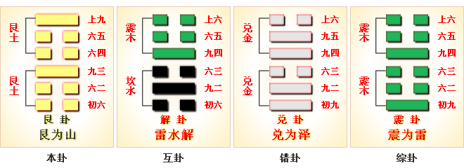

# 艮 ䷳ gèn

- No.52

> 艮其背，不獲其身。行其庭，不見其人，无咎。
>《彖》曰：艮，止也，時止則止，時行則行，動靜不失其時，其道光明。艮其止，止其所也。上下敵應，不相與也，是以不獲其身。行其庭不見其人，无咎也。
>《象》曰：兼山，艮，君子以思不出其位。

> 初六，艮其趾，无咎，利永貞。
>《象》曰：艮其趾，未失正也。

> 六二，艮其腓，不拯其隨，其心不快。
>《象》曰：不拯其隨，未退聽也。

> 九三，艮其限，列其夤，厲熏心。
>《象》曰：艮其限，危薰心也。

> 六四，艮其身，无咎。
>《象》曰：艮其身，止諸躬也。

> 六五，艮其輔，言有序，悔亡。
>《象》曰：艮其輔，以中正也。

> 上九，敦艮，吉。
>《象》曰：敦艮之吉，以厚終也。

乾分三阳，为长中少，至艮为少男。本体属阳，阳极则止，反生阴象。《易》云：“艮，止也。”于人为手、为背。取象为山、为石、为门、为狗。上艮下艮二象，土木分气候，与兑为飞伏。
> 丙寅木，丁未土。为少男取少女相配。

世上见宗庙，三公为应。阴阳迁次，长幼分形。
> 乾三生男，将至艮极，少长分形，长中分之，谓建也。

庚寅至乙未，
> 立春大暑。

阴长阳极，升降六位，进退顺时，消息盈虚。积筭起庚寅至己丑，周而复始。
> 木土入卦。

五星从位起荧惑，
> 荧惑火星入卦。

胃宿从位降丙寅，
> 胃宿入卦分位。

分数位元三十六。
> 配位六卦分吉凶。

金木相敌，升降以时。艮止于物，背于物。《易》云：“时止则止，时行则行。”刚极阳反阴长，积气止于九三。初六变阳，取其虚中，文明在内，成于贲。次降入贲卦。[䷕](e8b4b2bi_cn.md)

# [Gèn ䷳](e889aegen.md)
