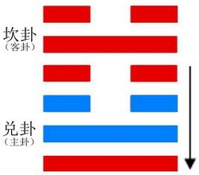

# Jié ䷻

* Regulating

> Chinese: 节 ䷻ jié

<a id="p-197"/>

**Jié ䷻** intimates that (under its conditions) there will be progress and attainment.
(But) if the regulations (which it prescribes) be severe and difficult, they cannot be permanent.

1.<a id="60.1"/> The first `NINE`, undivided, shows its subject not quitting the courtyard outside his door. There will be no error.

> **䷻** changing to [**䷜**](e59d8ekan.md#29.1)

> Matching Line 1 in Adjacent Hexagram: [**䷺**](e6b6a3huan.md#59.1)

<a id="p-198"/>

2.<a id="60.2"/> The second `NINE`, undivided, shows its subject not quitting the courtyard inside his gate. There will be evil.

> **䷻** changing to [**䷂**](e5b1afzhun.md#3.2)

> Matching Line 2 in Adjacent Hexagram: [**䷺**](e6b6a3huan.md#59.2)

3.<a id="60.3"/> The third `SIX`, divided, shows its subject with no appearance of observing the (proper) regulations, in which case we shall see him lamenting. But there will be no one to blame (but himself).

> **䷻** changing to [**䷄**](e99c80xu.md#5.3)

> Matching Line 3 in Adjacent Hexagram: [**䷺**](e6b6a3huan.md#59.3)

4.<a id="60.4"/> The fourth `SIX`, divided, shows its subject quietly and naturally (attentive to all) regulations. There will be progress and success.

> **䷻** changing to [**䷹**](e58591dui.md#58.4)

> Matching Line 4 in Adjacent Hexagram: [**䷺**](e6b6a3huan.md#59.4)

5.<a id="60.5"/> The fifth `NINE`, undivided, shows its subject sweetly and acceptably enacting his regulations. There will be good fortune. The onward progress with them will afford ground for admiration.

> **䷻** changing to [**䷒**](e4b8b4lin.md#19.5)

> Matching Line 5 in Adjacent Hexagram: [**䷺**](e6b6a3huan.md#59.5)

6.<a id="60.6"/> The topmost `SIX`, divided, shows its subject enacting regulations severe and difficult. Even with firmness and correctness there will be evil. But though there will be cause for repentance, it will (by and by) disappear.

> **䷻** changing to [**䷼**](e4b8ade5ad9azhongfu.md#61.6)

> Matching Line 6 in Adjacent Hexagram: [**䷺**](e6b6a3huan.md#59.6)

## Notes

The primary application of the character **Jié ䷻** was to denote the joints of the bamboo; it is used also for the joints of the human frame; and for the solar and other terms of the year. Whatever makes regular division may be denominated a **Jié ䷻**; there enter into it the ideas of regulating and restraining; and the subject of this hexagram is the regulations of government enacted for the guidance and control of the people. How the constituent trigrams are supposed to suggest or indicate this meaning will be seen in [Appendix II](appendix02s1.md).

[Zhū Xī](https://en.wikipedia.org/wiki/Zhu_Xi) anticipates that symbolism in trying to account for the statement that the figure gives the promise of success and attainment; but the ground of this is generally made out by referring to the equal division of the undivided and divided lines and our having in 2 and 5, the central places, two undivided lines. An important point concerning 'regulations' is brought out in the conclusion of the [Tuàn](https://ctext.org/book-of-changes/tuan-zhuan), -- that they must be adapted to circumstances, and not made too strict and severe.

Line 1 is strong, and in its correct place. Its subject therefore would not be wanting in power to make his way. But he is supposed to be kept in check by the strong 2, and the correlate 4 is the first line in the trigram of peril. The course of wisdom therefore is to keep still. The character here rendered door is that belonging to the inner apartments, leading from the hall into which entrance is found by the outer gate, mentioned under line 2. The courtyard outside the door and that inside the gate is one and the same. The 'Daily Lecture' says that the paragraph tells an officer not to take office rashly, but to exercise a cautious judgment in his measures.

Line 2 is strong, in the wrong place; nor has it a proper correlate. Its subject keeps still, when he ought to be up and doing. There will be evil.

Line 3 should be strong, but it is weak. It is neither central nor correct.
It has no proper correlate, and it is the topmost line in the trigram of complacent satisfaction.
Its subject will not receive the yoke of regulations; and he will find out his mistake, when it is too late.

Line 4 is weak, as it ought to be, and its subject has respect to the authority of the strong ruler in 5. Hence its good symbolism and auspice.

Line 5 is strong, and in its correct place. Its subject regulates himself, having no correlate; but he is lord of the hexagram, and his influence is everywhere beneficially felt.

Line 6 is weak, in its proper place. The subject of the topmost line must be supposed to possess an exaggerated desire for enacting regulations. They will be too severe, and the effect will be evil. But as Confucius ([Analects 3. 3](https://ctext.org/dictionary.pl?if=en&id=1144&remap=gb)) says, that is not so great a fault as to be easy and remiss. It may be remedied, and cause for repentance will disappear.

# [节 ䷻](e88a82jie_cn.md)
