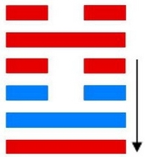

# 节 ䷻ jié

- No.60

> 節，亨，苦節不可貞。
>《彖》曰：節亨，剛柔分而剛得中。苦節不可貞，其道窮也。說以行險，當位以節，中正以通。天地節而四時成，節以制度，不傷財，不害民。
>《象》曰：澤上有水，節。君子以制數度，議德行。

> 初九，不出戶庭，无咎。
>《象》曰：不出戶庭，知通塞也。

> 九二，不出門庭，凶。
>《象》曰：不出門庭凶，失時極也。

> 六三，不節若，則嗟若，无咎。
>《象》曰：不節之嗟，又誰咎也。

> 六四，安節，亨。
>《象》曰：安節之亨，承上道也。

> 九五，甘節，吉。往有尚。
>《象》曰：甘節之吉，居位中也。

> 上六，苦節，貞凶，悔亡。
>《象》曰：苦節貞凶，其道窮也。

水居泽上，泽能积水。阳止于阴，故为节。节者，止也。阳荡阴而积实，居中悦内，而险于前。阴阳进退，金水交运，与兑为飞伏。
> 丁巳火，戊寅木。

元士立元首，见应诸侯。
> 金火受其气，纳到内。

建起甲申至己丑，
> 为本身节气，立秋大寒。

积筭起己丑至戊子，周而复始。
> 金水坎，火运入卦，杂定吉凶。

五星从位起太阴，
> 太阴属水，入卦用事。

女宿从位降丁巳。
> 配象入积筭。

金上见水，本位相资，二气交争，失节则嗟。《易》云：“不节若，则嗟若。”分气候二十八。
> 积筭起数二十八。

中男入兑，少女分荡入阴中位，见阳升降，见长男。次入水雷屯。
> 是则节险入阳，荡九二爻，体归于阳，次入屯卦。[䷂](e5b1afzhun_cn.md)

# [Jié ䷻](e88a82jie.md)
