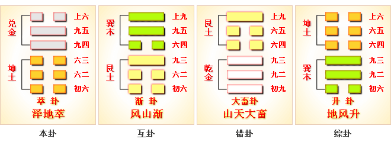
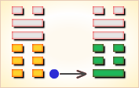
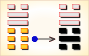
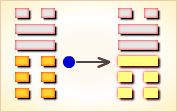
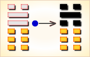
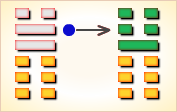
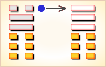

# 萃 ䷬


萃（cuì）卦，上泽下地，泽地萃。象征荟萃聚集。

这个卦是异卦相叠，下坤上兑。坤为地、为顺；兑为泽、为水。

泽泛滥淹没大地，人众多相互斗争，危机必四伏，务必顺天任贤，未雨绸缪，柔顺而又和悦，彼此相得益彰，安居乐业。萃，聚集、团结。
《萃》卦是论述君王与天下贤士及英雄豪杰聚萃于朝廷一堂之卦，此卦中谈了君王们应如何在这些聚萃中发挥作用以及如何应付一些发生的情况。

图中，红色表示当位的爻，天蓝色表示不当位的爻，箭头表示有应。

萃卦的代号是`0:6`，主卦是坤卦，卦象是地，阳数是`0`；客卦是兑卦，卦象是泽，阳数是`6`。
客方强而愉快，主方在客方的带动下，与客方相聚在一起，萃。聚会在一起，主方是被动的，不过主方乃可以从中受益。

- 卦序：45

> 萃，亨，王假有廟。利見大人，亨，利貞，用大牲吉，利有攸往。
>《彖》曰：萃，聚也。順以說，剛中而應，故聚也。王假有廟，致孝享也；利見大人，亨，聚以正也；用大牲，吉，利有攸往，順天命也。觀其所聚，而天地萬物之情可見矣。
>《象》曰：澤上於地，萃，君子以除戎器，戒不虞。

> 初六，有孚不終，乃亂乃萃。若號，一握為笑，勿恤，往无咎。
>《象》曰：乃亂乃萃，其志亂也。

> 六二，引吉，无咎。孚乃利用禴。
>《象》曰：引吉无咎，中未變也。

> 六三，萃如嗟如，无攸利，往无咎，小吝。
>《象》曰：往无咎，上巽也。

> 九四，大吉无咎。
>《象》曰：大吉无咎，位不當也。

> 九五，萃有位，无咎，匪孚。元永貞，悔亡。
>《象》曰：萃有位，志未光也。

> 上六，齎咨涕洟，无咎。
>《象》曰：齎咨涕洟，未安上也。

### 总述

《萃》卦，谈的是君王们应如何处理日常的君臣之间的关系问题。象征团结。

从卦象看，萃卦下卦是坤，是地，是人之所聚的地方；上卦是兑，是泽，是水之所聚的地方，所以萃卦象征聚集之意。当天下聚合之时，君王以至诚美德感格祖宗、先人和神灵，以凝聚人心，而长保其宗庙祭祀（也即家国基业长青）。此时若出现大德之人，则能聚集民心，而万事亨通，但必须固守正道而行。当民丰物阜之时，应隆重的以牛为牺牲，以祭祀祖先、神灵，以维系人心，则可获吉祥。并利于往前而有所作为。（王假有庙，君王以至诚美德感格祖考、神灵。假，音格，感格。大牲，祭祀所用丰盛的牺牲品，指牛）也有说法是卦名萃下原无“亨”字，帛书周易亦无亨字。传统解释：萃就是荟萃，会聚。

图中有两个箭头，都是由下而上。左边一个箭头的起点，对应主卦下爻。主卦代表主方，下爻代表主方行动，阴爻，表示主方消极被动。天蓝色，表示这条爻不当位，也就是说，对于主方来说，消极被动是一个潜在不利因素。其右边，“一阴”表示第一爻，是阴爻，后面是对应的爻辞。箭头的终点，对应客卦下爻，客卦代表客方。客卦下爻是阳爻，表示客方积极主动。这条爻也是天蓝色，表示这是一个对主方不利的潜在因素。其右的“四阳”表示这条爻是萃卦第四爻，阳爻，其后是对应的爻辞。箭头表示主卦和客卦的下爻有应，这个有应关系，表示主方的消极被动正好适应客方的积极主动，从而，主方受客方控制，主方消极被动和客方积极主动，这两个对主方不利的潜在因素成了真正的对主方不利的因素。

第二个箭头的起点，其左是主卦中爻，代表主方素质，阴，表示主方素质不佳，比如说，缺乏资金。红色，表示当位，是对主方有利的潜在因素，就是说，主方有可能从客方的良好素质弥补自己的不足。其右的“二阴”，表示这是萃卦第二爻，阴爻。其后是对应的爻辞。箭头的终点，其左是客卦中爻，红色表示阳爻，阳爻表示客方素质良好，比如说，资金充足。其右的“五阳”，表示这条爻是萃卦第五爻，阳爻，其后是对应的爻辞。这个箭头，表示主方的不佳素质有可能从客方的良好素质得到补充，使得主方的素质不佳和客方的素质良好这两个对主方的潜在有利因素，成了真正的对主方的有利因素。注意，主卦上爻和客卦上爻之间没有箭头，也就是说，没有有应关系。主卦上爻，即萃卦第三爻，是阴爻，天蓝色，就是说，主方的随和态度是不适当的。

另一方面，客卦上爻，即萃卦第六爻，也是阴爻，红色，这表示客方的随和态度是对主方有利的潜在因素。问题出在主方态度上，由于主方态度随和，不能有效地利用客方对主方随和的有利机会。所以，尽管存在主方利用客方的良好素质的有利因素，以及，客方对主方随和的好机会，然而，由于主方消极被动和态度随和，不一定能够利用这有利因素，反而受制于客方。主方须要着力改变消极被动状态和过分随和的态度，要积极行动起来，坚定而明确地谋取和维护自己的利益。

由于事物自身按螺旋形规律发展变化，按阳数其规律是4、5、6、7、3、2、1和0。主卦的阳数是0，已经进入发展变化的终点，要完全扭转消极被动为积极主动，阳数必须增加4，作质的跃变，从坤卦变到震卦，这很不容易。比较现实的作法是阴中有阳，在可能的范围内采取一些主动，态度稍强硬些，以维护安闲状态。

在当前的主客双方关系中，客方是一位在事业中或者生活中的成功者，享受着成功的愉快，主方在客方的带动下，与客方相聚在一起，萃，这是卦爻辞的主题。聚会在一起，主方是被动的，“引吉”，然而主方可以从中受益，“大吉”。不过，对于主方来说，并不是很愉快的事，“乃乱乃萃”，“萃如嗟如”，以及，“赍咨涕洟”。相聚在一起，只是为了各自利益，“萃有位”，没有什么真正的诚意可言，“匪孚”，“有孚不终”，主方倒是应当为双方关系做些实事，“孚乃利用禴”。

删去爻辞中的部分判断词，可以看出六条爻辞是一首位置的以“萃”为主题的散文诗。下面是其译文：

```
有诚信不终久，有时散乱有时会聚，
若大喊一声，一握转为欢笑，
（会聚）引导向吉祥；利用祭祀表达诚意。
会聚的时候带着叹惜，叹惜没有好处，
（顺从会聚）大为吉利。
会聚中各有其位，没有诚意，
（会聚中）只得流眼泪鼻涕悲叹。
```

卦辞明确地指出，重要的是主方自己要主动积极地行动起来，改善自己的素质，“利见大人”。

### 泽地萃 荟萃聚集 中上卦

《象》曰：游鱼戏水被网惊，跳过龙门身化龙，三尺杨柳垂金钱，万朵桃花显你能。

### 卦辞
```
〖原文〗亨，王假有庙，
利见大人，亨，利贞；用大牲吉，利有攸往。
〖译文〗顺利，王来到庙里，利于表现像个大人物，顺利，
利于坚持下去；用大牲畜祭祀，利于有所前进。
这是萃卦的卦辞。亨，(hēng)，顺利；通达；顺达：万事亨通。
“亨”是对当前形势的概括，指当前的关系良好。
假，(jiǎ)，借：假道，久假不归。

“王假有庙”是比喻，反映周时代的社会风俗，
王到庙里祭祖先或神灵，求赐好收成或其它保佑。
王是尊贵的人物，但是在祖先或神灵面前是低畀的，
首先必须跪拜以表虔诚，然后祭祀，再祈求赐予。
王指主方，祖先或神灵指客方，
主方向客方表示尊重以求得客方赐予。

见，(xiàn)，显现，展现：图穷匕见，风吹草低见牛羊。
攸，(yōu)，助词，相当于“所”：性命攸关。
主方行动和素质都是阴，既被动又软弱；态度也是阴，谦让随和。
但是只是乞求是不够的，还需要像个光明正大的人物，
积极主动做好工作，“利见大人”。
“亨”，如果主方能够像个光明正大的人物，积极主动做好工作，
那么由于客方素质良好，一切会进展顺利。
贞，(zhēn)，坚持下去：坚贞不屈。“利贞”，情况有利于坚持下去。
“用大牲吉”也是比喻，用大牲畜祭祀是对祖先或神灵作大供献，
指主方应当为双方关系作出成绩。“利有攸往”，利于有所前进。
卦辞的“萃：亨。
王假有庙：利见大人；亨，利，贞；用大牲吉。利有攸往”，
第一句是说君臣聚萃一堂的《萃》卦，它自然意味着亨通。
第二句是说国君王侯们在此喜庆之时，
应该到祖庙里去祭祀一下：
这样有利于显现大人；也亨通、适宜和无不贞正；
在这里祭祀，必须用大的牲畜来设祭，这样才吉祥。
最后一句是说《萃》卦宜于前往办一切事情。
```

### 彖传解释
```
《彖传》说：萃卦，就是聚集的意思。
顺从并且喜悦，刚强者居中而有应合，所以聚集起来。
君王来到宗庙，是要尽孝心祭祀祖先。
适宜见到大人而通达，是因为以正道来聚集。
用大牲去祭祀吉祥，并且适宜有所前往，是因为顺应天命。
观察它如何聚集，就可以见到天地万物的真实情况了。
```

### 象传解释
```
《象传》说：
沼泽高出大地之上，这就是萃卦。
君子由此领悟，要修治兵器，警戒意外状况。
```

### 一阴
```
〖原文〗有孚不终，乃乱乃萃；
若号，一握为笑；勿恤，往无咎。
〖译文〗有诚信不能保持到最后，有时散乱有时会聚；
如果号哭，一握手转为欢笑；不必忧虑，往前进无所怪罪。
〖解说〗这是萃卦第一爻爻辞，
反映主方行动，阴，表示主方消极被动，
比如说，防守、退却、不想冒险、
不想探索或开辟新发展领域、只求保持现状，等等。
孚（fú）是诚信，叫人信任，佩服：深孚众望。
若（ruò）是假如。号（háo）是高声喊：呼号。
恤（xù）是忧虑。咎（jiù）是怪罪。
这条爻辞的意思是：
虽有诚信但不终久，有时散乱有时会聚；
如若大喊一声，一握之间转为欢笑；
不必忧虑，往前进无所怪罪。
不过，这有一个条件：
主方必须克服消极被动状态，
“若号，一握为笑”，努力改善自己的素质，
往前进才能无所怪罪；不然，则是主方过错。
“初六”爻辞的“有孚不终，乃乱乃萃；
若号，一握为笑；勿恤，往无咎”，
第一层是说在人才聚萃的朝堂上，
国君的诚实信用要善始善终，
不要有始无终，如果有始无终，
将会发生君臣聚萃乱哄哄的场面；
第二层是说在人材聚萃的朝堂之上，
若君臣之间发生一些感情上不愉快的隙缝，
应当一握破涕为笑前嫌皆释方好，不然君臣将为仇敌；
第三层意思是说，对于这些事情，
君王不要耿耿于怀，不要忧愁，
要宽宏大度，前去不会发生任何事情。

〖结构分析〗第一爻的位置是阳位，
这条爻是阴爻，阳爻在阴位，不当位，不过，与四阳有应。
不当位表明主方消极被动是不适当的，
是对主方不利的潜在因素；
有应表明主方的消极被动正好被客方利用，
从而，受控于客方，对主方不利。
```

### 二阴
```
〖原文〗引吉，无咎；孚乃利用禴。
〖译文〗迎来吉祥，无所怪罪；
心怀诚信有益于祭祀求福。
〖解说〗这个爻代表主方素质，
阴，表示主方素质不佳，比如说，
资金缺乏、地位底下、实力薄弱、教育程度低，等等。
引（yǐn）是带领：引路。孚（fú）诚信。
乃（nǎi）就是。
禴（yuè）是古代四时祭祀之一，
较微薄的祭祀，在这里是个比喻。
这条爻辞的意思是：
被客方所引是吉祥的，无所怪罪；
诚意就是使用简单的祭祀。
这条爻辞的后一部分是对主方的建议，
主方应当实事求是地对待客方。
对于素质良好的客方，
应当像“用大牲畜祭祀”祖先或神灵一样，表示尊敬，
不过主方能力有限，不能“用大牲畜祭祀”，
只要主方对客方诚心诚意，尽力而为，
即使是“简单的祭祀”也行。
要实事求是，既不能脱离现实，
强行做作，也不无所作为。
暗示的意思是，不可以对客方不诚心诚意，
也不可以不尽力而为。
“六二”爻辞的“引，吉；无咎。孚，乃利用禴”，
此爻第一句有承接上一爻的含义，
是说当君臣之间有一些不愉快时，
君王应当主动退让，这样将会获得吉祥；也不会带来灾祸。
第二句是说君王为了建立自己诚实信用的威信，
应当利用到祖庙或神灵前去祭祀这一种形式。
这后一句的“用禴”，含禴有一种在广众与神灵前公证的成份，
也含有一种发誓的成份，亦当为《周易》的一种聚萃之道。

〖结构分析〗第二爻的位置是阴位，
这条爻是阴爻，阴爻在阴位，当位，并且和五阳有应。
当位表明由于主方素质不佳，主方有可能向客方索取弥补，
这是对主方有利的潜在因素；有应表明客方素质良好，
存在主方从客方获益的可能，这种有应关系，
使得对主方有利的潜在因素成为真正的有利因素。
主方应当充分利用这个有利因素，
为客方良好素质所吸引，对主方有益，“引吉”。
```

### 三阴
```
〖原文〗萃如嗟如，无攸利；往无咎，小吝。
〖译文〗由于会聚而生叹息，没有益处；
往前有所行动无所怪罪，有点小困难。
〖解说〗这条爻代表主方态度，阴，表示主方态度随和。
同时，第三爻是对第二条的补充，
由于第二条是阴，第三条也是阴，这表示主方素质很差。
“如”是像。“嗟”是叹惜。“攸”是所。“吝”是吝啬。
这条爻辞的意思是：
会聚的时候带着叹惜，叹惜没有好处；
往前进无所怪罪，客方有点吝啬。
主方素质很差，随和是不得己，不是心甘情愿，
因此会聚以后，勉强服从客方，心里不舒畅，带着叹惜。
这条爻辞的后面一部分是对主方的建议，
主方应当积极改善自己的状态，
爻辞说：往前进无所怪罪。
同时也不要指望客方太大方，“小吝”。
“六三”爻辞的“萃如嗟如，无攸利；往无咎，小吝”，
前半句是说如果君王在人材聚萃的朝堂上，经常边聚边叹，
这将会造成一种颓丧的不祥气氛，它一点好处也没有。
后半句是说这样前去办事也不会有什么凶险，
只不过一点小的悔恨和惋惜罢了。

〖结构分析〗第三爻的位置是阳位，
这条爻是阴爻，阴爻在阳位，不当位，并且与六阴不有应。
不当位表明主方的随和态度是对主方不利的潜在因素；
不有应表明客方的态度也随和。
客方对主方随和，
这是主方向客方明确提出要求，获取利益的好机会，
然而，由于主方也随和，
主方不能有效利用这样的好机会，只好叹息，“萃如嗟如”。
```

### 四阳
```
〖原文〗大吉，无咎。
〖译文〗大为吉利，无所怪罪。
〖解说〗这是萃卦第四爻，表示客方行动，
阳，表示客方积极主动谋取和扩大自己的利益，
比如说，创新、创业、投资、进攻、求职、示爱，等等。
这条爻辞的前两个字“大吉”，说明客方的行动对主方的影响。
主方安于现状，客方积极前进，
对主方来说不是舒服的事，正如不当位而有应所示；
但是，从主方的切身利益来看，
安于现状并不是可靠的生活方式，
积极奋发，努力改善素质，才是真正对主方有利的事。
要如此，主方必须行动起来，客方的积极主动，
促使主方摆脱消极被动，这对主方最有好处，
所以爻辞不仅说“吉”，而且说“大吉”。
这条爻辞的后两个字“无咎”是对主方的建议。
如果主方摆脱消极被动状态而积极起来，则无所怪罪。
“九四”爻辞的“大吉，无咎”，这是一个无前提的半句话，
是说《萃》 卦的人才聚萃于一堂，
这本身就意味着大吉大利，它将没有什么灾祸。

〖结构分析〗第四爻的位置是阴位，
这条爻是阳爻，阳爻在阴位，不当位，不过与一阴有应。
不当位，表明客方的积极行动对于主方来说，
是个不利的潜在因素；
有应表明主方的消极被动正好被客方利用，
这潜在因素成了真正的对主方不利的因素。
但是，主方适应客方，
从而能够利用客方的良好素质弥补自己的不足，
实际上对主方非常有利，“大吉”。
顺从客方，对主方有好处，主方“无咎”。
```

### 五阳
```
〖原文〗萃有位，无咎；
匪孚，元永贞，悔亡。
〖译文〗会聚而适得其位，无可怪罪；
但不能获取信任，长久坚持下去，悔恨消亡。
〖解说〗这是萃卦第五爻爻辞，阳，表示客方素质良好。
位（wèi）是位置。咎（jiù）是怪罪。匪（fěi）非。
孚（fú）是诚信。元（yuán）是第一。
永（yǒng）是长久。贞（zhēn）是坚持下去。
悔（huǐ）是悔恨。亡（wáng）是灭。
爻辞中的“萃有位，无咎”是对客方素质的影响的说明。
主方和客方会聚在一起，各为自己利益，“萃有位”。
尽管主方喜欢安闲舒适，但是能够顺从客方，
尽力而为，所以爻辞说“无咎”。
爻辞的后部“匪孚，元永贞，悔亡”是对主方的建议。
“匪孚”重复强调双方各为己利，不是诚心诚意地为了客方。
主方为了自己的利益，首先应当坚持下去，努力改善素质。
如果这样，主方就不致失去当前有利时机，不至于悔恨。
“九五”爻辞的“萃有位，无咎，匪孚；元永贞，悔亡”，
前半句是说《萃》卦的谈的聚萃之象，
自当有一个主事的尊位之人，这倒不会有什么灾祸，
但是这个尊位不一定就能够有孚于众望；
后半句是说君王如果能从一开始就坚持贞正，
那一切后悔都会消亡。

〖结构分析〗第五爻的位置是阳位，
这条爻是阳爻，阳爻在阳位，当位，又与二阴有应。
当位而有应，表明客方良好素质是对主方有利的因素，
主方有可能从客方良好素质获益。
```

### 六阴
```
〖原文〗赍咨涕洟，无咎。
〖译文〗流眼泪鼻涕悲叹，无可怪罪。
〖解说〗这是萃卦第六爻爻辞。
“上六”爻辞的“赍咨涕洟，无咎”，
是说国君应该经常怀着嗟叹哭泣的忧思之心，
也即如《否》卦所说的“其亡其亡，
系于苞桑”的警戒心，那就什么灾祸也不会发生。
阴，表示客方态度随和。
赍（jī），赍咨是悲叹声。涕（tì）是眼泪。
洟（yí）是鼻涕。咎（jiù）是怪罪。
在主方与客方双方中，客方没有悲叹，只有主方才会悲叹。
悲叹的是主方，主方消极被动，素质不佳，
客方不一定满足主方要求，以至于主方赍咨涕洟。
这条爻辞的最后两个字“无咎”是对主方的建议。
如果主方不再麻木地满足现状，
而是为周围环境的变化有所触动，
从而悲叹，从而开始行动，则无所怪罪。
再麻木不仁，就该怪罪他自己了。

〖结构分析〗第六爻的位置是阴位，
这条爻是阴爻，阴爻在阴位，当位，然而与三阴不有应。
当位表明客方的随和态度是对主方有利的潜在因素；
不有应表明主方也随和，
主方不能以坚定而明朗的态度，
有效地利用对主方有利的好机会，
这对主方不利，主方只得“赍咨涕洟”。
不过这是由于主方的素质太差，无可奈何，
不要怪罪主方，“无咎”。
```

### 注释
```
①萃：六十四卦卦名之一。
乃论述君王与朝臣聚萃与处理君臣日常关系之卦。
②王假有庙：“假”（gé 格）至。
此句为君王到祖庙里去祭祀。
③大牲：指牛羊这些大的牲畜。
④有孚不终：诚实的信用有始无终。
⑤乃乱乃萃：一盘乱哄哄的聚萃。
⑥若号，一握为笑：“号”，哭，此处指感情上的裂痕。
“一握”，即 一握手。此句为在君与臣聚萃中，
若有君臣发生不愉快之事，当握握手，破涕为笑，前嫌皆释。
⑦引：指君臣不合时君主主动退让。
⑧禴（yuè 跃）：
四时祭礼之一：一种说法指春祭；一种说法为夏祭。
⑨萃如嗟如：一边聚萃一边嗟叹的样子，言君臣聚萃一派悔丧气。
⑩萃有位：指聚萃中的当权者，犹君王。
⑪赍咨涕洟：“赍”（jī），“赍”的本字，乃带着抱着的意思。
“ 咨”（zī 资），嗟叹声。“涕”，眼泪。“洟”（yí 夷），鼻涕。
“涕洟”，为眼泪鼻涕哭泣之状。
“赍咨涕洟”，乃为带着嗟叹与眼泪鼻涕，含义为不忘忧患思虑之象。
```

### 起卦

萃是`0:6`卦的卦名。`0:6`是萃卦的代号，表示它由`0`卦和`6`卦组成，`0`卦是主卦，`6`卦是客卦。萃音cuì。

1. 草丛生的样子；
2. 聚集，会集，荟萃；
3. 聚在一起的人或物：出类拔萃。

萃卦代号`0:6`表示聚在一起的双方是一个弱，一个强，他们的力量对比是0和6。
主方是`0`，客方是`6`，主方必须顺从客方，接受客方的给予。
`0:6`卦的主卦是坤卦，坤卦的卦象是地，主要性质是静止而广大。
静止反映主方对现况的满足，广大反映主方对客方的尊重和谦让。
`0:6`卦的客卦是兑卦，兑卦的卦象是泽，泽是河泽地带，鱼米之乡，兑卦的主要性质是愉快而和顺。
愉快反映客方素质良好，和顺反映对主方宽容。

起卦前需要客观地、全面地、准确地分析主方和客方情况，必须至少符合下列条件之一，此卦才有参考价值：

1. 主方与地很相似，客方与泽很相似。
2. 主方阳数是`0`，客方阳数是`6`。
3. 主方的行动是阴，素质是阴，态度也是阴；客方的行动、素质和态度是阳、阳和阴。

切勿用任何随机数方式起卦，否则此卦不能用作决策工具。

### 帛书易
```
萃：白话中读“卒”。
卒①：王叚于庙，利见大人，
亨，利贞，用大生③吉，利有攸往。
【注释】
①卒：卦名，病，终，终于。
②叚：即“假”字，到达。
③大生：大牲，牛。生，牲。
【白话】筮得卒卦，君王到达了宗庙，利于谒见大人，
非常顺利，祭祀用大牲牛牢，利于有所作为。
【讲解】卒卦卦名，通行本作“萃”。萃为聚集。
《彖传》说：“萃，聚也。顺以说，刚中而应，故聚也。”
萃卦下卦坤卦为顺，上卦兑卦为悦，象征欢乐地顺从。
九五阳刚中正，又与中正的六二阴阳相应，构成聚集会合的卦象。

初六：有复①不终，乃乳②乃卒③，
若其号，一握于芺④，勿血，往，无咎。
【注释】
①有复：有诚意。
②乳：乱。
③卒：病。
④芺（ǎo）：笑。
【白话】筮得卒卦，占得初六爻，有诚信而不能坚持到底，
因而心烦意乱、身体疲病，如果因此而号哭，
一旦把握了诚信原则就象人脸上有了笑容，不用担忧，
一如既往地恪守诚信原则，就能没有灾难。
【讲解】初六阴柔之爻与九四阳刚之爻阴阳正应，所以有复。
六三阴柔比近九四阳刚，初六生出疑问，所以不终。
初六与六二、六三为伍，则不与九四相聚，所以乃乳乃卒。
初六既志乱妄与六二、六三为伍，
如果呼号求应于九四阳刚，
便为六二、六三阴柔之爻耻笑。
自己本与九四为正应相配，六三以近与九四相比得宠，
如果初六能安卑谦，退以自牧，便能无咎。

六二：引①吉，无咎。复乃利用濯②。
【注释】
①引：长久。
②濯：假借为“禴”。
【白话】筮得卒卦，占得六二爻，
长久吉善美好，没有灾难，有诚意就利于祭祀。
【讲解】六二阴柔之爻处中得正，以真诚应九五阳刚之爻，
虽然居于两阴爻之间，因与九五爻相应，所以吉善无咎。
六二爻既然能够与九五爻以中正相牵引，
就象君臣相辅相成一样。祭祀就需要这样的诚意。

六三：卒若嗟若①，无攸利，往，无咎，少閵。
【注释】①若：语尾助词。
【白话】筮得卒卦，占得六三爻，
病啊！嗟叹啊！都是没有什么利益的。
只有去掉那种病态，才能没有灾难，少有吝恨。
【讲解】六三阴柔之爻居于阳刚之位，
以比近九四，九四也是失位的爻，
不正的爻与不正的爻相聚会，相聚合而不正位，
是患难所以产生的关键。所以爻辞如此。

九四：大吉，无咎①。
【注释】①《象传》曰：“‘大吉，无咎’，位不当也。”
【白话】筮得卒卦，占得九四爻，非常吉善美好，没有灾难。
【讲解】九四阳刚之爻而履阴柔之位，
而下面占据三个阴爻，得其所据，失其所处。
处聚的时候，不正位的爻占据下面各爻，
所以必然大吉，立这样的大功然后就无咎了。

九五：卒有立，无咎，非①复，元永贞，悔亡。
【注释】①非：必须。
【白话】筮得卒卦，占得九五爻，
病倒了又站立起来了，没有遭受灾难，
必须有诚意，才能永远吉善，悔恨消失。
【讲解】九五阳刚之爻居于阳刚之位，而且得中处尊，最为盛位。
因九四阳刚之爻阻隔，所以虽然得位也只不过无咎而已。
王弼说：“处聚之时，最得盛位，故曰萃有位也。
四专而据，己德不行，自守而已，故曰无咎匪孚。
夫修仁守正，久必悔消，故曰‘元永贞，悔亡’。”

尚六：秶秭涕洎①，无咎。赍咨涕洟，无咎。
【注释】①秶（zī 资）：稷，粟米。
秭：屏息呼吸。涕洎（tī jì）：眼泪鼻洎。
【白话】筮得卒卦，占得尚六爻，
小心翼翼供奉祭祀所需的粟米，憋得泪流洎出，
不成体统，但因为他诚心诚意，所以没有灾难。
【讲解】尚六处于卒卦的时候，
居于上极，九五不是它的所乘，
内卦六三阴柔之爻不能应援尚六，处上独立，
近远没有援助，危险很大，所以吓得泪流洎出。
但如果能够知道危险的存在，惧祸之深，
忧病之甚，至于流泪洎出，不敢怠慢自安，
也是众人所不加害的人，因而能够转危为安，得以无咎。
```



### 《断易天机》解

萃卦兑上坤下，为兑宫二世卦。此卦指水在地上聚集成泽以滋润万物，造福于民。占得此卦，利于见大人，祭祀用大牲畜则吉利。

### 北宋易学家 邵雍 解

物产丰富，聚合丰盛；得贵接引，无往不利。

得此卦者，运气大好，能得到贵人的帮助，获利丰厚，无往不利。

### 台湾国学家 傅佩荣 解

- 时运：安不忘危，自可无忧。
- 财运：财聚之象，有聚有散。
- 家宅：防水入屋；洁身自爱。
- 身体：胸腹水涨，早些调理。

### 传统解卦
```
这个卦是异卦，下坤上兑，相叠。
坤为地、为顺；兑为泽、为水。
泽泛滥淹没大地，人众多相互斗争，
危机必四伏，务必顺天任贤，未雨绸缪，
柔顺而又和悦，彼此相得益彰，安居乐业。
萃，聚集、团结。

《象传》：泽在地上，水聚于泥土中，滋养草木，生长茂盛。
```

运势：吉运昌盛，又得长辈提携，事业大利，但须防财务纠纷。

- 事业：兴旺发达，团结和睦。正在蒸蒸日上，但水多泛滥，人多竞争必然激烈。盛则必衰，切勿骄傲，谨慎小心为好。但也不得犹豫不决，宜勇往直前，开拓新的业务。务必以高尚的品德服众。
- 经商：真诚合作，团结互助。鼓励是事业兴旺发达的标志。大胆开拓市场，稳妥前进，有备无患，必可取得不断发展。
- 求名：光靠个人努力，建树不会很大，定要取得他人的帮助，加上个人的条件方可达到理想的境界。
- 婚恋：勿急于求成，相亲相爱，美满幸福。
- 决策：善于团结他人共同合作，具有领导才能。但心胸宽阔，眼光务必远大，以诚信、中正为本，不失原则，尤其要严格要求自己，宽容他人，遭到他人反对时，应认真反省自己，得出教训，以这种心境处世为人，终生可平安，事业必通达。

### 台湾 张铭仁 解卦
```
萃：表示精华聚集之意，主吉中带小凶之状况卦。
有经过挑选、或是在因缘际会下，而重新再一起共事的意义。

解释：人才聚集。

特性：富同情心，慈悲心，
被动，略消极，乏耐性，博学不专。人缘佳，易有情爱困扰。
```

运势：昌隆，得信于人，承上辈照顾，事业吉昌，但宜小心财务上的纠纷。

- 家运：家庭融洽如意。防财务歧见之意外。
- 疾病：凶象，宜速诊治，防胸腹及咽喉之病变。
- 胎孕：胎安。然产母病多，注意保养身体。
- 子女：手足相敬如宾。
- 周转：可得到上辈支持。
- 买卖：可获利。
- 等人：一定会来，且有佳音相告。
- 寻人：会自己回来，不用担心。
- 失物：多半能失而复得。
- 外出：出行虽可能遇到小麻烦，但不要害怕，应以大局为重，积极行动。
- 考试：常保佳绩。
- 诉讼：宜解不宜结。
- 求事：可顺利，有成就。
- 改行：吉利。
- 开业：开业适时，可按计划进行。

### 初六爻辞

初六。有孚不终，乃乱乃萃。若号，一握为笑。勿恤，往无咎

《象》曰：乃乱乃萃，其志乱也。

### 白话文解释

初六：捕获了俘虏，却又逃跑了，引起纷乱和忧虑，大家呼喊着四处追捕。终于追回了，又高兴得嘻嘻哈哈，用不着担忧了。占得此爻，大胆前往，没有灾难。

《象传》说：混乱啊，憔悴啊，其人神志昏乱。

### 北宋易学家 邵雍 解

平：得此爻者，会受到小人的陷害，先凶后吉，宜谨慎从事。做官的会被贬职。

### 台湾国学家 傅佩荣 解

- 时运：一顺一逆，得人援手。
- 财运：聚散不定，可以免咎。
- 家宅：不可久居；始乱终弃。
- 身体：心神混乱，求医可治。

### 初六变卦：泽地萃 变卦 泽雷随



初六爻动变得[第17卦：泽雷随](e99a8fsui_cn.md)。

这个卦是异卦，下震上兑，相叠。

震为雷，为动；兑为悦，动而悦就是“随”。

随指相互顺从，己有随物，物能随己，彼此沟通。随必依时顺势，有原则和条件，以坚贞为前提。

### 六二爻辞

六二。引吉，无咎。孚乃利用禴。

《象》曰：引吉无咎，中未变也。

### 白话文解释

六二：占得此爻，长时间吉利，没有灾难。占问祭祀，贞兆显示：春祭要用俘虏作人牲才好。

《象传》说：“长时间吉利，没有灾难”，因为六二阴爻居于下卦中位，象人坚守正道，绝不改变。

### 北宋易学家 邵雍 解

吉：得此爻者，正当好运，贵人提举，营谋得利。做官的得人引荐，能升迁。

### 台湾国学家 傅佩荣 解

- 时运：中正之运，得人援引。
- 财运：合作有利，虔心酬神。
- 家宅：祖上积德；婚姻可订。
- 身体：勤练气功。

### 六二变卦：泽地萃 变卦 泽水困



六二爻动变得[第47卦：泽水困](e59bb0kun_cn.md)。

这个卦是异卦，下坎上兑，相叠。

兑为阴为泽喻悦；坎为阳为水喻险。

泽水困，陷入困境，才智难以施展，仍坚守正道，自得其乐，必可成事，摆脱困境。

### 六三爻辞

六三。萃如，嗟如，无攸利。往无咎，小吝。

《象》曰：往无咎，上巽也。

### 白话文解释

六三：忧愁嗟叹。占得此爻，无所利。出行则无灾难，但有小小的麻烦。

《象传》说：出行无灾难，因为六三阴爻居于九四阳爻之下，像臣下顺从君上，行为谨慎。

### 北宋易学家 邵雍 解

凶：得此爻者，家里不安，六亲有损，老者多凶。做官的在位不得安宁，出外则艰辛。

### 台湾国学家 傅佩荣 解

- 时运：运途平凡，须防小人。
- 财运：转运他处，可以无咎。
- 家宅：迁居为宜；怨偶之叹。
- 身体：胸部不适，注意排泄。

### 六三变卦：泽地萃 变卦 泽山咸



六三爻动变得[第31卦：泽山咸](e592b8xian_cn.md)。

这个卦是异卦，下艮上兑，相叠。

艮为山；泽为水。

兑柔在上，艮刚在下，水向下渗，柔上而刚下，交相感应。感则成。

### 九四爻辞

九四。大吉，无咎。

《象》曰：大吉无咎，位不当也。

### 白话文解释

九四：大吉大利，没有灾难。

《象传》说：贞兆本来是大吉大利，但结果仅仅是没有灾难，因为九四阳爻而居阴位，像人才小德薄而居高位，论其官运则谓亨通，论其居官则求无灾祸而已。

### 北宋易学家 邵雍 解

平：得此爻者，不从正道者，会有凶祸，惟大德君子，可改过得福。做官的须防他人猜忌，宜弃高就低，急流勇退为吉。

### 台湾国学家 傅佩荣 解

- 时运：虽然大顺，德不称位。
- 财运：大利当前，收敛为善。
- 家宅：兴旺平安；门第有差。
- 身体：外强中干。

### 九四变卦：泽地萃 变卦 水地比



九四爻动变得[第8卦：水地比](e6af94bi_cn.md)。

这个卦是异卦，下坤上坎，相叠。

坤为地，坎为水。

水附大地，地纳河海，相互依赖，亲密无间。

此卦与师卦完全相反，互为综卦。

它阐述的是相亲相辅，宽宏无私，精诚团结的道理。

### 九五爻辞

九五。萃有位，无咎。匪孚，元永贞，悔亡。

《象》曰：萃有位，志未光也。

### 白话文解释

九五：瘁心力于其职守，没有灾祸。不轻易责罚别人，卜问长期的吉凶，贞兆显示：没有大的悔恨。

《象传》说：瘁心力于其职守，结果仅仅是没有灾祸，因为才具驽下，不能有所建树。

### 北宋易学家 邵雍 解

平：得此爻者，人情不合，营谋有阻。做官的不得人心，其志未光。

### 台湾国学家 傅佩荣 解

- 时运：有位有权，更应修德。
- 财运：虽有利润，须守其正。
- 家宅：聚族而居；可称贵婿。
- 身体：心神不宁，最好静养。

### 九五变卦：泽地萃 变卦 雷地豫



九五爻动变得[第16卦：雷地豫](e8b1abyu_cn.md)。

这个卦是异卦，下坤上震，相叠。

坤为地，为顺；震为雷，为动。

雷依时出，预示大地回春。

因顺而动，和乐之源。

此卦与谦卦互为综卦，交互作用。

### 上六爻辞

上六。赍咨涕洟，无咎。

《象》曰：赍咨涕洟，未安上也。

### 白话文解释

上六：叹息流涕，忧心忡忡，但没有灾难。

《象传》说：叹息流涕，忧心忡仲，因为上六之爻居于一卦的尽头，孤悬无据，像人虽居高位，但如履薄冰，惊恐度日。

### 北宋易学家 邵雍 解

凶：得此爻者，事多烦扰，不能安宁，或上下无情，长幼忧愁，名利成虚。

### 台湾国学家 傅佩荣 解

- 时运：年老运退，待人援手。
- 财运：无利可图，幸有救援。
- 家宅：家室不安；生离死别。
- 身体：悲恸致病，放宽心思。

### 上六变卦：泽地萃 变卦 天地否



上六爻动变得[第12卦：天地否](e590a6pi_cn.md)。

这个卦是异卦，下坤上乾，相叠。

其结构同泰卦相反，系阳气上升，阴气下降，天地不交，万物不通。

它们彼此为“综卦”，表明泰极而否，否极泰来，互为因果。

# [Cuì ䷬](e89083cui.md)
