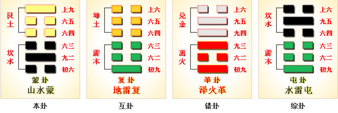
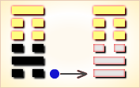
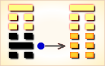
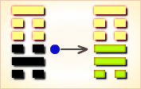
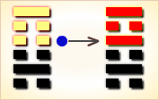
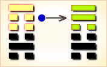

# 蒙 ䷃


蒙（méng）卦展示“蒙”的形势下各种变化的可能性。

蒙卦代号是`2:1`，主卦是坎卦，卦象是水，阳数是`2`；客卦是艮卦，卦象是山，阳数是 `1`。
主方应当按客方需要作对客方有利的事，在条件可能情况下，作些对自己有益的事。

图中，红色表示当位的爻，天蓝色表示不当位的爻，箭头表示有应。

《蒙》卦象征启蒙，亨通。

不是我有求于幼童，而是幼童有求于我，第一次向我请教，我有问必答，
如果一而再、再而三地没有礼貌地乱问，则不予回答。
利于守正道。 这个卦是异卦（下坎上艮）相叠。
卦形为山下有险，仍不停止前进，是为蒙昧，故称蒙卦。
但因把握时机，行动切合时宜；因此，具有启蒙和通达的卦象。

- 卦序：4

## 简介
### 卦名
```
山水蒙，艮为山，坎为泉，山下出泉。
泉水始流出山，则必将渐汇成江河，
正如蒙稚渐启，又山下有险，
因为有险停止不前，所以蒙昧不明，
事物发展的初期阶段，必然蒙昧，
所以是教育的当务之急，
培养学生纯正无邪的品质，是治蒙之道。

【注解】
蒙：卦名，蒙昧之意。

【释义】
此卦卦名为蒙，
“蒙”字在这里是细雨蒙蒙的意思，通“濛”。
上一卦为屯卦，卦象表现的是乌云密布，
雷声阵阵，不过雨点还没有掉下来，
所以接下来这一卦便掉下了细小的雨点。
```

### 卦画
```
蒙卦的卦画同屯卦一样也是两个阳爻四个阴爻，
只是位置发生了变化。这一变其含意就变了，
下面通过卦象来对蒙卦进行分析。
```

### 卦象
```
蒙卦的上卦为艮为山，下卦为坎为水，
山下的水蒸腾形成雾气，
好一派山水蒙蒙的自然景致！
这便是蒙卦的卦象。
卦画形成的卦象与“蒙”字的含义结合起来。
便是细雨濛濛，山水间雾气腾腾，一幅田园山水画。
这种朦胧的景致，是天地初开，云行雨施造成的。
所以屯卦表示事物的萌芽时期，
而蒙卦则表示事物的进一步生长。
于是它便有蒙昧初开的含义，
也就是说即将走出蒙昧的状态中。
走出蒙昧，便是这一卦的含义。
```

### 卦意
### 第4卦 山水蒙（蒙卦）启蒙奋发
### 中下卦

《象》曰：卦中爻象犯小耗，君子占之运不高，婚姻合伙有琐碎，做事必然受苦劳。

这个卦是异卦（下坎上艮）相叠，艮是山的形象，喻止；坎是水的形象，喻险。

卦形为山下有险，仍不停止前进，是为蒙昧，故称蒙卦。但因把握时机，行动切合时宜，因此，具有启蒙和通达的卦象。

## 古书记载
### 《彖》曰
```
蒙，山下有险，险而止，蒙。
蒙亨，以亨行时中也。
匪我求童蒙，童蒙求我，志应也。
初筮告，以刚中也。
再三渎，渎则不告，渎蒙也。
蒙以养正，圣功也。〔彖传〕

《彖传》说：蒙昧，犹如高山下有险阻，
遇到危险而停止下来，所以蒙昧不明。
蒙卦象征通往亨通顺利把握时机非常重要。
“不是我要去求那些蒙昧的学童来接受启蒙教育，
而应该是学童来求教于我。”这样才能志知趣相应。
“启蒙施教那些最初心诚的学童”，
是因为他们心存刚毅符合中庸之理。
“拒绝那些心存多变以亵渎神灵的学童”，
这是亵渎了启蒙的初衷，
而启蒙是为了培养纯正无邪的崇高品质，
是造就圣人的成功之路。
```

### 《象》曰
```
山下出泉，蒙；
君子以果行育德。
利用刑人，以正法也。
子克家，刚柔接也。
勿用取女，行不顺也。
困蒙之吝，独远实也。
童蒙之吉，顺以巽也。
利用御寇，上下顺也。
```

### 结构化解释
```
《蒙（méng）》：亨。匪我求童蒙，童蒙求我。
初筮告，再三渎，渎则不告，利贞。
上九：击蒙，不利为寇，利御寇。
六五：童蒙，吉。
六肆：困蒙，吝。
六三：勿用取女，见金夫，不有躬，无攸利。
九二：包蒙，吉。纳妇，吉，子克家。
初六：发蒙，利用刑人，用说桎梏，以往吝。

白话：消除蒙昧；能使一个人健康的成长。
不是我求这孩子接受我的启蒙教育，而是他感到有需求，
主动来请求我帮助他消除蒙蔽。
第一次可以告诉他，如果就一个问题反复再三的询问，
是对天的亵渎，同时也证明这个人是一个缺乏实践能力的人，
一个少有魄力勇气去单独承担责任的人，
这样就不应该再告诉他什么了。
启迪蒙昧后能让一个人最终获得成就并有完美结局。
```

1. 启迪蒙昧，最初的时候要采用体罚的措施（利用刑人），才能让一个人摆脱主观思想束缚（用说桎梏）；
2. 开始学习的时候要涉猎广泛（包蒙吉），多听母亲的谆谆劝导（纳妇吉），学习要有振兴家族的责任（子克家）；
3. 开始不要冒然行事，不要急于成家(勿用娶女)，对于有经验的长者要恭敬，才有机会得到他们的指导（见金夫，不有躬，无攸利）；
4. 自食其力、娶妻生子后暂时失去下一步的奋斗目标，感觉无所适从（困蒙）；
5. 要象天真无邪的孩童一样主动求教知识（童蒙）；
6. 在社会上受到欺骗后产生的觉悟（击蒙），只能增加自己的防范心理（利御寇），而不能使自己成为生活中的强者（不利为寇）。

### 结构和卦爻辞

在蒙卦中，有五条爻不当位（天蓝色），都是潜在的或者真正的对主方不利因素，只有一条当位的爻（红色），那是第四爻，表示客方消极被动，是潜在的对主方有利因素。主卦中的三条爻全部不当位，要改善形势，应当从主方着手考虑。需要考虑的是第一条，这是阴爻，表示主方消极被动，是潜在的对主方不利因素，对于主方来说最好是扭转消极被动状态，改为积极主动。但是，完全扭转消极被动状态很困难，因为主方早已经进入衰落过程，要重新返回上升过程，需要有很大的勇气与决心，彻底改变自己的状态，就是说必须有一场彻底的改革，或者革命。比较现实的做法是阴中有阳，在消极被动情况下，采取一些可行的积极主动措施，如果能够这样，正好客方消极被动，是主方行动的好机会。不过，这种阴中有阳的可能性也是有限的，只能是局部地、暂时地取得一些效果，从长远来看，还是避免不了消极被动。

主卦的中爻，也就是第二爻，代表主方素质，阳爻表示素质良好，比如说很富有，或者很健壮。
这条爻不当位而有应，是对主方不利因素，这是说，由于客方素质不佳，客方有可能掠取主方利益，而不是说主方应当放弃良好素质，主方不可能在这方面作些改变。

主卦上爻，也就是第三爻。代表主方态度，阴爻表示态度随和，这条爻也是不当位而有应，是对主方不利因素，这是说，由于客方态度强硬，正好制约主方，不利于主方维护和扩充自己的利益。主方的随和态度是出于实力不足，不得不随和，而客方的态度强硬是外强中干，勉强支撑，不得不如此。可见，在这方面主方也不能作什么改变。

总起来看，主方应当做的是：按客方需要，做些对客方有利的事，在条件可能的情况下，做些对自己有益的事。

蒙卦的卦辞以老师对待无知学童为比喻，说明在当前形势下，主方把自己的知识传授给学童，以自己的良好素质让客方受惠，“匪我求童蒙，童蒙求我”，有时则阴中有阳，维护自己的利益，“初筮告，再三渎，渎则不告”。

蒙卦爻辞中，除了第三爻以外，每条爻辞中都有“蒙”，如果删去判断词，再略去爻的名称，就是一首围绕主题“蒙”的散文诗：

```
教育开发，
就像是给受刑的人解脱手铐与脚镣。
教育包容，接纳妇女，生育子女，治理家，
不要娶那样的女子，
她看见有金钱的男人就不顾自己。
教育脱困，教育儿童。
教育击技，不要当匪寇，应当抵御匪寇。
```

下面逐条说明卦爻辞。

### 卦辞
```
〖卦辞原文〗亨。匪我求童蒙，童蒙求我。
初筮告，再三渎，渎则不告。利贞。

〖译文〗顺利，
不是我求学童，是学童求我。
初次筮问时，告诉他。
再三筮问就不恭敬，不恭敬则不告。有利于坚持。

〖解说〗第二爻是阳爻，表示主方素质良好；
第五爻是阴爻，表示客方素质不佳。
主方以良好素质帮助素质不佳的客方，
客方需要主方帮助，主方顺利，“亨”。
主方帮助客方，就如同老师根据蒙童要求教育蒙童，
“匪我求童蒙，童蒙求我”。
第三爻是阴爻，表示主方态度随和；
而第六爻是阳爻，表示客方态度强硬。
随和的主方受到态度强硬的客方的刁难。
主方不能对客方太随和，“初筮告，再三渎，渎则不告”。
帮助客方，就像是老师坚持主方应当坚持教育蒙童，“利贞”。
“筮”（shì），古代用蓍草占卦：“龟为卜，策为筮”。
“渎”（dú），轻慢，对人不恭敬：亵渎。
因为卜筮是以随机数联系求卜筮的人的提问和答文，
答文不可能重复，所以如果多次提问，就得不到一致的答文，
“初筮告，再三渎，渎则不告”。
在编撰这条卦辞的时候，社会上有卜筮形象，
编撰者依此作比喻，说明如果学生再三提问，
表现出对老师不尊敬，老师就应当拒绝解答。
```

## 爻辞概述
### 上九
```
〖原文〗击蒙，不利为寇，利御寇。

〖译文〗要惊醒愚昧无知的人促使其转化，
但不宜采用过激的行动使矛盾激化，
而如果你的方法正确，被教育者的坏习气便可以改掉。

〖解说〗第六爻是客卦上爻，代表客方态度，
阳，表示客方态度强硬，傲慢。
击（jī），击打。御（yù），抵挡：防御。
寇（kòu），盗匪，盗寇。
客方有可能态度强硬，可能喜爱击打，主方教育客方击打，
引导客方，不要当匪寇，而应当用学到的击技去抵御匪寇。

〖结构分析〗第六爻位置是阴位，这条爻是阳爻，
阳爻在阴位，不当位，不过与三阴有应。
不当位而有应是对主方不利因素，爻辞中没有判断辞，
只是描述应当引导客方向正确的方向发展。
```

### 六五
```
〖原文〗童蒙，吉。

〖译文〗没有敌意，
无邪念的蒙昧无知的人可以启发教育，必获吉祥。

〖解说〗第五爻是客卦中爻，代表客方素质，
阴，表示客方素质不佳，比如说，
贫穷、病弱、教育程度低，等等。
童，小孩子：儿童。主方像是教育儿童一样，
用自己的良好素质帮助素质不佳的客方，
这有助于改善双方关系，主方自己也受益，这是吉利的。

〖结构分析〗第五爻位置是阳位，这条爻是阴爻，
阴爻在阳位，不当位。这条爻与二阳有应。
不当位而有应，是对主方不利因素。
不过由于双方都消极被动，
这种不利因素给主方带来的损失有限。相反地，
主方可以根据客方需要用自己的良好素质帮助客方，
如同教师教育学生，这对双方关系有益，
同时，也对主方有益，所以爻辞说“吉”。
```

### 六四
```
〖原文〗困蒙，吝。

〖译文〗陷于蒙昧无知的人，深深被愚昧所困扰，
远离了接受教育的条件，故处境艰难。

〖解说〗第四爻是客卦下爻，
代表客方的行动，阴，表示客方消极被动，
比如说，防守、退却、不想冒险、
不想探索或开辟新的发展领域、
只求保持现状，等等。困，困境，困窘。
客方像是一个困窘的学童，
主方引导教育这样的学童如何摆脱困窘。
但是，由于客方消极被动，
要这样的学童能够摆脱困窘，很不容易。

〖结构分析〗第四爻位置是阴位，
这条爻是阴爻，阴爻在阴位，
当位，这是蒙卦中仅有的当位的爻，然而与一阴不有应。
当位，表明客方消极被动是主方发展的好机会，
是潜在的对主方有利因素；
不有应，表明主方也消极被动，
不能够利用这样的好机会，
这潜在因素没有成为真正的对主方有利因素，
所以爻辞说，“吝”。
```

### 六三
```
〖原文〗勿用取女，见金夫，不有躬，无攸利。

〖译文〗不要娶那样的女人，
她见到有金钱男人就不顾自己，没有一点好处。

〖解说〗第三爻是主卦上爻，
代表主方态度，阴，表示主方态度随和。
“女”指客方。第六爻是阳爻，表示客方态度强硬。
对于态度强硬客方，主方不能过于迁就，
对态度强硬的客方过于迁就，没有一点好处。
“金夫”，刚夫，指刚强的男子，一说指多金的男子。

〖结构分析〗第三爻位置是阳位，
这条爻是阴爻，阴爻在阳位，
不当位，不过与六阳有应。
不当位而有应，是对主方不利因素，
所以爻辞说，“无攸利”。
``` 

### 九二
```
〖原文〗包蒙，吉。纳妇，吉；子克家。

〖译文〗受教育者很多，
教育者要以有教无类的原则一视同仁，这正确的。
正如娶妻纳妾一样天经地义，这是吉利的。
人们接受教育后才能修身治家。

〖解说〗第二爻是主卦中爻，
代表主方素质，阳，表示主方素质良好，比如说，
主方有资金、有地位、有权力、有实力、有技术，等等。
包：包容；纳：接受、采纳；克：能够，克勤克俭。
主方教育客方包容，这样作是吉利的。
紧密联系客方，“纳妇，吉”。
客方可能作有益于双方的事，“子克家”。

〖结构分析〗第二爻位置是阴位，
这条爻是阳爻，阳爻在阴位，
不当位，这条爻与五阴有应。
当位而有应，是对主方不利因素，
主方有可能损失利益。
然而，在主客双方都消极被动情况下，
主方基本利益不至于遭受损失，
相反，主方可以用自己的良好素质为客方服务，
满足客方需要，从而改善双方关系，
这对双方都有好处，所以爻辞说，“吉”。
```

### 初六
```
〖原文〗发蒙，利用刑人，用说桎梏；以往吝。

〖译文〗启蒙教育，教育学生开发生产，
教师用受刑之人作榜样，给犯人脱去手铐脚镣。
往前走有困难。

〖解说〗第一爻是主卦下爻，
代表主方的行动，阴，表示主方消极被动，
比如说，防守、退却、不想冒险、
不想探索或开辟新的发展领域、只求保持现状，等等。
在变消极被动状态下，主方应当根据客方要求帮助客方，
就像是教师帮助蒙昧学童，引导学童前进，
这好比给受刑的犯人脱去手铐脚镣，让学童能够自由发展。
不过，不能求之过急，不能对客方指望过多，“以往吝”。
发（fā），发愤，开发。
刑人（xíng rén），受刑之人，
古代多以刑人充服劳役的奴隶。
桎梏（zhì gù），脚镣和手铐。

〖结构分析〗第一爻位置是阳位，
这条爻是阴爻，阴爻在阳位，
不当位，并且和四阴不有应。
不当位，表明主方消极被动，
不利于维护和扩张主方利益，
是潜在的对主方不利因素；
不有应，表明客方也消极被动，
那潜在因素没有成为真正的对主方不利因素，
所以爻辞说“以往吝”。
“吝”是舍不得，不等于有凶险。
```

## 爻辞详解
```
全卦内容：此卦由水下山上组成。

卦辞的“蒙：亨。匪我求童蒙，童蒙求我。
初筮告，再三渎，渎则不告。利贞”，
第一句是说作为处于蒙昧时期的《蒙》卦，但它却亨通。
因为《蒙》卦和《屯》卦一样，
它虽处在起始的蒙昧时期，但其前途却无量。
第二句是说并非是我需求如同孩童一样的蒙昧，
而是此蒙昧时期需求我。
此一句很可能其作者有先知先觉的圣贤自居的成份。
第三句带有一个迷信的成份，是说当遇到一些蒙昧难解时，
最好用蓍草筮问的办法去求告神灵；
但是却不是再三的去筮问，再三则有亵渎神灵的意思，
这样将得不到神灵的答复。
最后一句“利贞”和第一句“亨”没有多大区别，
是说《蒙》卦虽为蒙昧无知之卦，但它却利于贞正。
```

### 上九
```
爻辞的“击蒙，不利为寇，利御寇”，
是说在敲击振聩蒙昧时，千万不宜过急过激，
不然将激化矛盾，反而酿成仇寇；
但如治理蒙昧得当，自当防止了仇寇的发生。
也即是说在治理蒙昧时，千万不要导致仇寇，
而要防止仇寇的发生。
此一爻实乃谈的是《周易》中的“君子”“大人”们治国经邦之道，
当然，这里特指的是在事物由《屯》卦至《蒙》卦的，
起始时期的治国经邦之道。
```

### 六五
```
爻辞的“童蒙，吉”，是以辩证的观点，
既看到了“童蒙”蒙昧的一面，
又看到了“童蒙”本为吉兆的一面，
这就是“童蒙”本质在开发以前好的一面。
```

### 六四
```
爻辞的“困蒙，吝”，
是说《周易》中的“君子”“大人”们，
绝对不应实行“困蒙”的愚民政策，
若果真为如此，将为凶兆。
```

### 六三
```
爻辞的“勿用取女：见金夫，不有躬，无攸利”，
此一爻有接上一爻“纳妇，吉”的含义，
是说既然谈到娶妻和容纳妇人之蒙昧，
但是却不能娶这样的女子：
这就是见钱眼开的女子，若见有金钱的男子，
便不能控制自己，屈身投靠，娶到这样的女人没有任何好处。
```

### 九二
```
爻辞的“包蒙，吉；纳妇、吉。子克家”，
是说作为《蒙》卦来说，
如若能做到对蒙昧的包容，这是吉祥的；
如若能做到对一些妇人无知的包容，那也是很吉祥的。
这里实际上有一个《观》卦中所说的“童观”和 “窥观”的含义。
随后是说，如果能做到对蒙昧的包蒙，
如果人人都能做这样的宽容与纳许，
那便人人都能治理自己的家业了。
```

### 初六
```
爻辞的“发蒙：利用刑人；用说。桎梏，以往吝”，
是说如若启发教育蒙昧，得利用制度刑律来约束；
也得利用礼乐来诱导。
如若用束手束脚的束缚办法来对待蒙昧，
那必然得不到好的结果。
```

### 白话解析
```
蒙：亨，非我求童蒙，童蒙求我。
初筮吉，再参渎①，即不吉。利贞。
【白话】筮占得蒙卦，办事亨通，
不是我求助于蒙昧的儿童，而是儿童求助于我。
筮占的规则：只筮占一次就灵验吉善，
再三筮占就是亵渎神灵，亵渎神灵就不吉善。
懂得这些规则就利于贞问。
【注释】① 再参渎：再三筮占则亵渎神灵。
参：通三。渎：借为渎，亵渎。
【讲解】蒙卦下卦习赣卦，上卦根卦，呈山水蒙之象。
根宫第五卦，帛书第十三卦。

尚九：击蒙，不利为寇，利所①寇。
【白话】筮得蒙卦，占得尚九，
打击愚昧，不利于组织抢劫，利于抵御抢劫。
【注释】① 所：通行本作“御”。所，处也。
【讲解】蒙卦涉及到两种教育方法，
一种是严格的教育方法，一种是宽容的教育方法。
严则击蒙，用刑；宽则包蒙、发蒙，用脱桎梏。
刚柔相济，宽严并行。

六五：童蒙①，吉。
【白话】筮得蒙卦，占得六五，
其象为“童蒙”，其占为“吉”。
【注释】① 童蒙：幼稚蒙昧的儿童。
【讲解】六五阴柔得中居尊位，
下应于九二，童蒙纯洁，所以吉善。

六四：困蒙，閵①。
【白话】筮得蒙卦，占得六四，
困于蒙昧，则有艰难。
【注释】① 閵（lìn）：难。
【讲解】六四居于阴位，比于阴爻，应于阴爻，困难重重。

六三：勿用取女，见金夫，不有躬，无攸利。
【白话】筮得蒙卦，占得六三，
不能用来娶媳妇，见到金夫没有礼貌，没有好处。

九二：枹①蒙，吉；入妇②，吉；子克家。
【白话】筮得蒙卦，占得九二，
保护蒙昧的儿童，吉善；娶媳妇，吉善；
儿子能够建立起美满的家庭。
【注释】
① 枹：通包，引申为保护。② 人妇：纳妇，娶媳妇。
【讲解】九二有刚中的品德而应于六五，所以爻辞吉善。

初六：发蒙，利用刑人，用说①桎梏，已往閵。
【白话】筮得蒙卦，占得初六，废除蒙昧，
利于使用刑人，打开他们的枷锁，将他们放回原地，仍然很难。
【注释】① 说：借为脱。
【讲解】废蒙，通行本作发蒙，解为启发蒙昧。
```

## 总结

蒙卦是讲教育的。蒙卦所讲的教育基本思想与基本原则主要反映在卦辞中。蒙卦六爻，两阳爻是治蒙者，四阴爻是蒙者。初爻与上爻相对待，初爻用刑以发蒙，上爻用兵以击蒙。二爻与五爻相对待，二爻为治蒙之主爻，包容广大而与五爻相接；五爻为童蒙而求教于二爻。二与五两爻相对待。三爻由于自身的原因而致蒙，四爻由于处境而为困于蒙。三爻与四爻代表自暴自弃而不主动接受教育的人。

### 卦辞解释
```
蒙：亨。匪我求童蒙，童蒙求我；
初筮告，再三渎，渎则不告。利贞。
释义象征启蒙：亨通。不是我有求于幼童，
而是幼童有求于我，第一次向我请教，我有问必答，
如果一而再、再而三地没有礼貌地乱问，
则不予回答。利于守正道。
《象》曰：山下出泉，蒙；君子以果行育德。
```

### 释义
```
《象》上说：《蒙卦》的卦象是坎（水）下艮（山）上，
为山下有泉水之表象，但要想发现甘泉，
必须设法准确地找出泉水的位置，
即意味着先必须进行启蒙教育。
君子必须行动果断，才能培养出良好的品德。
从《蒙》卦的各爻内容来看，
它如同前边的《屯》卦和《蒙》卦之后的《需》卦一样，
它的每卦的六爻的前爻与后爻之间并没有必然的递进关系，
也即从初爻到第六爻之间并没有由低级到高级的演变关系，
它们与《乾》卦《坤》卦各爻之间的演变关系安排大不相同，
这几卦各爻的内容安排不过仅仅为了填充与说明此卦的全部含义而已。
虽然这几卦每卦各爻之间没有递进演变关系，
但是这些卦与卦之间却有着一个紧密衔接的递进演变关系。
从哲理上讲，《蒙》卦讲的是蒙昧，即物之始生之后的蒙昧状态。
但在其爻辞中又讲了“发蒙”与用“刑人”和“用说”，
反对“桎梏”和“困蒙”的愚民政策。
在《蒙》卦中，又提出了“童蒙，吉”的辩证观点，
即既看到一个事物有坏的、落后的一面的同时，
又看到了它有好的、积极的一面。
《蒙》卦作为《周易》的一个组成部分，
其作者亦将此运用到实际中去，
“击蒙，不利为寇，利御寇”就是一例。
不过在此卦中，
其作者并没有明显地掺和进一些“王事”“侯业”的政权问题，
但这一卦也是为这一政权的基本观点服务的。
```

### 爻辞解释
```
坎下艮①上。
蒙，山下有险，险而止，蒙。
蒙亨，以亨行时中也。
匪我求童蒙③，童蒙求我，志应也。
初筮告④，以刚中也。
再三渎⑤，渎则不告，渎蒙也。
蒙以养正，圣功也。
初六，发蒙⑥：利用刑人⑦；
用说⑧。桎梏⑨，以往吝。
九二，包蒙⑩，吉；纳妇⑪，吉。子克家⑫。
六三，勿用取女⑬：见金夫⑭，不有躬⑮，无攸利。
六四，困蒙⑯，吝。
六五，童蒙，吉。
上九，击蒙⑰，不利为寇⑱，利御寇。

注释：
① 艮：原始八卦之一。象征山。
② 蒙；六十四卦卦名之一。
起始之后的第二卦，乃论述蒙昧之卦。
③ 童蒙:“童蒙”与“蒙童”是两个不同的概念，
历来注释多将“童蒙”注释为蒙昧无知的幼童，
这不确，参《观》卦的“童观”“窥观”，
当知“童蒙”乃指此一时期如小童一样蒙昧无知。
④ 筮告：“筮”，用蓍草进行卜吉卜凶的一种占卜活动。
“筮告”，指用蓍草占卜的办法求告神灵。
⑤ 渎：轻慢之义。这里有亵渎神灵的意思。
⑥ 发蒙：“发”，启发，“发蒙”，指启发蒙昧。
⑦ 用刑人：“刑人”，刑法规章。
“用刑人”，指用刑罚规章约束人。
⑧ 用说：“说”（yuè 悦），同悦、喜悦、高兴。
“用说”，指用礼乐进行教化。
⑨ 桎梏：“桎”（zhì 制），古拘系罪犯两脚的刑具；
“梏”（gù 固），古木制的手铐。此处指束缚人。
⑩ 包蒙：“包”，包容。“包蒙”，指包容蒙昧。
⑪ 纳妇：“纳”，容纳。“妇”，此处亦含有蒙昧之义。
“纳妇”，指容纳妇人之蒙昧。此句亦含有“包蒙”的意思。
⑫ 子克家：“子”，古亦泛指“人”讲，此处即此义。
“克”，能够、胜任的意思。
“子克家”，即人人能治理家业的意思。
⑬ 勿用取女：不要娶这样的女子。
⑭ 金夫：指有钱财的男子。
⑮ 不有躬：“躬”，身体。
“不有躬”，指不能把握自己，屈身投靠。
⑯ 困蒙：“困”，围困、束缚。
“困蒙”与“发蒙”相对应，指愚民政策。
⑰ 击蒙：“击”，本为敲打，此为振击之义。
“击蒙”指敲击振动以使蒙昧开窍。
⑱ 寇：此处指仇讲。
```

### 新解
```
蒙的意思是说蒙昧，在我们蒙昧的时候，
就应该修正，这也是蒙卦的最主要的卦意。
蒙卦是人生的必修课，我们看自己的小孩，
小时候一副可爱的模样，天真无邪，人见人爱。
但是到了十一二岁，他还是一副天真无邪的样子，
别的大人不知道的还以为是傻子，
你难道忍心继续让他这么天真无邪不懂事下去吗？
这时候，我们就应该启蒙他，教育他，
教他哪些事是该做的，哪些事是不该做的。

亨。匪我求童蒙，童蒙求我。
初筮告，再三渎，渎则不告，利贞；
亨是讲亨通、顺利，
真正了解了蒙卦，你就可以等到亨。
匪通非，不是我求有蒙昧的人来请教我，
而是他们实在是想不清楚，自己主动自觉来请教我。
第一次请教我，我会尽力帮他走出困惑，
第二次他还是解不开困惑、蒙昧，
这说明他有点不认真，第三次他还来问我，
这就是说明他根本没用心，
是在亵渎我给予他的智慧、知识，
再问我就不告诉他了。这样有利于他自觉守正。

发蒙，利用刑人，用说桎梏；以往吝；
要做到启蒙，就应该用典型的人做榜样，
用坏人做反面教材，
这样有利于教育他的品德修养，将来对他很有帮助。

包蒙，吉。纳妇，吉；子克家；
包容所有的蒙昧。
是女孩，你就应该让她知道将来你是要嫁人，
要好好学做家务，帮丈夫管制家。
是男孩，你就应该让他明白，
你不能整天笑嘻嘻过日子啊，
将来你是要管制整个家，做一家之主的顶梁支柱。

勿用取女，见金夫，不有躬，无攸利；
不要取到只看金钱不看人的妻子，
这种人向来都是没有道德修养，对谁都没有好处。
这里讲的是那种误人子弟的老师，比如说，
学校有些老师见哪个学生家境好，
他就专门针对那个家境好的学生努力教育，
而那些家境不好的，他就不理不睬，
遇上这种老师是学不到什么知识、智慧的。

困蒙，吝；
困的意思是说，他什么都不懂，什么也不想懂，
用来比喻学生，就是看到书就不想看，
学习也找不到兴趣点，学校不想去，
什么都不想做，整天也不知道该干什么。

童蒙，吉；
小孩子的问题往往都是很单纯的，
单纯的问题很好理解，我们也可以很好的教育他。

击蒙，不利为寇，利御寇。
我们看，很多学校的老师，都有过打调皮学生的经历，
那都是对调皮、不爱学习的学生实在是没办法，才出此下策。
这个就要要求打的恰到好处了，有些老师击蒙的刚好，
家长们反而很乐意，有些老师击蒙拿捏不适当，
就成了教育意义上的体罚，搞不好还会别免职。
所以说，你要击蒙可以，但你要拿捏好火候，
否则，即使是好事，也会被别人误认为的坏事。
```

### 《哲学易经》之《蒙卦》 --- 李建明

蒙：亨。匪我求童蒙，童蒙求我。初筮告。再三渎，渎则不告。利贞。《彖》日：蒙，山下有险，险而止，蒙。“蒙，亨。”以亨行时中也。“匪我求童蒙，童蒙求我。”志应也。“初筮告。”以刚中也。“再三渎，渎则不告。”渎，蒙也。蒙以养正，圣功也。《象》曰：山下出泉，蒙。君子以果行育德。

有了屯立之地生存之基，但呈现在我们面前的客观世界是一幅由种种联系、相互作用、无穷无尽交织起来的画面，其中一切都在运动，变化，生产和消亡。因此在这个奥妙无穷的世界里总是让人感到知识的贫乏、经验的不足和生存的困惑，故受之《蒙》。

蒙，蒙昧也。之所以蒙昧是对一切现象感到迷惑，对生活充满迷茫，就象初生婴儿对一切都是新奇的和无知的一样。但一切为了生存与发展，人类就会对现存的客观世界进行有意识的有目的的能动性活动，就会对一切呈现出顽强的生生不息的动力。因此说蒙昧终将开化，关键在于必须自我要有执着的信念和不渝的毅力，必须自我要有不断开拓的精神和求知的欲望。我们又怎能放弃现在托付后辈的力量呢，而应当要用我们已有的知识和开拓的精神去开创未来，教化童蒙，造福人类。

世界无限神奇，自然奥秘无穷。如果人类只满足于现状，听命于造物的安排，那还有什么用呢？占筮，是因为疑惑。但内心执着、理念美好、目标明确，有什么不能成功的呢，故当一卜以定疑。若至再至三，则神都惑矣，何以正其志。因此君子之德当端正自我的态度，敦促自身的行为，坚定不移是以必有所为而利贞。

《彖》辞说，所谓蒙昧就好比身处山顶望山下，见到的全是杂草众生、灌木丛林和山峭陡壁，处处充满着险难，若因此而迷茫不前这就叫蒙昧。“蒙，亨通。”原因在于天下蒙昧总能开化，世界迷团定能揭示，关键在于自我要有对客观世界不断实践、开拓、创新的精神，自我要有不断求索和无限的追求，如此则必能开创出美好的未来，得到意想不到的成功。这就叫“之所以亨达，在于行时必有所中也。”因此，我们又怎能放弃现在托付后辈的力量呢，而应当要用我们实际的行动和已有的知识去开导童蒙，去共创美好未来，去成就远大志向，去建立盖世奇功。面对一切有什么可疑惑的呢，只要理念美好内心执着目标明确没有什么不可成功的，是以“初筮告，以刚中也。”若至再至三、迟疑不前、神都惑矣，何以正其志，这就叫真正的愚昧无知了。因此君子之德当立志以明其教，敦行以尽其性，成业以达其德，是以必能人道立天下教而圣功建矣。

《象》辞说，山上杂草众生灌木丛林有着无限不确定的险情和危难，但山下却清泉见澈无限明净，这是《蒙》之象。君子观此，思天下虽看似蒙昧混沌但必有清澈明净的一面，从而当果敢行动来培育自我高尚的品德，唯此则可为万民之师表而德业建矣。

上九：击蒙，不利为寇，利御寇。《象》曰：利用御寇，上下顺也。
击，拍击敲打的意思。要拍击和敲打一切愚昧的行为，不可相互冲突和搞破坏，而当团结一致相互抵敌。原因是只有团结一致相互抵敌，才能开创更为美好的明天。因此我们要统一人民的思想，规正人民的行为。只有统一人民的思想，规正人民行为，才能为发展创造更为有利条件。从而达到普利万物，上下皆顺，天下大昌。

六五：童蒙，吉。《象》曰：童蒙之吉，顺以巽也。
幼稚蒙昧，何来其吉，只有受人摆布而已！因此只有一个解释，即童蒙之吉在于行中庸之道而已。象童蒙一样天真纯洁，没有勾心斗角之棱角，是以十分吉祥。如以“众人皆醉我独醒”的姿态行事，世必疑矣。故君子当庸德庸行而不以已贵，憧憧往来而付物以能，是以功斯克矣。因此《象》辞说：“童蒙之吉，顺以巽也。”君子不劳已之聪明也不固于已见，而当一切顺势而为，依情而动，服从发展观，唯此才能容和于民、教学相长而蒙开天下。故“孔子行贿，大禹裸身，”以图功成，是以进相随而顺以巽也。

六四：困蒙，吝。《象》曰：困蒙之吝，独远实也。
困，困缚也。被蒙所困，是以前途未卜也。特别是自我困缚自己，这本身是愚昧的行为，必然只有受挨打和欺弄的份儿。因此《象》辞说，“困蒙之吝，独远实也。”原因是自我封闭了自己，是自我远离了实际的生活和远离了现实的世界。因而我们要改变落后的面貌，摆脱愚昧的思想，只有不断学习、努力奋进，只有不断吸取新思想新观点与世界接轨。脱离实际的行为是愚昧的行为，困缚自我的方法是愚昧的方法，因此必须走出去实践自己。

六三：勿用取女，见金夫。不有躬，无攸利。《象》曰：勿用取女，行不顺也。
金夫，是武夫的意思。不有躬，是得不到恭敬的意思。得不到恭敬而强行为之，是以必见金夫，受人攻击而已。故君子之道当释困度终，归正行为，不强而为之，否则则愚，“行不顺也。”

九二：包蒙，吉。纳妇，吉。子克家。《象》曰：子克家，刚柔接也。
包养蒙童，十分吉祥；娶纳妇人，十分吉祥。原因是只有接纳和容入才能为发展创造条件，才能承前启后，故“包养童蒙，十分吉祥；娶纳妇人，十分吉祥；如有子克家。”刚柔接也。其实一切的发展都是一个渐进的过程，实践的过程，发展的过程。因此我们需要相互传承，继往开来，才能开创出层出不穷的辉煌。

初六：发蒙，利用刑人。用说桎梏，以往吝。《象》曰：利用刑人，以正法也。
桎梏，刑具也。要规正人们的行为，启导人们的愚昧，只有树立典范以示其教。如没有刑法的约束就会各行其道天下大乱了。故国立法，家立笞，以示其教。是以《象》云：利用刑人，以正法也。

《吕氏春秋-当赏篇》上说：“人无道知天，依四时之化而兴作，臣无道知主，依主之赏罚而行力，赏罚信乎民，何事而不成，岂独兵乎？”当然，我们这里的主应当是人民的意志民众的主权，如果没有刑法的约束也会各行其道恣意四起天下大乱了。故君子观天下熙熙当趋之以利动之以刑以示其教则民无不劝而天下可化矣。但过于的“以法为教，以吏为师”不重民意，也就成暴政了。



### 《断易天机》解

蒙卦艮上坎下，为离宫四世卦。蒙即蒙昧，主回还往复，疑惑不前，多忧愁过失，乃是凶卦。

### 北宋易学家 邵雍 解

智慧未开，蒙昧闭塞；犹豫不决，缺乏果断。

得此卦者，智慧犹如童蒙，不辨是非，迷失方向；若能顺贤师良友之教，启其聪明则亨通。

### 台湾国学家 傅佩荣 解

- 时运：蓄积德行，出而用世。
- 财运：矿山生意，果决则吉。
- 家宅：君子居吉；婚姻之始。
- 身体：驱去邪热，可保平安。

### 传统解卦
```
这个卦是异卦（下坎上艮）相叠，艮是山的形象，喻止；
坎是水的形象，喻险。
卦形为山下有险，仍不停止前进，是为蒙昧，故称蒙卦。
但因把握时机，行动切合时宜，因此，具有启蒙和通达的卦象。

大象：蒙者，昏而无所见也，故宜“启蒙”。
```

运势：初时迷惑不知方向，须忍耐待机而动，凡事多听取别人意见，则运可通。

- 事业：事业开始，混乱无序，危机四伏，以勇敢坚毅的行动可以扭转局面。然而必须接受严格教育，培养这种奋发图强的精神。务必脚踏实地，最忌好高骛远，否则会陷入孤立无援的境地。
- 经商：务必小心谨慎，不得急功近利，尤其应树立高尚的商业道德，以良好的信誉提高竞争力而取胜。
- 求名：必须接受良好的基础教育，陶冶情操。且动机纯正，可以达到目的。
- 婚恋：注意考察对方品德，不可以金钱为诱铒。夫妻需相互宽容、理解。
- 决策：有时会陷入迷惘困顿的境地，加上胆小、不果断，往往误事。如能接受长辈的教诲，甚至严酷的考验，抛弃疑惧的心理，等待适当时机，必然一帆风顺。

### 台湾 张铭仁 解卦
```
蒙：表示被蒙蔽不明之意。主小凶象。
事情迷蒙不明，不宜轻信于人，此卦易犯小人，
需诚心求教于有智慧经验的友人长者，
受其启蒙开智慧，方能转危而安。
若是一意而行必现大凶象。

解释：被蒙蔽、被欺瞒。

特性：喜欢追求新的知识，过平稳生活，
做事谨慎，对下属要求较严，
领导统御能力略差。宜防受朋友之拖累蒙蔽。
```

运势：气运不发，多迷惑。初时不顺，须忍耐待机，渐可佳。切勿贸然行事或为人认保、作保，否则必有损失。凡事宜从上辈教诲，则运可通也。

- 家运：初时辛苦，上下无法沟通，只要以诚相待，必有开运之时。
- 疾病：病情不明，反覆难治。为肠胃、腹水之疾及传染病。
- 胎孕：胎孕无碍。
- 子女：应注重子女教养，将来方得幸福之象。
- 周转：困难，防止上当受骗。
- 买卖：不利，有损失。
- 等人：可能走错路，会迟到。
- 寻人：受诱惑而出走，因本身蒙昧无知而受骗。在东北或北方，日前难寻。
- 失物：遍寻不获。似乎在大门下陷之处遗失，忘记带走，可试问人。
- 外出：等候有利时机再行动，等待期间应积极做准备。
- 考试：不理想。
- 诉讼：因外人引起事端，目下未明，有理讲不清。
- 求事：未能如愿，再等时机。
- 改行：改行不宜
- 开业：开业者不宜。再等一段时间，筹备好资金再做打算。

## 初六爻详解
### 初六爻辞

初六。发蒙，利用刑人，用说桎梏。以往，吝。

《象》曰：利用刑人，以正法也。

### 白话文解释

初六：启蒙教育，教育学生开发生产，教师用受刑之人作榜样，给犯人脱去手铐脚镣。往前走有困难。

《象辞》说：以刑罚惩治罪人是有利的，可以以此来整肃法纪。

### 北宋易学家 邵雍 解

凶：得此爻者，多有官诉，亲朋不和，多争斗，终能脱解。做官的为教育之职，或为司法系统之职。

### 台湾国学家 傅佩荣 解

- 时运：求荣反辱，收敛自己。
- 财运：避免兴讼，得理即止。
- 家宅：谨慎持家；可能罢婚。
- 身体：恐有外伤。

### 初六变卦：山水蒙 变卦 山泽损



初六爻动变得[第41卦：山泽损](e68d9fsun_cn.md)。

这个卦是异卦（下兑上艮）相叠。

艮为山；兑为泽。

上山下泽，大泽浸蚀山根。

损益相间，损中有益，益中有损。

二者之间，不可不慎重对待。

损下益上，治理国家，过度会损伤国基。应损则损，但必量力、适度。少损而益最佳。

## 九二爻详解
### 九二爻辞

九二。包蒙吉。纳妇吉。子克家。

《象》曰：子克家，刚柔接也。

### 白话文解释

九二：教育包容，这是吉兆。筮遇此爻，娶迎妻子，吉利。男女能相配成家。

《象辞》说：男女相配成家，因为九二、六三两爻相近，表示阴阳刚柔相交会。

### 北宋易学家 邵雍 解

吉：得此爻者，人情和合，百事有成，或结婚，或生子孙，有财有福。做官的会守住官职。

### 台湾国学家 傅佩荣 解

- 时运：有财有福，子可继业。
- 财运：广纳财物，售至外地。
- 家宅：妻贤子孝，可振家业。
- 身体：柔软体操。

### 九二变卦：山水蒙 变卦 山地剥



九二爻动变得[第23卦：山地剥](e589a5bo_cn.md)。

这个卦是异卦（下坤上艮）相叠。

五阴在下，一阳在上，阴盛而阳孤；高山附于地。

二者都是剥落象，故为“剥卦”。

此卦阴盛阳衰，喻小人得势，君子困顿，事业败坏。

## 六三爻详解
### 六三爻辞

六三。勿用娶女，见金夫，不有躬。无攸利。

《象》曰：勿用娶女，行不顺也。

### 白话文解释

六三：不要抢劫女子为婚，会遭到武装者的抵抗，丢掉性命，没有什么好处。

《象辞》说：不能聘娶女子，六三之爻居于九二之上，这是以柔乘刚之象，象征着以女虐男，这是悖逆不顺的。

### 北宋易学家 邵雍 解

凶：得此爻者，会生是非，小则破财，大则伤身。做官的会因为贪婪而自取其辱。

### 台湾国学家 傅佩荣 解

- 时运：见财忘义，声名破败。
- 财运：小则破财，大则伤身。
- 家宅：妻强夫弱，恐有不安；不宜婚嫁。
- 身体：小心饮食。

### 六三变卦：山水蒙 变卦 山风蛊



六三爻动变得[第18卦：山风蛊](e89b8agu_cn.md)。

这个卦是异卦（下巽上艮）相叠，与随卦互为综卦。

蛊本意为事，引申为多事、混乱。

器皿久不用而生虫称“蛊”，喻天下久安而因循、腐败。

必须革新创造，治理整顿，挽救危机，重振事业。

## 六四爻详解
### 六四爻辞

六四。困蒙，吝。

《象》曰：困蒙之吝，独远实也。

### 白话文解释

六四：教育脱困，太可惜。

《象辞》说：为蒙昧无知所困扰，因为离群索居，远离生活。

### 北宋易学家 邵雍 解

凶：得此爻者，人情淡薄，经营受阻。静无灾，动有损。做官的因为无人赏识而难以晋升。

### 台湾国学家 傅佩荣 解

- 时运：远水近火，无济于事。
- 财运：缺乏资本，难免穷困。
- 家宅：地处偏僻，生活困苦。
- 身体：体质虚弱，阴寒之症。

### 六四变卦：山水蒙 变卦 火水未济



六四爻动变得[第64卦：火水未济](e69caae6b58eweiji_cn.md)。

这个卦是异卦（下坎上离）相叠。

离为火，坎为水。

火上水下，火势压倒水势，救火大功未成，故称未济。

《周易》以乾坤二卦为始，以既济、未济二卦为终，充分反映了变化发展的思想。

## 六五爻详解
### 六五爻辞

六五。童蒙，吉。

《象》曰：童蒙之吉，顺以巽也。

### 白话文解释

六五：教育少年儿童，吉利。

《象辞》说：幼稚蒙昧的人之所以吉利，是因为柔顺服从。

### 北宋易学家 邵雍 解

吉：得此爻者，依附贵人、良师者百事顺遂，谋望可成。

### 台湾国学家 傅佩荣 解

- 时运：功名未成，得良师则吉。
- 财运：无法独立，须靠人经营。
- 家宅：幼年定亲。
- 身体：听人指导锻炼。

### 六五变卦：山水蒙 变卦 风水涣



六五爻动变得[第59卦：风水涣](e6b6a3huan_cn.md)。

这个卦是异卦（下坎上巽）相叠。

风在水上行，推波助澜，四方流溢。

涣，水流流散之意。

象征组织和人心涣散，必须用积极的手段和方法克服，战胜弊端，挽救涣散，转危为安。

## 上九爻详解
### 上九爻辞

上九。击蒙。不利为寇，利御寇。

《象》曰：利用御寇，上下顺也。

### 白话文解释

上九：教育击打，不应当作匪寇，而要抵御匪寇。

《象辞》说：有利于防御盗寇，因为上九阳爻居于一卦之首，说明臣下顺从拥戴。防御盗寇之举，获得众人支持，必能胜利。

### 北宋易学家 邵雍 解

平：得此爻者，宜守旧，须谨防争讼，寇盗之扰。做官的会有司寇之名职。

### 台湾国学家 傅佩荣 解

- 时运：宜守不宜攻，与人和睦。
- 财运：顺取为宜，买卖相洽。
- 家宅：妇道贵顺，家道和平。
- 身体：保养为宜。

### 上九变卦：山水蒙 变卦 地水师


上九爻动变得[第7卦：地水师](e5b888shi_cn.md)。

这个卦是异卦（下坎上坤）相叠。

“师”指军队。坎为水、为险；坤为地、为顺，喻寓兵于农。

兵凶战危，用兵乃圣人不得已而为之。

但它可以顺利无阻碍地解决矛盾，因为顺乎形势，师出有名，故能化凶为吉。

# [Méng ䷃](e89299meng.md)
