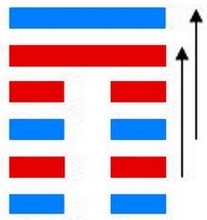

# 观 ䷓

观（䷓ guān）卦的代号是`0:3`。主卦是坤卦，卦象是地，阳数是`0`；客卦是巽卦，阳数是`3`，卦象是风。主方是观者，客方是被观者，察言观色，见风使舵，要看到客方的本质而不限于现象，以避免因观察失误而行动错误，以致遭受损失。观卦，风地观，观下瞻上，这个卦是异卦，下坤上巽，相叠。风行地上，喻德教遍施。观卦与临卦互为综卦，交相使用。在上者以道义观天下；在下者以敬仰瞻上，人心顺服归从。

图中，红色表示当位的爻，天蓝色表示不当位的爻，箭头表示有应。

- No.20

> 觀，盥而不薦，有孚顒若。
>《彖》曰：大觀在上，順而巽，中正以觀天下。觀盥而不薦，有孚顒若，下觀而化也。觀天之神道，而四時不忒，聖人以神道設教，而天下服矣。
>《象》曰：風行地上，觀，先王以省方，觀民設教。

> 初六，童觀，小人无咎，君子吝。
>《象》曰：初六童觀，小人道也。

> 六二，闚觀，利女貞。
>《象》曰：闚觀女貞，亦可醜也。

> 六三，觀我生，進退。
>《象》曰：觀我生進退，未失道也。

> 六四，觀國之光，利用賓于王。
>《象》曰：觀國之光，尚賓也。

> 九五，觀我生，君子无咎。
>《象》曰：觀我生，觀民也。

> 上九，觀其生，君子无咎。
>《象》曰：觀其生，志未平也。

> 观（䷓ guān）卦是异卦，下坤上巽，相叠。风行地上，喻德教遍施。观卦与临卦互为综卦，交相使用。在上者以道义观天下；在下者以敬仰瞻上，人心顺服归从。

>《象传》：风运行于坤地之上，喻有周游观览之意。阴长阳消，正道衰微，万物难行。

> 处身于变化之中，宜多观察入微，心身苦恼，并防外来诱惑。

- 事业：事业已出现不顺利的迹象，务必谦虚慎重，高瞻远瞩，尤忌短期行为，心胸开阔，注意搞好人际关系，团结他人，不宜轻率行动。必要时不妨投靠德行高的人，以图再度发展。
- 经商：市场形势不稳定，正处于变动，应谨慎小心，随时观察动向，从长计议，做好退却的准备。
- 求名：贵在自知之明，虚心向他人求教，端正处世态度，尤其不可自我满足，更须守中持正，树立远大理想，勿丧失个人追求的目标，勿偏离正道。
- 婚恋：不顺利，双方应经受住考验，从长计议，会有理想的结果。
- 决策：具有组织能力，适宜担任负责工作，但人生旅途多曲折，必须注意培养自己的预见性和观察力，办事务必公正，实事求是，注意人心动向，关心他人。尤其不可以陷入小人之道和近视行为之中。应有决断精神，不可盲从，必要时可进行策略依附。

观卦，巽上坤下，为[乾宫四世卦](jing/qian.md#20)。观卦象征将道义展示于众人面前。观卦风在上而地在下，是春风浩荡、万物滋生之象。以下观上，周游观览；平心静气，坚守岗位。得此卦者，处身于变化之中，心神不宁，宜多观察入微，待机行事，切勿妄进。

- 时运：出外游览，不易闲居。
- 财运：贩卖洋货，须防风险。
- 家宅：供养神佛。
- 身体：风湿之症，运动调养。

> 观：表示观察、观看，是个最标准的状况卦，吉凶未定。凡事不可轻下决定，需要再观察一下局势再做打算。尤其是对长官、上位者的态度更是要察言观色，不可轻忽大意。

> 解释：尚在观察中。

> 特性：有创意，喜欢开发新事物，见解新颖，爱旅行，观摩他人，研究比较，不断修正反省自己。

> 运势：处在有危险不稳的时运，耍多观望时势之利弊，待机行事，于人事物，须以诚待之，才能感化而幸免陷入困难也。

- 家运：正处于下坡时段，要知固守进退之机，听取长辈意见有助也。
- 疾病：有渐恶化之象，病情变化多，为腹、神经系统病症。
- 胎孕：孕有不安之象。
- 子女：儿女将来有成就幸福也。
- 周转：虽有好言，实际内在空虚。无指望居多。
- 买卖：交易有碍。应在戌亥日可成，否则难成。
- 等人：观望必有等待，而来者有随他人去之象。
- 寻人：此人到处漂泊，行踪不定，有险象。目前在西南方，宜丑未日见。
- 失物：若能细心四察，可以找回来。
- 外出：有风险，择日而行。
- 考试：不理想。
- 诉讼：小人当道，愈争论惹起纷争愈多，但终会和解。
- 求事：不易。
- 改行：擅自主张不宜，若由他人提拔则可。
- 开业：开业者不宜。

### 初六：童观，小人无咎，君子吝。《象》曰：初六童观，小人道也。

愚蠢近视，对一般百姓来讲尚无大碍，但对于担负政治责任的君子来说，将会铸成大错。《象传》：初六爻辞讲，愚蠢近视，这正是小人们的思想特征。

凶：得此爻者，宜防小人，诸事有困难，弄巧成拙。做官的有危难，不宜进取。

- 时运：初运未佳，但无大碍。
- 财运：初登场面，小作即可。
- 家宅：小心童仆；自由结亲。
- 身体：小孩没事，大人不利。

初六爻动变得[第42卦：风雷益](e79b8ayi_cn.md)。

风雷益䷩是异卦，下震上巽，相叠。巽为风；震为雷。风雷激荡，其势愈强，雷愈响，风雷相助互长，交相助益。此卦与损卦相反。它是损上以益下，后者是损下以益上。二卦阐述的是损益的原则。

### 六二：窥观，利女贞。《象》曰：窥观女贞，亦可丑也。

囿于一孔之见，这是有利于女人的贞兆。《象传》：女人窥视男人，即使操行贞正，亦属可丑的行为。

平：得此爻者，在家不如意，外出谋事则好，或喜或忧，或因妇人而起是非，大抵宜动不宜静。此爻女喜，男悲。

- 时运：最好退守，女性有利。
- 财运：蚕丝有利，余皆不宜。
- 家宅：妇女主家。
- 身体：阴寒之症，可愈。

六二爻动变得[第59卦：风水涣](e6b6a3huan_cn.md)。

风水涣䷺是异卦，下坎上巽，相叠。风在水上行，推波助澜，四方流溢。涣，水流流散之意。象征组织和人心涣散，必须用积极的手段和方法克服，战胜弊端，挽救涣散，转危为安。

### 六三：观我生，进退。《象》曰：观我生进退，未失道也。

观察亲族的思想动向，从而决定为政的措施。《象传》：观察亲族的思想动向，从而决定为政的措施，这才未失去用人行政的正道。

平：得此爻者，三心二意，须谨慎行事，知难而退。做官的进退无常。

- 时运：度德量力，稍安毋躁。
- 财运：随买随卖，不致有失。
- 家宅：守住旧债。
- 身体：安心静养，可保平安。

六三爻动变得[第53卦：风山渐](e6b890jian_cn.md)。

风山渐䷴是异卦，下艮上巽，相叠。艮为山，巽为木。山上有木，逐渐成长，山也随着增高。这是逐渐进步的过程，所以称渐，渐即进，渐渐前进而不急速。

### 六四。观国之光，利用宾于王。《象》曰：观国之光，尚宾也。

观察国家政绩风俗的辉煌表现。筮遇此爻，有利于朝觐君王。《象传》：观察国家政绩风俗的辉煌表现，此来者为国宾。

平：得此爻者，宜出外谋事，多与外人交往，则有利。做官的或居闲职，清高之地。

- 时运：正当好运，名胜于利。
- 财运：国际贸易，有利有名。
- 家宅：喜事临门。
- 身体：多加小心。

六四爻动变得[第12卦：天地否](e590a6pi_cn.md)。

天地否䷋是异卦，下坤上乾，相叠。其结构同泰卦相反，系阳气上升，阴气下降，天地不交，万物不通。它们彼此为“综卦”，表明泰极而否，否极泰来，互为因果。

### 九五：观我生，君子无咎。《象》曰：观我生，观民也。

善于观察亲族之意向，君子可以无过错。《象传》：观察亲族之意向，就是观察天下万民的意向。

吉：得此爻者，时来运转，利益丰厚，对于妇人则有怀孕之喜，病重者有生命之忧。做官的会因为自己良好的官德，爵禄有升。

- 时运：直道而行，无往不利。
- 财运：我来决定，必可得利。
- 家宅：我来建宅。
- 身体：平安无碍。

九五爻动变得[第23卦：山地剥](e589a5bo_cn.md)。

山地剥䷖是异卦，下坤上艮，相叠。五阴在下，一阳在上，阴盛而阳孤；高山附于地。二者都是剥落象，故为“剥卦”。此卦阴盛阳衰，喻小人得势，君子困顿，事业败坏。

### 上九：观其生，君子无咎。《象》曰：观其生，志未平也。

观察其他部族的意向，君子可以无过错。《象传》：观察其他部族的意向，是因为尚未全面摸清情况，心不踏实，决心难下。

平：得此爻者，运势不通，心有余而力不足，怀孕者利于生育，久病者会痊愈。做官的宜退守，修德养身。

- 时运：大运已过，自省无碍。
- 财运：买到货存，有利可图。
- 家宅：老宅生息。
- 身体：来日无多。

上九爻动变得[第8卦：水地比](e6af94bi_cn.md)。

水地比䷇是异卦，下坤上坎，相叠。坤为地，坎为水。水附大地，地纳河海，相互依赖，亲密无间。此卦与师卦完全相反，互为综卦。它阐述的是相亲相辅，宽宏无私，精诚团结的道理。

# [Guān ䷓](e8a782guan.md)
