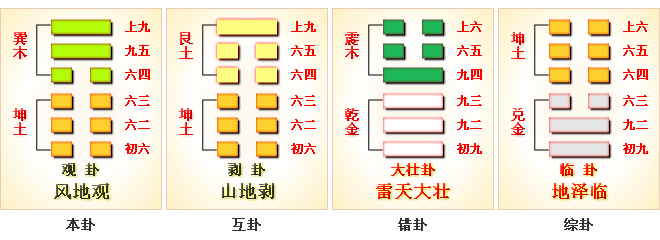
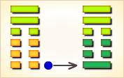
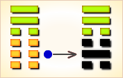
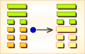
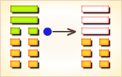
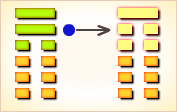
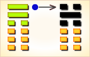

# 观 ䷓


观（guān）卦代号是`0:3`，主卦是坤卦，卦象是地，阳数是`0`；客卦是巽卦，阳数是`3`，卦象是风。

主方是观者，客方是被观者，察言观色，见风使舵，要看到客方的本质而不限于现象，以避免因观察失误而行动错误，以致遭受损失。

观卦，风地观，观下瞻上，这个卦是异卦，下坤上巽，相叠。风行地上，喻德教遍施。
观卦与临卦互为综卦，交相使用。在上者以道义观天下；在下者以敬仰瞻上，人心顺服归从。

“盥”是在祭祀前洗手。“荐”是将祭品奉献。“不”是还没有，“顒”是严正、温恭，“若”与然同，“顒若”是尊敬仰慕的意思。图中，红色表示当位的爻，天蓝色表示不当位的爻，箭头表示有应。

- 卦辞：盥而不荐，有孚顒若。
- 主卦：坤卦，地）
- 客卦：巽卦，风）
- 卦序：20

> 觀，盥而不薦，有孚顒若。初六，童觀，小人无咎，君子吝。六二，闚觀，利女貞。六三，觀我生，進退。六四，觀國之光，利用賓于王。九五，觀我生，君子无咎。上九，觀其生，君子无咎。
>《彖》曰：大觀在上，順而巽，中正以觀天下。觀盥而不薦，有孚顒若，下觀而化也。觀天之神道，而四時不忒，聖人以神道設教，而天下服矣。
>《象》曰：風行地上，觀，先王以省方，觀民設教。

### 风地观 观下瞻上 中上卦

《象》曰：卦遇蓬花旱逢河，生意买卖利息多，婚姻自有人来助，出门永不受折磨。
这个卦是异卦，下坤上巽，相叠。风行地上，喻德教遍施。观卦与临卦互为综卦，
交相使用。在上者以道义观天下；在下者以敬仰瞻上，人心顺服归从。

```
观：盥而不荐，有孚顒若。

【白话】《观卦》象征瞻仰：
瞻仰了祭祀开头盛大的倾酒灌地的降神仪式，
就可以不去看后面的献飨之礼了，
因为这时心中已经充满了诚敬肃穆的情绪。

《象》曰：风行地上，观；先王以省方观民设教。
【白话】《象辞》说：
《观卦》的卦象是坤（地）下巽（风）上，
为风吹拂于地上而遍及万物之表象，象征瞻仰。
先代君王仿效风吹拂于地而遍及万物的精神，
视察四方，留心民风民俗，用教育来感化民众。

初六，童观，小人无咎，君子吝。
【白话】初六，像幼稚的儿童一样观察景物，
这对无知的庶民来说，不会有害处，
但对担任教化重任的君子来说，就未免有所憾惜。

《象》曰：初六，“童观”，小人道也。
【白话】《象辞》说：
《观卦》的第一位（初六），
“像幼稚的儿童一样观察景物”，
这是浅薄的小人之道。

六二，闚观，利女贞。
【白话】六二，由门缝中偷观景物，
有利于妇女保持节操，坚持正道。
《象》曰：“闚观，女贞”，亦可丑也。
【白话】《象辞》说：
“由门缝中偷观景物，
对于妇女来说有利于坚持正道，固守贞操”，
但对男子汉来说，这样的行为就丢丑了。

六三，观我生，进退。
【白话】对照高尚的道德标准来省察自己的言行，
审时度势，小心谨慎地决定进退。
《象》曰：“观我生，进退”，未失道也。
【白话】《象辞》说：
“对照高尚的道德标准省察自己的言行，
审时度势，小心谨慎地决定进退”，
这样做是不失原则的。

六四，观国之光，利用宾于王。
【白话】六四，瞻仰一个国家的文治武功，
有利于成为君王的宾客和辅佐。
《象》曰：“观国之光”，尚宾也。
【白话】《象辞》说：
“瞻观一个国家的文治武功”，说明此国崇尚贤士。

九五，观我生，君子无咎。
【白话】九五，
对照高尚的道德标准省察自己的言行，
不断地完善自己，君子就不会有祸患。
《象》曰：“观我生”，观民也。
【白话】《象辞》说：
“对照高尚的道德标准，审察自己的言行，
弄清自己的德行”，便可知万民的德行。

上九，观其生，君子无咎。
【白话】上九，
君子时刻瞻仰君主的德行和作为，
并按照君主的德行和作为行事，这样才不会有祸患。
《象》曰：“观其生”，志未平也。
【白话】《象辞》说：
“君子时刻瞻仰君主的德行和作为”，
因为君子始终以天下为己任，天下未安，其志难平。
```

### 卦辞解释
```
观：盥而不荐，有孚颙若。
郑玄曰：坤为地，为众。巽为木，为风。
九五，天子之爻。互体有艮。艮为鬼门，又为宫阙。
地上有木。而为鬼门宫阙者，天子宗庙之象也。
王弼曰：王道之可观者，莫盛乎宗庙。
宗庙之可观者，莫盛乎盥也。
至荐简略，不足复观，故“观盥而不荐”也。
马融曰：盥者，进爵灌地，以降神也。
此是祭祀盛时，及神降荐牲，其礼简略，不足允也。
国之大事，唯祀与戎。王道可观，在于祭祀。
祭祀之盛，莫过初盥降神。
故孔子曰：谛自既灌而往者，吾不欲观之矣。
此言及荐简略，则不足观也。
以下观上，见其至盛之礼，万民信敬，故云“有孚颙若”。
孚，信。颙，敬也。
案：鬼神害盈，祸淫福善。若人君修德，至诚感神。
信则黍稷非馨，明德惟馨。
故“观盥而不观荐”，飨其诚信者也。
斯即东邻杀牛，不如西邻之禴祭，实受其福，是其义也。

《彖》曰：大观在上，
蜀才曰：此本乾卦。
案：柔小浸长，刚大在上，
其德可观，故曰“大观在上”也。
顺而巽，中正以观天下。

虞翻曰：谓阳息临二，直方大。
临者，大也。在观上，故称“大观”。
顺，坤也。中正谓五。
五以天神道观示天下，咸服其化，宾于王庭。
观，盥而不荐，有孚颙若，下观而化也。

虞翻曰：观，反临也。
以五阳观示坤民，故称“观”。
盥，沃盥。荐，羞牲也。
孚，信，谓五。颙颙，君德，有威容貌。
若，顺也。坎为水，坤为器，
艮手临坤，坎水沃之，盥之象也。
故“观盥而不荐”。
孔子曰：谛自既灌，吾不欲观之矣。
巽为进退，容止可观，进退可度，则下观其德而顺其化。
上之三，五在坎中，故“有孚颙若，下观而化”。
《诗》曰：颙颙昂昂，如珪如璋。君德之义也。
观天之神道，而四时不忒。

虞翻曰：忒（tè），差也。神道谓五。
临，震兑为春秋，三上易位，坎冬离夏，日月象正。
故“四时不忒”。
圣人神道设教，而天下服矣。

虞翻曰：圣人谓乾，退藏于密，而齐于巽，
以神明其德教，故“圣人设教”，坤民顺从，而天下服矣。
《象》曰：风行地上，观。先王以省方观民设教。
《九家易》曰：先王谓五。应天顺民，受命之王也。
风行地上，草木必偃，枯槁朽腐，独不从风，谓应外之爻。
天地气绝，阴阳所去，象不化之民，五刑所加，
故以省察四方，观视民俗，而设其教也。
言先王德化，光被四表，有不宾之民，
不从法令，以五刑加之，以齐德教也。

综述：
这一卦，形象与临卦完全相反，彼此是“综卦”。
临是由上往下看，观是由下往上看，
彼此都在监视，所以临与观交互作用。
《序卦传》说：“物大然后可观，故受之以观。”
“观”是展示与仰观意思。
这一卦所阐释的，是说要将道义，展示于众人之前，
众人必然也对自己瞻仰的道理。
“九五”在尊位，被四个阴爻瞻仰；
“九五”也以中正的德性，展示于天下。所以命名为“观”。
```

### 爻辞解释
```
初六：童观，小人无咎，君子吝。
虞翻曰：艮为童。阴，小人。阳，君子。
初位贱，以小人承君子，故“无咎”。
阳伏阴下，故“君子吝”矣。
《象》曰：初六童观，小人道也。
王弼曰：失位处下，最远朝美，无所鉴见，故曰“童观”。
处大观之时，而童观趣顺而已。
小人为之，无可咎责。君子为之，鄙吝之道。
“观”在此应当作“看”解。
“初六”阴爻柔弱，在最下位，仰观“九五”，距离遥远；
因而，象征没有才华，
不能高瞻远瞩，是儿童的观点，当然幼稚。
“小人”指庶民，庶民无知，这是必然的情形，所以说没有过失。
但对身负教化的人来说，则是耻辱。
这一爻，说明观察不可幼稚，应高瞻远瞩。

六二：窥观，利女贞。
虞翻曰：临兑为女。窃观称窥兑女反成巽。
巽四五得正，故“利女贞”。
艮为宫室，坤为阖户，小人而应五。
故“窥观女贞利”，不淫视也。
《象》曰：窥观女贞，亦可丑也。
侯果曰：得位居中，上应于五。窥观朝美，不能大观。
处大观之时，而为窥观。女正则利，君子则丑也。
案：六二离爻，离为目，又为中女。外互体艮，艮为门。
阙女目近门，窥观之象也。
窥视的意思，窥是由洞中偷看。
“六二”阴爻，在内卦，柔弱黑暗，观看光辉的“九五”，
眼花撩乱，看不清楚，好像是由门缝中偷看。
以古代来说，妇女足不出门，这是当然的道理。
这一爻，说明观察不可偏狭。

六三：观我生，进退。
虞翻曰：坤为我，临震为生。
生，谓坤生民也；巽为进退，故“观我生进退”。
临震进之五，得正居中，故《象》曰“未失道”。
《象》曰：观我生进退，未失道也。
荀爽曰：我，谓五也。生者，教化生也。
三欲进观于五，四既在前，而三故退，未失道也。
“六三”在下卦的最上方，处于可进可退的位置，
不必观察高高在上的“九五”，应当观察自己的主张，来决定进退。
应当择善固执，不可趋炎附势，失去了自己的原则。
这一爻，说明观察应有主见，不可盲从。

六四：观国之光，利用宾于王。
虞翻曰：坤为国。临阳至二，天下文明。
反上成观，进显天位，故“观国之光”。
王谓五阳。阳尊宾坤。坤为用、为臣，四在王庭，宾事于五。
故“利用宾于王”矣。
《诗》曰：莫敢不来宾，莫敢不来王。是其义也。
《象》曰：观国之光，尚宾也。
崔觐曰：得位比尊，承于王者。
职在搜扬国俊，宾荐王庭，故以进贤为尚宾也。
“宾”即仕，古代有德行的人，
天子以宾客的礼仪招待，所以说宾。
“六四”最接近“九五”。
“九五”象征阳刚、中正、德高望重的君王，
所以“六四”可观看到君王德行的光辉。
“观国之光”是指由一国的风俗民情，
就足以观察到君王的德行如何。
这一爻，说明应观察民情，了解民间疾苦。

九五：观我生，君子无咎。
虞翻曰：我，身也，谓我生。
生，谓生民。震生象。反坤，为死丧。嫌非生民，故不言民。
阳为君子，在临二，失位之五，得道处中，故“君子无咎”矣。
《象》曰：观我生，观民也。
王弼曰：观我生，自观其道也。
为众观之主，当宣文化，光于四表，上之化下，犹风之靡草。
百姓有过，在予一人。君子风著，已乃无咎。
欲察已道，当观民也。
虞翻曰：坤为民，谓三也。坤体成，故观民也。
“九五”阳爻，在至尊的中位，下面有四个阴爻仰观，
象征是一位有德行的君王，成为这一卦的主体。
以君子来说，应当经常反省观察自己的日常作为，
坚守中正，当然就不会有灾祸。
这一爻，说明应当观察自己的作为，检讨反省。

上九：观其生，君子无咎。
虞翻曰：应在三，三体临震，故“观其生”。
君子谓三，之三得正，故“无咎”矣。
《象》曰：观其生，志未平也。
王弼曰：观其生，为人所观也。最处上，极天下所观者也。
处天下所观之地，其志未为平易，不可不慎。
故君子德见，乃得无咎。
生，犹动出也。
虞翻曰：坎为志，为平，上来之三，故“志未平”矣。
“上九”阳爻，在尊位“九五”的上方，象征高尚的隐士，
虽然超然于世俗以外，但却仍然被天下人观察；
如果刚毅无欲，符合君子应有的德行，才没有灾祸。
这一爻，说明在上者时刻都被注目，不可掉以轻心。
观卦，阐释观与瞻的道理。
在上者的一举一动，都成为注意的焦点，
无时无刻不在被注视中；
因而，不可掉以轻心，不能轻率行动，
必须诚信严正，以道义展示于天下，
才能得人民的信仰与尊敬，服从领导，产力量。
相对的，在上者对外要观察民情对民间疾苦，
有所作为。同时对内要观察自己的言行作为，不断反省检讨。
《序卦》曰：可观而后有所合，故受之以噬嗑。嗑者，合也。
崔觐曰：言可观政于人，
则有所合于刑矣，故曰“可观而有所合”。

综述：（风地观卦）
上巽下坤，中存艮坤，地之上有山，积为垣墙之义，
成高大之势，山地之上，又为巽风为之扇扬，
高大光厚，威仪盛美，必有可观者焉，君子得之则为壮观之象。
观者观也，卦中缺兄弟子孙，以干卦第五爻申金兄弟爻，
伏于本卦第五爻巳火之下，巳火是飞神，申金是伏神，
金长生在巳，谓之伏下长生，遇引即出，以干卦初爻子水子孙，
伏于本卦初爻未土之下，未土是飞神，子水是伏神，
土克水谓之飞来克伏。
```

### 起卦

观卦是`0:3`卦的卦名，`0:3`是观卦的代号。观（guān）看，走马观花。

观卦的主卦是坤卦，卦象是地，阳数是`0`，性质是适应；客卦是巽卦，阳数是`3`，卦象是风，性质是被动和阻止。主方是观者，客方是被观者。主方观察客方，察言观色，见风使舵，不过对客方要观察得仔细，要看到客方的本质而不限于现象，以避免因观察失误而行动错误，以致遭受损失。

起卦前需要客观地、全面地、准确地分析主方和客方情况，至少符合下列条件之一，此卦才有参考价值：

1. 主方与地很相似，客方与风很相似。
2. 主卦阳数是`0`，客卦阳数是`3`。
3. 主方的行动是阴，素质是阴，态度也是阴；客方的行动、素质和态度是阴、阳和阳。

切勿用任何随机数方式起卦，否则此卦不能用作决策工具。

### 结构和卦爻辞

观卦的结构和卦爻辞中有两个方向相同的箭头，都表示主客双方对应的方面阴阳和谐，但是，这两个箭头的两端的爻的颜色不同，一组是红色，表示当位，当位而有应是对主方有利因素；另一组是天蓝色，表示不当位，不当位而有应是对主方不利因素。为什么一组有利，而另一组不利呢？这要从爻的意义说起。

第一个箭头的两端是主卦和客卦的中爻，中爻代表素质。客卦中爻是阳，表示客方素质良好，阳代表天的属性，天发光发热，是能源的施主；主卦中爻是阴，表示主方素质不佳，阴代表地的属性，地接受天的光和热，是受惠者。在这个和谐状态下，主方受惠于客方，所以是对主方有利因素。

第二个箭头的两端是主卦和客卦的上爻，上爻代表态度。客卦上爻是阳，阳是天的属性，天至高无上，上爻是阳表示态度强硬。主卦上爻是阴，阴代表地的属性，地的地位低下，上爻是阴表示态度随和。态度随和的主方受到态度强硬的客方制约，所以这个和谐状态是对主方不利因素。

余下的两条爻之间没有箭头，这是主卦和客卦的下爻，代表双方的行动。在这方面，双方有矛盾而不和谐。这两条爻都是阴爻，但是对主方的影响有所不同，主卦下爻是天蓝色，天蓝色表示不当位，因为阴爻表示主方像地一样静止不动地消极被动，难于创造和维护利益，甚至有可能受到客方攻击而损失利益，这是潜在的对主方不利因素。客卦下爻是红色，表示客方也是像地一样静止不动地消极被动，客方不进攻主方，主方的利益不受损失，甚至，如果主方主动，主方有可能从客方得利，所以，这是潜在的对主方有利因素。总之，这两方面都是潜在因素，关键看主方如何处理。

综合来看，主方应当扭转消极被动为主动，但是，需要很大的勇气与积累，很不容易做到，当前比较现实的做法是冷静地观望客方变化，忍受制约，在可能情况下，接受客方的帮助。关于观卦的卦爻辞，由于客方像风一样变化无常，主方必须仔细观察环境，才能适应客方，六条爻辞中，每一条都有“观”。“童观”与“闚（kuī）观”是二种不正确的观察方式；第三条的“观我生”与第五条的“观我生”的含义不一样，前者指从主方的角度观察自己的所作所为，后者是观察客方对自己的影响；第四条的“观国之光”是客观地观察主客双方关系，而第六条的“观其生”则是观察客方的行为。

```
像儿童般观望，小人这样还可以，君子这样不适宜。
隐蔽观察，可以像女子般地坚持下去。
观察我的一生，反思是否进退得当。
观国之风光，宜于作国王的宾客（客观，置身事外）。
观察我的一生，他是君子，应当接受（受他帮助）。
观察他（她）的一生，他（她）应当是君子。
```

卦辞则是综合地阐述在当前形势下，主方应当作的事。下面逐条说明卦爻辞。

### 卦辞
```
〖原文〗盥而不荐，有孚顒若。
〖译文〗观盥洗而不观上供，有诚意就是尊敬。

〖解说〗盥（guàn）洗：盥洗室。
荐（jiàn）介绍：举荐。孚（fú）叫人信任：深孚众望。
顒（yóng）仰慕：顒望。若（ruò）好像：旁若无人。
观是这个卦的卦名，也是这个卦的主题，
卦辞中没有“观”，可以认为是省略。
“盥而不荐”并不是指一种只盥洗而不上供的过程，
而是说观察的两个部分，一部分是盥洗，一部分是上供，
只需要观察盥洗，而不需要观察上供。
这里的“盥”和“荐”可能是指古代的宗庙祭祀。
有人说“盥”是指祭祀开始时用香酒浇灌地面以降神之礼，
“荐”是指向神献飨之礼；
有人说“盥”是将祭而洁手之礼。说法不一。
不过，祭祀只是一个比喻，不必严格推敲。
是否可以简单地理解“盥”是盥洗，
“荐”是供献牲口、食物等上供祭品。
“盥”虽简单，但显示虔诚，“荐”虽繁杂壮丽，但多形式表现。
观“盥”可知虔诚，观“荐”徒看表演
，“盥而不荐”看本质而不限于现象。
“有孚”是有诚意。“顒若”像仰慕的样子。
“有孚顒若”，有诚意就是尊敬，进一步解释了“盥而不荐”，
强调本质比现象更重要。“盥”表现了诚意，也就表现了敬慕。
```

### 初爻
```
〖原文〗童观，小人无咎，君子吝。
〖译文〗儿童式的观望，小人没有罪责，君子太吝啬。

〖解说〗这是观卦第一爻爻辞，
阴，表示主方消极被动，比如说，
防守、退却、只求保持现状，等等。
咎（jiù）罪责：咎由自取；责备：既往不咎。
吝（lìn）过分爱惜：吝啬。
主方素质不佳，相当于爻辞中说的小人。
第一爻反映出主方消极被动的潜在不利因素，
主方本应当积极努力改善素质，然而满足现状，
不求进取，对自己的处境负有责任。
另一方面，客方素质良好，相当于爻辞中说的大人。
如果把两方面结合起来，说小人有罪责，君子应严管，
那么就观察到了事情的本质，看到问题所在。
不过，主方可能看不到这点，而认为消极被动是应当的，
如果与客方关系不好，是因为客方吝啬。
这是一种简单的、片面的看法。
卦辞把这种错误的看法，
比作儿童式的天真幼稚的观察事物的方法，即“童观”。

〖结构分析〗第一爻位置是阳位，
这条爻是阴爻，阴爻在阳位，
不当位，并且与四阴不有应。
不当位，表明主方消极被动是潜在的对主方不利因素，
不过，扭转这种消极被动状态很不容易，
需要很大勇气与积累，不能简单地怪罪主方，所以“无咎”。
不有应，表明客方也是消极被动，客方素质良好，
但不愿主动地帮助主方，因此说，“君子吝”。
```

### 二阴
```
〖原文〗闚观，利女贞。
〖译文〗隐蔽观察，利于女子坚持下去。

〖解说〗第二爻是阴爻，代表主方的素质是阴。
闚（kuī）从隐蔽处偷看：闚测。
贞（zhēn）对自己的信仰十分忠诚：坚贞不屈。
“闚观”是小心翼翼地掩盖自己观察客方。
这条爻辞的意思是：隐蔽观察，利于像细心的女子那样坚持下去。

〖结构分析〗第二爻位置是阴位，
这条爻是阴爻，阴爻在阴位，
当位，并且与五阳有应。
当位，表示素质不佳的主方有可能接受客方惠赠，
是潜在的对主方有利因素；
有应，表明客方素质良好，有可能赠予主方，
那潜在因素成了真正的对主方有利因素。
不过，因为客方消极被动，不主动地帮助主方，
主方必须小心地观察客方，并且耐心地等待客方的帮助，
所以，爻辞说，“闚观，利女贞”。
```

### 三阴
```
〖原文〗观我生，进退。
〖译文〗观察我的一生，前进与后退。

〖解说〗这个爻代表主方态度，
阴，主方的态度随和。
同时，第三爻是对第二条的补充，
如果第二条是阴，第三条也是阴，则表示主方的素质很差。
“生”指主方的生活经历，也就是主方的曾经。
“观我生”，观察主方的过去的经历和如今的状态。
主方的未来还没有成为事实，无法观察。
由于素质很差，不得不采取和顺谦虚的态度。
另一方面，由于和顺谦虚，不顶撞客方，
可能得到客方帮助，这反映在这条爻的有应上。
不过，不顶撞客方有可能受益，也有可能受损。
主方需要反思自己的行为，吸取经验教训，以做到进退得当。
这条爻辞的意思是：观察我的一生，反思是否进退得当。

〖结构分析〗第三爻的位置是阳位，
这条爻是阴爻，阴爻在阴位，
不当位，然而与六阳有应。
不当位，表明主方的态度随和，
有可能受到客方压抑，
是潜在的对主方不利的因素。
有应，表明客方态度强硬，态度随和的主方遭受客方的压抑，
那潜在因素成了真正的对主方不利的因素，
在此不利情况下，主方保持随和的态度，
能进则进，能退则退，所以，爻辞说“进退”。
```

### 四阴
```
〖原文〗观国之光，利用宾于王。
〖译文〗观国之风光，宜于作国王的宾客。

〖解说〗这是观卦第四爻的爻辞，
阴，表示客方消极被动。
这条爻辞的意思是：
为了观国之风光，宜于作国王的宾客。
需要考虑的是：
为什么要“作国王的宾客”而不作服务于“国王”的“臣”？
“国”指什么？“宾”指谁？“王”指谁？
在这个主客双方关系中，观者是主方，被观者是客方。
“国”指相互关系，“王”指客方，“宾”指主方。
观察必须事实是，要接近事物而不能远离事物，
观光必须在“国”内；
观察必须客观，要置身事外，不牵涉个人利益，
只作“宾”而不作“臣”。
这条爻辞告诉主方要观察主客双方关系的情况和变化，
分析要客观，分析要避免从个人利益出发。

〖结构分析〗第四爻位置是阴位，
这条爻是阴爻，阴爻在阴位，
当位，然而与一阴不有应。
当位，表明客方消极被动有利于主方发展，
是潜在的对主方有利因素；
不有应，表明主方也消极被动，
主方不能利用客方的消极被动为自己谋利益，
那潜在因素没有成为真正的对主方有利因素，
主方仅仅是个“宾”，所以爻辞说“利用宾于王”。
```

### 五阳
```
〖原文〗观我生，君子无咎。
〖译文〗观察我的一生，他是君子，我不应当受到怪罪。

〖解说〗这是观卦第五爻爻辞，
阳，表示客方素质良好。
咎（jiù），常用于“既往不咎”，指怪罪。
“我”指主方。“君子”是指客方。客方素质良好，是“君子”。
这条爻辞的意思是：
主方观察自己的一生的时候，如果有什么不良境遇，
应当意识到那是客方素质良好而我自己素质不佳造成的，
我不应当受到怪罪。
“无咎”是判断辞，判断辞总是对于主方说的。

〖结构分析〗第五爻位置是阳位，
这条爻是阳爻，阳爻在阳位，
当位，又与二阴有应。
当位，表明客方素质良好，
有可能帮助主方，这是潜在的对主方有利因素；
有应，表明主方素质不佳，需要客方帮助，
那种潜在因素成了真正的对主方有利因素，
主方接受客方的帮助是应当的，所以爻辞说，“无咎”。
```

### 六阳
```
〖原文〗观其生，君子无咎。
〖译文〗观察他（她）的一生，
他（她）是君子，我无所怪罪。

〖解说〗第六爻是客卦的上爻，
代表客方态度，阳，客方态度强硬。
“其”是代词，他、她或它：出其不意。
“生”指生命，活的。
“观其生”不一定要理解为“观察他（她）的一生”，
而可以理解为“观察他（她）的现况”。
这里的他（她）指客方。君子也是指客方。
这条爻辞的意思是：
观察他（她）的现况，他（她）是君子。
主方无所怪罪。

〖结构分析〗第六爻位置是阴位，
这条爻是阳爻，阳爻在阴位，
不当位，然而与四阴有应。
不当位，表明客方态度强硬，有可能制约主方，
是潜在的对主方不利因素；
有应，表明主方态度随和，
正好接受客方的制约，
那不利因素成了真正的对主方不利因素。
第六爻是对第五爻的补充，表示客方实力极强；
第三爻是对第二爻的补充，表示主方实力极弱。
客方制约主方是极大的实力对比造成的，
主方不应当受到怪罪，所以爻辞说“无咎”。
```

### 白话解析
```
观①：盥②而不尊③，有复颙④若。

【白话】筮得观卦，祭祀的时候，
用洗干净的手灌酒于地以迎神，
虽然不进献祭祀的供品，但是有虔诚敬神的心态。

【注释】
① 观：卦名，看，观察。
② 盥：灌酒于地上以请神。
③ 不尊：没有祭品。
尊：本义为双手奉酒以祭祀天神，引申为祭品。
④ 颙：敬重。

【讲解】观察是人们认识事物的一种重要方法。
人们通过对美好事物的观察可以得到心情的愉悦和快乐。
观卦的九五阳爻在尊位，
以盛大美好的德行，在上位而被万物所瞻仰。
下卦坤卦为顺，上卦巽卦为从，
上下二体象人有柔顺谦逊的品德。

初六：童观①，小人无咎，君子閵。

【白话】筮得观卦，占得初六爻，幼稚的看法，
对小人来说没有关系，对君子来说则有灾难。

【注释】① 童观：幼稚、不成熟的看法。

【讲解】初六阴柔之爻居阳刚之位，居不当位，
而且远离九五，体于阴柔，不能够自进，
没有什么可以鉴借观赏的，所以说“童观”。
只能顺从，不能自力更生有所作为，
这是小人的处世原则，君子则不能这样逆来顺受。

六二：闚观①，利女贞。

【白话】筮得观卦，占得六二爻，
从缝隙中观察，见识短小，仅利于女子贞问。

【注释】① 闚：假借为窥。窥观：从缝隙中观看。

【讲解】六二阴柔之爻处于阴柔之位，
而且得以固守下体坤顺之中。
这德性是封建社会对妇女的品德的要求。
封建社会将妇女视为家庭的附属品，附属于男人，
不能有行动的自由，连观察世界的权力都没有。
被关在家中，只能偷偷地看世界。

六三：观我生①，进退。

【白话】筮得观卦，占得六三爻，
观察自我的德性，以审定自己的进退。

【注释】① 生：假借为“性”，德性。

【讲解】六三阴柔之爻居于阳刚之位，
处上下二体相交之际，进退随己，所以说“观我生，进退”。

六四：观国之光，利用宾①于王。

【白话】筮得观卦，占得六四爻，
观察国家的风光，利于做君王的宾客。

【注释】① 用宾：做客。

【讲解】六四阴柔之爻居于阳刚之位，
贴近九五阳刚至尊，九五以阳刚中正处于尊位，有如明君，
六四观国就是观看国家的君王，所以说“观国之光”。

九五：观我生①，君子无咎。

【白话】筮得观卦，占得九五爻，
观察自我的德性，这样做对君子有利无害。

【注释】
① 生：参阅本卦六三爻的注释。

【讲解】九五阳刚之爻居于阳刚至尊之位，
为观卦的卦主。
君主常常自我观察监督自己的管理统治方法，
以便为民造福，为自己消灾免祸。

尚九：观其①生，君子无咎。

【白话】筮得观卦，占得尚九爻，
观察他人的德性，对于君子来说有利而无弊。

【注释】① 其：指他人。
【讲解】尚九阳刚之爻居于观卦的终点，
虽然没有处于君位，却处观卦的最高处。
有如不在朝的圣贤，
他的一言一行、一举一动都为民众所仰望。
```

### 《彖》曰
```
大观在上，顺而巽，中正以观天下。
观，盥而不荐，有孚颙若，下观而化也。
观天之神道，而四时不忒；
圣人以神道设教，而天下服矣！

【白话文】《彖传》说：
宏大壮观的天象高高在上，具有柔顺谦逊的美德，
凭借中和刚正之德被天下人所仰观。
抬头仰视，“祭祀之前的忏悔思过，
眼睛里充满了虔诚肃穆的神情。”
是说天下世人通过仰观天象而获得教化。
仰观大自然天象运行的神妙法则，
感悟时空四季交替分毫不出偏差的道理。
圣人应仿效大自然的神妙法则去设立教化，
让天下百姓获得教化而归顺诚服。
```

### 《象》曰
```
风行地上，观；
先王以省方观民设教。
初六童观，小人道也。
窥观女贞，亦可丑也。
观我生进退，未失道也。
观国之光，尚宾也。
观我生，观民也。
观其生，志未平也。
```

### 新解
```
【原文】 
（坤下巽上）观①：盥而不荐②，有孚颙若③。
初六：童观④，小人无咎，君子吝。
六二：闚观⑤，利女贞。
六三：观我生进退⑥。
六四：观国之光，利用宾于王⑦。
九五：观我生，君子无咎。
上九：观其生⑧，君子无咎。

【注释】 
① 观是本卦标题。观的意思是观察、观看。
全卦的内容与政治统治有关。观在卦中多次出现，
也与所讲内容有关，所以用它来作标题。
② 盥（guàn）： 古代祭祖时用酒灌地迎神。
荐：献，指祭祖时的献牲。
③ 颙（yóng）若：头大的样子，
这里是指俘虏的头被打肿了。
④ 童：儿童，这里指幼稚无知。
⑤ 闚观：一孔之见。 
⑥ 我生：我姓，指亲族。
进退：行动，这里指政策措施。
⑦ 光：光耀，这里指政绩光耀。
宾：作宾客，这里指朝觐。
⑧ 其生：其他姓氏，指别的部落氏族。

【译文】 
观卦：祭祀时灌酒敬神，不献人牲，
因为作祭牲的俘虏头青脸肿，不宜敬神。
初六：看问题幼稚无知，
这对小人来说没有什么，但对君子就有害了。
六二：目光短浅，这是对女子有利的兆头。
六三：体察亲族的动向，由此决定政策措施。
六四：观察国家政绩大小，以选择可以朝觐的君王。
九五：体察亲族的意向，君子从政就不会有困难。
上九：体察其他部族的意向，君子从政就不会有困难。

【读解】
这一卦又是从有利于统治者的角度，
来劝诫他们从政要善于体察各个方面的情况，
从而维护自己的统治和既得利益，保证权力地位的牢固。
作者的用心不可谓不良苦，算得上是忠君之士。
历来的忠君之士大抵都以匡扶社稷、劝诫国君为己任，
而历来的史传都把这样的人奉为供人景仰的爱国者。
其中是与非，自有人评说。
在他们的心目中，万众百姓是供君子大人驱赶的羔羊，
民生疾苦和家国兴衰的价值，
只不过是用来烘托君子大人的神圣贤明。
但愿现代社会中人们的观念里再也不要有君子与小人、
为官与为民一类高下尊卑的等级观念。
君子大人同样是肉身凡胎吃五谷拉人屎，
并不比百姓小人聪明多少高贵多少能干多少。
```

### 《哲学易经》之《观卦》 

观：盥而不荐，有孚顒若。《彖》日：大观在上，顺而巽，中正以观天下。“观，盥而不荐，有孚顒若。”下观而化也。观天之神道而四时不忒，圣人以神道设教而天下服矣。《象》曰：风行地上，观。先王以省方、观民、设教。

观：《说文》，谛视也。它有观摩、察看、审视之意。有观摩、察看、审视从而才能明天下之理，知天下之情，晓已身之美，谋久远之法。故要想把天下治理好必须学会观摩、察看、审视而受之《观》。观，人类认识事物之大法也。“静察其阳，动察其阴，先观其迹，后知其心。”故唯观才能洞察一切，唯观才能彰显一切而把事情做好做大做顺，是以“观：盥而不荐，有孚顒若。”

盥，水盆也。古以水为镜，盥而可正衣冠、洗垢面、整乱发、彰显其美，一丝不荐，无有杂乱。
是以有所观才能明天下之理，知天下之情，晓已身之美，谋久远之法。
故以中正谛视天下则神道可立，万民可教，天下可服矣。天下无不在观摩、省察、审视中理智、成熟、借鉴和发展也。故观，它逐能使事物通顺和达开来，这就叫下观而天下可化矣。

《樵鱼问对》上说：“我亦人，人亦我，我与人皆物也。用天下之目为已之目，其目无所不见；用天下耳为已之耳，其耳无所不听；用天下口为已之口，其口无所不言；用天下心为已之心，其心无所不谋。此以物观物也。一心观万心，一身观万身，一物观万物，一世观万世，则无所不观。”是以“大观在上，顺而巽。”此“中正以观天下也。”唐太宗说过：“人以铜为镜，可以正衣冠；以古为镜，可以见兴替；以人为镜，可以知得失。”这都是观法之大义也。

《彖》辞说：大观在上，它通顺而和巽，因此当中正以谛视天下也。因为只有中正以谛视天下，才能象端着水盆那样可以观摩已身，整理乱发，彰显其美，这就叫下观而天下可化矣。观天之神道，从而使人民知道了四时井然有序而没有差错。圣人由于不断地观乎于神道制定了教义，从而使天下万民和服而巽顺。因此观乃天下之大法也。只有细心的观察和全面考核，从而才能有全面认识而作出有利于发展的行为。
《象》辞说：观就是谛视，就是省察。它的品德如风行地上，万物不遗，这是《观》之象。是以上古的君王感于观的伟大意义，从而不断巡视邦国、体察民情、度越国政、推行教化。

初六：童观，小人无咎君子吝。《象》曰：初六童观，小人道也。
童观，儿童之观。象幼稚无知的儿童一样看事物对于普通老百姓来说好象没有什么，
但对于行大事建大业的君子来说就会有很大的危险。原因是我们不能深入到现象的实质中去就很难发现存在的一切问题。

六二：窥观，利女贞。《象》曰：窥观女贞，亦可丑也。
囿于一孔之见，就不能发现实质性的问题，这是闺门闺女偷看新郎的角色，是以亦可丑也。
《吕氏春秋》上说：“人各有所爱，各有所恶，心存偏见，听觉必然发生错误。向东面望的人看不到西面的墙，向南看的人看不到北方。”
因此，只有站立于不同的角度才能看清事态的真相，才能明心见性，凭主观的见解就会善恶不分。

六三：观我生进退。《象》曰：观我生进退，未失道也。
我生，即与我之生。观摩我生的趋势和行情，从而才能作出正确的决择。因此君子当“天时、民财、交情、审其意，知其好恶而为之度。”《吕氏春秋.察今篇》说：“察已则可以知人，察今则可以知古，人与我同耳。有道之士，贵以近知远，以今知古，以益所见知所不见。故审堂下之阴而知日月之行，阴阳之变；见瓶水之冰而知天下之寒，鱼鳖之藏；尝一脟肉而知一镬之味，一鼎之调。”可见，只有正视我之生才能知天下而不惑，只有观察民心之所向才能行而不过。

六四：观国之光，利用宾于王。《象》曰：观国之光，尚宾也。
光，光点也。有敏捷眼光者，超人常识者，可为君王之佳宾矣。原因是如能观国之光华，就能发现一切问题，改变一切问题，完善一切问题，是以可利用宾于王矣。孟子说：“孔子登东山而小鲁，登泰山而小天下。”孟子说：“观水有术，必观其澜。日月有明，容光必照焉。”深入的观察必能洞察一切、发现一切、改善一切。君子这样做必将树立起丰功伟绩而能成为君王之佳宾矣。

九五：观我生，君子无咎。《象》曰：观我生，观民也。
观我生，君子就不会犯咎。原因是君子只有不断地观民所需，知民所乐，才能行不过而不犯其咎。孟子说：“政，民为大。乐民之乐，则民乐其乐；忧民之忧，则民亦忧其忧。乐以天下，忧以天下，然后不王者，未之有也。”

上九：观其生，君子无咎。《象》曰：观其生，志未平也。
其生，他生也。犹外邦也。善于观察国外形势，才能知己知彼戒鉴有司而立于不败之地，是以君子无咎也。因此我们当放眼大千世界，静观世界变化，就不难发现存在的一切问题而作出相应的改变。故君子不可自满其志，当观天下会通，行典礼、断吉凶、顺物宜，才能平定天下之不足，改变自我之缺陷。

### 全新译文
```
观：盥而不荐，有孚顒若。
译文：圣人面前，要庄重大气而不轻率，
更要有诚敬而仰慕的状态。
这才是正确的观摩学习之道。

初六：童观，小人无咎，君子吝。
译文：人生在世，
首先学会的肯定是小孩那种天真童趣的观物视角。
这种儿童视角不做正事无所谓，
要用来做正事的话肯定是不行的。

六二：窥观，利女贞。
译文：年龄大了一点对大人的世界充满了好奇，
经常会去窥探一些大人世界的秘密。
这种视角对于女生来说无所谓，
对于男生来说就缺少了一些庄重与大气。

六三：观我生，进退。
译文：成人了不是小孩子了，
要习惯性的体察自己的举止言行，
要懂进退辨是非做大事了。

六四：观国之光，利用宾于王。
译文：有了重要的官位进入朝堂了，
要为国争光为君王争脸面，把外国使臣比下去！

九五：观我生，君子无咎。
译文：得圣主庇佑一路升官 好不风光。
只要你坚守正道一生都会无灾无祸。

上九：观其生，君子无咎。
译文：年龄不小了看惯了风风雨雨，
懂得了怜悯天下怜悯众生，
这就是道你所学到的圣人慈悲之道。
```



### 《断易天机》解

观卦巽上坤下，为乾宫四世卦。观卦象征将道义展示于众人面前。观卦风在上而地在下，是春风浩荡、万物滋生之象。

### 北宋易学家 邵雍 解

以下观上，周游观览；平心静气，坚守岗位。

得此卦者，处身于变化之中，心神不宁，宜多观察入微，待机行事，切勿妄进。

### 台湾国学家 傅佩荣 解

- 时运：出外游览，不易闲居。
- 财运：贩卖洋货，须防风险。
- 家宅：供养神佛。
- 身体：风湿之症，运动调养。

### 传统解卦
```
这个卦是异卦，下坤上巽，相叠。
风行地上，喻德教遍施。
观卦与临卦互为综卦，交相使用。
在上者以道义观天下；
在下者以敬仰瞻上，人心顺服归从。

大象：风运行于坤地之上，喻有周游观览之意。
阴长阳消，正道衰微，万物难行。
```

运势：处身于变化之中，宜多观察入微，心身苦恼，并防外来诱惑。

- 事业：事业已出现不顺利的迹象，务必谦虚慎重，高瞻远瞩，尤忌短期行为，心胸开阔，注意搞好人际关系，团结他人，不宜轻率行动。必要时不妨投靠德行高的人，以图再度发展。
- 经商：市场形势不稳定，正处于变动，应谨慎小心，随时观察动向，从长计议，做好退却的准备。
- 求名：贵在自知之明，虚心向他人求教，端正处世态度，尤其不可自我满足，更须守中持正，树立远大理想，勿丧失个人追求的目标，勿偏离正道。
- 婚恋：不顺利，双方应经受住考验，从长计议，会有理想的结果。
- 决策：具有组织能力，适宜担任负责工作，但人生旅途多曲折，必须注意培养自己的预见性和观察力，办事务必公正，实事求是，注意人心动向，关心他人。尤其不可以陷入小人之道和近视行为之中。应有决断精神，不可盲从，必要时可进行策略依附。

### 台湾 张铭仁 解卦
```
观：表示观察、观看，
是个最标准的状况卦，吉凶未定。
凡事不可轻下决定，需要再观察一下局势再做打算。
尤其是对长官、上位者的态度更是要察言观色，不可轻忽大意。

解释：尚在观察中。

特性：有创意，喜欢开发新事物，
见解新颖，爱旅行，观摩他人，
研究比较，不断修正反省自己。
```

运势：处在有危险不稳的时运，耍多观望时势之利弊，待机行事，于人事物，须以诚待之，才能感化而幸免陷入困难也。

- 家运：正处于下坡时段，要知固守进退之机，听取长辈意见有助也。
- 疾病：有渐恶化之象，病情变化多，为腹、神经系统病症。
- 胎孕：孕有不安之象。
- 子女：儿女将来有成就幸福也。
- 周转：虽有好言，实际内在空虚。无指望居多。
- 买卖：交易有碍。应在戌亥日可成，否则难成。
- 等人：观望必有等待，而来者有随他人去之象。
- 寻人：此人到处漂泊，行踪不定，有险象。目前在西南方，宜丑未日见。
- 失物：若能细心四察，可以找回来。
- 外出：有风险，择日而行。
- 考试：不理想。
- 诉讼：小人当道，愈争论惹起纷争愈多，但终会和解。
- 求事：不易。
- 改行：擅自主张不宜，若由他人提拔则可。
- 开业：开业者不宜。

## 初六爻详解
### 初六爻辞

初六。童观，小人无咎，君子吝。

《象》曰：初六童观，小人道也。

### 白话文解释

初六：愚蠢近视，对一般百姓来讲尚无大碍，但对于担负政治责任的君子来说，将会铸成大错。

《象辞》说：初六爻辞讲，愚蠢近视，这正是小人们的思想特征。

### 北宋易学家 邵雍 解

凶：得此爻者，宜防小人，诸事有困难，弄巧成拙。做官的有危难，不宜进取。

### 台湾国学家 傅佩荣 解

- 时运：初运未佳，但无大碍。
- 财运：初登场面，小作即可。
- 家宅：小心童仆；自由结亲。
- 身体：小孩没事，大人不利。

### 初六变卦：风地观 变卦 风雷益



初六爻动变得[第42卦：风雷益](e79b8ayi_cn.md)。

这个卦是异卦，下震上巽，相叠。

巽为风；震为雷。

风雷激荡，其势愈强，雷愈响，风雷相助互长，交相助益。

此卦与损卦相反。它是损上以益下，后者是损下以益上。二卦阐述的是损益的原则。

## 六二爻详解
### 六二爻辞

六二。窥观，利女贞。

《象》曰：窥观女贞，亦可丑也。

### 白话文解释

六二：囿于一孔之见，这是有利于女人的贞兆。

《象辞》说：女人窥视男人，即使操行贞正，亦属可丑的行为。

### 北宋易学家 邵雍 解

平：得此爻者，在家不如意，外出谋事则好，或喜或忧，或因妇人而起是非，大抵宜动不宜静。此爻女喜，男悲。

### 台湾国学家 傅佩荣 解

- 时运：最好退守，女性有利。
- 财运：蚕丝有利，余皆不宜。
- 家宅：妇女主家。
- 身体：阴寒之症，可愈。

### 六二变卦：风地观 变卦 风水涣



六二爻动变得[第59卦：风水涣](e6b6a3huan_cn.md)。

这个卦是异卦，下坎上巽，相叠。

风在水上行，推波助澜，四方流溢。

涣，水流流散之意。

象征组织和人心涣散，必须用积极的手段和方法克服，战胜弊端，挽救涣散，转危为安。

## 六三爻详解
### 六三爻辞

六三。观我生，进退。

《象》曰：观我生进退，未失道也。

### 白话文解释

六三：观察亲族的思想动向，从而决定为政的措施。

《象辞》说：观察亲族的思想动向，从而决定为政的措施，这才未失去用人行政的正道。

### 北宋易学家 邵雍 解

平：得此爻者，三心二意，须谨慎行事，知难而退。做官的进退无常。

### 台湾国学家 傅佩荣 解

- 时运：度德量力，稍安毋躁。
- 财运：随买随卖，不致有失。
- 家宅：守住旧债。
- 身体：安心静养，可保平安。

### 六三变卦：风地观 变卦 风山渐



六三爻动变得[第53卦：风山渐](e6b890jian_cn.md)。

这个卦是异卦，下艮上巽，相叠。

艮为山，巽为木。

山上有木，逐渐成长，山也随着增高。

这是逐渐进步的过程，所以称渐，渐即进，渐渐前进而不急速。

## 六四爻详解
### 六四爻辞

六四。观国之光，利用宾于王。

《象》曰：观国之光，尚宾也。

### 白话文解释

六四：观察国家政绩风俗的辉煌表现。筮遇此爻，有利于朝觐君王。

《象辞》说：观察国家政绩风俗的辉煌表现，此来者为国宾。

### 北宋易学家 邵雍 解

平：得此爻者，宜出外谋事，多与外人交往，则有利。做官的或居闲职，清高之地。

### 台湾国学家 傅佩荣 解

- 时运：正当好运，名胜于利。
- 财运：国际贸易，有利有名。
- 家宅：喜事临门。
- 身体：多加小心。

### 六四变卦：风地观 变卦 天地否



六四爻动变得[第12卦：天地否](e590a6pi_cn.md)。

这个卦是异卦，下坤上乾，相叠。

其结构同泰卦相反，系阳气上升，阴气下降，天地不交，万物不通。

它们彼此为“综卦”，表明泰极而否，否极泰来，互为因果。

## 九五爻详解
### 九五爻辞

九五。观我生，君子无咎。

《象》曰：观我生，观民也。

### 白话文解释

九五：善于观察亲族之意向，君子可以无过错。

《象辞》说：观察亲族之意向，就是观察天下万民的意向。

### 北宋易学家 邵雍 解

吉：得此爻者，时来运转，利益丰厚，对于妇人则有怀孕之喜，病重者有生命之忧。做官的会因为自己良好的官德，爵禄有升。

### 台湾国学家 傅佩荣 解

- 时运：直道而行，无往不利。
- 财运：我来决定，必可得利。
- 家宅：我来建宅。
- 身体：平安无碍。

### 九五变卦：风地观 变卦 山地剥



九五爻动变得[第23卦：山地剥](e589a5bo_cn.md)。

这个卦是异卦，下坤上艮，相叠。

五阴在下，一阳在上，阴盛而阳孤；高山附于地。

二者都是剥落象，故为“剥卦”。

此卦阴盛阳衰，喻小人得势，君子困顿，事业败坏。

## 上九爻详解
### 上九爻辞

上九。观其生，君子无咎。

《象》曰：观其生，志未平也。

### 白话文解释

上九：观察其他部族的意向，君子可以无过错。

《象辞》说：观察其他部族的意向，是因为尚未全面摸清情况，心不踏实，决心难下。

### 北宋易学家 邵雍 解

平：得此爻者，运势不通，心有余而力不足，怀孕者利于生育，久病者会痊愈。做官的宜退守，修德养身。

### 台湾国学家 傅佩荣 解

- 时运：大运已过，自省无碍。
- 财运：买到货存，有利可图。
- 家宅：老宅生息。
- 身体：来日无多。

### 上九变卦：风地观 变卦 水地比



上九爻动变得[第8卦：水地比](e6af94bi_cn.md)。

这个卦是异卦，下坤上坎，相叠。

坤为地，坎为水。

水附大地，地纳河海，相互依赖，亲密无间。

此卦与师卦完全相反，互为综卦。

它阐述的是相亲相辅，宽宏无私，精诚团结的道理。

# [Guān ䷓](e8a782guan.md)
