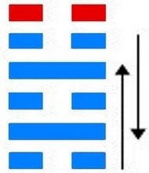
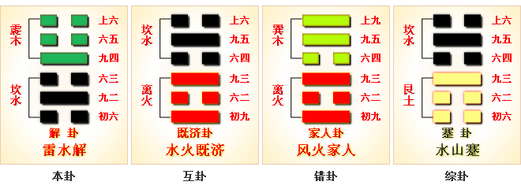

# 解 ䷧ xiè

- No.40

> 解，利西南，无所往，其來復吉。有攸往，夙吉。
>《彖》曰：解，險以動，動而免乎險，解。解，利西南，往得眾也；其來復吉，乃得中也；有攸往夙吉，往有功也。天地解而雷雨作，雷雨作而百果草木皆甲坼，解之時大矣哉。
>《象》曰：雷雨作，解。君子以赦過宥罪。

> 初六，无咎。
>《象》曰：剛柔之際，義无咎也。

> 九二，田獲三狐，得黃矢，貞吉。
>《象》曰：九二貞吉，得中道也。

> 六三，負且乘，致寇至，貞吝。
>《象》曰：負且乘，亦可醜也，自我致戎，又誰咎也。
>《繫辭》：子曰：作易者，其知盜乎！易曰：「負且乘，致寇至。」負也者，小人之事也。乘也者，君子之器也。小人而乘君子之器，盜思奪之矣。上慢下暴，盜思伐之矣。慢藏誨盜，冶容誨淫。易曰「負且乘，致寇至」，盜之招也。

> 九四，解而拇，朋至斯孚。
>《象》曰：解而拇，未當位也。

> 六五，君子維有解，吉，有孚于小人。
>《象》曰：君子有解，小人退也。

> 上六，公用射隼于高墉之上，獲之，无不利。
>《象》曰：公用射隼，以解悖也。
>《繫辭》：易曰：「公用射隼于高墉之上，獲之，无不利。」子曰：隼者禽也，弓矢者器也，射之者人也，君子藏器於身，待時而動，何不利之有。動而不括，是以出而有獲，語成器而動者也。

阴阳积气，聚散以时，内险外动，必散。《易》云：“解者，散也。”解也，品汇甲拆，雷雨交作，
> 震雷坎雨。

积气运动，天地剖判。成卦之义，在于九二，与坎为飞伏。
> 戊辰土，庚寅木。

立大夫于世为人，而六五降应，委权命于庶品。建戊寅至癸未，
> 立春大暑。

推吉凶于阴阳，定运数于岁时。积筭起癸未至壬午，周而复始。
> 土火入数起宫。

五星从位起镇星，
> 镇星土位。

氐宿从位降戊辰。
> 氐宿入戊辰。

木下见水，动而险。阴阳会散，万物通焉。升降属阳荡阴，以阳为尊。尊者高而卑者低。变六三为九三恒卦。分气候定数，极位于三十六。
> 金水入数，合卦成数，定日月时。

变坎入巽，居内象为雷风，运动鼓吹万物，谓之恒。
> 入恒卦。

# [Xiè ䷧](e8a7a3xie.md)
