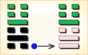
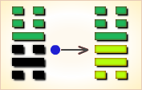
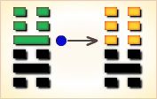
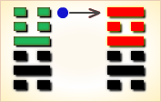

# 解 ䷧


解（xiè）卦的代号是`2:4`。主卦是`2`卦坎卦，客卦是`4`卦震卦。

解卦，雷水解，柔道致治。
解卦，阐释解除困难的法则。发生困难，就应当设法解除。

原则上，应当采用柔和平易的方法，才能得到群众的支持；而且应当快速，立即恢复平静，以免扰民。
当困难开始之初，就应当刚柔相济，顺应情势，立即解除。
应当坚持中庸正直的原则；任用得当，名实相符，不可敷衍了事，徒然增加困难。而且除恶务尽，不惜断然采取严厉的手段。

小人势消，然君子势长，才能得到正义力量的信任与支持，使困难消除于无形。

图中，红色表示当位的爻，天蓝色表示不当位的爻，箭头表示有应。

- 卦序：40

> 解，利西南，无所往，其來復吉。有攸往，夙吉。
>《彖》曰：解，險以動，動而免乎險，解。解，利西南，往得眾也；其來復吉，乃得中也；有攸往夙吉，往有功也。天地解而雷雨作，雷雨作而百果草木皆甲坼，解之時大矣哉。
>《象》曰：雷雨作，解。君子以赦過宥罪。

> 初六，无咎。
>《象》曰：剛柔之際，義无咎也。

> 九二，田獲三狐，得黃矢，貞吉。
>《象》曰：九二貞吉，得中道也。

> 六三，負且乘，致寇至，貞吝。
>《象》曰：負且乘，亦可醜也，自我致戎，又誰咎也。
>繫辭：子曰：作易者，其知盜乎！易曰：「負且乘，致寇至。」負也者，小人之事也。乘也者，君子之器也。小人而乘君子之器，盜思奪之矣。上慢下暴，盜思伐之矣。慢藏誨盜，冶容誨淫。易曰「負且乘，致寇至」，盜之招也。

> 九四，解而拇，朋至斯孚。
>《象》曰：解而拇，未當位也。

> 六五，君子維有解，吉，有孚于小人。
>《象》曰：君子有解，小人退也。

> 上六，公用射隼于高墉之上，獲之，无不利。
>《象》曰：公用射隼，以解悖也。
>《繫辭》：易曰：「公用射隼于高墉之上，獲之，无不利。」子曰：隼者禽也，弓矢者器也，射之者人也，君子藏器於身，待時而動，何不利之有。動而不括，是以出而有獲，語成器而動者也。

### 起卦

解是`2:4`卦的卦名，`2:4`是解卦的代号。
“解”（xiè 又读 jiě），把束缚着、系着的东西打开：解开。
`2:4`卦的主卦是`2`卦坎卦，卦象是水，特性是危险与困难。
客卦是`4`卦震卦，卦象是雷，特性是运动而乏力。
处于困境的主方，在客方的冲击下，困难的处境得以解脱。

起卦前必须客观地、全面地、准确地分析主方和客方的情况，必须至少符合下列条件之一，此卦才有参考价值：

1. 主方与水很相似，客方与雷很相似。
2. 主方的阳数是`2`，客方的阳数是`4`。
3. 主方的行动是阴，素质是阳，态度是阴；客方的行动、素质和态度是阳、阴和阴。

切勿用任何随机数方式起卦，否则此卦不能用作决策工具。

### 结构和卦爻辞

解卦下部的三条爻是主卦，代表主方。这三条爻都是不当位的爻，以灰色表示。
不当位指爻的阴阳属性的位置不恰当，对主方不利。这三条爻都对主方不利，说明主方的困难是主方自己造成的。

造成主方困难的主要是历史原因，按事物自身变化规律，主方已经从巽卦衰落到坎卦，经历了一段量变过程，阳数从3减少到了2，素质减弱，实力减弱，态度由强硬变到随和。困境是衰老的表现，就如同人到中年以后，要恢复青春活力是不可能的，但是，仍然可以做许多保健活动，延缓衰老。

主方现在首先能够做的是变化第一爻，就是变消极被动为积极主动。从图中看，有一个箭头从第四爻指向第一爻，表示主方消极被动，客方积极主动，这一对爻处于和谐状态。阴阳趋于和谐是事物变化的基本规律，和谐是稳定状态，主方要改变这种状态很难。不过阴中有阳，阳中有阴，主方应当关注客方的动向，能进则进，该退则退。其次，主方应当考虑第二爻，这里也有一个箭头，从第五爻指向第二爻，这一对爻也处于和谐状态，表示素质不佳的客方从主方的良好素质受益，同时，客方依赖主方，主方应当利用客方的依赖，化解自己的困难。再次，主方可以考虑变化第三爻，这条爻与第六爻不有应，没有约束，变化比较容易。不过，第三爻是对第二条的补充，态度随和是力量不足的表现，没有实力支持，维持强硬态度很难，也只能是灵活应对，能硬则硬，不能硬就软。

解卦上部的三条爻是客卦，代表客方。这是主方所处的外部环境。客卦的下爻和中爻都是不当位的爻，是造成主方困难的外部因素，这两个因素决定于客方，主方不能改变，只能恰当应对。
爻辞实际上是一首完整的围绕主题“解”的散文诗，下面是其译文：

```
（先生在）田野获得三只狐狸，得到一支黄色的箭，
（先生）骑在马上背着包，引来了强盗。
（先生）试图用拇指解开捆绑，来了可以信任的朋友，
诚恳地对待这帮小人（强盗），捆绑先生的绳索解开了。
（回到家）先生用那支黄色的箭射落在高墙上的鸟，
获得了那只鸟。
```

### 卦辞释义
```
〖原文〗利西南；
无所往，其来复吉；有攸往，夙吉。
〖译文〗对西南方向有利；
无路可走的时候，沿着来的路返回吉利；
有路可走的时候，早到吉利。
〖解说〗周文王的时候，周国在西南方，
“西南”指主方，“利西南”，形势对主方有利。
主方有素质上的优势，比如说，
主方有资金、有地位、有权力、有实力、有技术，等等，
客方需要主方的帮助，整个形势对主方有利。
主方处于消极被动状态，
而客方是积极主动地谋取和扩大自己的利益，
主方不宜盲目跟随客方，而应当见机而行。
如果往前走没有希望，就退回去，
从那里来，回到那里去，吉利；
如果往前走显然是有利的，就快点走，早点到达，吉利。
“夙”（sù），早：夙夜。“夙吉”，早到吉利。
```

### 一阴
```
〖原文〗无咎。
〖译文〗无所怪罪。
〖解说〗第一爻是主卦的下爻，
代表主方的行动，
阴，表示主方消极被动，
比如说，防守、退却、不想冒险、
不想探索或开辟新的发展领域、
只求保持现状，等等。
主方素质良好，而客方素质不佳，
客方积极图谋从主方获取利益。
主方谨慎行动，为了防止自己的利益受到损失，
采取消极被动是适当的，无所怪罪。

〖结构分析〗第一爻的位置是阳位，
这条爻是阴爻，阴爻在阳位，
不当位，不过与四阳有应。
不当位表明主方消极被动，
有可能让自己的利益受到损失，
是潜在的对主方不利的因素；
有应表明客方积极主动，
正好可以利用主方的消极被动，窃取主方的利益，
这潜在因素成了真正的对主方不利的因素。
这种不利因素是主方长期衰落造成的，
现实如此，不应当怪罪主方，所以爻辞说“无咎”。
```

### 二阳
```
〖原文〗田获三狐，得黄矢；贞吉。
〖译文〗在田野捕获三只狐狸，
得到黄色的箭；坚持下去吉利。
〖解说〗第二爻是主卦的中爻，
代表主方的素质，阳，表示主方素质良好，比如说，
主方有资金、有地位、有权力、有实力、有技术，等等。
广阔的田野象征主客双方关系，
三只狐狸象征主方从双方关系中获得的利益。
主方依靠素质的优势从积极行动的客方获得方便，
“得黄矢”，从而获得三只狐狸。
以这样的方式对待客方是正确的，坚持下去对主方吉利。

〖结构分析〗第二爻的位置是阴位，
这条爻是阳爻，阳爻在阴位，
不当位，不过与五阴有应。
不当位表明主方素质良好，
有可能受到客方损害，
是潜在的对主方不利的因素；
有应表明客方素质不佳，
正好可以从主方的良好素质取得补益，
这潜在因素成了真正的对主方不利的因素。
从另一个角度看，主方可以依靠自己的良好素质，
让客方依赖主方，保持安定环境，所以爻辞说“贞吉”。
```

### 三阴
```
〖原文〗负且乘，致寇至；贞吝。
〖译文〗背负着包袱乘马，
招致强盗来；坚持下去有困难。
〖解说〗第三爻是主卦的上爻，
代表主方的态度，阴，表示主方态度随和。
主方像是背负着包袱乘马，
结果招致像客方这样的行动积极的强盗来；
坚持下去主方会吃亏的。

〖结构分析〗第三爻的位置是阳位，
这条爻是阴爻，阴爻在阳位，
不当位，不过和六阴不有应。
不当位表明主方态度随和，
有可能受到客方制约，
是潜在的对主方不利的因素；
不有应表明客方的态度也随和，
不求制约主方，
这潜在因素没有成为真正的对主方不利的因素。
由于这种不利的潜在因素存在，
如果继续下去，有可能对主方真地不利，
所以爻辞说“贞吝”。
```

### 四阳
```
〖原文〗解而拇，朋至斯孚。
〖译文〗像解开被绑的拇指一般摆脱纠缠，
朋友来了，感受到他的真诚。
〖解说〗第四爻代表客方的行动，
阳，表示客方积极主动地谋取和扩大自己的利益，
比如说，创新、创业、投资、进攻、求职、示爱，等等。
朋友指客方。斯孚指客方的信任。
客方的积极主动解决了主方的困难，
客方帮助主方是出于对主方的信任。
主方需要保持对客方诚恳，以取得客方的信任。

〖结构分析〗第四爻的位置是阴位，
这条爻是阳爻，阳爻在阴位，
不当位，并且与一阴有应。
不当位表明客方积极主动谋求发展，
有可能损害主方利益，是潜在的对主方不利的因素；
有应表明主方消极被动，是客方发展的好机会，
这潜在因素成了真正的对主方不利的因素。
另一方面，客方的积极主动有可能帮助主方化解困难，
所以爻辞中没有判断词。
```

### 五阴
```
〖原文〗君子维有解，吉，有孚于小人。
〖译文〗先生的困难被化解，吉利，受到普通人的信任。
〖解说〗第五爻是客卦的中爻，
代表客方的素质，阴，表示客方素质不佳，比如说，
资金缺乏、地位底下、实力薄弱、教育程度低，等等。
主方的素质良好，君子指主方。
客方的素质不佳，小人指客方。
主方以良好的素质帮助客方，取得了客方的信任，
从而，客方帮助主方，解决了主方的困境。
“维”（wéi），拴，系：絷之维之，以永今朝。

〖结构分析〗第五爻的位置是阳位，
这条爻是阴爻，阴爻在阳位，
不当位，不过与二阳有应。
不当位表明客方素质不佳，有可能寻求从主方得到补益，
是潜在的对主方不利的因素；
有应表明客方正好可以从素质良好的主方取得补益，
这不利因素成了真正的对主方不利的因素。
换一个角度考虑，由于主方给予客方所需要的补益，
主方得到客方信任，客方帮助主方度过困难时期，
对主方非常有利，所以爻辞说“吉”。
```

### 六阴
```
〖原文〗公用射隼于高墉之上，获之，无不利。
〖译文〗先生射中在高墙上的鸟，获取它，没有不利的。
〖解说〗第六爻是客卦的上爻，
代表客方的态度，阴，表示客方态度随和。
同时，第六爻是对第五条的补充，
第五条是阴，第六条也是阴，这表示客方的素质很差。
客方的阴的态度给了主方机会，主方应当抓住机会取利。
主方的素质良好，公指主方。客方积极主动，如飞鸟。
如果主方的态度强硬起来，趁客方态度随和之机，
客方就如同落在高墙上的鸟，给了主方获利的机会。
机会来了，主方要积极主动、态度强硬地抓住机会。
“隼”（sǔn），鸟类的一科，翅膀窄而尖，
上嘴呈钩曲状，背青黑色，尾尖白色，腹部黄色。
饲养驯熟后，可以帮助打猎。亦称“鹘”。
“墉”（yōng），城墙：墉垣。

〖结构分析〗第六爻的位置是阴位，
这条爻是阴爻，阴爻在阴位，
当位，然而与三阴不有应。
当位表明客方态度随和，
有可能被主方制约，
是潜在的对主方有利的因素；
不有应表明主方的态度也随和，
主方不求制约客方，
这潜在因素没有成为真正的对主方有利的因素。
由于这个潜在的有利因素存在，
如果主方利用此机会制约客方，
没有什么不利，所以爻辞说“无不利”。
```

### 另解
```
解①：利西南，无所往，其来复，吉；有攸往，宿②，吉。
【注释】
①解：卦名，有判决、和解、缓解、分解、辨释等意义。
②宿：止。通行本作“夙”。
【白话】利于西南方，没有前进，而返回原地，则吉善；
有所前进，又能停止前进，也会吉善。
【讲解】按照《彖传》的解释，
解卦的卦德由下卦坎卦危险的性质与震卦运动的性质构成。
动而能够走出困境是解除危险的象征，所以卦名叫作解。
卦辞“解利西南”指的是走出困境的方向即西南方坤（川）卦之位。
坤为众，九四爻进入坤体，得众心之归。
卦辞“其来复，吉”指九二爻在内卦得中。
卦辞“有攸往，宿，吉”指九二在内卦得中，
用适中平衡原理走出了困境取得了成功。

初六：无咎。
【白话】没有灾难。
【讲解】王弼说：“解者，解也。
屯难盘结，于是乎解也。
处蹇难始解之初，在刚柔始散之际，将赦罪厄，以夷其险。
处此之时，不烦于位而无咎也。”

九二：田①获三狐，得黄矢②，贞吉。
【注释】
①田：假借为畋，打猎。
②黄矢：铜箭头。
【白话】打猎获三只狐狸，
使用金属制造的箭头射中的，贞问吉善。
【讲解】九二得中道，与六五阴阳相应，所以贞问吉善。

六三：负且乘，致寇至，贞閵①。
【注释】①閵：假借为“吝”。
【白话】带着许多货物，背的背，拉的拉，
引人瞩目，结果招来了强盗，贞问艰吝。
【讲解】六三阴柔之爻处于阳刚之位，
是处非得位，
履非得正，以附于九四阳刚，
乘九二阳刚负九四阳刚以容其柔弱之身，
所以有“致寇至，贞閵”这样的占语。

九四：解其栂①，傰②至此复③。
【注释】
①栂：假借为“拇”，大拇指。
②傰：假借为“朋”，朋贝。
③复：信诚。
【白话】放开手脚，赚大钱全靠守信用。
【讲解】九四阳刚之爻居于阴柔之位，
是不当位之象，失位不正，而比于六三，
所以六三爻得以附于此爻，为九四之栂。
九四爻与初六爻阴阳相应，故有“傰至此复”之象。

六五：君子唯①有解，吉，有复于小人。
【注释】①唯，通行本作“维”。唯、维，古通用。
【白话】有道德的人只有和解才能吉善，又能守信用于小人。
【讲解】六五阴柔之爻居尊履中，
而与九二阳刚相应，可以解难释险而获吉善。
用君子之道去感化折服小人，是统治者的重要统治方法之一。

尚六：公用射敻①于高庸之上，获之无不利。
【注释】①敻：读为“隼”。隼：猛禽类鸟，形状似鹰。
【白话】公在高高的城楼上把鹰射中了，没有什么不好的。
【讲解】解卦初六爻与九四爻阴阳相应，
九二爻与六五爻阴阳相应，
尚六与六三阴爻与阴爻相敌。
六三失位负乘，处下体之上，尚六居动体之上，
为解卦的终极点，将解除一切秽乱，所以用射之。
王弼说：“极而后动，成而后举，故必获之，而无不利也。”
```

### 雷水解 柔道致治 中上卦《象》曰：目下月令如过关，千辛万苦受熬煎，时来恰相有人救，任意所为不相干。

解：利西南，无所往，其来复吉。有攸往，夙吉。 （夙，音：sù 宿）

上震下坎，卦名称作“雷水解”。解卦，是与蹇卦形象上下相反的综卦，困难必须解除，但解除后又容易耽于安乐，产生困难，难与解相反相成。“序卦传”说：“物不可以终难，故受之以解；解者缓也。”意思是事物不可能一味险难到终了，所以在表示险难的蹇卦之后接着是解卦。意思是险难缓解。

这一卦，内卦“坎”是险，外卦“震”是动，行动走出困难之外，使困难解除；所以，命名为“解”。

```
解卦来自升卦，升卦的“三”与“四”交换，就成为解卦。
升卦的上卦“坤”，方位在西南，
九三升入西南的“坤”，成为困难解除的解卦；
所以说西南有利。亦即，解除困难，应当用柔。
又，西南的“坤”是地，大地平坦宁静；
当艰难解除之后，就应当一切简易宁静，
与民休息，不可再繁琐扰民，才有利。
当困难解除之后，不宜再有任何行动，
应当回到原来的地方休息，才会吉祥。
解除困难，应当立即迅速解决，
不可使纷扰延续久，才会吉祥。

解，利西南，其来复吉。有攸往，夙吉。
解卦，有利于西南方。无所前往，返回来吉祥。
有所前往，提前一些吉祥。
彖曰：解，险以动，动而免乎险，解。
解利西南，往得众也。无所往，其来复吉，乃得中也。
有攸往夙吉，往有功也。
天地解而雷雨作，雷雨作而百果草木皆甲坼。
解之时大矣哉！

解卦，有险难而动，动而脱离险难，解脱。
解卦西南方有利，前往可以得到群众。
无所前往，返回来吉祥，即可得到中位。
有所前往提前一些吉祥，是前往会有成功。
天地开解就会发生雷雨，
雷雨发生百果草木都破壳而出，解的时势太重大了！
《象》曰：雷雨作，解。君子以赦过有罪。
雷雨发生就是解卦。
君子从中得到启示，要赦免原宥有罪过的人。

初六：无咎。
《象》曰：刚柔之际，义无咎也。
“义”在此当宜解。
这一爻是解除困难的时刻，
“初六”柔爻，在最下方，
柔顺，位置不显著，所以安全。
而且，“初六”与上卦的“九四”，
阴阳相应，虽然不会大吉，也没九灾难。
“象传”说：
在“初六”与“九四”刚柔相应的状况下，应当不会有灾难。
这一爻，说明当困难开始之初，就应当迅速解除。

九二：田获三狐，得黄矢，贞吉。
《象》曰：九二贞吉，得中道也。
“黄矢”是黄金箭头的箭。
狐是迷惑使人中邪的动物，象征小人。
这一卦有四个阴爻，除了在君位的“六五”之外，
还有三个阴爻，所以说三狐。
“九二”阳爻在内卦的中位，因而中庸，
又与君位的“六五”相应，得到信任，
能够驱逐迷惑君主的小人，所以说猎获三只狐。
射狐如果被逃走，就会损失黄金的箭，
但射中猎获，就会得回箭。
“黄”是地的颜色，在木火土金水的五行中，
是中央颜色；箭是直的；
象征在驱逐小人时，须用中庸、正直的方法。
驱逐小人，是为了使正义伸张，须坚守正道，才会吉祥。
这一爻，说明解除困难，须把握中庸、正直的原则。

六三：负且乘，致寇至，贞吝。
《象》曰：负且乘，亦可丑也，自我致戎，又谁咎也。
“系辞传”对这一爻的说明：
“背负物件，是卑残小人的工作，车是贵人乘坐的器物。
卑残的小人，乘坐贵人用的车辆，强盗就想夺取了。”
“六三”是阴爻，象征小人却位于下卦的最高位，
而且阴爻阳位不正，品德与地位不相称，
必然会招致想盗取这一地位的人出现。
就是坚守正道，也难以免羞。
“象传”说：乘坐超越自己身分的车辆，不也惭愧。
自己招来强盗，又会是谁的过失呢？
后世用“负乘”形容地位与身份不相称的人，
就是出自这一爻辞。
这一爻，说明解除困难，名实必须相符。

九四：解而拇，朋至斯孚。
《象》曰：解而拇，未当位也。
“解”的原义，是用刀将牛角切离。
“而”与尔通用，是你的意思，指“九四”。
“拇”是大脚趾，指在最下方的“初六”，
“初六”与“九四”相应，
又在最下方，所以说你的大脚趾。
“九四”与“初六”，位都不正；亦即，以不正相应。
不过，“九四”是阳爻，象征君子；
“初六”是阴爻，象征小人；
虽然相应，却不能成为同志。
“九四”断然将“初六”切除，朋友才会到来，对自己产生信心。
亦即，切断与小人的关系，才会得到君子的信任。
“象传”说：这是由于位置不正的缘故。
因为“九四”应当得正却不正，含有惋惜的意思。
这一爻，说明除恶务尽，才能得到君子的信任与支持。

六五：君子维有解，吉；有孚于小人。
《象》曰：君子有解，小人退也。
“维”是惟，思的意思。“孚”是信，有验证的含义。
这一卦，有四个阴爻，阴爻代表小人，
其中祇有“六五”在君位，是君子；
但容易与其他三个阴爻的小人混淆。
君子应当祇与君子交往，必须远离小人，结果才会吉祥；
所以，君子在思考是否已经切断不良的交往时，
应当以小人是否已经退去来验证。
这一爻，说明君子势长，小人必然势消。

上六：公用射隼，于高墉之上，获之，无不利。
《象》曰：公用射隼，以解悖也。
隼是猎物，弓箭是打猎是工具，是人在射。
君子将猎具，藏在身上，
等待时机行动，怎么会不利呢？
“上六”是这一卦的最高位，
但不如“五”的君位，所以称公，公爵的意思。
“隼”是恶鸟，象征小人，指“六三”。
“高墉”是高的土墻，指“上六”在最高位。
这一爻，是解卦的终结的一爻，必然一切困难都已经解除。
“上六”对贪想高位，不相应的小人“六三”，
在他飞上来的时候，就像站在高墻上射隼般，
将其射落，不会有不利。

“悖”是叛乱。“象传”说：公爵将隼射落，以解决叛乱。
这一爻，说明对邪恶应采取断然手段。
```

解卦，阐释解除困难的法则。发生困难，就应当设法解除。原则上，应当采用柔和平易的方法，才能得到群众的支持；而且应当快速，立即恢复平静，以免扰民。当困难开始之初，就应当刚柔相济，顺应情势，立即解除。应当坚持中庸正直的原则；任用得当，名实相符，不可敷衍了事，徒然增加困难。而且除恶务尽，不惜断然采取严厉的手段。小人势消，然君子势长，才能得到正义力量的信任与支持，使困难消除于无形。

上震下坎，中存坎离，雷声一发而雨作，日方欲明，内外皆陷，使阴阳相搏，水泽通行，沾濡万物，故曰险以能动，动而免险，君子得之，则为患难解散之象。

解者散也，卦中缺父母，以震卦初爻子水父母，伏于本卦初爻寅木之下，寅木是飞神，子水是伏神，水生木谓之伏去生飞，名曰泄气。

### 新解
```
解①：利西南。无所往，
其来复，吉。有攸往， 夙吉②。
初六：无咎。
九二：田获三狐，得黄矢③。贞吉。
六三：负且乘，致寇至。贞吝。
九四：解而拇④，朋至斯罕⑤。
六五：，君子维有解⑥，吉。有翠于小人⑦。
上六：公用射隼于高墉之上⑧，获之，无不利。

①解是本卦的标题。解的意思是分解，解除。
全卦内容主要讲商旅、狩猎和俘虏。
标题的“解”字为卦中多见词。
②夙：早。
③黄矢：铜箭头。
④解：用作“懈”，意思是懈怠。
拇：脚大拇趾，这里代指脚。
解而拇：意思是说不想走路。
⑤朋至：获得朋贝，赚了钱。斯：则。
⑥维：系，束缚。有：又。解：解开，松开。
⑦罕：惩罚。
⑧公：这 里指贵族。隼（sǔn）：鹰。墉：城墙。

【译文】
解卦：往西南方走有利。
如果没有明确的目的地，不如返回来，吉利。
如目的明确，早去吉利。
初六：没有灾祸。
九二：田猎获得三只狐狸，
身上带着铜箭头。占得吉兆。
六三：带着许多货物，背负马拉，
惹人汪目，结果强盗来了。占得险兆。
九四：赚了钱而懈怠不想走，却被人抓去。
六五：君子彼捆起后又被解开，吉利。
小人将受到惩罚。
上六：王公贵族在高高的城墙上射中一只鹰，
并抓住了。
这没有什么不吉利。
```


解卦震上坎下，为震宫二世卦。震为动，坎为险，遇险而动，为即将脱险走出困境之兆，因此多主吉。

艰难化散，排难解纷；把握时机，趁早进行。得此卦者，能解脱先前之困难，宜把握良机，求谋事业，出外谋事者更佳。

- 时运：灾难已解，声名大起。
- 财运：天时地利，人和为贵。
- 家宅：祈祷解厄；婚姻吉祥。
- 身体：药到病除。

```
这个卦是异卦，下坎上震，相叠。
震为雷、为动；坎为水、为险。
险在内，动在外。
严冬天地闭塞，静极而动。
万象更新，冬去春来，一切消除，是为解。

《象传》：春雷大作，大地解冻，喻冬去春来生机再现。
```

运势：宜把握良机，快速处理身边困境，更宜出外求谋，因贵人在远方，以西南为吉方。

- 事业：元气初复，宜休养生息，安静平易为佳，宜宽宜和。当准备就绪则应立即行动，争取主动，不可拖廷，所往必有功利，但切勿贪得无厌。克勤克俭，刚柔相济，以柔为主。远避小人，团结君子，相互依托，共成事业。
- 经商：行动贵神速，积极而为，方可摆脱险境。行商宜循正道，切勿招摇过市，此乃愚蠢行动，必自招灾祸。
- 求名：初出茅庐，应继续充实自己。待机行动。尤应远小人，近君子和有才德的人，以期迅速提高自己。
- 婚恋：应适时进行。夫妻和衷共济，可家庭和睦，免除灾难。
- 决策：稳妥为宜，亦不应冒险，因一切尚在元气初复阶段。为争取大发展，务必宽以待人，以柔致治，广交贤者，遣散小人，以中庸、正直的方式，张驰结合的手段，开拓方兴未艾的事业。

```
解：表示解决之象，
先苦后甜之象，冬雪春化之意。
冰冻三尺非一日之寒，
事出有因、但已是到该解决的尽头了！
只是化解之日还很长，要抓住重点方向，
好好努力坚持下去，还是有可能再成功的。

解释：解冻。

特性：耐性差，爱变化，
喜热闹场合，多学不精，
思想兴趣不稳定，易受外界影响。
一生多为他人排解事务，自己却少有他人之助。
```

运势：顺势而行，速把握良机、坚持努力，快速处理可成。贵人在远方，有助，宜出外营谋。大运在西南。

- 家运：初有困难，但难关已过。开花结实之兆。
- 疾病：久病可治愈，注意肝、肾、足疾。
- 胎孕：孕安。
- 子女：初时因子女牵累而劳苦，但其子女越长运越好，故苦后得甘，已可得到幸福。
- 周转：速进行可成，延迟不利。
- 买卖：即速交易，可名利双收。
- 等人：一定来。
- 寻人：北方寻之可见。
- 失物：遗失之物似有被支解破坏的可能，故寻回的机会不大。
- 外出：一旦准备充分，立即行动，捷足先登必有所获。
- 考试：题榜在望。
- 诉讼：一般纠纷皆可解决，宜当机立断，不可拖延。
- 求事：有贵人相助。
- 改行：速改有利。
- 开业：开业者有很大的展望。

### 初六：无咎。《象》曰：刚柔之际，义无咎也。

筮遇此爻，没有灾难。《象传》说：初六与九二相接，为刚柔相应之象，喻君臣、夫妻和衷共济，其义自无灾难。

平：得此爻者，经营者吉，未婚者配。做官的德位相称，晋升有望，读书人会取得好成绩。

- 时运：困难初解，不可妄动。
- 财运：没有损失，即是幸事。
- 家宅：平安度日。
- 身体：一切无恙。



初六爻动变得[第54卦：雷泽归妹](e5bd92e5a6b9guimei_cn.md)。

这个卦是异卦，下兑上震，相叠。震为动、为长男；兑为悦、为少女。以少女从长男，产生爱慕之情，有婚姻之动，有嫁女之象，故称归妹。

### 九二。田获三狐，得黄矢，贞吉。《象》曰：九二贞吉，得中道也。

畋猎获得三只狐狸，猎物身上带着铜箭头。卜问得吉兆。《象传》说：九二爻辞讲的卜问得吉兆，因为九二之爻居下卦中位，像其人行事遵循正道。

吉：得此爻者，正当好运，财利可获。做官的会荣华富贵，读书人会取得佳绩。

- 时运：避邪归正，功名有望。
- 财运：努力经营，可得厚利。
- 家宅：防范作祟；得到正室。
- 身体：防有邪念邪病。


九二爻动变得[第16卦：雷地豫](e8b1abyu_cn.md)。

这个卦是异卦，下坤上震，相叠。坤为地，为顺；震为雷，为动。雷依时出，预示大地回春。因顺而动，和乐之源。此卦与谦卦互为综卦，交互作用。

### 六三：负且乘，致寇至，贞吝。《象》曰：负且乘，亦可丑也；自我致戎，又谁咎也。

带着许多财物，又是背负，又是车拉，招摇惹盗，自然招致盗寇抢劫，卜问有灾祸之象。《象传》说：带着许多财物，又是背负，又是车拉，招摇惹盗，这是愚蠢可耻之事，由于自己慢藏诲盗，招致盗寇，又能谴责谁呢？

凶：得此爻者，须防窃盗，是非诉讼。做官的谨防被贬之忧。

- 时运：素行不端，自取其辱。
- 财运：小心防盗，以免损失。
- 家宅：盗窃难防；富而不仁。
- 身体：乱服成药，自找麻烦。

### 六三变卦：雷水解 变卦 雷风恒



六三爻动变得[第32卦：雷风恒](e68192heng_cn.md)。

这个卦是异卦，下巽上震，相叠。震为男、为雷；巽为女、为风。震刚在上，巽柔在下。刚上柔下，造化有常，相互助长。阴阳相应，常情，故称为恒。

### 九四：解而拇，朋至斯孚。《象》曰：解而拇，未当位也。

赚了钱，而懒怠不想走，结果被人虏去。《象传》说：懒怠不想动，说明其人怠于职守，不称其位。

凶：得此爻者，须防小人，或有交友不慎之祸。

- 时运：因人成事，才有机会。
- 财运：获利不多，朋友交心。
- 家宅：不易安居；有力媒人。
- 身体：慢跑健身。



九四爻动变得[第7卦：地水师](e5b888shi_cn.md)。

这个卦是异卦，下坎上坤，相叠。“师”指军队。坎为水、为险；坤为地、为顺，喻寓兵于农。兵凶战危，用兵乃圣人不得已而为之，但它可以顺利无阻碍地解决矛盾，因为顺乎形势，师出有名，故能化凶为吉。

### 六五：君子维有解，吉，有孚于小人。《象》曰：君子有解，小人退也。

君子被拘囚后又获释，吉利；小人则将受罚。《象传》说：君子解除了小人的职务，说明小人被摒退。

吉：得此爻者，正当好运，君子有利，病者愈。做官的会身居要职。

- 时运：正运亨通，君子有利。
- 财运：自然作去，就有利润。
- 家宅：福宅可居；婚姻吉祥。
- 身体：恢复正气。


六五爻动变得[第47卦：泽水困](e59bb0kun_cn.md)。

这个卦是异卦，下坎上兑，相叠。兑为阴为泽喻悦；坎为阳为水喻险。泽水困，陷入困境，才智难以施展，仍坚守正道，自得其乐，必可成事，摆脱困境。

### 上六。公用射隼，于高墉之上，获之无不利。《象》曰：公用射隼，以解悖也。

在高高的城墙上，王公射中一只鹰，并且抓到了，这没有什么不吉利的。《象传》说：王公射鹰，意在除强去暴。

吉：得此爻者，运途顺利，多营谋获利。做官的闲职者会复职，居要位。

- 时运：运途顺利，须防小寇。
- 财运：谨慎防范，有利无损。
- 家宅：防备窃盗。
- 身体：户外运动。



上六爻动变得[第64卦：火水未济](e69caae6b58eweiji_cn.md)。

这个卦是异卦，下坎上离，相叠。离为火，坎为水。火上水下，火势压倒水势，救火大功未成，故称未济。《周易》以乾坤二卦为始，以既济、未济二卦为终，充分反映了变化发展的思想。

# [Xiè ䷧](e8a7a3xie.md)
