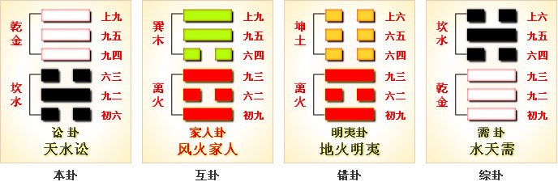

# 讼 ䷅


讼（sòng）卦 是上卦为乾，下卦为坎的卦名。代号是`2:7`。

“讼”，在法庭上争辨是非曲直，打官司：讼事。

讼卦的主卦是`2`卦坎卦，卦象是水，阳数是`2`，特性是危险和困难；客卦是`7`卦乾卦，卦象是天，阳数是`7`，特性是强健。
处境困难的主方在威力强大的客方面前，受到客方的强力限制和压迫，不得已时只好求之于诉讼，寻求法律保护。

图中，红色是当位的爻，天蓝色是不当位的爻，箭头表示有应。

讼卦，天水讼，慎争戒讼。《象》曰：心中有事事难做，恰是二人争路走，雨下俱是要占先，谁肯让谁走一步。 
这个卦是异卦，下坎上乾，相叠。同需卦卦爻排布相反，互为“综卦”。乾为刚健，坎为险陷。
刚与险，健与险，彼此反对，定生争讼。争讼非善事，务必慎重戒惧。

- 卦序：6

> 訟，有孚窒惕，中吉，終凶。利見大人，不利涉大川。
>《彖》曰：訟，上剛下險，險而健，訟。訟有孚窒惕中吉，剛來而得中也。終凶，訟不可成也。利見大人，尚中正也。不利涉大川，入于淵也。
>《象》曰：天與水違行，訟。君子以作事謀始。

> 初六，不永所事，小有言，終吉。
>《象》曰：不永所事，訟不可長也。雖小有言，其辯明也。

> 九二，不克訟，歸而逋其邑，人三百戶，无眚。
>《象》曰：不克訟，歸逋，竄也。自下訟上，患至掇也。

> 六三，食舊德，貞厲，終吉。或從王事，无成。
>《象》曰：食舊德，從上吉也。

> 九四，不克訟，復即命渝，安貞吉。
>《象》曰：復即命渝，安貞不失也。

> 九五，訟，元吉。
>《象》曰：訟元吉，以中正也。

> 上九，或錫之鞶帶，終朝三褫之。
>《象》曰：以訟受服，亦不足敬也。

### 简介

天水讼。乾为天，坎为水，天西转与水东流背向而行，像人与人不和而争辩争论，含诉讼之义。
当不易和解时，便会导致诉讼。应该找有大德大才的人进行决断，不要逞强冒险。

此卦的卦名为讼。《说文》中对讼的解释是：“讼，争也。”便是说讼就是争讼、争斗的意思。
前面的蒙卦处于事物的生长期，生长期需要饮食营养，万物都想得到更多的饮食营养，于是便发生了争夺，诚信的原则便失去了。
怎么解决这个问题，只有进行诉讼了。讼卦的卦画与需卦的卦画相似，都是两个阴爻四个阳爻，只是排列顺序正好相反。古人称这种现象为“相覆”，就是 颠倒过来的意思。《周易》中的八卦排列往往是非覆即变，这是《周易》中八卦的排列规律。

讼卦上卦象为乾为天为阳，其性质向上，下卦为坎为水其性质向下，两卦同性相斥，并且天往上升，水往下流，目标相违背，这便是讼卦的卦象。这就好比人们各自怀着私心，都为自已的利益着想，思想不能统一起来。所以人们在争夺利益的同时，便会引发争斗，到头来只有通过诉讼进行解决了。

### 白话解释

化解纠纷；能够让自己建立威信，但要提高警觉尽量避免纠纷的发生。
保持不偏不倚的态度去处理，就不会有差错，但最终还是一个两败俱伤的事情。经常调解纠纷对一个人的成长有促进作用，但对事业的发展是不利的。

1. 为了获取更多的猎物，自己经常做一些超越常理的事情（不永所事），招致大家的议论（小有言），最终大家对此类事情采用了听之任之的态度；
2. 在与其他部落的纠纷中调解不成功（不克讼），赶紧跑回部落躲藏起来（归而逋），有那么多部落民众的支持，他们最终拿你也没有办法（其邑人三百户，无眚）；
3. 发生纠纷后仰仗自己以往的功绩和贡献（食旧德）化解了问题，倘若依赖本部落首领则一事无成（无成）。
4. 倘若自己败诉，那就认罚，主动给对方以物质赔偿（复即命），这样才能够让自己今后的生活与工作平安、顺利（安贞吉）；
5. 自己改正了缺点，而且还结交了一些有能力的朋友，这样很多纠纷就消除在萌芽状态，大事化小的得以妥善解决（讼，元吉）；
6. 上面的领导经常授权你处理民众之间的纠纷，这种荣誉授命于危难（或锡之鞶带），过后会很快的把这种特权剥夺掉（终朝三褫之）。

### 结构和卦爻辞

图中，主卦的三条爻全是天蓝色，表示这三条爻都不当位，表示主方的行动、素质和态度都是对主方不利的潜在因素，主方的困难和危险来于主方本身。
图中，有两个从阴爻指向阳爻的箭头，表示在行动方面和态度方面都存在主方与客方之间的和谐关系，不过，由于箭头的起点都在主方，这两种和谐关系使得在行动上和态度上对主方不利的潜在因素成了真正的对主方不利的因素。卦的结构图中，有一条红色的爻，这是唯一的一条当位的爻，是第五爻，代表客方素质，是对主方有利的潜在因素，然而，这条爻不有应，对应的第二爻也是不当位的阳爻，这个对主方有利的潜在因素没有能够成为真正的对主方有利的因素。因此可以说，当前形势对于主方来说，是不利的，主方应当努力扭转被动局面，并且，采取对客方比较强硬的态度。

不过，主方的消极被动是衰落的表现。按阳数，事物自身发展规律是4、5、6、7、3、2、1和0，主卦的阳数是2，已经从乾卦，越过一个量变到质变的关键点，衰落到巽卦，再衰落到坎卦，要扭转被动局面很难，需要很大的决心和付出，比较现实的作法是阴中有阳，在可能情况下，采取主动，维护自己的利益。同时，采取比较强硬的态度,也是有限的，因为态度随和是素质不是很好的表现，没有很强的素质支持，强硬态度难维持，所以，也只能是灵活应对，态度能够强硬一些，就强硬一些，不行就继续随和。

讼卦的六条爻辞中有三条包含“讼”字，第二爻的“讼”，指主方被客方所讼；第四爻和第五爻的“讼”，是主方对客方的讼。前三条爻辞，建议主方尽量避免被诉讼，“不永所事”；不能赢得诉讼时，应当给予客方适当赔偿，“不克讼，归而逋”；困境中坚持下去，“食旧德”。后三条爻辞建议主方应当对客方采用诉讼手段，不能赢，则退，“不克讼，复即命”；能赢则吉，“讼，元吉”；不要过于相信客方，“终朝三褫之”。删去一些判断词，六条爻辞就是一首完整的围绕主题“讼”的散文诗。

```
不要纠缠于诉讼之事，
即使有流言蜚语，最终还是有利。
诉讼中不赢，归来后隐藏起来，
给以城镇里三百户人口的税收，避免灾难。
依靠过去的成就过日子，坚持不下去；
如果从事于政府事务，不会成功。
诉讼不赢，返回遵从王命，
改变一些（态度），维持安定生活。
（不得已）诉讼，很吉利。
有时（他）赐给佩玉皮带，
又一天之内三次夺了回去，（忍耐些吧）。
```

卦辞则提出在当前的双方关系中主方应当采取的作法。

## 卦辞
```
〖原文〗有孚窒惕，中吉，终凶。
利见大人，不利涉大川。
〖译文〗有诚信，恐惧，中期吉利，终了凶险。
利于表现为大人物，不利涉越大河大川。
〖解说〗主方消极被动，顺从客方，
诚恳地对待客方，这是“有孚”。
主方惧怕客方的巨大威力，“窒惕”。
由于主方顺从客方，在中期，
与强大的客方协作，对于主方吉利。
然而，客方总是寻求自己的利益，主方在终了时有凶险。
主方不应当过分谦虚，应当依靠自己的良好素质，表现得像个大人物，
不过，毕竟客方比主方强大得多，主方不宜冒险，“不利涉大川”。
“窒”，通“恎”。“恎”（dié），凶狠。“窒惕”（zhì tì），恐惧。
```

### 初六
```
〖原文〗不永所事，小有言，终吉。
〖译文〗不要纠缠于诉讼之事，
有些流言蜚语，终了吉利。
〖解说〗第一爻是主卦下爻，
代表主方行动，阴表示主方消极被动，
比如说，防守、退却、不想冒险、
不想探索或开辟新的发展领域、只求保持现状，等等。
在与客方有冲突的时候，不要纠缠于诉讼之事，
即使有流言蜚语，最终对主方有利。

〖结构分析〗第一爻位置是阳位，
这条爻是阴爻，阴爻在阳位，不当位，不过与四阳有应。
不当位表明主方没有积极主动地保护自己的利益，
这是对主方不利的潜在因素；
有应表示主方的消极被动正好适应了客方的积极主动，
这不利的潜在因素成了真正的对主方不利因素。
在这明显不利形势下，主方应当有所变化。
如果直接变为主动，此爻将由阴爻变成阳爻，不当位变成当位，
这只是创造了潜在的有利因素，由于和第四爻不有应，
这种有利的潜在因素并不是真正的有利因素。
主方应当冷静观察事态发展，不要理会流言蜚语，
在客方表现出被动状态时，再采取主动，
那么，此爻将是既当位又有应，
将出现对主方真正有利的因素，于是，“终吉”。
```

### 九二
```
〖原文〗不克讼，归而逋，其邑人三百户。无眚。
〖译文〗诉讼中不赢，归来而隐藏，
给以其城镇里三百户人口的税收。没有灾难。
〖解说〗第二爻是主卦中爻，
代表主方素质，阳，表示主方素质良好，比如说，
主方有资金、有地位、有权力、有实力、有技术，等等。
然而客方的素质也良好，客方远比主方更强有力，
主方不能赢客方，只得躲避客方攻击，“不克讼，归而逋”。
为了保护自己，主方不得不与客方妥协，
就如同古时候周文王与纣王妥协。
那时，周文王被纣王关押七年，
为了保存周文王自己的力量，
献了大量礼物给纣王，周文王被释放，
而后，周文王回到周国，给于纣王三百户人家的税收。
主方与客方作适当妥协，主方就没有灾难。
“逋”（bū），逃亡，逋逃。
“眚”（shěng），灾难，疾苦：灾眚。

〖结构分析〗第二爻位置是阴位，
这条爻是阳爻，阳爻在阴位，
不当位，并且与五阳不有应。
不当位，表示主方的良好素质可能受到客方损害，
是对主方不利的潜在因素；
不有应，这种对主方不利的潜在因素，
并没有成为真正的对主方不利的因素，
主方可以用自己的良好素质，维持自己的利益，
在对自己不利情况下，作出适当牺牲，以保护自己，
“不克讼，归而逋，其邑人三百户”，使自己免受伤害，“无眚”。
```

### 六三
```
〖原文〗食旧德，贞厉，终吉；或从王事，无成。
〖译文〗依靠过去的成就过日子，坚持下去很难，终了吉利；
如果从事于政府事务，不成功。
〖解说〗第三爻是主卦上爻，
代表主方态度，阴，表示主方态度随和。
而同时，客方态度强硬，
当主方受控于客方的时候，尽管主方对客方谦让，
客方仍然要求主方多作贡献，主方“食旧德，贞厉”。
如果主方结束依靠过去的成就过日子，
主方的情况会好转，“终吉”。
当前，如果主方为客方服务，不会有成功。
“王”指客方，客方以7卦乾卦代表。

〖结构分析〗第三爻位置是阳位，
这条爻是阴爻，阴爻在阳位，不当位，不过，与六阳有应。
不当位，表示主方对客方随和的态度是对主方不利的潜在因素；
有应，表明这种潜在因素已经成了真正对主方不利的因素，
主方受客方压抑。在这种情况下，如果主方改变态度，
强硬起来，这样，这第三爻就变成阳爻，
是对主方潜在的有利因素，然而，第六爻仍然是阳爻，
第三爻与第六爻不有应，
这潜在的有利因素不能成为真正的对主方的有利因素，
因此，依仗自己的素质良好吃老本，很难，“食旧德，贞厉”。
主方应当冷静地观察客方的变化，
经过一段时间，客方一旦表现软弱，就立即采取强硬态度，
那么，第三爻将是既当位又有应，
成为真正对主方有利的因素，“终吉”。
第三爻不当位而有应是此卦的一般情况，
主方不能指望依靠客方，“或从王事，无成”。
```

### 九四
```
〖原文〗不克讼，复即命；渝，安贞吉。
〖译文〗诉讼不赢，返回遵从王命；
作出改变，坚持安定的生活吉利。
〖解说〗第四爻是客卦下爻，
代表客方行动，阳，
表示客方积极主动地谋取和扩大自己的利益，比如说，
创新、创业、投资、进攻、求职、示爱，等等。
积极主动的客方加紧对主方控制，
主方忍受不了而诉讼，诉讼不能赢。
主方只得回复原状，遵从客方的命令。
如果主方改变自己的作法，不再诉讼，
而是坚持安定的生活，情况对于主方来说是吉利的。
“即命”（jí mìng），顺从正理；遵从王命。
“渝”（yú），改变，违背（多指感情或态度）：忠贞不渝。

〖结构分析〗第四爻位置是阴位，
这条爻是阳爻，阳爻在阴位，
不当位，不过与一阴有应。
不当位，表明客方的积极主动是对主方的潜在不利因素；
不当位而有应，
表明这种潜在因素成了真正的对主方不利的因素，
因此诉讼中主方不赢，只得“复即命”。
主方已经受客方控制，改变现状很难，
最好还是维持现状，柔中有刚，阴中有阳，
冷静地观察客方变化，一旦客方有被动迹象，
立即采取行动，改变此爻为既当位又有应，
情况将对于主方吉利，“安贞吉”。
```

### 九五
```
〖原文〗讼，元吉。
〖译文〗诉讼，很吉利。
〖解说〗第五爻是客卦中爻，
代表客方素质，阳，表示客方素质良好，比如说，
很富有、很健康、很有权力等等。
同时，主方素质也是良好，主方与客方有矛盾。
如果主方与客方斗争，主方将失败。
主方不能直接与客方斗争，
主方可以提出对客方的诉讼，
用法律保护自己，这对于主方很有利。
与以上各爻的“讼”相比，
这里的“讼”有避免与客方的直接斗争，
而用法律手段保护自己的意思。

〖结构分析〗第五爻位置是阳位，
这条爻是阳爻，阳爻在阳位，
当位，然而与二阳不有应。
当位，表明客方良好素质是对主方有利的潜在因素；
当位而不有应，
表明这种对主方有利的潜在因素只是潜在因素而已，
并没有成为真正的对主方的有利因素。
如果主方不显示自己的良好素质，而表现为受害者，
诉讼客方，这样，第二爻表现为阴爻，
第五爻既当位又有应，对于主方吉利，
所以，爻辞说，“讼，元吉”。
```

### 上九
```
〖原文〗或锡之鞶带，终朝三褫之。
〖译文〗有时赐给佩玉的皮带，一天之内三次夺回去。
〖解说〗第六爻是客卦上爻，
代表客方态度，阳，表示客方态度强硬。而主方态度随和。
由于主方对客方谦让，客方高兴而赐给主方佩玉的皮带，
不过，客方很傲慢、很霸道，
一天三次把赐给主方的佩玉的皮带又要了回去。
“锡”（xī），给予；赐给。
“鞶”（pán），古人佩玉的皮带。
“褫”（chǐ），剥夺：褫夺（依法剥夺）。

〖结构分析〗第六爻位置是阴位，
这条爻是阳爻，阳爻在阴位，
不当位，不过与三阴有应。
不当位，表明客方的强硬态度是对主方不利的潜在因素；
不当位而有应，
表明这个潜在因素已经成了真正的对主方不利的因素。
主方受客方压抑，不得不顺从客方，
由于顺从，客方奖励主方，“或锡之鞶带”。
第六爻是对第五爻的补充，这两条爻都是阳爻，
表示客方的素质非常好，实力非常强大，
以致态度过分强硬，表现得傲慢而粗暴，
如爻辞所说，“终朝三褫之”。
```

### 卦辞解释
```
讼：有孚窒。惕中吉。终凶。
利见大人，不利涉大川。
彖曰：讼，上刚下险，险而健，讼。
讼有孚窒，惕中吉，刚来而得中也。
终凶。讼不可成也。利见大人：尚中正也。
不利涉大川；入于渊也。
《象》曰：天与水违行，讼：君子以做事谋始。
【注解】
窒：窒息，阻塞不通。
天与水违行：讼卦上卦为天，其性质向上；
下卦为水，其性质向下。所以说天与水背道而行。
【释义】
经文意思是：诚信被窒息，
在警惕中生存会吉祥，但最终还是凶。
有利于拜见大人物，不利于跋涉大川险阻。
彖辞的意思是：讼卦，上卦乾为刚，下卦坎为险，
阴险而又刚健所以会发生争讼。
讼卦“有孚窒，惕中吉”是由于九二爻乘阳刚的德，
而且得到中正这位。
“终凶”，是由于持刚乘险将陷入深渊，
所以争讼没有结果。
“利见大人”是由于九五爻处于中位“不利涉大川”，
是因为会陷入深渊之中。

象传的意思是：上卦象为天，下卦为水，
天的性质向上，水的性质向下，
双方背道而驰，这就是讼卦卦像。
君子做事要从中受到启发，做事时要预先谋划好。
人们各自怀着自私之心，在这种情况下，
诚信自然会被窒息，
因为靠诚信无法使自己获得更多的饮食与财物。
这就好比战国时代，人们怎么生活和保全自己呢？
只有“惕中吉”了。
也就是说只有时刻警惕，谨慎小心做事，才不会受害。
可是如果社会成了这个样子，
人们再警惕，最终也是难逃凶险的。
在这种情形下，遇到难题唯一的出路是求大人物帮助，
可是不适合跨越大的险阻，因为这种时代只能逃避危险，
哪能以身犯险呢！
这种生活方式，就有些像小市民的生活方式。
小市民寄生在贸易来往的城市里，
可是自己又没有地位，没有权势。
来城里做生意的商人都很奸诈，为了不上当，
小市民必须学得“精”一点，自然别人也不会讲诚信了。
一遇到别人欺负，只能请有能力的大人物帮助解决，
对于有危险的事情，离得远远的。
小市民的这种生活方式是环境造成的。
可是君子处于这种时代该怎么办呢，
总不能像小市民一样吧？
象传中对君子的忠告是“做事谋始”。
也就是说在做一件事之前，
一定要预先做好谋划，
把不利的因素全考虑清楚，权衡利弊之后再行动。
```

### 天水讼 慎争戒讼 中下卦《象》曰：心中有事事难做，恰是二人争路走，雨下俱是要占先，谁肯让谁走一步。

### 爻辞解释
```
讼①：有孚，窒②惕③。
中吉；终凶。利见大人；不利涉大川。
初六，不永所事④，小有言⑤，终吉。
九二，不克讼，归而逋⑥；
其邑人三百户⑦，无眚⑧。
六三，食旧德⑨，贞厉，终吉；或从王事，无成。
九四，不克讼，复即命⑩；渝⑪，安贞吉。
九五，讼，元吉⑫。
上九，或锡⑬之鞶带⑭，终朝三褫⑮之。

①讼：六十四卦卦名之一。乃论述国与国争讼之卦。
②窒（zhì 至）：阻塞。
③惕：警惕戒备。
④不永所事：不会永远处于原来所事的平安状态。
⑤小有言：因利害而发生争执，遭到别国责难。
⑥逋（bū）：逃。
⑦其邑人三百户：藏匿到三百户人家的小邑国中。
⑧眚（shěng 省）：灾祸。
⑨食旧德：指享受祖辈或自己原来的基业。
⑩复即命：“复”，恢复。“命”，有命运的含义。
“复即命”，恢复到原来的命运状态。
⑪渝：改变。
⑫元吉：大吉。
⑬锡（xī）：锡与裼字同音，此处当裼字之误。
乃皮衣上加罩衣之义，可引伸为穿戴。
⑭鞶（pán 盘）带：命服之饰，有皮束的华贵服妆。
⑮褫（chǐ 齿）：不能与当褫夺与褫剥讲，此处为脱的意思。
```

### 全卦内容

此卦由水下天上组成。
卦辞的“讼：有孚窒，惕。中吉；终凶。利见大人；不利涉大川”，前一句是说作为争讼之卦，乃是因为诚实信用受到阻塞，亦即受到来自某国的压抑而起，对此当要引起警惕戒备。第二句是说，作为争讼一事，中间可能还会吉祥；但终究必然引起干戈大起，终为凶祸。第三句是说，此一争讼一事，虽然利于出现“大人”，但是，在争讼时期，弱小国家还不利于“涉大川”，亦即不利于去争雄天下。这里主要指姬周王朝处境而言。
1. “初六”爻辞的“不永所事；小有言，终吉”，前半句是说此卦接上卦《需》卦而来，初六阴爻阳位不正，又在最下方，因而柔弱。虽然与上挂的九四，阴阳相应，但中间有九二阻碍；所以，无力排解争论。但九四阳刚，始终有呼应的倾向；因而，只要不将争讼拖的太久，虽然有小责难，但最终还会吉祥。这里的“终吉”、“六三”爻辞中的“终吉”，都有“九五”爻辞“讼，元吉”的概念，即争讼乃孕育着一个“大人”的崛起这一含义，它与卦辞中的“终凶”含义不同。
2. “九二”爻辞的“不克讼，归而逋；其邑人三百户，无眚”，是说弱小 受压抑的一方，在争讼的过程中，自当不克讼，即不能赢得对方，其最好的办法还是逋逃为好；此时若能逋逃到有三百户人家的小邑国中，还可以避免灾祸。
3. “六三”爻辞的“食旧德，贞厉，终吉；或从王事，无成”，是说在“ 归而逋”之后，还是以食祖辈或自己原来经营的旧德业为好，此时虽然贞厉一点，但终局还是吉祥的；但是在此时若还想去干超出自己能力的从事王业的大事，暂时还是无成的。
4. “九四”爻辞的“不克讼，复即命；渝，安贞吉”，是说每次争讼，由于不能取胜，最好还是恢复原来的状态；只有暂时改变争讼，还能保持吉祥的结果。
5. “九五”爻辞的“讼，元吉”，是说尽管每次争讼皆不利，但是作为争讼本身来说，它还是大吉的。
这里有一个这么一个问题，对于一个崛起的王侯来说，，无争讼之角斗，便无一个王侯的崛起，故“讼，元吉。”
6. “上九”爻辞的“或锡之鞶带，终朝三褫之”，是说作为争讼角斗的王侯，可能会被赏赐华贵的腰带，但一天之内就被剥夺了三次。
是说，即使争讼达到目的，也不会受人尊敬。

### 白话解析
```
讼：有复洫宁①，克吉②，冬凶③，
利用见大人，不利涉大川。
【白话】筮占得讼卦，
讼卦的卦象是“有复洫宁”，
占语是“克吉，冬凶”，
告诫问卦的人适合于去拜见大人，不适合渡河。
【注释】
①有复洫宁：恢复田间的安静。
洫：古代井田制成与成之间的水道。
②克吉：能吉。克：能。
③冬凶：结果不好。冬：假借为终。凶：恶。
【讲解】讼卦的下卦为习赣卦，
上卦为键卦，键宫第五卦，帛书第五卦。
键为天，赣为水，天水讼。
从卦象上分析，键阳上行，赣水下流，
上下相违而行，所以形成了争讼的卦象。
从卦体上分析，上键阳刚，下赣性险，刚险相连，必定争讼。

初六：不永所事，少有言，冬吉①。　
【白话】筮遇讼卦，占得初六，
只要不为所争讼的事情纠缠不休，沉默不言，终归吉善。
【注释】①冬吉：终吉。
【讲解】初六以阴柔之爻居于卦下，
象征处讼之际也应以退让为美，退让就可以平息争讼，
退让就会给对方留下一条宽广的路。息事宜人，讼莫善焉。

九二：不克讼，归而逋①；其邑人三百户，无省②。　
【白话】筮遇讼卦，占得九二，虽然输了官司，
回到家中与邑中三百户人家一同逃跑了，也没有什么关系。
【注释】①逋：逃。②无省：无眚，没有关系。
【讲解】这条爻辞记录了一个输了官司的人同邑人逃走的故事。

六三：食旧德①，贞厉；
或从王事，无成。
【白话】筮遇讼卦，占得六三，修养旧德，贞问危厉；
有跟君主行事之象，占断为不能成功。
【注释】①食旧德：修养永恒的品德。食：修养。旧：永久。
【讲解】修养永恒的品德为什么还贞厉呢？
这是因为不应该出而为君王谋事，
所以不能养成其永久的完美的品德。

九四：不克讼，复即命：俞安①，贞吉。　
【白话】筮遇讼卦，占得九四，
虽然没有打赢官司，归来后立即安抚部下，贞问得吉占。
【注释】①复即命：俞安：归来后命令安抚。
复：归。俞安：安渝。俞，通渝。
【讲解】九四以阳刚之爻而居于键卦之下，
既不得中又不得正，
但是由于它上承九五，下履六三，
又应于初六，故能化险为夷，平安无事。

九五：讼，元吉①。
【白话】筮遇讼卦，占得九五，
秉公判断争讼，得到了大吉的占断。
【注释】①元吉：大吉。
【讲解】九五以阳刚居中得正，是听讼秉公执法的象征。

上九：或赐之般带，终朝三褫之①。
【白话】筮遇讼卦，占得尚九，
国君送给那位听讼官大般带，他视若珍宝爱不惜手。
【注释】①三褫之：视若珍宝爱不惜手。
褫，当是揣字之讹。
【讲解】这条爻辞记录了古代对办案人员的嘉奖，
以及办案人员受宠若惊的心态。
```

### 彖传解释
```
《彖传》说：
讼卦的上卦是刚强，下卦是看是凶险，
面临凶险而能够强健，这便是争论诉讼。
讼卦象征争论诉讼，是诚实守信被世俗窒碍，
心里畏惧因而有所警惕不会有错，
刚强以坚守正道居中不偏。
“终凶”，说明争论诉讼到底也有凶兆，不一定如愿。
“利见大人”，有利于出现德高望重的人物。
“不利涉大川”，说明外出远行，建功创业会困难重重。
```

### 象传解释
```
讼卦《象》曰：
“天与水违行，讼。君子以作事谋始。”
讼卦上面是天，下面是水，
它揭示了太阳要往东升起，
江河要往西流淌，二者逆向相背而行，
不能沟通和协调，是争讼之象。
因此《易经》告诫人们做事一开始就要想到结果，
要从事情的起端就止息事端，消弭芥蒂，
防患于未然，免得自陷于争讼的泥沼。
```

### 新解
```
讼①：有孚，窒惕②，中吉，终凶。
利见大人，不 利涉大川。
初六：不永所事③，小有言，终吉。
九二：不克讼④，归而逋；其邑人三百户⑤。无眚⑥。
六三：食旧德⑦。贞厉⑧，终吉。或从王事，无成。
九四：不克讼，复即命渝⑨。安贞，吉。
九五：讼。元吉。
上九：或锡之鞶带⑩，终朝三褫之⑪。

①讼是本卦标题。讼的意思是争斗。
本卦的内容主要讲人与人之间的纠 纷和斗争。
②窒；用作“侄”，意思是戒惧。窒惕：戒惧警惕。
③永：长久。不永所事：做事不能坚持长久。
④克：胜利，成功。
⑤逋（bū）：逃亡。
邑人：采邑中的人，实际上是奴隶。
⑥眚（shěng）：灾 祸，过错。
⑦旧德：从先人那里继承下来的遗产。
⑧厉：艰险。 
⑨复：返回。即：服从。命渝：命谕，指判决。
⑩锡：赐。鞶（pán）带：皮革做成的大腰带，
供身居要职的贵族佩带，这里借指官位。
⑪终朝：一整天。褫（chǐ）：剥夺。

【译文】
讼卦：抓获了俘虏，但要戒惧警惕。
事情的过程吉利，结果凶险。
对王公贵族有利，对涉水渡河不利。
初六：做事不能坚持长久，
出了小过错，而结果吉利。
九二：争讼失败，回到采邑。
邑中奴隶逃跑了三百户。没有灾祸。
六三：靠从先人那里继承下来的遗产过活。
占卜的征兆险恶，结果吉利。如果参与战争，不会获胜。
九四：争讼失败，返回服从判决。占问平安，得到吉兆。
九五：争讼。大吉大利。
上九：君王赏赐官职，但一天之内三次将赐予的官职剥夺。

【读解】
凡是有人群的地方，总免不了有争斗，古今中外，概莫能外。
争斗的原因，林林总总，不一而足：或者为权力，或者为金钱，
或者为名誉，或者为恋爱婚姻，或者为家务琐事……
一言以蔽之，人们之间的争斗，总与利益有牵涉。
小则动口舌、动手脚，大则动干戈、搞暴动。
讼卦为我们展现的，便是几千年前古人争斗的真实图景。
争斗未必全是坏事，
其中肯定有正义和非正义、进步与反动的原则区分。
参与争斗也未必是好斗，
《水许》中的英雄好汉是被逼造反，“官逼民反，民不得不反”。
世事的险恶，多半映衬出人心的险恶。
可以说，只要人类社会存在一天，总会伴随着争斗，
在一定意义上，它也是推动社会前进的一种动力。
```

### 哲学易经

> 讼：有孚窒惕，中吉，终凶。利见大人，不利涉大川。《彖》曰：讼，上刚下险，险而健，讼。“讼：有孚窒惕，中吉。”刚来而得中也。“终凶。”讼不可成也。“利见大人。”尚中正也。“不利涉大川。”入于渊也。《象》曰：天与水违行，讼。君子以作事谋始。

有需求就会引来争端，故受之《讼》。讼，争也，是利益受到侵害和威吓而产生的。利益受到了侵害和威吓就必须相互中和合理解决，如顺其发展则必争必斗而凶见矣。因此，有了争端就当对簿公堂利见大人公正解决，不能顺其发展。如顺其发展和不以有效的手段来规范行为就会形成一个血光冲天的世界而永无宁日矣。故当设立官府以止讼，订立章法来平讼，才能曲直见是非明而国泰民安天下平和。因此止讼在于社会制度的是否完善，政权行为的是否公平公正。如果说政权仅仅为一方阶级服务而不能代表人民群众的根本利益也就违背了官府设立的职能，更无从说起公正公平为民作主了。

特别是社会发展至今，人们已经不再沉睡，仅仅用高压手段终究难以解决社会矛盾。相反，越是用强制性的手段社会矛盾越尖锐。因此社会制度必须建立在人民利益之上才是科学的稳固的，政府官员只有不断体察民情履行公正才是称职的足道的。离开任何一条，社会就会动荡矛盾就会激化。孔子说“听讼吾犹人也，必也使无讼乎。”先哲常且如此，然后今人乎？

《彖传》说：讼就是争的意思，是人类为了各自的利益相互竞争而产生的，是利益受到侵害和威吓而形成的，如果不加以揭止就会强者凌弱而弱者行险，充满在不断的危难之中。因此人类必须归附于正义以求刚健中正，这就是《讼》之道。有争端和风波是因为利益受到侵害和威吓而产生的。因此我们当中和矛盾合理解决，其行刚健中正也。如顺其发展，则终有其凶。因此讼事决不可放纵，当设立官府以止讼，订立章法来平讼，对簿公堂和公正解决，以尚中正之道也。如顺其发展，就会泛滥成灾，危害四起。因此必须入于其渊，平息一切讼事的发生。

> 《象传》说：天向西转，水向东流，各有所执，这是《讼》之象。

君子观之，思自然界常且不能统一行向何况天下万民之心乎？故必有所争必有所讼，从而在做任何事情前必须考祥周到，慎终谋始。

> 初六：不永所事，小有言，终吉。《象》曰：不永所事，讼不可长也。虽小有言，其辨明也。

不要把得失看得太重，这样小有争言而终吉。若太过于名节，看重于富贵，就会财迷心窍和利欲熏心。故不永所事，何以害其身，其讼何可长。有争言就意味着有危险，因此有争言不可不慎，其中的利害明摆着的。然后我们有许多人却总为蝇头小利而争得不可开交，岂非相去千里矣。

> 九二：不克讼，归而逋其邑人三百户，无眚。《象》曰：不克讼，归逋，窜也。自下讼上，患至掇也。

有争端需要的是一个“理“字，而理的产生是众多观点的统一。因此，不管是议会制也好民主制也好，各种政策的出台都必须符合人民群众的共同立场和意愿，否则都很难长久立足。因此观点得不到认可，自身利益得不到保障，就当参与众体的意见，依赖群众的立场，才能维护正义和保障自己的权利所在。是以不克讼当归而逋其邑人三百户，那么最强悍之盗也只有逃遁隐匿而已。因此纸老虎并不可怕，自下讼上，以弱争强，团结一致就没有什么不可战胜的。

> 六三：食旧德，贞厉，终吉。或从王事，无成。《象》曰：食旧德，从上吉也。

食旧德，操持旧有德行也，坚守已有之业也。操持旧有德行，坚守已有之业，虽艰终吉。但若以此心从王事，何以有成功，守旧也。故君子必须顺应形势创新发展才能走持续可发展的道路，必须开创新颖产业才能与世界接轨而全面发展。食旧德之吉，听从认命而已。故君子又怎能认命自己的命运，而当争天下也。

> 九四：不克讼，复即命渝，安贞吉。《象》曰：复即命渝，安贞不失也。

渝，是改变的意思。“世界潮流，浩浩荡荡；顺之者昌，逆之者亡。”。因此观点得不到通行，争端难以胜出，就当及时改变自己的立场观点和校正自我的偏见，是以可获吉祥。原因是退复而马上改变观念校正偏见，在于服从发展观。服从发展观，是以安贞不会失。故万事不可自持，当按于不可逆转的现实。

> 九五：讼，元吉。《象》曰：讼，元吉，以中正也。

“言为心声，书为心画，可明理、去非、除恶、扬善。”故时相争议势必能使事物更为趋向中正合情，社会更加进步和谐。
因此听讼才能断枉直之情，有是非才能曲直明而利害见，这是社会之所以不断发展和变革的根本动力。
因此讼不可塞。其中《召公谏弭谤》讲得很是诚恳，“防民之口，甚于防川。川壅而溃，伤人必多，民亦如之；是故为川者决之使导，为民者宣之使言。因此天子听政，使公卿至于列士献诗，瞽献曲，史献书，师箴，瞍赋，朦涌，百工谏，庶人传语，近臣尽规，亲戚补察，瞽史教诲，耆艾修之，而后王斟酌焉，是以行事而不勃。民之有口也，犹土之有山川也，财用于是乎出。犹其有原隰衍沃也，衣食于是乎生。口之宣言也，善败于是乎兴。行善而备败，所以阜财用衣食者也。夫民虑之于心而宣之于口，成而行之，胡可壅也。若壅其口，其与几何？”故《象传》说：“讼，元吉，以中正也。”一个没有争论的社会是不进步的，听不到争声也就发现不了实质性的问题了。

> 上九：或锡之鞶带，终朝三褫之。《象》曰：以讼受服，亦不足敬也。

也许获得了一时的成功，得到了极大的赏识，但以讼受服有什么值得尊敬的呢。
特别是嘴上功夫了得又有何用，没有实质性的进展是不值得称道的。因此我们需要实际行动去解决一切存在的问题，而不是相互显耀和吹捧，更不是争夺和拥有。



讼卦乾上坎下，为离宫游魂卦。上乾为刚，下坎为险，一方刚强，一方阴险，必然产生争论，因此多有不吉。

天高水深，达远不亲；慎谋退守，敬畏无凶。得此卦者，身心不安，事多不顺，与他人多争诉之事，宜修身养性，谨慎处事。

- 时运：功名受阻，不宜树敌。
- 财运：开始谨慎，终可获利。
- 家宅：君子必求淑女。
- 身体：预防胜于治疗。

```
这个卦是异卦，下坎上乾，相叠。
同需卦相反，互为“综卦”。
乾为刚健，坎为险陷。
刚与险，健与险，彼此反对，定生争讼。
争讼非善事，务必慎重戒惧。

《象传》：乾天升于上，坎水降于下，相背而行而起讼。
```

运势：事与愿违，凡事不顺，小人加害，宜防陷阱。

- 事业：起初顺利，有利可图，继而受挫，务必警惕，慎之又慎，不得固执已见，极力避免介入诉讼纠纷的争执之中。与其这样，不如退而让人，求得化解，安于正理，可免除意外之灾。陷入争讼，即使获胜，最后还得失去，得不偿失。
- 经商：和气生财，吃亏是福，切勿追求不义之财。商业谈判应坚持公正、公平、互利的原则，尽量避免发生冲突。这样便会有好结果。
- 求名：不利。自己尚缺乏竞争实力，应坚守纯正，隐忍自励，自强自勉，切莫逞强。依靠有地位的人的帮助，及早渡过难关。
- 婚恋：虽不尽人意，倒也般配，彼此理解，未尝不可。双方应以温和的方式处理生活。
- 决策：争强好胜，不安于现状，为改变命运和超越他人而奋斗。头脑聪颖，反应敏捷，有贵人相助。但缺乏持之以恒的毅力，容易露出锋芒，得罪他人，带来诉讼之灾。宜承认现实，顺其自然，知足，适可而止。接受教训，引以为戒，可功成名就。

```
讼：表示诉讼、争端之象。
主大凶象。
事情冲突到必须见官上法院，
可能必须以法律途径来解决了！
凡事皆不利，而且已引起很大口舌是非争持，
而必须摊牌互相攻击的程度了！

解释：官司缠讼。

特性：不服输，好竞争辩论，反应快，口才佳，
易得罪他人，是自立自强之人。
```

运势：百事闭塞不通，伤害频繁，受中伤而又易陷于奸计，不如意之运也。得饶人处且饶人，得过且过，莫再争讼，否则皆不利也。

- 家运：家庭内部不和，有口舌争端之害，并有散离之象。
- 疾病：病情严重，为腰、血液、泌尿系统、头部疾患。
- 胎孕：生产无惊阻，安也。
- 子女：父子之间存有歧见，无法沟通之象。子女生来劳碌，与父母缘薄，多辛劳忧苦也。
- 周转：不得要领，难成。
- 买卖：因处理不当，有冲突争端，常招损失，不利也。
- 等人：不会来。就算会来，双方必有争执事情发生。
- 寻人：此人因争执事由负气出走，并有生命危险，又寻找不易，尽量往西北与北方寻找。
- 失物：不会出现。
- 外出：途中多有变故，宜改日出行。
- 考试：不理想。
- 诉讼：两败俱伤，宜找中间人调解，久争无益。
- 求事：难成。
- 改行：不利。
- 开业：不宜。

### 初六：不永所事，小有言，终吉。《象》曰：不永所事，讼不可长也；虽小有言，其辩明也。

做事不能持之以恒，稍有过错，最后还是吉利的。《象传》说：做事不能持之以恒，说明官司不可能长久打下去。虽然稍有过错，但争讼双方的是非曲直终将辨别清楚。

吉：得此爻者，会生起是非，但终吉。有病者，不药而愈。做官的会遭诽谤，但会不辩自明。

- 时运：不会久困，终可出名。
- 财运：及时售出，口舌无碍。
- 家宅：有些争议，分辨明白即可。
- 身体：初病可愈，久病则凶。


初六爻动变得[第10卦：天泽履](e5b1a5lv_cn.md)。

这个卦是异卦，下兑上乾，相叠。乾为天，兑为泽，以天喻君，以泽喻民，原文：“履（踩）虎尾，不咥（咬）人”。因此，结果吉利。君上民下，各得其位。兑柔遇乾刚，所履危。履意为实践，卦义是脚踏实地的向前进取的意思。

### 九二。不克讼，归而逋，其邑人三百户无眚。《象》曰：不克讼，归而逋也；自下讼上，患至掇也。

讼事失败，归到采邑，三百户奴隶逃亡。没有大的灾祸。《象传》说：讼事失败，逃窜回家，这是躲避反讼。小官与大官争讼，败讼而归，势在必然。幸好灾难没有进一步扩大。

平：得此爻者，平安无事。做官的会有食邑之荣。

- 时运：退而隐居，可保无害。
- 财运：小有耗损，不必多虑。
- 家宅：不宜婚嫁。
- 身体：在外染病，回家调养。


九二爻动变得[第12卦：天地否](e590a6pi_cn.md)。

这个卦是异卦，下坤上乾，相叠。其结构同泰卦相反，系阳气上升，阴气下降，天地不交，万物不通。它们彼此为“综卦”，表明泰极而否，否极泰来，互为因果。

### 六三：食旧德，贞厉，终吉。或从王事，无成。《象》曰：食旧德，从上吉也。

依赖先人遗业过活。卜问得险兆，但最后是吉利的。但是，如果服务于王事，谋取利禄，却不会成功。《象传》说：依赖先人遗业过活，因为六三爻象表明，居于九四之下，只有凭借祖上余荫才获吉利。

平：得此爻者，宜保持常态，则无灾难。做官的宜谨守常职，晋升无望。

- 时运：谨守旧业，求仕无成。
- 财运：固守家产，终可得利。
- 家宅：不宜另建新居。
- 身体：按原医师指示为宜。


六三爻动变得[第44卦：天风姤](e5a7a4gou_cn.md)。

这个卦是异卦，下巽上乾，相叠。乾为天，巽为风。天下有风，吹遍大地，阴阳交合，万物茂盛。姤（gòu）卦与夬卦相反，互为“综卦”。姤即媾，阴阳相遇。但五阳一阴，不能长久相处。

### 九四：不克讼，复即命，渝安贞，吉。《象》曰：复即命，渝安贞，吉，不失也。

讼事失败，败讼回家，服从判决。卜问平安，得吉利之兆。《象传》说：败讼回家，服从判决，安守本分，不失正道。

吉：得此爻者，会转危为安。做官的会闲中复职。

- 时运：转危为安。
- 财运：合作不成，反是好事。
- 家宅：改婚不失其道。
- 身体：有凶险，改变生活方式则吉。


九四爻动变得[第59卦：风水涣](e6b6a3huan_cn.md)。

这个卦是异卦，下坎上巽，相叠。风在水上行，推波助澜，四方流溢。涣，水流流散之意。象征组织和人心涣散，必须用积极的手段和方法克服，战胜弊端，挽救涣散，转危为安。

### 九五：讼，元吉。《象》曰：讼，元吉，以中正也。

争讼，筮遇此爻，大吉大利。《象传》说：争讼而大吉大利，因为九五之爻居上卦的中位，像人守中正之道。

吉：得此爻者，经营、谋事、求财皆大吉。做官的会受到重用。读书人会获得佳绩。

- 时运：以正求进，必可大显。
- 财运：公平经营，取得正财。
- 家宅：与富贵人结婚。
- 身体：吐纳之术保健康。


九五爻动变得[第64卦：火水未济](e69caae6b58eweiji_cn.mdop)。

这个卦是异卦，下坎上离，相叠。离为火，坎为水。火上水下，火势压倒水势，救火大功未成，故称未济。《周易》以乾坤二卦为始，以既济、未济二卦为终，充分反映了变化发展的思想。

### 上九：或锡之鞶带，终朝三褫之。《象》曰：以讼受服，亦不足敬也。

王侯赐予人以绅带，但不满一天，三次赐予三次革夺。《象传》说：某人因为讼事而得到赐予绅带的殊荣，这不是值得尊敬的事。

平：得此爻者，会有争诉之忧，宜修德养身，化大为小。做官的会有成有败，患得患失。读书人认真学习，必可获佳绩。

- 时运：患得患失，殊为不值。
- 财运：不是正财，得不偿失。
- 家宅：不易安居。
- 身体：病势时好时坏，恐凶。


上九爻动变得[第47卦：泽水困](e59bb0kun_cn.md)。

这个卦是异卦，下坎上兑，相叠。兑为阴为泽喻悦；坎为阳为水喻险。泽水困，陷入困境，才智难以施展，仍坚守正道，自得其乐，必可成事，摆脱困境。

# [Sòng ䷅](e8aebcsong.md)
