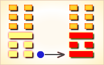
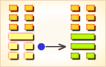
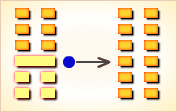
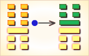
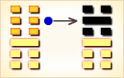
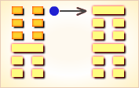

# 谦 ䷎


谦（䷎ qiān）卦的代号是`1:0`，主卦是艮卦，卦象是山，阳数是`1`，特性是被动和阻止；客卦是坤卦，卦象是地，阳数是`0`，特性是广大和适应。主卦与客卦的阳数比是`1:0`。谦卦卦体中上卦为坤为地，下卦为艮为山。谦卦，艮下坤上，为地下有山之象。山本高大，但处于地下，高大显示不出来，此在人则象德行很高，但能自觉地不显扬。谦卦展示谦的形势下各种变化的可能性。谦指谦让。谦的人像山一样，从不炫耀自己的秀丽，也从不掩饰自己的秃石和断崖。主方应当灵活地采取主动，利用客方的消极被动，并且坚持强硬态度，着力改善素质。

图中，红色表示当位的爻，天蓝色表示不当位的爻，箭头表示有应。

- 卦序：15

> 謙，亨，君子有終。
>《彖》曰：謙，亨，天道下濟而光明，地道卑而上行；天道虧盈而益謙，地道變盈而流謙；鬼神害盈而福謙，人道惡盈而好謙。謙尊而光，卑而不可踰，君子之終也。
>《象》曰：地中有山，謙，君子以裒多益寡，稱物平施。

> 初六，謙謙君子，用涉大川，吉。
>《象》曰：謙謙君子，卑以自牧也。

> 六二，鳴謙，貞吉。
>《象》曰：鳴謙貞吉，中心得也。

> 九三，勞謙，君子有終，吉。
>《象》曰：勞謙君子，萬民服也。
>《繫辭》：「勞謙，君子有終，吉。」子曰：「勞而不伐，有功而不德，厚之至也。語以其功下人者也。德言盛，禮言恭。謙也者，致恭以存其位者也。」

> 六四，无不利，撝謙。
>《象》曰：无不利，撝謙，不違則也。

> 六五，不富以其鄰，利用侵伐，无不利。
>《象》曰：利用侵伐，征不服也。

> 上六，鳴謙，利用行師，征邑國。
>《象》曰：鳴謙，志未得也，可用行師，征邑國也。


```
谦（䷎ qiān）卦是异卦，下艮上坤，相叠。艮为山，坤为地。
地面有山，地卑（低）而山高，是为内高外低，
比喻功高不自居，名高不自誉，位高不自傲。这就是谦。

《象传》：山应在地面上，而今在地下，代表谦逊之德。
```

运势：吉利平安，前途无限，但必须去除骄横之气。

- 事业：尚未被人器重，但因品德高尚，终会为人发现。自己不必有意表现，尤其不可放弃谦虚的美德，埋头苦干，一定会得到他人的帮助，在事业上大有作为。
- 经商：较为顺利，但不会获暴利，须逐步积累，故应极其小心谨慎，诚心与他人合作，遵守商业道德，通过自己的勤劳努力，取得商业的发展。
- 求名：天资聪明，但因性格不善于表现自己，起初往往被埋没，自己只要不灰心，继续努力钻研业务，保持谦逊好学精神，更大的成功正在未来。
- 婚恋：美满的婚姻应由双方共同去努力争取。否则，恋爱不成功，家庭不能和睦。
- 决策：具有内高外低的谦虚美德，善于团结他人，也能得到别人的帮助，事业很顺利，遇到困难，很快可以化险为夷，有惊无险。由于能够认真吸取别人的长处，进步很快，会畅通无阻，但需要特别注意学业、德业和修养。

谦卦坤上艮下，为兑宫五世卦。谦为谦逊，内卦艮和外卦坤都是谦虚之象，所以为吉利之卦。

谦和忍让，尊人自卑；利用谦虚，万事可达。得此卦者，吉利平安，步步高升。谦虚忍让者前途大好，骄横者必招败。谦受益，满招损。

- 时运：眼前平顺，步步高升。
- 财运：物价合理，利益保障。
- 家宅：近山之居，合家平安。
- 身体：内郁之症，放宽心胸。

```
谦：表示谦虚不出风头之意。主吉中带小凶。
谦卦显示除了谦虚不与人争之外，
还有一个很重要的意义，就是被「压抑」！
在目前到处都充满竞争的时代里，彼此竞争、排斥，
是很正常的一种现象，所以，谦卦就是告诉你，
虽然一时被压制了，但是忍辱负重，很快就会再意气风发。
因此不要气馁、灰心。另外，也显示，事事不可强出头，
目前局势下，谦让不意气用事，才可得吉象。

解释：要谦虚才可得到助力。

特性：待人谦恭，随和，
交游广泛，喜休闲活动，
重视生活安排及财物的规划，并不断追求新知。
```

运势：吉利平安，欣欣向荣之象，谦者前途大利，骄者横行招败。故以君子谦德，纵涉大川而无险也，卦利君子。正所谓谦受益满招损也。

- 家运：幸福之吉运。
- 疾病：防旧病发，腹部或背部之疾，但仍属吉象。
- 胎孕：生男儿无灾。生女儿亦无灾。
- 子女：子女多温顺，事亲孝，可贺也。
- 周转：诚实谦恭，可成也。
- 买卖：终成，有是非。获薄利，益也。
- 等人：准时到达。
- 寻人：未见，待一段时间自回。
- 失物：难以发现，有失窃的可能。
- 外出：顺利，但应准备充分，途中小心，不可忽视安全。
- 考试：金榜题名。
- 诉讼：宜速和解，拖延不利。
- 求事：吉利，可成。
- 改行：可行。
- 开业：开业者吉利，但诸事勿太急，以谦则受益。

### 初六：谦谦君子，用涉大川，吉。《象》曰：谦谦君子，卑以自牧也。

谦让，再谦让，这才是君子的风度。具有这种品德，即使冒险涉水过河，也是吉利的。《象传》：十分谦让的君子，就是从谦让入手进行自我修养。

平：得此爻者，宜远行或出游，出外做生意会发财。做官的须退守，不宜与人争利，出差的机会会多。

- 时运：不与人争，自可无难。
- 财运：投资航业，有利可图。
- 家宅：治家以德，平安和睦。
- 身体：游泳健身。



初六爻动变得[第36卦：地火明夷](e6988ee5a4b7mingyi_cn.md)。

地火明夷䷣是异卦，下离上坤，相叠。离为明，坤为顺；离为日；坤为地。日没入地，光明受损，前途不明，环境困难。宜遵时养晦，坚守正道，外愚内慧，韬光养晦。

### 六二：鸣谦，贞吉。《象》曰：鸣谦贞吉，中心得也。

明智而谦让，卜问得吉兆。《象传》：明智而谦让，心正而吉利，因为六二之爻居下卦中位，像人守中正之道。

吉：得此爻者，不宜轻举妄动，宜退守。做官的会升迁，读书人会进取成名。

- 时运：声名传开，颇为得意。
- 财运：得人呼应，利益自来。
- 家宅：家有恒产，亦有善名。
- 身体：用心过劳之症。



六二爻动变得[第46卦：地风升](e58d87sheng_cn.md)。

地风升䷭是异卦，下巽上坤，相叠。坤为地、为顺；巽为木、为逊。大地生长树木，逐渐成长，日渐高大成材。喻事业步步高升，前程远大，故名“升”。

### 九三：劳谦君子，有终吉。《象》曰：劳谦君子，万民服也。

勤劳而谦让，这样的人将有好结果，凡事吉利。《象传》：勤劳而谦让的君子，万民敬服。

吉：得此爻者，营谋得利，但会劳心劳力。做官的会高升。

- 时运：劳苦有成，晚运亨通。
- 财运：基业已成，永保利益。
- 家宅：持盈保泰，安居乐业。
- 身体：劳累过度，可能归天。



九三爻动变得[第2卦：坤为地](e59da4kun_cn.md)。

坤为地䷁是同卦，下坤上坤，相叠。阴性。象征地（与乾卦相反），顺从天，承载万物，伸展无穷无尽。坤卦以雌马为象征，表明地道生育抚养万物，而又依天顺时，性情温顺。它以“先迷后得”证明“坤”顺从“乾”，依随“乾”，才能把握正确方向，遵循正道，获取吉利。

### 六四。无不利，撝谦。《象》曰：无不利，撝谦，不违则也。

无所不利，只要奋勇直前而又谦虚谨慎。《象传》：无所不利，只要奋勇直前而又谦虚谨慎，因为这样才不会违犯法则。

吉：得此爻者，无所不通，但做官的、读书人及商人宜固守退让，太盛则有过。

- 时运：正当好运，诸事皆吉。
- 财运：利益甚多，留些余地。
- 家宅：谦和相处，自无不利。
- 身体：多多散心，自可痊愈。



六四爻动变得[第62卦：雷山小过](e5b08fe8bf87xiaoguo_cn.md)。

雷山小过䷽是异卦，下艮上震，相叠。艮为山，震为雷，过山雷鸣，不可不畏惧。阳为大，阴为小。卦外四阴超过中二阳，故称“小过”，小有越过。

### 六五：不富以其邻，利用侵伐，无不利。《象》曰：利用侵伐，征不服也。

贫穷是由于敌国的侵掠，应该对之讨伐，无所不利。《象传》：筮遇此爻有利于征战讨伐，因为是征讨不服从王命的人。

平：得此爻者，会得到贵人的帮助而成事，会获得利益，但须谨防生出祸端，与人争诉。当官的会文武兼用，利于进取。读书人会有金榜题名之机会。

- 时运：振作自强，不可姑息。
- 财运：防人分取，更生事端。
- 家宅：择邻而处，守望相助；近邻议婚。
- 身体：消热去火。



六五爻动变得[第39卦：水山蹇](e8b987jian_cn.md)。

水山蹇䷦是异卦，下艮上坎，相叠。坎为水，艮为山。山高水深，困难重重。人生险阻，见险而止。明哲保身，可谓智慧。蹇，跋行艰难。

### 上六。鸣谦，利用行师，征邑国。《象》曰：鸣谦，志未得也；可用行师，征邑国也。

明智而谦让，出兵征伐邑国自然获胜。《象传》：明智而谦让，尚不能感化邑国得行其志，就可以出兵征讨邑国。

平：得此爻者，有争诉之扰，但会不辨自明。做官的须修德养身，进取有望。

- 时运：大运已过，心意受阻。
- 财运：有名无实，认真整顿。
- 家宅：防范邪祟。
- 身体：调养心志。



上六爻动变得[第52卦：艮为山](e889aegen_cn.md)。

艮为山䷳是同卦，下艮上艮，相叠。艮为山，二山相重，喻静止。它和震卦相反。高潮过后，必然出现低潮，进入事物的相对静止阶段。静止如山，宜止则止，宜行则行。行止即动和静，都不可失机，应恰到好处，动静得宜，适可而止。

# [Qiān ䷎](e8b0a6qian.md)
