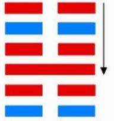
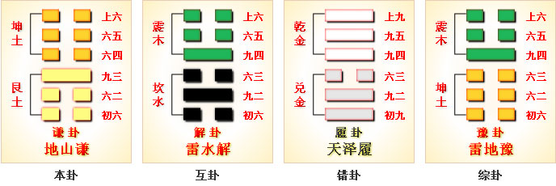

# 谦 ䷎ qiān

- No.15

> 謙，亨，君子有終。
>《彖》曰：謙，亨，天道下濟而光明，地道卑而上行；天道虧盈而益謙，地道變盈而流謙；鬼神害盈而福謙，人道惡盈而好謙。謙尊而光，卑而不可踰，君子之終也。
>《象》曰：地中有山，謙，君子以裒多益寡，稱物平施。

> 初六，謙謙君子，用涉大川，吉。
>《象》曰：謙謙君子，卑以自牧也。

> 六二，鳴謙，貞吉。
>《象》曰：鳴謙貞吉，中心得也。

> 九三，勞謙，君子有終，吉。
>《象》曰：勞謙君子，萬民服也。
>《繫辭》：「勞謙，君子有終，吉。」子曰：「勞而不伐，有功而不德，厚之至也。語以其功下人者也。德言盛，禮言恭。謙也者，致恭以存其位者也。」

> 六四，无不利，撝謙。
>《象》曰：无不利，撝謙，不違則也。

> 六五，不富以其鄰，利用侵伐，无不利。
>《象》曰：利用侵伐，征不服也。

> 上六，鳴謙，利用行師，征邑國。
>《象》曰：鳴謙，志未得也，可用行師，征邑國也。

六位谦顺，四象无凶，一阳居内卦之上，为谦之主。《易》曰：“谦谦君子，利涉大川。”阴阳不争，处位谦柔，阴中见阳，止顺于谦。有无之位，上下皆通。《易》曰：“㧑谦，无不顺也。”与坤为飞伏。
> 癸亥水，丁酉金。

六五居世，大夫在应。建始庚申至乙丑，
> 立秋，大寒。

积筭起乙丑至甲子，周而复始。金土入坤艮。
> 金土二象，入兑宫起筭也。

五星从位起太白，
> 太白金星入兑宫卦。

张宿从位降癸亥，
> 二十八宿，分张宿入谦六五癸亥水上。

分气候二十八。
> 积筭起数，二十八位。

坤在艮上，顺而止，五行入位象谦柔。
> 吉凶随爻适变。

阴阳升降，至六五位返入游魂，变归六四，
> 荡六四一爻入阳也。

八卦相离，四象分也。次降入雷山小过卦。[䷽](e5b08fe8bf87xiaoguo_cn.md)

# [Qiān ䷎](e8b0a6qian.md)
