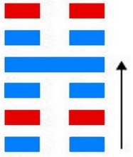
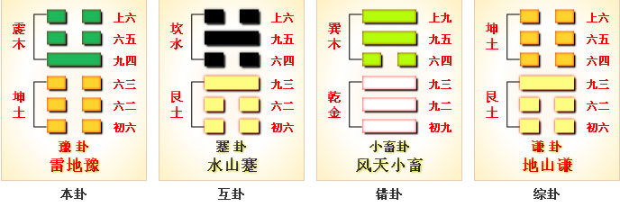

# 豫 ䷏ yǜ

- No.16

> 豫，利建侯、行師。
>《彖》曰：豫，剛應而志行，順以動，豫。豫順以動，故天地如之，而況建侯行師乎？天地以順動，故日月不過，而四時不忒。聖人以順動，則刑罰清而民服。豫之時義大矣哉。
>《象》曰：雷出地奮，豫。先王以作樂崇德，殷薦之上帝，以配祖考。
>《繫辭》：重門擊柝，以待暴客，蓋取諸豫。

> 初六，鳴豫，凶。
>《象》曰：初六鳴豫，志窮凶也。

> 六二，介于石，不終日，貞吉。
>《象》曰：不終日，貞吉，以中正也。
>《繫辭》：子曰：知幾其神乎！君子上交不諂，下交不瀆。其知幾乎！幾者動之微，吉之先見者也。君子見幾而作，不俟終日。易曰：「介于石，不終日，貞吉。」介如石焉，寧用終日，斷可識矣。君子知微知彰，知柔知剛，萬夫之望。

> 六三，盱豫，悔遲有悔。
>《象》曰：盱豫有悔，位不當也。

> 九四，由豫，大有得，勿疑，朋盍簪。
>《象》曰：由豫，大有得，志大行也。

> 六五，貞疾，恒不死。
>《象》曰：六五，貞疾，乘剛也。恒不死，中未亡也。

> 上六，冥豫，成有渝，无咎。
>《象》曰：冥豫在上，何可長也。

卦配火水木，以为阳用事。《易》云：“利建侯行师。”又云：“天地以顺动，故日月不过，四时不忒。
> 坤顺震动。

圣人以顺动，则刑罚清而民服。”与坤为飞伏。
> 乙未土，庚子水。

世立元士为地，易奉九四为正正。建丁丑至壬午，
> 大寒芒种。

积筭起壬午至辛巳，以六爻定吉凶，周而复始。
> 火土筭休咎。

五星从位起荧惑，
> 荧惑火星入卦用事。

亢宿从位降乙未土，
> 亢宿配乙未土。

上木下见土，内顺外动，故为悦豫。

时有屯夷，事非一揆，爻象适时，有凶有吉。人之生世，亦复如斯。或逢治世，或逢乱时，出处存亡，其道皆系。《易》云：“大矣哉。”阴阳升降，分数二十八，极大小之数，以定吉凶之道。
> 积筭壬午入乙未推吉凶。

豫以阳适阴为内顺，成卦之义，在于九四一爻。以阳荡阴，君子之道，变之于解。
> 豫卦以阴入阳，成九四之德。变入解卦，阳入阴，成解之德。

# [Yù ䷏](e8b1abyu.md)
