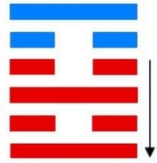

# Bì ䷕

* Adorning

> Chinese: 贲 ䷕ bì

<a id="p-103"/>

**Bì ䷕** indicates that there should be free course (in what it denotes). There will be little advantage (however) if it be allowed to advance (and take the lead).

<a id="p-104"/>

1.<a id="22.1"/> The first `NINE`, undivided, shows one adorning (the way of) his feet. He can discard a carriage and walk on foot.

> **䷕** changing to [**䷳**](e889aegen.md)

> Matching Line 1 in Adjacent Hexagram: [**䷔**](e599ace59791shike.md#21.1)

2.<a id="22.2"/> The second `SIX`, divided, shows one adorning his beard.

> **䷕** changing to [**䷙**](e5a4a7e89384daxu.md)

> Matching Line 2 in Adjacent Hexagram: [**䷔**](e599ace59791shike.md#21.2)

3.<a id="22.3"/> The third `NINE`, undivided, shows its subject with the appearance of being adorned and bedewed (with rich favours). But let him ever maintain his firm correctness, and there will be good fortune.

> **䷕** changing to [**䷚**](e9a290yi.md)

> Matching Line 3 in Adjacent Hexagram: [**䷔**](e599ace59791shike.md#21.3)

4.<a id="22.4"/> The fourth `SIX`, divided, shows one looking as if adorned, but only in white. As if (mounted on) a white horse, and furnished with wings, (he seeks union with the subject of the first line), while (the intervening third pursues), not as a robber, but intent on a matrimonial alliance.

> **䷕** changing to [**䷝**](e7a6bbli.md)

> Matching Line 4 in Adjacent Hexagram: [**䷔**](e599ace59791shike.md#21.4)

5.<a id="22.5"/> The fifth `SIX`, divided, shows its subject adorned by (the occupants of) the heights and gardens. He bears his roll of silk, small and slight. He may appear stingy; but there will be good fortune in the end.

> **䷕** changing to [**䷤**](e5aeb6e4babajiaren.md)

> Matching Line 5 in Adjacent Hexagram: [**䷔**](e599ace59791shike.md#21.5)

6.<a id="22.6"/> The sixth `NINE`, undivided, shows one with white as his (only) ornament. There will be no error.

> **䷕** changing to [**䷣**](e6988ee5a4b7mingyi.md)

> Matching Line 6 in Adjacent Hexagram: [**䷔**](e599ace59791shike.md#21.6)

## Notes

The character **Bì ䷕** is the symbol of what is ornamental and of the act of adorning. As there is ornament in nature, so should there be in society; but its place is secondary to that of what is substantial. This is the view of [king Wén](https://en.wikipedia.org/wiki/King_Wen_of_Zhou) in his [Tuàn](https://ctext.org/book-of-changes/tuan-zhuan). The symbolism of the separate lines is sometimes fantastic.

Line 1 is strong, and in an odd place. It is at the very bottom of the hexagram, and is the first line of Lî, the trigram. for fire or light, and suggesting what is elegant and bright. Its subject has nothing to do but to attend to himself. Thus he cultivates -- adorns -- himself in his humble position; but if need be, righteousness requiring it, he can give up every luxury and indulgence.

Line 2 is weak and in its proper place, but with no proper correlate above. The strong line 3 is similarly situated. These two lines therefore keep together, and are as the beard and the chin. Line 1 follows 2. What is substantial commands and rules what is merely ornamental.

Line 3 is strong, and between two weak lines, which adorn it, and bestow their favours on it. But this happy condition is from the accident of place. The subject of the line must be always correct and firm to ensure its continuance.

Line 4 has its proper correlate in 1, from whose strength it should receive ornament, but 2 and the strong 3 intervene and keep them apart, so that the ornament is only white, and of no bright colour. Line 4, however, is faithful to 1, and earnest for their union. And finally line 3 appears in a good character, and not with the purpose to injure, so that the union of 1 and 4 takes place. All this is intended to indicate how ornament recognises the superiority of solidity. Compare the symbolism of the second line of [**Zhūn ䷂**](e5b1afzhun.md) (No. 3), and that of the topmost line of [**Kuí ䷥**](e79dbdkui.md) (No. 38).

Line 5 is in the place of honour, and has no proper correlate in 2. It therefore associates with the strong 6, which is symbolised by the heights and gardens round a city, and serving both to protect and to beautify it. Thus the subject of the line receives adorning from without, and does not of itself try to manifest it. Moreover, in his weakness, his offerings of ceremony are poor and mean. But, as Confucius said, 'In ceremonies it is better to be sparing than extravagant.' Hence that stinginess does not prevent a good auspice.

Line 6 is at the top of the hexagram. Ornament has had its course, and here there is a return to pure, 'white,' simplicity. Substantiality is better than ornament.

# [贲 ䷕](e8b4b2bi_cn.md)
