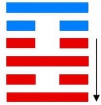

# 贲 ䷕ bì

- No.22

> 賁，亨，小利有攸往。
>《彖》曰：賁亨。柔來而文剛，故亨。分剛上而文柔，故小利有攸往，天文也。文明以止，人文也。觀乎天文，以察時變，觀乎人文，以化成天下。
>《象》曰：山下有火，賁。君子以明庶政，无敢折獄。

> 初九，賁其趾，舍車而徒。
>《象》曰：舍車而徒，義弗乘也。

> 六二，賁其須。
>《象》曰：賁其須，與上興也。

> 九三，賁如濡如，永貞吉。
>《象》曰：永貞之吉，終莫之陵也。

> 六四，賁如皤如，白馬翰如，匪寇婚媾。
>《象》曰：六四當位，疑也；匪寇婚媾，終无尤也。

> 六五，賁于丘園，束帛戔戔，吝，終吉。
>《象》曰：六五之吉，有喜也。

> 上九，白賁，无咎。
>《象》曰：白賁无咎，上得志也。

泰取象，上六柔来反刚，九二刚上文柔，成贲之体，止于文明。贲者，饰也。五色不成谓之贲，文彩杂也。山下有火，取象文明，火土分象，与离为飞伏。
> 己卯木，丙辰土。

世立元士，六四诸侯在应。阴柔居尊，文柔当世，素尚居高，侯王无累。《易》云：“贲于丘园，束帛戋戋。”建始辛卯至丙申，
> 春分立秋。

积筭起丙申至乙未，周而复始。
> 金土入卦起筭。

五星从位起镇星，
> 镇星入卦。

昴宿从位降己卯，
> 昴宿配贲卦初九阳位起筭。

分气候二十八。
> 起六位五行筭吉凶。

土火木分阴阳，相应为敌体；上九积阳，素尚全身远害，贵其正道。起于潜，至于用九。
> 假乾初上为喻也。

阴阳升降，通变随时。

离入乾，将之大畜。次降六二中虚为三连。入大畜卦。[䷙](e5a4a7e89384daxu_cn.md)
> 阴消阳长。

# [Bì ䷕](e8b4b2bi.md)
