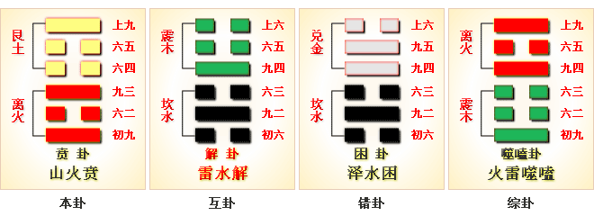
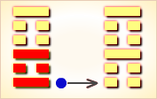
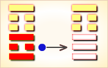
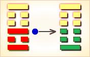
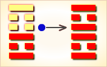
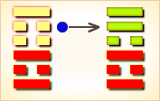
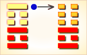

# 贲 ䷕


贲（bì）卦展示“贲”的形势下各种变化的可能性。
“贲”的意思是装饰得很好。

贲卦的代号是`5:1`，表示主卦是离卦，卦象是火，阳数是`5`；客卦是艮卦，卦象是山，阳数是`1`。

主卦和客卦的中爻和上爻都是相同，表明双方素质都不佳，态度都强硬；
主卦下爻阳，客卦下爻阴，主方利用客方消极被动之机积极发展。
主方应当避免冲突，把自己的不佳素质和强硬态度装饰得很好，表现出对客方的善意。

图中，红色表示当位的爻，天蓝色表示不当位的爻，箭头表示有应。

贲卦，山火贲，饰外扬质。应当领悟，一切文饰都是空虚的道理，惟有重实质，有内涵的朴实面目，才是文饰的极致。

- 卦序：22

> 賁，亨，小利有攸往。
>《彖》曰：賁亨。柔來而文剛，故亨。分剛上而文柔，故小利有攸往，天文也。文明以止，人文也。觀乎天文，以察時變，觀乎人文，以化成天下。
>《象》曰：山下有火，賁。君子以明庶政，无敢折獄。

> 初九，賁其趾，舍車而徒。
>《象》曰：舍車而徒，義弗乘也。

> 六二，賁其須。
>《象》曰：賁其須，與上興也。

> 九三，賁如濡如，永貞吉。
>《象》曰：永貞之吉，終莫之陵也。

> 六四，賁如皤如，白馬翰如，匪寇婚媾。
>《象》曰：六四當位，疑也；匪寇婚媾，終无尤也。

> 六五，賁于丘園，束帛戔戔，吝，終吉。
>《象》曰：六五之吉，有喜也。

> 上九，白賁，无咎。
>《象》曰：白賁无咎，上得志也。

### 山火贲 饰外扬质 中上卦

这个卦是异卦，下离上艮，相叠。离为火为明；艮为山为止。文明而有节制。
贲（bì）卦论述文与质的关系，以质为主，以文调节。贲，文饰、修饰。

《象》曰：近来运转瑞气周，窈窕淑女君子求。钟鼓乐之大吉庆，占者逢之喜临头。

```
【原文】贲①。亨。小利有攸往。
【注释】①贲（bì），卦名。本卦为异卦相叠，离下艮上。
【译文】贲卦：通达。有所往则有小利。
本卦下卦为离，离为火，上卦为艮，艮为山。
山下有火，一片艳红，花木相映，锦绣如文。
喻男婚女嫁，国政家制，都有仪礼制度，
构成了复杂的社会人文关系，用以维护现存的社会秩序。
这正是所谓贤德君子“观乎天文，察乎时变”神道设教的结果。
所以卦名曰贲。贲，《序卦》：“饰也。”
```

### 彖传
```
《彖》曰：贲，亨。
柔来而文刚，故亨。分，刚上而文柔①。
故以“小利有攸往”，刚柔交错②，天文也。
文明以止，人文也。
观乎天文以察时变，观乎人文，以化成天下。

①“柔来而文刚”四句，文，文饰。
本卦下卦为离为柔，上卦为艮为刚，柔居刚下，俯顺于刚，
所以说“柔来”，“刚上”。“文刚”、“文柔”，
就是柔刚互为文饰，即以伦理、礼仪来规范人们的生活，
用各种政治设施来维护社会制度的尊严。
②今本无“刚柔交错”四字。郭京本有。
王弼、孔颖达所据本亦有。今据增。

【译文】 
《彖辞》说：贲，通达。
此卦下卦为离，义为阴柔，
上卦为艮，义为阳刚，
所以说阴柔文饰阳刚，因此“通达”。
柔、刚分布，刚为主而柔为衬，所以说“有所往则有小利”。
刚柔交错成文，这是天象。
社会制度、风俗教化是人们生活的基础，是社会人文现象。
观察天象，就可以察觉到时序的变化。
观察社会人文现象，就可以用教化改造成就天下的人。
```

### 象传
```
《象》曰：山下有火，贲。
君子以明庶政①，无敢折狱。

①庶，众。庶政，各项政事。

【译文】
《象传》说：
本卦上卦为艮为山，下卦为离为火，
山下有火，火燎群山，这是贲卦的卦象。
君子观此卦象，思及猛火燎山，玉石俱焚，
草木皆尽，以此为戒，
从而明察各项政事，不敢以威猛断狱。
【白话】《象传》说：
“《贲卦》的卦象是离（火）下，艮（山）上，
为山下燃烧着火焰之表象。
山下火焰把山上草木万物照得通明，
如同披彩，这就叫装饰。
君子像火焰一样，使众多的政务清明，
但却不能用修饰的方法来断官司。
```

### 初九
```
【原文】贲其趾①，舍车而徒。
《象》曰：舍车而徒，义弗乘也。
【注释】①贲，文饰。贲其趾，犹言用花鞋套脚。
【译文】脚穿花鞋，舍车不乘，徒步而行。
《象传》说：舍车不乘，徒步而行，
为显示鞋子之美丽，理应不乘车。
本卦多记录婚嫁之事，礼聘迎娶都有生动的描写，
展现了对偶婚制的简单的风俗图景。
读者可从这个角度体察各爻意义。
《象传》附会大义，曲加解释，以致面目全非。
```

### 六二
```
【原文】贲其须。
《象》曰：贲其须，与上兴也。
【译文】修饰自己的胡须。
《象传》说：修饰自己的胡须，
说明老人不服老，帮助君王振兴国家。
```

### 九三
```
【原文】贲如濡如①。永贞吉。
《象》曰：永贞之吉，终莫之陵也②。
【注释】
①贲，借为奔。濡，湿。如，形容词词尾。
②《象传》释“贞”为诚信贞正。陵，侵凌。
【译文】奔跑向前，汗流浃背。
卜问长时期的凶吉而得吉兆。
《象传》说：永远贞正，必吉利，
因为决没有人侵凌正人君子。
```

### 六四
```
【原文】贲如皤如①。
白马翰如②。匪寇，婚媾。
《象》曰：六四，当位疑也③。
匪寇，婚媾，终无尤也。
【注释】
①贲，借为奔。
皤（pó 婆），郑玄本作燔，
焚烧，这里指太阳当头晒。
②翰，黄颖注：“马举头高昂也。”
马头高举即飞奔之状。
③当位，此以六四爻位爻象为据。
【译文】奔跑气吁吁，太阳火辣辣。
高头白马，向前飞奔。不是来抢劫，而是来娶亲。
《象传》说：六四阴爻居阴位，所处恰当。
既知不是来抢劫，而是来娶亲，疑虑冰释，终无灾祸。
六四，阴爻居阴位（第四位为阴位），是为当位。
之所以称“疑”，因为看到大批人马奔驰而来，
心中犯疑，难料吉凶。
```

### 六五
```
【原文】贲于丘园，束帛戋戋①。吝，终吉。
《象》曰：六五之吉，有喜也。
【注释】①戋戋，马融注：“委积貌。”即一大堆的样子。
【译文】奔向丘园，
送上许多布帛，初遇困难，终则顺利。
《象传》说：六五爻辞说的吉利，是指有婚姻之喜。
```

### 上九
```
【原文】白贲①，无咎。
《象》曰：白贲，无咎，上得志也。
【注释】①贲，饰，这里指配色。
白贲，犹言白底的布帛饰以各苞花纹。
【译文】送上白底饰以诸色花纹的布帛，不会坏事。
《象传》说：白底的布帛饰以诸色花纹，没有灾祸，
因为上九居一卦乞首位，像人高高在上，志得意满。
```

### 详细解释
```
初九：贲其趾，舍车而徒。
《象》曰：舍车而徒，义弗乘也。
趾是脚趾，人体的最低部份。
“初九”阳刚，下卦“离”是明；
所以，刚毅贤明，甘心在最下位，
一心美化自己的行为，择善固执。
这是装饰脚趾的形象，
脚趾用来行走，行走与行为相通。
像这样贫贱不移，洁身自爱的人，
就是送给他不应当有的华丽的车，
也不会坐，宁愿舍弃车，徒步行走。
这一爻，说明文饰应恰当。

六二：贲其须。
《象》曰：贲其须，与上兴也。
“须”是须的本字，胡须在口边的称髭，
在两颊的称髯，在颐亦即下颚的称须。
“六二”阴柔中正，与上方阳刚得正的“九三”接近，
双方在上卦又都无应，因而异性相吸，关系密切，
一起行动，得以兴盛，
就像须装饰在下颚，与下颚一起行动。
亦即，在没有应援时，应当追随接近的有实力的人物。
这一爻，说明文饰应取法乎上。

九三：贲如濡如，永贞吉。
《象》曰：永贞之吉，终莫之陵也。
“濡如”，像打湿般的光泽。“陵”与凌同。
“九三”阳刚，在两个阴爻中间，被装饰得光泽柔润。
然而，“六二”、“六四”都不是与“九三”相应的正当匹配，
虽然令人陶醉，却不能被诱惑，以致沉溺不能自拔。
所以，永远坚守正道，才能吉祥。
“象传”说：这样才始终不会被人凌辱。
这一爻，说明不可被文饰迷失。

六四：贲如皤如，白马翰如，匪寇婚媾。
《象》曰：当位疑也。匪寇婚媾，终无尤也。
“皤如”，本来是指老人的白发，在此当作不加修饰的白色。
“翰如”是像鸟一般飞的快速的意思。
“六四”本来与“初九”是正当的相应，相互装饰；
可是，“九三”隔在中间，形成障碍，
以致应当得到的装饰，却落了空。
因而，“六四”为了要与正当的配偶相聚，
骑马像飞一般的奔驰前往，由于自己是未加装饰的白色，
马也看着是白色。但“九三”阳刚得正，
所以阻挡，并非是要强暴，不过是想求婚而已。
这一爻，说明文饰重实效，不在一时的得失。

六五：贲于丘园，束帛戋戋，吝，终吉。
《象》曰：六五之吉，有喜也。
“束帛”是五匹一束的绢。
“戋（jiān）戋”是轻少的意思，
如水少是浅，贝少是贱；金少是钱。
“六五”柔顺，在外卦得中，是这一卦的主爻。
大凡装饰，内在的实质，重于外表的形式，
“六五”在中央，象征重视内在实质，
就像不去装饰人人注目的都市，
而去装饰内在朴实的山丘林园。
然而，“六五”阴爻，代表女性，本性吝啬，
以“六五”君王的地位，赠送的礼物，
不过是微薄的一束绢，当然寒酸；
但实质重于装饰，
虽然被讥笑为吝啬，最后仍然会吉祥喜悦。
这一爻，强调文饰重实质。

上九：白贲，无咎。
《象》曰：白贲无咎，上得志也。
“上九”已是贲卦的极点，一切的装饰，
都由极端又返回一片空白的本来面目。
人类的装饰是礼法，当礼法达到极致时，
又恢复到朴素，所以说“白贲”。
“上九”如果领悟到装饰的空虚，
而恢复本来面目时，就会无咎。
上位无位，已是局外人的立场，
“上九”到达这一位置，领悟一切，
放弃虚饰，悠然自得。所以“象传”说得志。
这一爻，再强调一切文饰，
都是空虚，应当反璞归真。
```

### 注解
```
贲：亨，小利有攸往。
注释：贲（bì）：卦名。
有修饰，文饰之义。帛《易》作“蘩”。
小利有攸往：有小利可以前往。
朱熹《周易本义》曰：“贲”，饰也。
内离而外艮，有文明而各得其分之象，故为贲。
占者以其柔来文刚，
阳得阴助，而离明于内，故为“亨”。
以其刚上文柔，而艮止于外，故“小利有攸往”。

初九：贲其趾，舍车而徒。
注释：贲其趾，舍车而徒：
饰其脚趾，弃车徒步而行。趾，脚趾。徒，徒步。
朱熹《周易本义》曰：
刚德明体，自贲于下，
为舍非道之车，而安于徒步之象。

六二：贲其须。
注释：贲其须：修饰其须。
须，须。指面毛与胡须。
朱熹《周易本义》曰：
二以阴柔居正中，三以阳刚而得正，皆无应与。
故而附三而动，有贲须之象。
占者宜从上之阳刚而动也。

九三：贲如濡如，永贞吉。
注释; 贲如濡如，永贞吉：
修饰、润色，长久守正则可得吉。
如，语助词。濡，湿润而光泽。
永，长久。贞，正固。
朱熹《周易本义》曰：
一阳居二阴之间，得其贲而润泽者也。
然不可溺于所安，故有“永贞”之戒。

六四：贲如皤如，白马翰如，匪寇婚媾。
注释：贲如皤如，白马翰如：
修饰素白，白马奔驰如飞。
皤（pó），老人发白曰“皤”，此指白色文素之貌。
翰如：言马奔跑如鸟飞之疾。
匪寇婚媾：不是强盗，是来求婚的。
匪，即非。寇，盗寇。
朱熹《周易本义》曰：“皤”，白也。
“马”，人所乘，人白则马亦白矣。
四与初相贲者，乃为九三所隔而不得遂，故有“皤如”。
而其往求之心，如飞翰之疾也。
然九三刚正，非为寇者也，乃求婚媾耳，故其象如此。

六五：贲于丘园，束帛戋戋，吝，终吉。
注释：贲于丘园，束帛戋戋：
修饰家园，只以寥寥束帛。
丘园，家园。帛，丝织品总称。
戋戋，即残残。指很少。
朱熹《周易本义》曰：
六五柔中为贲之主，敦本尚实，
得贲之道，故有“丘园”之象。
然阴性吝啬，故有“束帛戋戋”之象。
人而如此，虽可羞吝，然礼奢宁俭，故得“终吉”。

上九：白贲，无咎。
注释：白贲：以白色装饰。
朱熹《周易本义》曰：
贲极反本，复于无色，“善补过矣”，故其象占如此。
```

### 新解
```
贲①：亨。小利有攸往。
初九：贲其趾，舍车而徒③。
六二：贲其须。
九三：贲如濡如④。永贞吉。
六四：贵如皤如⑤，白马翰如⑥。匪寇，婚媾。
六五：贲于丘园⑦，束帛戋戋⑧。
吝，终吉。 上九：白贲⑨无咎。

①贲（bì）是本卦标题。
贲的意思是装饰，文饰。
在本卦中，贲还借用 为“奔”和“豮”。
全卦内容主要讲婚嫁之事，
作标题的“贲”字为卦中多见词。
②贲：文饰。
③徒：徒步行走。
④贲：借用为“奔”。濡： 汗湿。
⑤贲：借用为“奔”。皤（pó）：用作“燔”，意思是焚烧。
⑥翰：马头高昂，这里指马飞驰的样子。
⑦丘园：指女家附近的地方。
⑧束：五匹帛为一束。戋戋：一大堆的样子。
⑨贲：借用为“豮”，意思是大猪。

【译文】 
贲卦：亨通。外出有小利。
初九：把脚上穿戴好，不坐车而徒步行走。
六二：把胡须修饰好。
九三：奔跑得满身大汗。占问长久吉凶得吉兆。
六四：一路奔跑，太阳晒得像火烧，
白马昂头飞驰。不是来抢劫，而是来娶亲。
六五：跑到丘园，送上一束束布帛。
遇到了困难，结果还是吉利。
上九：送上白色大肥猪，没有灾祸。

【读解】
婚礼嫁娶是人生大事之一。
远古时代民间婚俗的情景，今天已难想象得十分具体生动。
“贲卦”中的描绘，恰好是一幅民间婚俗的风情画：
娶亲的男方穿戴修饰整齐，
有车不坐，一路奔跑到女方家，献上结婚的礼物。
一桩美满姻缘就此完成了。据说这是原始社会中期对偶婚的遗俗。
结婚时，男方全氏族的成员要迁到靠近女方氏族居住的地方。
“贲卦”所描绘的，正是这种情形。
虽然只有动作、行为等简单的情节，
但足以让我们在想象中去体察新郎内心的状态：
兴奋激动中又包含着几分急切和忐忑不安，
未来生儿育女的家庭生活和共同劳作的情景，
一次又一次在脑海中闪现。
其中肯定也有对肩负更大责任的意识，
因为那时结婚绝不是简单的个人行为，
而是同整个氏族的利益联系在一起的。
```

### 《哲学易经》

贲，亨。小利，有攸往。《彖》曰：贲，亨。柔来而文刚，故亨。
分，刚上而文柔，故小利有攸往，刚柔交错，天文也。文明以止，人文也。
观乎天文以察时变，观乎人文以化成天下。

《象》曰：山下有火，贲。君子以明庶政，无敢折狱。
贲，文饰之意。意文饰改良也。明辩了事物的实质就能知其弊端而不断进行文饰和改良了，从而才能使事物不断地趋向完善和改进，是以“十分亨通，小利，有攸往。”

《彖传》说：不断文饰、改良、修正，十分亨通。原因是只有不断文饰、改良、修正，才能使事物不断地趋向完善和改进。故柔来当文之以刚，非常亨通；分而言之，刚上则文之以柔。如此则无物不亨而天下可化，是以此乃天文也。天之文总是刚柔相济、阴阳相合、相辅相成化育万物的，而人类当认识这个原则不断地修饰事物推向光明，这应当是人类之文。观乎天文才能了解时序的变化而作出相应的行动，观乎人文才能归正天下而作出相应的措施。这就是《贲》之义。

《象传》说：山下有火，能洞照黑暗，耀亮天下，这是《贲》之象。是以君子观之思一切事物如能相得益彰，无所不亨。从而当明庶政、辩狱情、不滥用刑罚。

> 初九：贲其趾，舍车而徒。《象》曰：舍车而徒，义弗乘也。

要展现自己的脚趾，就得舍车而徒，饰已以文人也。故贲其趾，就得舍车而徒，义弗乘也。孔子说：“言之不文，行之不远。”君子秀外慧中才能彰显人格美、品德美、行为美。

> 六二：贲如须。《象》曰：贲于须，与上兴也。

须，需也。“民事无不急，务急之谓大。”要及时解决和妥然处理最要紧的和最迫切需要的事，才能达到社会的安定和天下的安康，是以“与上兴也”。

> 九三：贲如濡如，永贞吉。《象》曰：永贞之吉，终莫之陵也。

要不断地加以修饰和改良，要不断地加以补充和修正，这是永恒的真理。社会的发展来之于对旧事物的不断改良和修正。
如果没有这些粉饰，人类也无从谈起文明的进程。故永贞之吉，才能走在时代的顶端，终不至于受到凌辱和磨难。

> 六四：贲如皤如，白马翰如。匪寇，婚媾。《象》曰：六四当位，疑也。匪寇，婚媾，终无尤也。

皤，皤然之意。不断地文饰才能彰显它的美丽，不断改进才能向更高层次发展。因此当乘马而进必然会向更好层次发展。因此六四当位，虽疑，何其忧。只要行事中正，是以“匪寇，婚媾，终无尤也。”

> 六五：贲于丘园，束帛戋戋。吝，终吉。《象》曰：六五之吉，有喜也。

丘园，桑园良田也。只有不断地改良土壤、整修桑田，才能为丰收创造条件而束帛戋戋。是以虽吝而终有其吉。故君子当为一切发展创造条件，是以“六五之吉，有喜也。”

> 上九：白贲无咎。《象》曰：白贲无咎，上得志也。

白贲，白色无纹没有掩饰性也。孔子说：“丹漆不文，白玉不雕，宝珠不饰，质有余者不受饰也。”正确的理论无需修饰，完善的政策何需粉饰，是以上得志也。
                  


### 《断易天机》解

贲卦艮上离下，为艮宫初世卦。贲为装饰之意，离为明，艮为止，表示有文明的制度使人们止于一定的规范，因此多为吉兆。

### 北宋易学家 邵雍 解

文饰光明，外实内需；隐忧之时，量力而为。

得此卦者，表面风光，内在空虚，多虚少实。宜充实自己，稳重行事，量力而为。

### 台湾国学家 傅佩荣 解

- 时运：上有阻力，不可任意。
- 财运：经理精明，须防套牢。
- 家宅：小心火灾。
- 身体：郁火上升，慎用寒剂。

### 传统解卦
```
这个卦是异卦，下离上艮相叠。
离为火为明；艮为山为止。
文明而有节制。
贲卦论述文与质的关系，以质为主，以文调节。
贲，文饰、修饰。

《象传》：日落西山，照耀通明，
华美灿烂，同时喻光明力量渐消，阴暗的力量扩大。
```

运势：表面风光，内里空虚，必须充实自己，凡事宜踏实、按部就班。

- 事业：顺利，小有成绩，宜即时总结经验，图谋更大的发展。树立信心，不计较一时的得失。追求实质性的内容，慎重行事，不要随波逐流，寻求有实力的人物提携自己。
- 经商：开始会遇到困难，不应灰心，宜全面分析形势，大胆开拓，勇敢地投入，联合他人，共同合作，根据市场，运转业务。
- 求名：不可过多地注重外表，而应着重于内在的素质。大胆地推荐自己，但应坚持自己的理想。
- 婚恋：慎重选择，有合适者，则应迫切追求，不可三心二意，务必专一。注重对方的内在气质，勿为表面现象所欺骗。
- 决策：喜爱注重外表，缺乏追求内在气质的恒心。生性较为浮躁，好务虚名，往往因此而碰壁，或半途而废。在事实的教育下，改变不切实际的做法，明察社会和人生，会有所收敛，变得自持，注重自身修养，成全事业，中年以后会大有作为，老年仍可发挥余热。

### 台湾 张铭仁 解卦
```
贲：表示美丽得外表装饰，主小凶象。
「金玉其外、败絮其中」，
经过有心修饰、伪装的外表或事情，
事业投资、感情皆不宜。
慎防有心的小人、伪君子。

解释：表面好看，里表不一。

特性：重精神，轻物质，
有艺术文学专才，感情敏锐，追求理想。
在情爱上，易留下刻骨的回忆。
```

运势：卦象是象征其人外表好看，内在空虚，因此，必须充实自己，凡事深思远虑，与人和睦相处，能获得意外利益。切忌因小失大，更无须为了掩饰外观而造成不必要的损失。凡事踏实，按部就班为是。

- 家运：外美内虚而不为外人所知，应及时整顿家庭经济，使其安稳、充实，更须安份自持，莫以虚浮来掩饰空虚。踏实为上策。
- 疾病：病情危重，为心脏、胸腹等病。
- 胎孕：孕有不安之象。
- 子女：子女身体虚弱，美丽而得人缘。
- 周转：不宜大，小调尚可。
- 买卖：有贵人，速决有利。
- 等人：会来。但远方者不来。
- 寻人：已在东北或南方亲友家，可寻。
- 失物：在家中遗失，将可寻回。不妨试试注意门脚的地方。
- 外出：慎远行。但只要准备充分，注意安全，不会出麻烦。
- 考试：不理想。但人家以为你读得不错。
- 诉讼：宜速求解决，不可拖延，可得贵人调解。
- 求事：条件勿太苛求，可成。
- 改行：改行宜，但勿夸大或太过。
- 开业：开业者吉利之象。

### 初九爻辞

初九。贲其趾，舍车而徒。

《象》曰：舍车而徒，义弗乘也。

### 白话文解释

初九：脚穿花鞋，舍车不乘，徒步而行。

《象传》说：舍车不乘，徒步而行，为显示鞋子之美丽，理应不乘车。

### 北宋易学家 邵雍 解

平：得此爻者，多奔波，静凶动吉。做官的须防退职之患。

### 台湾国学家 傅佩荣 解

- 时运：个性清高，德优于名。
- 财运：脚踏实地，虽小亦亨。
- 家宅：勤俭起家，知足不辱。
- 身体：初起之病，自可痊愈。

### 初九变卦：山火贲 变卦 艮为山



初九爻动变得[第52卦：艮为山](e889aegen_cn.md)。

这个卦是同卦，下艮上艮，相叠。

艮为山，二山相重，喻静止。

它和震卦相反。

高潮过后，必然出现低潮，进入事物的相对静止阶段。

静止如山，宜止则止，宜行则行。

行止即动和静，都不可失机，应恰到好处，动静得宜，适可而止。

### 六二爻辞

六二。贲其须。

《象》曰：贲其须，与上兴也。

### 白话文解释

六二：修饰自己的胡须。

《象传》说：修饰自己的胡须，说明老人不服老，帮助君王振兴国家。

### 北宋易学家 邵雍 解

平：得此爻者，得人提拔，好运可期，但也要相时而动，不可随性而为，以免遭难。做官的会因人成事，升迁有望。

### 台湾国学家 傅佩荣 解

- 时运：平平淡淡，依人成事。
- 财运：配合富商，必可获利。
- 家宅：祖上福泽；婚嫁宜待。
- 身体：遵照医嘱。

### 六二变卦：山火贲 变卦 山天大畜



六二爻动变得[第26卦：山天大畜](e5a4a7e89384daxu_cn.md)。

这个卦是异卦，下乾上艮，相叠。

乾为天，刚健；艮为山，笃实。

畜者积聚，大畜意为大积蓄。

为此不畏严重的艰难险阻，努力修身养性以丰富德业。

### 九三爻辞

九三。贲如，濡如，永贞吉。

《象》曰：永贞之吉，终莫之陵也。

### 白话文解释

九三：奔跑向前，汗流浃背。卜问长时期的凶吉而得吉兆。

《象传》说：永远贞正，必吉利，因为决没有人侵凌正人君子。

### 北宋易学家 邵雍 解

吉：得此爻者，好运来到，不必费力，自然荣盛，即使有是非纠纷，也不足为患。做官的与人和睦，能居要职。

### 台湾国学家 傅佩荣 解

- 时运：名利双收，光华润泽。
- 财运：财源如水，可保基业。
- 家宅：可以久居；百年偕老。
- 身体：游泳健身。

### 九三变卦：山火贲 变卦 山雷颐



九三爻动变得[第27卦：山雷颐](e9a290yi_cn.md)。

这个卦是异卦，下震上艮，相叠。

震为雷，艮为山。

山在上而雷在下，外实内虚。

春暖万物养育，依时养贤育民。

阳实阴虚，实者养人，虚者为人养。自食其力。

### 六四爻辞

六四。贲如，皤如，白马翰如，匪寇婚媾。

《象》曰：六四当位疑也。匪寇婚媾，终无尤也。

### 白话文解释

六四：奔跑气吁吁，太阳火辣辣。高头白马，向前飞奔。不是来抢劫，而是来娶亲。

《象传》说：六四阴爻居阴位，所处恰当。既知不是来抢劫，而是来娶亲，疑虑冰释，终无灾祸。

### 北宋易学家 邵雍 解

平：得此爻者，先凶后吉，忧中有喜，虽有危险，终得安宁。未婚者，有望成家。做官的先难后易。

### 台湾国学家 傅佩荣 解

- 时运：安分则吉，明年亨通。
- 财运：早些售出，获利了结。
- 家宅：先有丧事，后有婚事。
- 身体：胸中气阻，调节上下。

### 六四变卦：山火贲 变卦 离为火



六四爻动变得[第30卦：离为火](e7a6bbli_cn.md)。

这个卦是同卦，下离上离，相叠。

离者丽也，附着之意。

一阴附丽，上下二阳，该卦象征火，内空外明。

离为火、为明，太阳反复升落，运行不息，柔顺为心。

### 六五爻辞

六五。贲于丘园，束帛戋戋。吝，终吉。

《象》曰：六五之吉，有喜也。

### 白话文解释

六五：奔向丘园，送上许多布帛，初遇困难，终则顺利。

《象传》说：六五爻辞说的吉利，是指有婚姻之喜。

### 北宋易学家 邵雍 解

吉：得此爻者，会遇贵人，经营获利，多喜事。做官的闲职者会受到重用，在职者福禄双全。

### 台湾国学家 傅佩荣 解

- 时运：虽为正运，勤俭为宜。
- 财运：木材丝绸，皆可获利。
- 家宅：家风勤俭；贤妇可喜。
- 身体：园林修养。

### 六五变卦：山火贲 变卦 风火家人



六五爻动变得[第37卦：风火家人](e5aeb6e4babajiaren_cn.md)。

这个卦是异卦，下离上巽，相叠。

离为火；巽为风。

火使热气上升，成为风。

一切事物皆应以内在为本，然后伸延到外。

发生于内，形成于外。

喻先治家而后治天下，家道正，天下安乐。

### 上九爻辞

上九。白贲，无咎。

《象》曰：白贲无咎，上得志也。

### 白话文解释

上九：送上白底饰以诸色花纹的布帛，不会坏事。

《象传》说：白底的布帛饰以诸色花纹，没有灾祸，因为上九居一卦之首位，像人高高在上，志得意满。

### 北宋易学家 邵雍 解

平：得此爻者，须防好运转凶，家中、亲属有长辈或命终。做官的会升迁。

### 台湾国学家 傅佩荣 解

- 时运：好运已终，恬谈自适。
- 财运：直接出售，依然有利。
- 家宅：清白高尚。
- 身体：清谈解热，可能归天。

### 上九变卦：山火贲 变卦 地火明夷



上九爻动变得[第36卦：地火明夷](e6988ee5a4b7mingyi_cn.md)。

这个卦是异卦，下离上坤，相叠。

离为明，坤为顺；离为日；坤为地。

日没入地，光明受损，前途不明，环境困难。

宜遵时养晦，坚守正道，外愚内慧，韬光养晦。

# [Bì ䷕](e8b4b2bi.md)
