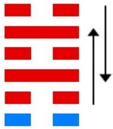

# 蹇 ䷦ jiǎn

- No.39

> 蹇，利西南，不利東北。利見大人，貞吉。
>《彖》曰：蹇，難也，險在前也。見險而能止，知矣哉。蹇，利西南，往得中也；不利東北，其道窮也。利見大人，往有功也；當位貞吉，以正邦也。蹇之時用大矣哉。
>《象》曰：山上有水，蹇，君子以反身脩德。

> 初六，往蹇，來譽。
>《象》曰：往蹇來譽，宜待也。

> 六二，王臣蹇蹇，匪躬之故。
>《象》曰：王臣蹇蹇，終无尤也。

> 九三，往蹇來反。
>《象》曰：往蹇來反，內喜之也。

> 六四，往蹇來連。
>《象》曰：往蹇來連，當位實也。

> 九五，大蹇朋來。
>《象》曰：大蹇朋來，以中節也。

> 上六，往蹇來碩，吉，利見大人。
>《象》曰：往蹇來碩，志在內也；利見大人，以從貴也。

利于西南，民道通也。水在山上，蹇险难进，阴阳二气否也。阴待于阳，柔道牵也。险而逆止，阳固阴长。处能竭至诚，于物为合，蹇道亨也。《易》曰：“王臣蹇蹇，匪躬之故。”
> 六二。

与坎为飞伏。
> 戊申金，丁亥水。

六四诸侯居世，初六元士在应。建始己未至甲子，
> 大暑，大寒。

积筭起甲子至癸亥，周而复始。土水入坎艮。
> 水土二象入艮，配金宫起筭。

五星从位起镇星，
> 土星入金宫。

星宿从位降戊申，
> 二十八宿，分星宿入蹇六四戊申金上。

分气候其数三十六。
> 积筭起数三十六，从六位五行。

土上见水，柔而和此，五行相推二气合，取象则阴阳相背也。九五适变入坤宫，宫比得朋，阴气合也。
> 外卦九五，变入坤内，见艮，故曰得朋也。将入谦卦取象。

坎降，入地山谦。[䷎](e8b0a6qian_cn.md)

# [Jiǎn ䷦](e8b987jian.md)
