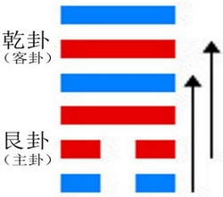

# Dùn ䷠

* Retiring

> Chinese: 遯 ䷠ dùn

<a id="p-127"/>

**Dùn ䷠** indicates successful progress (in its circumstances). To a small extent it will (still) be advantageous to be firm and correct.

1. The first `SIX`, divided, shows a retiring tail. The position is perilous. No movement in any direction should be made.

<a id="p-128"/>

> **䷠** changing to [**䷌**](e5908ce4babatongren.md)

> Matching Line 1 in Adjacent Hexagram: [**䷡**](e5a4a7e5a3aedazhuang.md#34.1)

2. The second `SIX`, divided, shows its subject holding (his purpose) fast as if by a (thong made from the) hide of a yellow ox, which cannot be broken.

> **䷠** changing to [**䷫**](e5a7a4gou.md)

> Matching Line 2 in Adjacent Hexagram: [**䷡**](e5a4a7e5a3aedazhuang.md#34.2)

3. The third `NINE`, undivided, shows one retiring but bound, -- to his distress and peril. (If he were to deal with his binders as in) nourishing a servant or concubine, it would be fortunate for him.

> **䷠** changing to [**䷋**](e590a6pi.md)

> Matching Line 3 in Adjacent Hexagram: [**䷡**](e5a4a7e5a3aedazhuang.md#34.3)

4. The fourth `NINE`, undivided, shows its subject retiring notwithstanding his likings. In a superior man this will lead to good fortune; a small man cannot attain to this.

> **䷠** changing to [**䷴**](e6b890jian.md)

> Matching Line 4 in Adjacent Hexagram: [**䷡**](e5a4a7e5a3aedazhuang.md#34.4)

5. The fifth `NINE`, undivided, shows its subject retiring in an admirable way. With firm correctness there will be good fortune.

> **䷠** changing to [**䷷**](e69785lv.md)

> Matching Line 5 in Adjacent Hexagram: [**䷡**](e5a4a7e5a3aedazhuang.md#34.5)

6. The sixth `NINE`, undivided, shows its subject retiring in a noble way. It will be advantageous in every respect.

> **䷠** changing to [**䷞**](e592b8xian.md)

> Matching Line 6 in Adjacent Hexagram: [**䷡**](e5a4a7e5a3aedazhuang.md#34.6)

## Notes

**Dùn ䷠** is the hexagram of the sixth month; the `yīn` influence is represented by two weak lines, and has made good its footing in the year. The figure thus suggested to [king Wén](https://en.wikipedia.org/wiki/King_Wen_of_Zhou) the growth of small and unprincipled men in the state, before whose advance superior men were obliged to retire. This is the theme of his essay, -- how, I when small men multiply and increase in power, [p. 129](e5a4a7e5a3aedazhuang.md#p-129) the necessity of the time requires superior men to withdraw before them.' Yet the auspice of **Dùn ䷠** is not all bad. By firm correctness the threatened evil may be arrested to a small extent.

'A retiring tail' seems to suggest the idea of the subject of the lines hurrying away, which would only aggravate the evil and danger of the time.

'His purpose' in line 2 is the purpose to withdraw. The weak 2 responds correctly to the strong 5, and both are central. The purpose therefore is symbolled as in the text. The 'yellow' colour of the ox is introduced because of its being 'correct,' and of a piece with the central place of the line.

Line 3 has no proper correlate in 6 and its subject allows himself to be entangled and impeded by the subjects of 1 and 2. He is too familiar with them, and they presume, and fetter his movements; -- compare [Analects, 17. 25](https://ctext.org/dictionary.pl?if=en&id=1561&remap=gb). He should keep them at a distance.

Line 4 has a correlate in 1, and is free to exercise the decision belonging to its subject. The line is the first in Khien, symbolic of strength.

In the [Shàng Shū IV, v, Section 2](https://ctext.org/dictionary.pl?if=en&id=21181&remap=gb), the worthy [Yī Yǐn](https://en.wikipedia.org/wiki/Yi_Yin) is made to say, 'The minister will not for favour or gain continue in an office whose work is done;' and the [Kāng Xī](https://en.wikipedia.org/wiki/Kangxi_Dictionary) editors refer to his words as an illustration of what is said on line 5. It has its correlate in 2, and its subject carries out the purpose to retire 'in an admirable way.'

Line 6 is strong, and with no correlate to detain it in 3. Its subject vigorously and happily carries out the idea of the hexagram.

# [遯 ䷠](e981afdun_cn.md)
