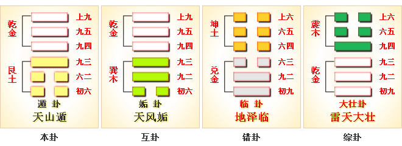

# 遯 ䷠ dùn

- No.33

> 遯，亨，小利貞。
>《彖》曰：遯亨，遯而亨也。剛當位而應，與時行也。小利貞，浸而長也。遯之時義大矣哉。
>《象》曰：天下有山，遯。君子以遠小人，不惡而嚴。

> 初六，遯尾厲，勿用有攸往。
>《象》曰：遯尾之厲，不往何災也。

> 六二，執之用黃牛之革，莫之勝說。
>《象》曰：執用黃牛，固志也。

> 九三，係遯，有疾，厲，畜臣妾吉。
>《象》曰：係遯之厲，有疾憊也。畜臣妾吉，不可大事也。

> 九四，好遯，君子吉，小人否。
>《象》曰：君子好遯，小人否也。

> 九五，嘉遯，貞吉。
>《象》曰：嘉遯貞吉，以正志也。

> 上九，肥遯，无不利。
>《象》曰：肥遯，无不利，无所疑也。

阴爻用事。阴荡阳，遁。金土见象，山在天下为遁。
> 遁，退也。

阴来阳退也。小人君子污隆，契斯义也。《易》云：“遁世无闷。”与艮为飞伏，大夫居世。建辛未为月。
> 丙午火，丙寅木。

六二得应，与君位遇建焉，臣事君，全身远害。
> 遁，俟时也。

建辛未至丙子，阴阳遁去，终而伏位。
> 从六月至十一月也。

积筭起丙子至乙亥，周而复始。
> 火土同宫，天与山遁。

阳消阴长，无专于败。《系》云：“能消者息，必专者败。”五星从位起太阴，鬼宿入位降丙辰。
> 丙辰临元士。

配于人事，为背，为手。
> 艮为背、手。

于类为狗，为山石。 

内外升降，阴阳分数二十八候。
> 分阴阳进退。

土入金为缓，积阳为天，积阴为地。山所地高峻，逼通于天。是阴长阳消，降入否。
> 阴逼阳去，入天地否卦。

# [Dùn ䷠](e981afdun.md)
