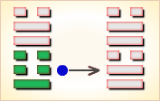
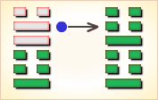

# 随 ䷐


随是跟随的意思，用于“随便”、“随从”、“跟随”、“随后”、“随意”等等。

代号是`4:6`。主卦是`4`卦震卦，卦象是雷，特性是运动，阳数是`4`。客卦是`6`卦兑卦，卦象是泽，阳数是`6`。

主方跟随客方在这生气盈然的河泽地区积极主动地探索。

随卦，泽雷随，随时变通。这个卦是异卦（下震上兑）相叠，震为雷、为动；兑为悦。动而悦就是“随”。

“随”指相互顺从，己有随物，物能随己，彼此沟通。随必依时顺势，有原则和条件，以坚贞为前提。
随：元亨利贞，无咎。天下的事物都要随时而动。这是随卦的本质含义。

图中，红色表示当位的爻，天蓝色表示不当位的爻，箭头表示有应。

- 象征：顺随
- 主卦：震卦（雷）
- 客卦：兑卦（泽）
- 卦序：17

### 总述

《随》卦讲的随从、追随，实质是从善。不论对人对事都应择善相从，向善良者学习，人与人之间，个人利益往往会有冲突，有时必须舍弃个人的私见、私利，才能维系安和乐利的社会。因而，不可固执己见，应当以群体的利益为依归，才能精诚团结，达到安和乐利的目标，这也正是今天的民主精神。随：元亨利贞，无咎。《序卦传》说：“豫必有随，故受之以随。”安和乐利的社会，必定人人都来追随。「随」是随从、随和。这一卦，主要在阐释怎样使人追随的原则；同时，也是舍弃己见，随和众人。

### 应用条件

起卦前客观地、全面地、准确地分析主方和客方情况，必须至少符合下列条件之一，此卦才有参考价值：

1. 主方与雷很相似，客方与泽很相似。
2. 主方的阳数是`4`，客方的阳数是`6`。
3. 主方的行动是阳，素质是阴，态度也是阴；客方的行动、素质和态度是阳、阳和阴。

切勿用任何随机数方式起卦，否则此卦不能用作决策工具。

### 结构和卦爻辞

图左是随卦的结构，右边是随卦的卦爻辞。别卦中，爻的顺序从下而上，爻辞与爻，一一对应，从下而上。
图中有一个箭头，表示爻之间有应，箭头的方向，由阴爻到阳爻。这有应的一对爻是主卦的中爻和客卦的中爻，中爻代表素质。

这一对爻都是黑色，黑色表示当位，即位置适当。这一对爻既有应又当位，说明主方有可能从客方受益，是对主方有利的因素，应当努力保持下去。第一爻和第四爻代表主方和客方的行动，都是阳，表示二者都是积极主动，然而，相互之间没有应，二者处于矛盾之中。第三爻是阴爻，第六爻也是阴爻，表明主客双方的态度都随和。第一爻当位，表明主方的积极主动是正确的，是潜在的对主方有利的因素，应当保持。第三爻不当位，表明主方随和的态度是不适当的，是潜在的对主方不利的因素，应当改变。主方在处理与客方的矛盾中，应当随而不从。因为客方的素质良好，跟随客方，客方到那里，主方也到那里，然而，主方应当态度坚定而明朗，谋取和扩大自己的利益，而不是盲从客方，不对客方过于随和。

随卦的第三爻爻辞和第四爻爻辞都有“随”，第二爻爻辞和第三爻爻辞都有“系”，第六爻爻辞有“维”，说明主方不仅仅要跟随客方，而且要与客方维系在一起。第一爻爻辞指出，这种维系在一起的关系，首先要靠交往，“出门交”，在交往过程中要诚恳，要诚恳维持着这种跟随关系，“孚于嘉”。

爻辞中的判断词是根据爻在卦中的状态加进去的，删除判断词，就可以看出六条爻辞是一首完整的围绕主题“随”的散文诗：

```
官长的行动有变化，
出门（与他）交往有功劳。
（交往中）只注重弱者，就可能忽略强者，
应当充分注意强者，把弱者放在次要地位；
跟随强者，可以获得所希望有的东西。
跟随有收获，坚持不变有凶险，
以诚信（交往）合乎情理，
以此明确行动，何以怪罪？
诚信给于最佳效果，
（与官长）紧密联系，继续跟随，
（如同）周王在歧山祭祀祖先。
```

下面逐条说明卦爻辞。

### 卦辞解释
```
随：元、亨、利、贞，无咎。
虞翻曰：否上之初，刚来下柔，初上得正，
故“元、享、利、贞，无咎”。
郑玄曰：震，动也。兑，说也。
内动之以德，外说之以言，
则天下之人，咸慕其行，而随从之，故谓之随也。
既见随从，能长之以善，
通其嘉礼，和之以义，干之以正，
则功成而有福，若无此四德，则有凶咎焉。
焦赣曰：汉高帝与项籍，其明徵也。

《彖》曰：随，刚来而下柔，动而说，随。
虞翻曰：否乾上来之坤初，故“刚来而下柔”。
动，震，说，兑也。
大亨贞，无咎。荀爽曰：随者，震之归魂。
震归从巽，故大通。动爻得正，故利贞。
阳降阴升，嫌于有咎。动而得正，故“无咎”。

而天下随时，
虞翻曰：乾为天，坤为下，震春兑秋。
三四之正，坎冬离夏。
四时位正，时行则行，故“天下随时”矣。
随之时义大矣哉。
蜀才曰：此本否卦。
刚自上来居初，柔自初而升上，
则内动而外说，是动而说随也。
相随而大亨无咎。得于时也。
得时，则天下随之矣。故曰“随之时义大矣哉”。

《象》曰：泽中有雷，随。
《九家易》曰：兑泽震雷，八月之时。
雷藏于泽，则天下随时之象也。
君子以向晦入宴息。崔元曰：晦者，冥也。
雷者，阳气，春夏用事。
今在泽中，秋冬时也。故君子象之。
日出视事，其将晦冥，退入宴寝而休息也。
侯果曰：坤为晦，乾之上九来入坤初，向晦者也。
坤初升兑，兑为休息入宴者也。
欲君民者，晦德息物，动说黎庶，则万方归随也。
```

### 卦辞概述
```
〖卦辞原文〗随：元，亨，利，贞，无咎。
〖译文〗《随卦》象征随从，随和：
如果随从、随和，便能始终亨通，和谐有利。
固守正道，没有任何危险。
```

### 象传
```
泽中有雷，随；君子以向晦入宴息。

〖译文〗《象辞》说：
《随卦》的卦象是震（雷）下兑（泽）上，
为泽中有雷之表象。
泽中有雷声，泽随从雷声而震动，这便象征随从。
君子行事要遵从合适的作息时间。
白天出处辛劳工作，夜晚就回家睡觉安息。

〖解说〗“元亨，利贞，无咎”是卦辞，
综合说明卦所代表的情况。
“元”（yuán）是第一。“亨”（hēng），顺利。
“贞”（zhēn）是坚持下去。“咎”（jiù）是怪罪。
卦辞的前提是“随”，强调主方应当跟随客方。
如果不“随”，不跟随客方，孤独行动，
进展就不一定顺利；主方就不一定不受怪罪。

在豫卦的春天雷出地奋，万物喜悦跟随蓬勃生长，
但到了秋天雷乃收声龙将潜渊。
那么君子做事就要跟随天时有行有止劳逸结合，
君王治理国家也要让万民休养生息，这就是跟随天时之“随”。
尺蠖之屈以求信也，龙蛇之蛰以存身也，
天地万物跟随自然能得“元亨”。
而人的随从之道则不然，天地万物既能阴随阳，也能阳随阴。
但人一般只会部下随领导，臣民随君王，反过来却做不到。
再加上今人随从古人，
以及沿袭以前的政治制度等等，有可能盲目随从。
人际交往相随，必须合乎正道，如果随而不正丧失原则，
就会破坏和谐的人际关系，动而有悔，故称“利贞”。
天地宇宙阳消阴长日新月异，人也必须做到与时俱进随正而行，
才不会出现过失和差错，故称“无咎”。
```

### 彖传
```
随，刚来而下柔，动而说。
随大亨，贞无咎，而天下随时，随时之义大矣哉。

〖译文〗彖传说：随卦，雷龙潜回地渊，
象征阳刚君子回到柔顺民众之下，主动随从于民，
民众也因感应随从于阳刚君子，阴阳和谐刚柔并济，
只有首先与民众真诚交心，民众才能喜悦相随而动。
万物跟随天之大道得以元亨，
民众跟随有德大人才能亨通，人际交往随从正道则可无咎。
其实纵观天下万事万物，莫不跟随天时运行而得亨通，
龙出龙隐，雷发雷收，春夏秋冬，
寒来暑往，随天则昌逆时则衰，
君子之行劳逸结合动静有常，国家也要让民众休养生息，
随天时而动的现象比比皆是，其包含的义理真是广大无边啊！
```

### 一阳
```
〖原文〗官有渝，贞吉；出门交有功。

〖译文〗官长的行动有变化，
坚持变化是吉利的，出门交往有功劳。

〖解说〗这是随卦第一爻的爻辞，
这是阳爻，表示主方积极主动地谋取和扩大自己的利益，
比如说，创新、创业、投资、进攻、求职、示爱，等等。
“官”指客方。“渝”（yú），变化的意思。
客方变了，调主方要适应形势而随之变化，并且要坚持变化。
用灵活变化的策略对外交往，有可能取得成功。

〖结构分析〗第一爻的位置是阳位，
这条爻是阳爻，当位，与四阳不有应，与客方的积极行动有冲突。
主方的积极主动是正确的，应当坚持，不须要回避矛盾，
应当积极与客方交往，跟随客方，客方到那里，主方也到那里，
如果有冲突，就积极应对，奉陪倒底。

译文：官事有了变化，要贞正自守，
出门与人交往，且会获得成功。
【白话】初九，思想随时代而变化，坚持正道可获吉祥。
出门交朋友，一定能成功。
启示：追随持正道而中正者。
《象》曰：“官有渝”，从正吉也；“出门交，有功”，不失也。
【白话】《象辞》说：“思想随时代而变化”，
但无论怎么变，都必然始终遵从正道，这样就可以获得吉祥。
“出站交朋友，一定能成功”，
这是因为其唯正是从，见善则从，没有过失的缘故。
```

### 二阴
```
〖原文〗系小子，失丈夫。

〖译文〗如果只注重弱者的现况，就可能忽略强者的现况。

〖解说〗这是随卦第二爻的爻辞。
第二爻是阴爻，表示主方素质不佳，比如说，
资金缺乏、地位底下、实力薄弱、教育程度低，等等。
“小子”和“丈夫”都是形象，都是比喻，
不能狭义地理解为具体的小子和丈夫。
在这个例子中，
“小子”是指相对弱小的一方，“丈夫”指相对强大的一方。
也就是说，
“小子”是指主方，它的阳数是4；
“丈夫”是指客方，其阳数是6。
这条爻辞提醒主方，
不应当只考虑主方自己的状态，而忽略客方的状态。

〖结构分析〗第二爻的位置是阴位，
这条爻是阴爻，当位，又与五阳有应。
主方的阴的素质对于主方有利，
主方有可能从客方的良好素质获益，
利用客方素质上的优势，补足自己的不足。

【白话】六二，倾心随从于年轻小子，
则会失去了阳刚方正的丈夫。
《象》曰：“系小子”，弗兼与也。
【白话】《象辞》说：
“倾心随从于年轻小子则会失去阳刚方正的丈夫”，
因为二者是互相排斥的，是不可兼得的。
译文：把儿子拴住了，丈夫却跑出去了。
启示：勿贪近利，要目光长远。
```

### 三阴
```
〖原文〗系丈夫，失小子；随有求得，利居贞。

〖译文〗应当充分注意强者情况，
把弱者情况放在次要地位；
跟随强者而行动，则可以获得所希望有的东西。
应当保持现在主客双方的状态。

〖解说〗这是随卦第三爻的爻辞，
第三爻是阴爻，表示主方态度随和。
同时，第三爻是对第二条的补充，
第二条是阴，第三条也是阴，这表示主方的素质很差。
“利居贞”中“居”（jū），居住、安居、居心叵测。
“丈夫”指客方，“小子”指主方。
主方应当充分注意客方情况，把主方现况放在次要地位；
跟随客方行动，则可以获得所希望有的东西，
应当坚持安于跟随客方的现状。

〖结构分析〗第三爻的位置是阳位，
这条爻是阴爻，不当位，又与六阴不有应。
不当位，表明主方的随和态度是不对的，
主方应当态度坚定而明朗，
在跟随客方的过程中，注意寻取自己的利益。

【白话】六三，随从阳刚方正的丈夫行事，
则必然丢失年轻小子。随从于丈夫，有求必得，
有利于安居乐业，坚守妇道，贞节处世。
《象》曰：“系丈夫”，志舍下也。
【白话】《象辞》说：“随从阳刚方正的丈夫行事”，
专心不二，说明其志在于舍弃下方的年轻小子。
译文：把丈夫系住了，儿子却跑出去了。
随意寻找后立即找到了。若贞正自居，更为有利。
启示：追随才德优于自己者。
```

### 四阳
```
〖原文〗随有获，贞凶；有孚在道，以明何咎。

〖译文〗跟随有收获，坚持不变有凶险，
有诚信合乎情理，以此明确行动，何以怪罪？

〖解说〗这是随卦第四爻的爻辞，是阳爻，
表示客方积极主动地谋取和扩大自己的利益，
比如说，创新、创业、投资、进攻、求职、示爱，等等。
“随有获，贞凶；有孚在道，以明何咎”，
其中，“孚”（fú），诚信。
客方在积极谋取自己的利益，主方怎么办？
“随有获，贞凶”，
主方也应当跟随客方谋取自己的利益，
如果坚持不变，是有凶险的。
以诚信对待客方，合乎情理，
以此明确行动，有何可以怪罪？

〖结构分析〗第四爻的位置是阴位，
这条爻是阳爻，不当位，并且与一阳不有应。
客方的阳的行动有可能不利于主方，
然而，主方不能改变客方行动，只能跟随客方，
客方到那里，主方也到那里，不回避矛盾，
如果有冲突，主方应当积极应对。

【白话】九四，他人追随自己，虽有收获，
但有可能发生凶险。虽有凶险，但只要心存诚信，
不违正道，使自己的美德显明，那还有什么危害呢？
《象》曰：“随有获”，其义凶也。“有孚在道”，明功也。
【白话】《象辞》说：“他人追随自己，虽有收获”，
但因居位不当，有“震主”之嫌，所以可能有凶险。
但只要“心存诚信，不违正道”，则可逢凶化吉，
这是由于立身光明磊落所带来的功效。
译文：随之而来的是收获，虽然对贞，但也有凶。
在与人交往的道路上，有诚心，光明磊落，还有什麽灾咎可言？
启示：要诚信守分，还要知明哲保身之机。
```

### 五阳
```
〖原文〗孚于嘉，吉。

〖译文〗诚信于最佳效果，吉利。

〖解说〗这是随卦第五爻的爻辞，
阳性，表示客方素质良好，比如说，
客方有资金、有地位、有权力、有实力、有技术，等等。
这条爻辞的意思是：以诚信致力于最佳效果，吉利。
言外之意是，如果不是以诚信致力于最佳效果，就不一定吉利。
什么是最佳效果呢？在其它爻的爻辞中已经清楚地说明：
要充分重视客方良好的素质，
认真地跟随客方以获得所希望的东西，以诚信对待客方。

〖结构分析〗第五爻的位置是阳位，
这条爻是阳爻，当位，并且与二阴有应。
客方的阳的素质对主方有利，
主方应当争取利用客方的良好素质获取利益。

【白话】九五，把诚信带给诚实善良之人，可获吉祥。
《象》曰：“孚于嘉，吉”，位正中也。
【白话】《象辞》说：“把诚信带给诚实善良之人，可获吉祥”，
这是因为九五爻得正居中，不倚不偏。
译文：相互友善又讲求信用，当然吉利。
启示：择善而从，择类而从。
```

### 六阴
```
〖原文〗拘系之，乃从维之，王用亨于西山。

〖译文〗紧密联系起来，以致维持跟随状态，周王在歧山祭祖。

〖解说〗这是随卦第六爻的爻辞，阴性。表示客方态度随和。
“拘系之，乃从维之，王用亨于西山”，
其中，“拘”（jū），拘留，拘束。
“系”（xì），联系，关系。
“维”（wéi），维系，维护，维持。
“王用亨于西山”，
指周文王等周时的王在周的西部的歧山祭其祖先，是历史典故。
这条爻辞的意思是：与客方的行动紧密联系起来，
以致维持跟随状态，像周王在歧山祭祖那样，跟随祖先的发展路线。

〖结构分析〗第六爻的位置是阴位，
这条爻是阴爻，当位，然而与三阴不有应。
主方应当利用客方的随和态度，
坚定而明朗地保持与客方联系，从中维护自己的权益。

【白话】上六，只有拘禁起来强迫、命令他，
他才不得不顺服追随，再用绳索捆绑紧，才能追随到底。
君王在西山设祭，要出师讨伐那些不顺从的人。
《象》曰：“拘系之”，上穷也。
【白话】《象辞》说：
“只有拘禁起来强迫、命令他，他才不得不顺服追随”，
这是因为上六爻高居《随卦》最上爻，物极必反的缘故。
译文：把他们看管起来，然后把他们一个接一个捆在一起，
国王用他们祭祀西山之神。
启示：诚信团结为“随”卦之根本。
```

### 新解
```
（震下兑上）
随①：元亨，利贞，无咎。
初九：官有渝②，贞吉。出门交有功③。
六二：系小子④，失丈夫⑤。
六三：系丈夫，失小子。随有求得⑥利居贞。
九四：随有获，贞凶。有孚在道，以明⑦，何咎。
九五：孚于嘉⑧，吉。
上六：拘系之，乃从维之⑨。王⑩用亨于西山。

【注释】
① 随是本卦标题。随的意思是顺从，相随。
全卦的内容讲商人出门做生意和贩卖奴隶的情况。
② 官：古“馆”字，指馆舍，旅馆。
③ 交：交往，这里指互相帮助。
④ 小子：这里指年龄小的奴隶。
⑤ 丈夫：这里指成年的奴隶。
⑥ 求得：意思是希望获得利益。
⑦ 明：这里用作“盟”，意思是订立盟约。
⑧ 嘉：周代一个小国的名称，也称“有嘉”。
⑨ 维：捆绑。
⑩ 王：指周文王。西山：指岐山。

【译文】
随卦：大吉大利，吉利的占卜，没有灾祸。
初九：旅馆中发生了变故，但占得吉利。
出门同行互相帮助有好处。
六二：抓住了年少的奴隶，成年的奴隶逃跑了。
六三：抓住了成年的奴隶，年少的奴隶逃跑了。
结伴出门经商是为了获利。占问居住处得到吉兆。
九四：商人结伴出门是为了获利，占问得到凶兆。
押送俘虏上路，互相订立了盟约，没有灾祸。
九五：俘虏了嘉国的人，吉利。
上六：把俘虏拘禁起来，紧紧捆住。
周文王在岐山把他们作人牲祭祀神灵。

【读解】
这一卦所讲的出门经商所干的勾当是贩卖奴隶，
其中透露出奴隶的两个来源：
一个是商业买卖，一个是战争中的俘虏。
同时，我们也了解到了那时还用奴隶的生命来祭祀神灵。
这些情况至少让我们立刻联想到两点。
首先是用现代人道主义的观点来看，
贩卖和残杀奴隶是野蛮和骇人听闻的，在今天看来是不可思议的。
其次是西方近代史上殖民主义者打着人道主义旗号贩卖奴隶、
残害奴隶的血腥史实（法国作家梅里美的小说《塔曼戈》，
和美国作家斯陀夫人的小说《汤姆叔叔的小屋》均有真切描述）。
用道德化的观点来看历史，可以完全肯定地说，
奴隶制是人类历史上黑暗、野蛮、残酷、血腥、丑恶的一页，
理所应当口诛笔伐。不过，也可以用另一种观点来看待历史，
那就是历史唯物主义的态度。
从这种观点来看，奴隶制是人类社会历史发展过程中的必然。
它为人类的物质和精神文明也作出过巨大的贡献。
当然，这个推动力的主角，不是奴隶主，
而是被他们侮辱和残害的奴隶。
这一点，作者无论如何是想不到的。
```


### 《断易天机》解

随卦兑上震下，为震宫归魂卦。随即顺从、随时之意，占得此卦，凡事顺心，吉无不利。

### 北宋易学家 邵雍 解

随顺和同，贞固自持;随从机运，不能专横。

小吉：得此卦者，宜随大势，其事可成。凡事与他人多沟通交流，可名利双收。切不可坚持己见，专横者事不成。

### 台湾国学家 傅佩荣 解

- 时运：明年运行，五年方展。
- 财运：堆积存货，明春有利。
- 家宅：防止惊惧。
- 身体：休养为宜;牢狱之灾。

### 传统解卦
```
这个卦是异卦（下震上兑）相叠，
震为雷，为动；兑为悦，动而悦就是“随”。
随指相互顺从，己有随物，物能随己，彼此沟通。
随必依时顺势，有原则和条件，以坚贞为前提。

大象：震木在兑泽之下，木必随水漂荡，随者，顺也。
```

运势：有去旧迎新之吉象，宜与人合作，可获厚利，忌三心两意，或独断独行。

- 事业：对社会和人生有正确的估价，重视人际关系，善于同他人合作，事业会很顺利。为了保证取得更进一步的成功，不得贪图小利，向比自己优秀的人学习，择善而从，心存诚信、努力开拓事业。
- 经商：顺利。在与他人的真诚合作下，能够达到预期的目的。在竞争中应保持清醒头脑，从大处、长远考虑，遵守商业道德，保持至诚的态度对待顾客和同行，会保持竞争优势。
- 求名：在自己刻苦钻研的基础上，虚心向有德有才的师长学习，借助外界的力量，促使自己更快的进步，实现个人的理想。
- 婚恋：双方情投意合可以成功，家庭和睦，但若迷恋于情爱，会影响双方的事业，务必注意。
- 决策：个人成长道路并不十分顺利，但由于谦虚、随和，人际关系好，尤其能够得到长辈的器重，各种事都能在他人的帮助和关心下成功。但务必注意追随他人应有的立场和原则，不可趋炎附势，招致祸凶。

### 台湾 张铭仁 解卦
```
随：表示随遇而安，一切随缘、随和。主吉象。
事事均可依随着自己的心思计划来执行，会顺利地达成。
事业、投资、理财、感情，均会有令人满意的发展和收获。

解释：跟随上司主意行事。

特性：交际佳，贵人运多，
善谋略，为辅佐良才，保守，被动。
```

运势：物事均有去旧迎新之吉象，凡事与他人互相通达、协商，可名利双收。倘若三心二意，或独立单行，不听人言劝，有自招灾祸之虞。

- 家运：本身有相当不错的收入，富有之象。但不可过于放纵，守操节为宜。
- 疾病：病重，须长期治疗，注意口腔、肝、足患等症。
- 胎孕：无碍，无惊险。
- 子女：亲情融洽，与六亲和睦，幸福之象。
- 周转：和气相商有利，意气用事则难成。
- 买卖：勿顽强固执，则交易有利。否则失之，有阻。
- 等人：会迟到。
- 寻人：不必去找了，过些时日会自己回来，勿急。
- 失物：即将疏忽之时，会突然察觉。
- 外出：吉利。可以改变处境。
- 考试：成绩理想。
- 诉讼：宜决意和解，目前无忧，但不久须防有祸。
- 求事：虽吉，然若能谦逊待人，多接受别人意见，会得人提拔。
- 改行：有充份计划者可行。
- 开业：吉利。

## 初九爻详解
### 初九爻辞

初九。官有渝，贞吉。 出门交有功。

《象》曰：官有渝，从正吉也;出门交有功，不失也。

### 白话文解释

初九：馆舍时里发生事故，筮遇此爻则吉，出门同行都得好处。

《象辞》说：官吏把事情办坏了，归从正道则吉利。出门同行都得好处，这是不失正道的缘故。

### 北宋易学家 邵雍 解

吉：得此爻者，多获利。做官的正当好运，有升迁之机。

### 台湾国学家 傅佩荣 解

- 时运：交运之时，利于变动。
- 财运：货物外售，可以得利。
- 家宅：装修迁居。
- 身体：改变用药，远方求医。

### 初九变卦：泽雷随 变卦 泽地萃


初九爻动变得[第45卦：泽地萃](e89083cui_cn.md)。

这个卦是异卦相叠（下坤上兑）。

坤为地、为顺;兑为泽、为水。

泽泛滥淹没大地，人众多相互斗争。

危机必四伏，务必顺天任贤，未雨绸缪，柔顺而又和悦，彼此相得益彰，安居乐业。
萃，聚集、团结。

## 六二爻详解
### 六二爻辞

六二。系小子，失丈夫。

《象》曰：系小子，弗兼与也。

### 白话文解释

六二：抓住了未成年的奴隶，跑了成年的奴隶。

《象辞》说：抓住了小的，跑了大的，意思是两者不能兼得。

### 北宋易学家 邵雍 解

凶：得此爻者，不安宁，或受小人的暗算，是非不断。当官的宜退守，进取者要有自知之明。

### 台湾国学家 傅佩荣 解

- 时运：形势颠倒，最好谨慎。
- 财运：贪小失大，显然不利。
- 家宅：家主受累;婚嫁不妥。
- 身体：顾此失彼。

### 六二变卦：泽雷随 变卦 兑为泽



六二爻动变得[第58卦：兑为泽](e58591dui_cn.md)。

这个卦是同卦（下泽上泽）相叠。

泽为水。两泽相连，两水交流。

上下相和，团结一致，朋友相助，欢欣喜悦。

兑为悦也。同秉刚健之德，外抱柔和之姿，坚行正道，导民向上。

## 六三爻详解
### 六三爻辞

六三。系丈夫，失小子。随有求，得，利居贞。

《象》曰：系丈夫，志舍下也。

### 白话文解释

六三：抓住了成年奴隶，跑了未成年奴隶。希望无失不如现得。筮遇此爻，卜问居处则吉利。

《象辞》说：抓了大的，跑了小的，其志在于追逐大的，舍弃小的。

### 北宋易学家 邵雍 解

平：得此爻者，营谋遂意，但宜走正道，才能得利。做官的会得到保举而升迁有望。

### 台湾国学家 傅佩荣 解

- 时运：求财求名，皆为正运。
- 财运：小往大来，利益可期。
- 家宅：积蓄有成，关心子女。
- 身体：大人无妨，小孩不利。

### 六三变卦：泽雷随 变卦 泽火革


六三爻动变得[第49卦：泽火革](e99da9ge_cn.md)。

这个卦是异卦（下离上兑）相叠。

离为火、兑为泽，泽内有水。

水在上而下浇，火在下而上升。

火旺水干；水大火熄。

二者相生亦相克，必然出现变革。变革是宇宙的基本规律。

## 九四爻详解
### 九四爻辞

九四。随有获，贞凶。有孚，在道以明，何咎?

《象》曰：随有获，其义凶也。有孚在道，明功也。

### 白话文解释

九四：追名逐利，贪多务获，卜问得凶兆。押送俘虏上路，明于约束，没有灾难。

《象辞》说：追名逐利，贪多务获，这种人遭遇凶险是应该的。谨守信用，严守正道，这是明察事功的结果。

### 北宋易学家 邵雍 解

平：得此爻者，会得到好人的抬举，化凶为吉。做官的会身居要职，努力进取者可成事，可获得名利。

### 台湾国学家 傅佩荣 解

- 时运：吉凶互见，明年吉祥。
- 财运：虽有获利，小心意外。
- 家宅：置屋不宜。
- 身体：先凶后吉。

### 九四变卦：泽雷随 变卦 水雷屯


九四爻动变得[第3卦：水雷屯](e5b1afzhun_cn.md)。

这个卦是异卦（下震上坎）相叠，

震为雷，喻动;坎为雨，喻险。

雷雨交加，险象丛生，环境恶劣。

“屯”原指植物萌生大地。

万物始生，充满艰难险阻，然而顺时应运，必欣欣向荣。

## 九五爻详解
### 九五爻辞

九五。孚于嘉，吉。

《象》曰：孚于嘉吉，位正中也。

### 白话文解释

九五：俘虏了不少嘉人，吉利。

《象辞》说：信守中正之道，诸事吉利，因为九五之爻居上卦中位，像人守中正之道。

### 北宋易学家 邵雍 解

吉：得此爻者，营谋遂意，多喜庆之事，做官的会升职，或多喜事。

### 台湾国学家 傅佩荣 解

- 时运：正当好运，诸事皆吉。
- 财运：货物上品，得利不少。
- 家宅：积善之家;婚嫁可喜。
- 身体：无须担心。

### 九五变卦：泽雷随 变卦 震为雷



九五爻动变得[第51卦：震为雷](e99c87zhen_cn.md)。

这个卦是同卦（下震上震）相叠。

震为雷，两震相叠，反响巨大。

可消除沉闷之气，亨通畅达。

平日应居安思危，怀恐惧心理，不敢有所怠慢，遇到突发事变，也能安然自若，谈笑如常。

## 上六爻详解
### 上六爻辞

上六。拘系之，乃从维之;王用亨于西山。

《象》曰：拘系之，上穷也。

### 白话文解释

上六：将俘虏拘禁起来，紧紧捆绑，周文王将他们作为人牲在西山祭祀神灵。

《象辞》说：被捆绑拘禁，因为上六居一卦之尽头，像人处于穷困之境地。

### 北宋易学家 邵雍 解

凶：得此爻者，苦难多多，不很如意，重病者会有生命之忧。做官的须防止小人的谗言。

### 台湾国学家 傅佩荣 解

- 时运：困难重重，难以如意。
- 财运：稳扎稳打，未能伸展。
- 家宅：家人抱怨;嫁娶有缘。
- 身体：诚心祷告;可能归魂。

### 上六变卦：泽雷随 变卦 天雷无妄


上六爻动变得[第25卦：天雷无妄](e697a0e5a684wuwang_cn.md)。

这个卦是异卦（下震上乾）相叠。

乾为天为刚为健；震为雷为刚为动。

动而健，刚阳盛，人心振奋，必有所得。

但唯循纯正，不可妄行。无妄必有获，必可致福。

# [Suí ䷐](e99a8fsui.md)
