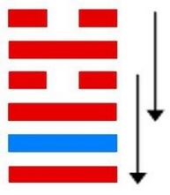
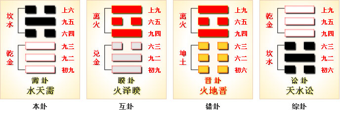

# 需 ䷄



“需”（䷄ xū）卦的代号是`7:2`。下部是主卦，代表主方，是乾卦，阳数是`7`，卦象是天，天运转不息，具有无穷威力；上部是客卦，代表客方，是坎卦，阳数是`2`，卦象是水，水总是往下流，有力，可以浮舟，也可以沉舟。主方积极主动，实力非常强大，态度强硬；而客方消极被动，处境困难，但是素质仍然良好，仍有相当实力，态度随和。如果主方强行从客方谋取利益，双方都可能遭受损失，所以主方应当耐心等待时机，取得客方信任，从而能够从客方良好素质受益。需卦，水天需，守正待机。中上卦。明珠土埋日久深，无光无亮到如今，忽然大风吹土去，自然显露有重新。

图中，红色表示当位的爻，天蓝色表示不当位的爻，箭头表示有应。

- 卦序：5

> 需，有孚，光亨，貞吉，利涉大川。
>《彖》曰：需，須也，險在前也。剛健而不陷，其義不困窮矣。需，有孚，光亨，貞吉，位乎天位，以正中也。利涉大川，往有功也。
>《象》曰：雲上於天，需，君子以飲食宴樂。

> 初九，需于郊，利用恒，无咎。
>《象》曰：需于郊，不犯難行也。利用恆，无咎，未失常也。

> 九二，需于沙，小有言，終吉。
>《象》曰：需于沙，衍在中也，雖小有言，以吉終也。

> 九三，需于泥，致寇至。
>《象》曰：需于泥，災在外也。自我致寇，敬慎不敗也。

> 六四，需于血，出自穴。
>《象》曰：需于血，順以聽也。

> 九五，需于酒食，貞吉。
>《象》曰：酒食貞吉，以中正也。

> 上六，入于穴，有不速之客三人來，敬之終吉。
>《象》曰：不速之客來，敬之終吉，雖不當位，未大失也。



> “需”（䷄ xū）卦是异卦，下乾上坎，相叠。下卦是乾，刚健之意；上卦是坎，险陷之意。以刚逢险，宜稳健之妥，不可冒失行动，观时待变，所往一定成功。

>《象传》：云登天上而未雨，不能急进，等待时机之象。

> 智者必须待时而行，急进反见凶险。

- 事业：关键在于审时度势，耐心等待，事成于安祥，切勿冒险，欲速不达。自己要充满自信，临危不惧，坚守中正，必可化险为夷。情况有利时，仍得居安思危。
- 经商：行动之初，情况困难，必须以极大的耐心，创造条件和机会，行事光明磊落，观时待变，实现愿望。事情接近成功时，更应小心谨慎，切莫功亏一篑。
- 求名：时机尚不成熟，应耐心等待。这时应坚定信念，不为闲言流语所动摇，努力丰富自己，再求助可靠的人便可成功。
- 婚恋：慎重，切不可草率行事，逐渐培养感情，以诚实、热情相待，会发生变故，仍可以有良好的结局。双方都应懂得以柔克刚的道理。
- 决策：前途光明，有雄心大志，且可实现。为此需要积蓄实力，等待时机，大器晚成。本人具有坚强的意志，冷静的头脑。前进途中会遇到困难和险阻，必须十分谨慎，坦然对待小人的中伤，在灾祸在面前能镇静自若。不轻举妄动，冷静选择方向。为人谦和、坦率，多有他人相助，促使事业成功。当时机成熟后，必然一帆风顺。

需卦坎上乾下，为坤宫游魂卦。需为踌躇、期待，虽然刚强，但前面有险阻，应当等待，涉大川则利。

坎陷当前，遇阻不进；大器晚成，收成在后。得此卦者，时机尚未成熟，需要耐心等待，急进反会见凶。

- 时运：时机尚未成熟，耐心等待。
- 财运：资本未集，无法开张。
- 家宅：平安是福。
- 身体：调节饮食，健康有望。

```
需：表示需要、需求，但却又是时机未到。
此卦凶中带吉，需耐心等待，则事情可成。
健康方面，要特别注意。

解释：需要等待时机。

特性：谦恭有礼，性格保守，
稍被动，但为人诚恳，欲求不高，中晚年才渐入佳境。
不利早婚，有宗教艺术兴趣。
```

运势：宜退守正道，不宜冒险前进，投机急取反而失利。须知贪小失大，智者必须待时也。

- 家运：初为多事之秋，须凭智慧耐心挽救颓势。
- 疾病：病情拖延，须留心治疗，为头、胸、肺、泌尿系统等病。
- 胎孕：临产之时才占卜，表示会有障碍。防克产母。
- 子女：得子迟。
- 周转：不能预期而得，有延滞。
- 买卖：有口舌不可成就，亦勿贪小而失大。
- 等人：迟到。
- 寻人：此出走之人因感情之事，在西北或北方。
- 失物：即时不能寻回，需经过一段时间将会出现。
- 外出：充分准备齐全后，可平安无事。
- 考试：要多用功。
- 诉讼：暂时未能了结，以和为贵。
- 求事：不宜急取，急亦不得，再等待，再寻求。
- 改行：不宜。
- 开业：不宜。

### 初九：需于郊，利用恒，无咎。《象》曰：需于郊，不犯难行也；利用恒，无咎，未失常也。

在郊外等侯，应该照旧等待下去，没有危险。《象传》：在郊外等候，是说不能冒险前进。照旧等待下去，没有危险，这是因为待机而动没有违反正常的原则。

平：得此爻者，宜守旧，则无灾祸。做官的须守常职，耐心等待机会。

- 时运：必须久待，守恒为要。
- 财运：暂勿投资，货物无损。
- 家宅：可居郊外。
- 身体：幽居养病，终无大碍。


初九爻动变得[第48卦：水风井](e4ba95jing_cn.md)。

水风井䷯是异卦，下巽上坎，相叠。坎为水；巽为木。树木得水而蓬勃生长。人靠水井生活，水井由人挖掘而成。相互为养，井以水养人，经久不竭，人应取此德而勤劳自勉。

### 九二。需于沙，小有言，终吉。《象》曰：需于沙，衍在中也；虽小有言，以终吉也。

在沙地上等待，稍微有过错，最后还是吉利的。《象传》：在沙地上等待，沙地软柔难通行，将有延误事机之失，这过失在自身。虽然稍微有过错，最后的结果还是好的。

吉：得此爻者，会受到争诉之扰，若能以宽厚待人，则不辩自明。做官的会受到流言的困扰，但最后吉祥。

- 时运：流言困阻，最后吉祥。
- 财运：货运不通，无害商业。
- 家宅：口舌之争。
- 身体：心胸宽大，自然吉祥。


九二爻动变得[第63卦：水火既济](e697a2e6b58ejiji_cn.md)。

水火既济䷾是异卦，下离上坎，相叠。坎为水，离为火。水火相交，水在火上，水势压倒火势，救火大功告成。既，已经；济，成也。既济就是事情已经成功，但终将发生变故。

### 九三：需于泥，致寇至。《象》曰：需于泥，灾在外也。自我致寇，敬慎不败也。

在泥淖中等待，把强盗招引过来。《象传》：在泥淖中等待，泥淖污秽，环境险恶，灾难就在附近。由自己招致了强盗，但郑重谨慎，随机应变，就可不受损伤。

凶：得此爻者，须防止窃盗之患，亦要预防水险。做官的会被贬职。

- 时运：难期上达，谨慎自持。
- 财运：无法流通，小心受骗。
- 家宅：婚事难成，成则怨偶。
- 身体：小心外伤。


九三爻动变得[第60卦：水泽节](e88a82jie_cn.md)。

水泽节䷻是异卦，下兑上坎，相叠。兑为泽，坎为水。泽有水而流有限，多必溢于泽外。因此要有节度，故称节。节卦与涣卦相反，互为综卦，交相使用。天地有节度才能常新，国家有节度才能安稳，个人有节度才能完美。

### 六四。需于血，出自穴。《象》曰：需于血，顺以听也。

六四：起初在血泊中滞留，后来从凶险的陷阱中逃脱出来。《象传》：在血泊中滞留，坐等不测的命运降临，六四之爻处在九五之爻的威逼之下，只得顺从强者，听从摆布。

平：得此爻者，坏运逐渐远离，恢复平静。做官的能全身而退。从事国学者可出身成名。

- 时运：用尽心力才可出头。
- 财运：投资矿业，有利可图。
- 家宅：乔迁之喜。
- 身体：调养气血，和顺阴阳。


六四爻动变得[第43卦：泽天夬](e5a4acguai_cn.md)。

泽天夬䷪是异卦，下乾上兑，相叠。乾为天为健；兑为泽为悦。泽气上升，决注成雨，雨施大地，滋润万物。五阳去一阴，去之不难，决（去之意）即可，故名为夬（guài），夬即决。

### 九五：需于酒食，贞吉。《象》曰：酒食贞吉，以中正也。

在酒宴上等待，这是吉利的占兆。《象传》：有酒有肉，吉利之兆，因为九五之爻处于上卦中位，象征其人有中正的品德，自能择善而居，处优容之境。

吉：得此爻者，会物产丰富，衣食不缺，也会有婚嫁之喜。做官的食禄会丰厚。

- 时运：功成名就，可以宴乐。
- 财运：投资饮食业，可获利。
- 家宅：婚嫁得宜。
- 身体：饮食调理。


九五爻动变得[第11卦：地天泰](e6b3b0tai_cn.md)。

地天泰䷊是异卦，下乾上坤，相叠。乾为天，为阳；坤为地，为阴。阴阳交感，上下互通，天地相交，万物纷纭。反之则凶，万事万物，皆对立，转化，盛极必衰，衰而转盛，故应时而变者泰（通）。

### 上六。入于穴，有不速之客三人来，敬之终吉。《象》曰：不速之客，敬之终吉；虽不当位，未大失也。

进入地穴式的房屋，有三位不速之客来到，恭敬地接待他们，结果是吉利的。《象传》：不速之客来了，恭敬地接待他们，结果是吉利的。因为全卦阳刚过甚，逼压阴柔，但是上六处阴位，位置合适，所以有惊无险，没有大的损失。

平：得此爻者，宜谨慎，则忧愁自散。做官的会有升迁之机会，但须防谗邪之流。

- 时运：凭险自守，和解为贵。
- 财运：得价则售，不可贮藏。
- 家宅：持家有道；少男乃吉。
- 身体：病况凶险，不存侥幸。


上六爻动变得[第9卦：风天小畜](e5b08fe7959cxiaoxu_cn.md)。

风天小畜䷈是异卦，下乾上巽，相叠。乾为天，巽为风。喻风调雨顺，谷物滋长，故卦名小畜（蓄）。力量有限，须待发展到一定程度，才可大有作为。

# [Xū ䷄](e99c80xu.md)
