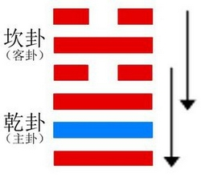

# 需 ䷄



“需”（xū）的意思是等待。需卦的代号是`7:2`。

需卦下部是主卦，代表主方，是乾卦，阳数是`7`，卦象是天，天运转不息，具有无穷威力；需卦上部是客卦，代表客方，是坎卦，阳数是`2`，卦象是水，水总是往下流，有力，可以浮舟，也可以沉舟。

主方积极主动，实力非常强大，态度强硬；而客方消极被动，处境困难，但是素质仍然良好，仍有相当实力，态度随和。

如果主方强行从客方谋取利益，双方都可能遭受损失，所以主方应当耐心等待时机，取得客方信任，从而能够从客方良好素质受益。

图中，红色表示当位的爻，天蓝色表示不当位的爻，箭头表示有应。

需卦，水天需，守正待机。中上卦。

《象》曰：明珠土埋日久深，无光无亮到如今，忽然大风吹土去，自然显露有重新。

- 卦序：5

> 需，有孚，光亨，貞吉，利涉大川。
>《彖》曰：需，須也，險在前也。剛健而不陷，其義不困窮矣。需，有孚，光亨，貞吉，位乎天位，以正中也。利涉大川，往有功也。
>《象》曰：雲上於天，需，君子以飲食宴樂。

> 初九，需于郊，利用恒，无咎。
>《象》曰：需于郊，不犯難行也。利用恆，无咎，未失常也。

> 九二，需于沙，小有言，終吉。
>《象》曰：需于沙，衍在中也，雖小有言，以吉終也。

> 九三，需于泥，致寇至。
>《象》曰：需于泥，災在外也。自我致寇，敬慎不敗也。

> 六四，需于血，出自穴。
>《象》曰：需于血，順以聽也。

> 九五，需于酒食，貞吉。
>《象》曰：酒食貞吉，以中正也。

> 上六，入于穴，有不速之客三人來，敬之終吉。
>《象》曰：不速之客來，敬之終吉，雖不當位，未大失也。

### 白话解释

拓展需求；能增加自己的威信，光大自己的名声和影响力，使自己得以成长，事业得以完善。有利于今后事业的发展壮大。

1. 为了获取更多的猎物去换取自己想要的生活资料，在城市附近的郊区狩猎（需于郊），只要勤奋努力（利用恒），必然有收获；
2. 在两个部落的边界狩猎（需于沙），产生了一些摩擦（小有言）；
3. 贪图更大的猎物，不小心陷在泥中（需于泥），导致猎物被强盗夺走（致寇至）。
4. 血的教训（需于血）让自己认识到不能仅为个人的私立着想，使自己从自身的思想局限限性中摆脱出来（出自穴）；
5. 开始与江湖上有关朋友饮食宴乐（需于酒食），寻找到了人生的另一种生活乐趣；
6. 每天沉浸在与朋友的欢宴中不能自拔（入于穴），忽然来了几个陌生的朋友（有不速之客三人来），对他们保持恭敬，就不会有大碍（敬之终吉）。 

### 新解
```
【原文】 
需①：有孚②。
光亨③，贞吉。利涉大川。 
初九：需④于郊，利用恒⑤。无咎。
九二：需于沙⑥，小有言⑦，终吉。
九三：需于泥⑧，致寇至。
六四：需于血⑨，出自穴⑩。
九五：需于酒食，贞吉。
上六：入于穴，有不速⑪之客三人来，敬之，终吉。
【注释】
①需是本卦标题。
需的本义是天上下雨，
卦象是表示天的“乾”和表示云的“坎”相叠加。
本卦因“需”字多次出现，便用它作标题。
全卦内容主要是出行和客居。
②孚：本义是俘虏，也指获利。
③光亨：意思是大亨，元亨。
④需：爻辞中“需”的意思是等待，停留。
⑤用：以，于。恒：常，长久。
⑥沙：沙地，难走的地。”
⑦言：当作想用，意思是过错。
⑧泥：泥泞的地方。
⑨血：血污的地方。
⑩穴；古时的住所，依地势挖建而成，
下半是在地下挖出的小土穴，上半是在地面搭建的屋顶。
⑪速：请，招。不速：没有邀请。
【译文】 
需卦：捉到俘虏。大吉大利，吉祥的占卜。
有利于渡过大江大河。
初九：在郊野停留等待，这样长久下去是吉利的，没有危险。
九二：在沙地停留等待，出了一点小过错，最后结果是吉利的。
九三：在泥泞中停留等待，引来了强盗抢劫。
六四：陷入到血污之中，从地穴住处里逃脱出来。
九五：在酒席上留连等待，征兆吉利。
上六：进入地穴住处。
【读解】
古人出行客居，
自然与今人游山玩水、消闲遣闷、联络友情不同。
他们没有那么多闲逸轻松的时光，
日常时光和精力大多被生产、生活中谋生的活动占据了，
出行客居总同某一具体的实用目的有关，
主要是经商贸易或征战、求婚等。
因而，自然山川风光的绮丽，
季候物象变幻与内在心境的共鸣，似乎被视而不见。
在道路阻隔、交通工具简陋的情况下，
首先让人关心的是顺利与否，出行前就必定要叩问神灵。
出行中有泥泞坎坷风雨霜雪等天然险阻，
有强盗出没洗钱害命等人祸，
当然也有路途坦荡、酒足饭饱睡香的愉悦畅快。
透过这幅吉凶交织、苦乐掺杂的出行客居图，
我们在驰骋的想象中完全可以领悟到：
这是漫漫人生旅途的缩影。
```

### 变化

需卦展示在“需”的形势下各种变化的可能性。“需”的意思是等待。需卦代表的形势是：主方积极主动，实力非常强大，态度强硬；而客方消极被动，处境困难，但是素质仍然良好，仍有相当实力，态度随和。如果主方强行从客方谋取利益，双方都可能遭受损失，所以主方应当耐心等待时机，取得客方信任，从而能够从客方良好素质受益。

### 结构与卦爻辞

需卦的代号是`7:2`。需卦下部是主卦，代表主方，是乾卦，阳数是`7`，卦象是天，天运转不息，具有无穷威力；需卦上部是客卦，代表客方，是坎卦，阳数是`2`，卦象是水，水总是往下流，有力，可以浮舟，也可以沉舟。在需卦的结构和卦爻辞图中，只有第二爻不当位，以天蓝色表示，这是须要变化的爻。其它的五条爻都当位，以红色表示。两个箭头表示有两对爻有应。当位而又有应是对主方有利因素，当位而不有应是潜在的对主方有利因素。只有第二爻，既不当位也不有应，是潜在的对主方不利因素。可以说，当前形势对于主方来说非常好，不过须要考虑如何运用主方的实力。

第二爻是潜在的对主方不利因素，并不等于是对主方不利因素，关键是看主方如何处理。第二爻代表主方素质，比如说，主方的健康状态，经济实力，技术水平，等等，也可以说代表主方利益。增强第二爻就是增加主方利益。与此相对应的第五爻代表客方素质，也可以说代表客方利益。用易制定策略，归根结底是维护和增加主方利益。由于，第三爻是对第二爻的补充，这两条爻都是阳爻，表示主方素质非常好，实力非常强大。也就是说主方已经发展到了顶点，利益不可能再增加了，“不需要”再从客方获取利益了。如此，主方就不能利用对自己有利的，或者潜在有利的，各种因素扩充自己的利益，而事实上，客方仍然具有一定实力，尽管处于困境，仍然是主方的一个强劲对手。为了维护主方利益，维持对主方有利的大好形势，主方必须变“不需”获取客方利益为“需要”获取客方利益，须要保持积极主动和强硬态度从客方获益。然而，尽管客方处于困境，要完全制服这个对手并不容易，因为客方实力仍然不可忽视，主方须要耐心等待。“需要”和“等待”就是这个卦的主题。

需卦的爻辞中有五个“需”，分别指主方的等待状态，“需于郊”，“需于沙”，“需于泥”，甚至“需于血”。等待应当是随时随地，“需于酒食”。还要主动积极地接近客方，“入于穴”。耐心等待，结果会有利于主方，“终吉”。

删去一些判断辞，六条爻辞就是一首完整的围绕主题“需”的散文诗，下面是其译文：

```
在郊野等待（尚未接触），
应当有恒心等待。
在沙滩上等待，
（接触以后）少许有些不同意见，终了吉利。
（无法摆脱纠缠）在泥沼中等待，
以致于（第三者）强盗来了。
（作出牺牲）在流血的情况下等待，
（终于）从洞穴中出来了。
喝酒吃饭（时时）等待，坚持下去吉利。
（主动）深入洞穴，
有三位没有意料到的客人来了（并不孤单），
尊敬他们，终了吉利。
```

六条爻辞既详细解释了“需”的含义，也向主方提供了一个具体可行的策略，
同时，又分别结合各条爻，解释完全抽象的爻所包含的信息。卦辞指出等待必须对客方诚恳，“有孚”。

### 卦辞
```
〖原文〗有孚，光亨，贞吉，利涉大川。
〖译文〗有了信任，光明而顺利，
坚持下去吉利，利于涉越大江大河。
〖解说〗客方消极被动，
方便了主方的积极主动行动，
客方的随和态度适应了主方强硬态度，
这些都是对主方有利条件，
只是客方的良好素质与主方的良好素质之间有问题。
如果主方处理得好，取得客方信任，
客方的良好素质就有利于主方，反之，则不利于主方。
所以，最重要的是取得客方信任，“有孚”是先决条件。
有了信任，双方关系就有光明前景，进展就顺利。
把这种状态坚持下去，对主方就吉利。
并且，主方还可以往前发展，“利涉大川”。
“有孚”是条件，“有孚”须要等待，
不能盲动，不能粗暴。
```

### 初九
```
〖原文〗需于郊，利用恒，无咎。
〖译文〗在郊野等待，应当有恒心等待，无所怪罪。
〖解说〗第一爻是主卦下爻，
代表主方的行动，阳，
主方积极主动地谋取和扩大自己的利益，
比如说，创新、创业、投资、进攻、求职、示爱，等等。
而客方消极被动，主方不能急躁。
“需于郊”在出发的起点等待，
从行动一开始就等待，要有等待客方的恒心。
如果主方有恒心等待，主方就无所怪罪。

〖爻辞分析〗第一爻位置是阳位，
这条爻是阳爻，阳爻在阳位，
当位，并且和四阴有应。
当位，表明主方的积极主动，
有可能有益于维护和扩充自己的利益，
是潜在的对主方有利因素；
有应，表明客方消极被动，
是主方积极主动开拓发展的良机，
这潜在因素成了真正的对主方有利因素。
在此有利形势下，
主方采取积极主动的行动是应当的，“无咎”。
主方应当继续积极主动。
```

### 九二
```
〖原文〗需于沙，小有言；终吉。
〖译文〗在沙滩上等待，少许有些不同意见，终了吉利。
〖解说〗第二爻是主卦中爻，代表主方素质，
阳，表示主方素质良好，比如说，
主方有资金、有地位、有权力、有实力、有技术，等等。
积极主动的主方在比较远的沙滩上等待消极被动的客方，
由于客方素质也良好，为了维护各自利益，
主方与客方有些分歧，客方有些不同意见，“小有言”。
“终”，是等待的终了，
等待到客方与主方协同合作，于是，对于主方吉利。
“吉”，是“终”的“吉”，
爻辞仍然强调，主方要耐心等待。

〖结构分析〗第二爻位置是阴位，
这条爻是阳爻，阳爻在阴位，
不当位，并且与五阳不有应。
不当位，表明主方素质良好，
有可能不利于再从客方获取利益，
是潜在的对主方不利因素；
不有应，表明客方素质也良好，
与主方的良好素质矛盾，爻辞说“小有言”。
如果主方采取低姿态，
不以自己的良好素质为满足，
继续积极主动，
就可能从客方的良好素质得益，“终吉”。
```

### 九三
```
〖原文〗需于泥，致寇至。
〖译文〗在泥沼中等待，以致于强盗来了。
〖解说〗第三爻是主卦上爻，
代表主方态度，阳，表示主方态度强硬。
另一方面，客方态度随和。
主方的傲慢，粗暴的态度，
可能纠缠在与客方的某些问题上，
而无法摆脱，“需于泥”；
其结果是主方的利益受到损失，“致寇至”。
爻辞强调了主方态度不宜过分强硬。
“寇”指第三方，主客双方纠缠之时，第三方趁机得利。

〖结构分析〗第三爻位置是阳位，
这条爻是阳爻，阳爻在阳位，
当位，并且和六阴有应。
第三爻既当位而又有应，是对主方有利因素，
主方应当保持对客方强硬的态度，
然而，第三爻是对第二爻的补充，
第二爻是阳，第三爻也是阳，这表示主方素质很好，
实力非常强大，面对态度随和的客方，
可能表现出自满和傲慢，从而对客方粗暴，
引起麻烦，如爻辞所说，“致寇至”。
```

### 六四
```
〖原文〗需于血，出自穴。
〖译文〗在流血的情况下等待，从洞穴中出来。
〖解说〗第四爻是客卦下爻，
代表客方的行动，阴，表示客方消极被动，
主方耐心地长久地等待客方，直至等得流血了，
等客方从深藏的洞穴中出来。
“需于血”的是主方，主方积极主动地等待。
“出自穴”的是客方，客方被动地藏在洞穴中。

〖结构分析〗第四爻位置是阴位，
这条爻是阴爻，阴爻在阴位，
当位，并且和一阳有应。
当位，表明客方消极被动有可能对主方发展有利，
是潜在的对主方有利因素；
有应，表明主方积极主动，
正好可以利用客方的消极被动，
那潜在因素成了真正的对主方有利因素。
尽管形势对主方有利，客方仍然有一定实力，
主方须要非常耐心地等待，“需于血”，
客方良好素质才能够逐渐地被主方获得，“出自穴”。
```

### 九五
```
〖原文〗需于酒食，贞吉。
〖译文〗喝酒吃饭等待，坚持下去吉利。
〖解说〗第五爻是客卦中爻，
代表客方素质，阳，客方素质良好。
主方素质也良好，主方等待客方合作，
并不着急，“需于酒食”。
坚持下去，等得客方的协同，
可以取益于客方良好素质，“贞吉”。

〖结构分析〗第五爻位置是阳位，
这条爻是阳爻，阳爻在阳位，
当位，然而与二阳不有应。
当位，表明客方的良好素质有可能被主方吸收，
是潜在的对主方有利因素；
不有应，表明主方素质也良好，
主方已经饱了，不能把客方良好素质都吸收了，
那潜在因素并没有成为真正的对主方有利因素。
不过，主方可以像饮酒吃饭一样地，
逐渐吸收客方良好素质，
坚持下去，
有可能从客方良好素质受益，“贞吉”。
```

### 上六
```
〖原文〗入于穴，有不速之客三人来，敬之，终吉。
〖译文〗进入洞穴，有三位没有意料到的客人来了，
尊敬他们，终了吉利。
〖解说〗第六爻是客卦上爻，
代表客方态度，阴，客方态度随和。
而主方态度强硬，主方以积极主动的行动和强硬的态度，
在等待了很久以后，进入了客方躲藏的洞穴，
在洞穴中遇到了三位没有意料到的客人。
在穴中的是消极被动的客方。
三人，表示客方不孤单，有力量。
主方应当尊敬客方，从而取得客方信任，
得益于客方协同合作，“终吉”。
“终吉”是以“敬之为条件的，主方不可太傲慢，不可太粗暴。

〖结构分析〗第六爻位置是阴位，
这条爻是阴爻，阴爻在阴位，
当位，并且和三阳有应。
第六爻既当位又有应，是对主方有利因素。
不过，尽管存在此有利因素，
仔细观察主方状态，主方仍然须要谨慎。
与第六爻对应的第三爻，不仅表示主方态度强硬，
而且，表示主方实力非常强大，已经达到发展的顶峰，
很可能会态度强硬过度，主方必须谨慎。
如果主方态度不强硬过度，尊敬客方，
最终结果对主方吉利，“终吉”。
需卦在周易中是第5卦。
```

### 详细解释

《需》卦，上接《屯》《蒙》卦，亦言起始之艰难。“需”实即“待”的意思，亦即“在”的意思。即《周易》中的“君子”“大人”们在何时当如何对待的问题。此卦各爻辞并无前后之分，“需于沙”，“需于泥”等爻不过填充六爻数字而已。由于《需》卦亦乃承《屯》卦发展而来，故其虽困难重重，然最后结局仍为“利涉大川”和“终吉”。

### 卦名

水天需乾为天，坎为云，云气上集于天，待时降雨，为需。需象征需待。物初蒙稚，得养而成，因此也含有需待饮食的意思。

#### 释义

此卦卦名为需。“需”在《说文》中的解释是：“需，须也，遇雨不进，止须也。”就是讲下雨了，必须找个地方避雨，等雨过天晴后再赶路。所以需卦便有等待的含义。前面屯卦是有云有雷表现的是要下雨，蒙卦则是下起了蒙蒙细雨，此卦则是等待雨过天晴。所以《杂卦传》中说：“履不外也，需不进也。”便是说需卦有等待的含义。而需卦还有另外一个意思，就是讲饮食之道。《序卦传》中说：“物稚不可以不养，故受之以需。需者，饮食之道也。”这便是说，屯卦处于事物的萌芽时期，相对于人来说就是婴儿期；蒙卦处于事物的蒙昧期，相对于人来说就是儿童；需卦则处于事物的生长期。相对于人来说便是少年时期。在生长期，自然最重要的便是饮食这道了。雨水与阳光给植物提供了饮食的所需，植物给食草动物提供了饮食所需，动植物又给人类提供了饮食所需。长生期，必须要有充足的营养物质，所以需卦便也含有饮食之道的含义了。

### 卦画

需卦的卦画四个阳爻，可以看出阳气处于强势。

### 卦象

需卦上卦为坎为水为云，下卦为乾为天为干燥，蓝天上面白云飘，这就是需卦的卦象，根本没有下雨的意思。这是怎么回事呢？其实这个卦象表示的是人们等待后的情景。天下雨了，人们在等待中避雨，结果天晴了，可以走了。需卦卦象表示的便是最后这一阶段，即雨过天晴阶段。需卦的上卦坎还有险的含义，下卦乾有刚健的含义，所以这一卦还有遇险而止的意思，这一卦象与“需” 的含义便较为贴切了。都有等待停止的意思了。可是以刚健涉险境，是可以走过险境的，所以这一卦的含义并非是让人们完全等待，也含有动的成分。孔子说：“书不尽言，言不尽意。”的确卦画的内涵是无法用一两句话说清楚的，所以卦名与卦辞也只是表现了卦画的一部分内容。

### 水天需 守正待机 中上卦

《象》曰：明珠土埋日久深，无光无亮到如今，忽然大风吹土去，自然显露有重新。
这个卦是异卦，下乾上坎，相叠。下卦是乾，刚健之意；上卦是坎，险陷之意。以刚逢险，宜稳健之妥，不可冒失行动，观时待变，所往一定成功。事业：关键在于审时度势，耐心等待，事成于安详，切勿冒险，欲速不达。自己要充满自信，临危不惧，坚守中正，必可化险为夷。情况有利时，仍得居安思危。

需，有孚，光亨，贞吉；利涉大川。

1. 需卦象征需待之意。孔颖达曰：需者，待也，物初蒙稚，待养而成。
2. 有所需待之时，能心怀诚信，光明磊落，守正不阿，则可获得亨通和吉祥。能涉险行难，任重道远以利天下。◎孚者，信也。有孚，谓心怀诚信。◎光，即光明磊落。亦释为广也。 ◎大川，喻艰难险阻。
3. 刘沅曰：水气在天为云，方云而未雨，蒸养太和，需之象也。坎中爻得干之正体，当需而需，是诚信相孚之象。需以阳德遇险而能待，此有德而不苟进者，从容、和平、退让、敬慎，天下无不可为也。
4. 李士鉁曰：天一生水，坎干同德，是以有孚。事坏于操切，政败于苟且，王者久道化成，不于当前计其功，并不于吾身收其效，优游渐渍，民日见迁善而不自知，所以广大、亨通、正固而吉也。渡水之道，当安静以俟时；济难之方，贵从容而不迫。此需之所以利涉也。
5. 序卦传：物稚不可不养也，故受之以需。需者，饮食之道也。

《彖》曰：需，须也，险在前也。刚健而不陷，其义不困穷矣。需，有孚，光亨，贞吉，位乎天位，以正中也。利涉大川，往有功也。

1. 彖传曰：需为等待之义。需卦下干健、上坎险，有坎险在前不可涉，刚健者须有所等待之象。干体刚健，见机而动，不陷于坎险之中，宜其不困穷也。◎须，等待也。如摩厉以须。◎义，宜也。
2. 何妥曰：此明得名由于坎也，坎为险也，有险在前，不可妄涉，故须待时而后动也。 侯果曰：干体刚健，遇险能通，险不能险，义不穷也。
3. 而卦辞谓有所需待之时，能心怀诚信，光明磊落，守正不阿，则可获得亨通和吉祥者，乃因九五居天子之位，且得正而持中也。而卦辞谓能涉险行难，任重道远以利天下者，乃因下干刚健，故行险而有功。
4.刘沅曰：天位即干体，坎中爻即干中爻之真阳也，故曰中正。
5. 孔颖达曰：以九五居乎天子之位，又以阳居阳，正而得中，故能有信、光明、亨通而贞吉也。
6. 马其昶曰：舟楫之利，最是天地大用。其象皆取诸乾坤坎巽四卦，其义则所谓致远而利天下者，非为涉险之喻。惟不利涉大川，乃取险象尔，皆在坎体，所谓水能载舟、水能覆舟，坎险是也。

《象》曰：云上于天，需；君子以饮食宴乐。

1. 《象传》传曰：需卦下干天、上坎为水、为云，有云气聚集于天上，待时而降之象，故称云上于天，有需待之义。
2. 孔颖达曰：不言天上有云者，因无以见欲雨之义，故言云上于天。
3. 君子者观察需卦云上于天，待时而雨之象，悟知凡事当需待之时，不必有所作为，惟饮食宴乐，待其自至而已，饮食以养其体，宴乐以养其神。
4. 程颐曰：云气蒸而上升于天，必阴阳和洽，然后成雨，故为需待之义。饮食以养其气体，宴乐以养其心志。
5. 司马光曰：云上于天，万物荫之，滂沱下施，万物饮之。以丰以肥，以荣以滋，故君子以饮食宴乐。
6. 序卦传：需者，饮食之道也。 黄泽曰：天地开辟以来，水生物之功为大。雨自上降，滋润百榖草木，而后动物有所养，此需所以为饮食。
7. 李光地曰：需之义不止处险，凡事皆当顺其理而待其成，不可妄有为作，故需有养义。又为饮食之道焉，饮食养人也以渐，如物稚而至长，待之而已。

初九，需于郊，利用恒，无咎。
《象》曰：需于郊，不犯难行也。利用恒，无咎，未失常也。

1. 初九处需卦之始，远离坎险，犹如在城邑之外，旷野之地，需待时机。惟其阳刚得位，位卑而体健，宜有恒心等待，而不可肆意妄动，则可无咎害。◎郊，谓城邑之外，旷野之地。
2. 李士鉁曰：初九居需之始，而位处下，远于坎险，故需于郊。乾德不息，故利用恒，阳德在下，养晦俟时，不变其志，则不涉于险矣。
3. 象传曰：初九在城邑之外，旷野之地，需待时机者，乃说明其不冒险犯难而往前行。而其能恒心等待，不肆意妄动，而可无咎害者，则说明其行为并未离失恒常之理。◎常，谓恒常之理。
4. 程颐曰：君子之需时也，安静自守，志虽有须，而恬然若将终身焉，乃能用常也。虽不进而志动者，不能安其常也。
5. 粱寅曰：需下三爻，以去险之远近为吉凶。

九二，需于沙，小有言，终吉。
《象》曰：需于沙，衍在中也。虽有小言，以终吉也。

1. 九二以阳居阴，上无应与，而离坎险尚隔九三，不求遽进，犹如在靠近水旁之沙滩上等待时机。又因其居位不正，且渐近于坎险，故有些谗谤之言，然其有刚中之德，无畏于人之毁誉，俟机待时，终获吉祥。◎沙，水旁平衍之地，即沙滩。此喻离坎险不远。
2. 朱熹曰：沙，则近于险矣，言语之伤，亦灾害之小者，渐近于坎，故有此象。刚中能需，故得终吉。
3. 象传曰：九二在靠近水旁之沙滩上等待时机者，乃因其有刚中之德，心中能宽衍平和而不急躁。虽然略受言语之中伤，但能坚持需待，终必获得吉祥。◎衍，谓心中宽广。
4. 孔颖达曰：衍，谓宽衍。去难虽近，犹未逼于难，而宽衍在其中也。
5. 胡炳文曰：初最远坎，利用恒，故无咎；九二渐近坎，小有言矣，而曰终吉者：初九以刚居刚，恐其躁急，故虽远险，犹有戒辞；九二以刚居柔，性宽而得中，故虽近险而不害其为吉。

九三，需于泥，致寇至。
《象》曰：需于泥，灾在外也。自我致寇，敬慎不败也。

1. 九三居位已近于坎险，犹如在水滨泥溺之地需待时机，而其过刚不中，若急躁以进，将有陷于坎险之忧。 ◎泥，指傍水泥溺之地。 ◎寇，喻危险灾害。
2. 孔颖达曰：九三处需下卦之上，濒临坎险，犹如在泥滩需待，将陷水中。又以阳居阳位，有刚亢躁进之象，故将致寇害。
3. 象传曰：九三在水滨泥溺之地需待时机者，意指其身尚在坎险之外。如有危险灾害乃自我招致，如能相时而动，待机而后进，敬谨审慎，则可避免危败。
4. 刘沅曰：人无保其必无险逼之理，惟恃在我者，敬慎以自全，泥虽逼水，而实尚非水，坎在外卦，是灾在外也，与需于水不同。自我致寇，以刚而近险也。然三乃乾德，不失其正，敬于居心，慎于行事，则不败。
5. 程颐曰：需之时，须而后进也。其意在相时而动，非戒其不可进也，直使敬慎，毋失其宜耳。
6. 龚焕曰：郊、沙、泥之象，视坎水远近而为言者也，易之取象如此。

六四，需于血，岀自穴。
《象》曰：需于血，顺以听也。

1. 六四居坎险下位，犹如罹险而遭遇伤害，需待于血泊之中。惟其阴柔得正，在危难中能冷静自处，需待有方，化险为夷，故能自深穴中脱险而岀。◎血，喻遭遇伤害之处。 ◎穴，喻坎陷之地。
2. 朱熹曰：六四交坎体，入乎险矣，故为需于血之象。然柔得其正，需而不进，故又为岀自穴之象。占者如是，则虽在伤地，而终得岀也。
3. 象传曰：六四需待于血泊之中，而能脱险而岀，乃因其阴居阴位，性情柔顺，能冷静需待，又上承九五，听任尊者的安排，而不受险害。
4. 刘沅曰：四为坎体，已在坎矣，故需于血。九五为坎之正象，六四顺以听之，不与险斗，不能为害，故岀自穴。
5. 李士鉁曰：四直兑口，兑口为穴，穴，云所自岀，云岀自穴而升于天，膏雨将降，四能通下之情以达乎上，岀地之气以致乎天，需道将成矣。

九五，需于酒食，贞吉。
《象》曰：酒食贞吉，以中正也。

1. 九五阳刚中正，高居君位，能行王道以养天下，王道久而民自化，犹如需待丰美食物以施惠于民，久而恩泽广被天下，能固守正道，必获吉祥。
2. 王逢曰：酒食，德泽之谓也。九五之君，当天中正，以泽乎民。
3. 刘沅曰：九五阳刚中正，居君位而需焉，盖当治具昌明之时，休养生息，涵煦天下，而不求近功；在修身者道德和平，优游餍饫，皆需于酒食之象。惟贞则吉，言以中正，非耽乐也。
4. 马其昶曰：需于酒食，榖食也。树艺五榖，五榖熟而人民育。九五泽被天下，由积累而成。 又曰：凡言贞吉、贞凶，皆积累而吉，积累而凶。
5. 象传曰：九五能行王道施恩泽于民，能谨守正道而获吉祥者，乃因其居位中正，施政居中履正，合时措之宜而恒久不变。
6. 司马光曰：有孚、光亨、贞吉，人君所以待天下之道也。九五居中履正，以待天下之需，中则尽时措之宜，正则长久而不已。

上六，入于穴，有不速之客三人来，敬之，终吉。
《象》曰：不速之客三人来，敬之，终吉，虽不当位，未大失也。

1. 上六虽阴柔得正，然位居卦终，有需极转躁，不复需待之象，故陷入坎陷之中而不能自脱。惟其与九三有应，当需极之时，九三偕同下二阳前来应援，犹如有不速之客三人来助，上六虽陷入坎穴，能以柔顺之道敬待之，则可脱离险难而终获吉祥。◎穴，谓坎陷之地。◎速，召也。◎三人，指下三阳。
2. 朱熹曰：上六阴居险极，无复有需，有陷而入穴之象。而其下应九三，九三与下二阳需急并进，为不速之客三人之象。上六不能御而能顺之，有敬之之象。敬而待之，则得终吉也。
3. 象传曰：“不速之客三人来，敬之，终吉”，说明上六虽处于不稳当之境地，但并未遭受重大之损失。
4. 刘沅曰：上六在上穷极，无可复需，故不言需。我为主，应为客，上六下应九三，与二阳需极并进，为不速之客三人来象。不当位、未大失者，盖望人补救于是后之意。
5. 朱熹曰：上六以阴居上，是为当位，言不当位，未详。王弼曰：上六处无位（虚位）之地，此即所谓不当位者也。
6. 马振彪曰：易一卦多义，未可执一而求。需有待义、有敬意、有养义、有求义，皆于爻象中括之。初与二不冒险轻进，是待而需也；三致寇不败，是敬而需也：四顺以听，是自养而需也；五酒食贞吉，是养贤以应天下之需求也。是皆得需道之善者，若上则不需而亦无大失，终不外乎敬矣。
7. 马振彪曰：左传云，需者，事之贼。是怠而需，非敬也，为本卦所不取。须之正义，以敬为主，与观卦盥而不荐之义同。
8. 吕祖谦曰：需卦初九、九五之吉，固不待言，其余四爻，如二之小有言终吉，如三之象则曰敬慎不败，如四之象则曰顺以听也，而上则曰有不速之客三人来，敬之终吉。大抵天下之事，若能款曲停待，终是少错。故容忍守静，敬慎待时，处需之道也。

### 详细注释
```
需①：有孚②，光亨③，贞吉；利涉大川④。
初九，需于郊⑤，利用恒⑥，无咎。
九二，需于沙⑦，小有言⑧，终吉。
九三，需于泥⑨，致寇至⑩。
六四，需于血⑪，出自穴⑫。
九五，需于酒食⑬，贞吉。
上六，入于穴⑭，有不速之客⑮三人来；敬之，终吉。

①需：六十四卦卦名之一。
论述在某种时域里如何对待的卦。
②孚：诚实信用。
③光亨：光明而亨通。
④利涉大川：是一种政治术语。
《尚书.微子》一篇中有“今殷其沦丧，若涉大水，无津涯”，
此“利涉大川”与“若涉大水”的“大水”本为同义。
⑤需于郊：待在郊外之义。
⑥利用恒：利用恒心耐心对待。
⑦需于沙：待在沙滩之义。
⑧小有言：受别人责难。
⑨需于泥：待在泥泽中之义。
⑩致寇至：招致别人进犯。
⑪需于血：“血”乃“穴”之同音字。
非作血泊解。此乃古人的一种避讳手法。
⑫出自穴：从洞穴中逃了出来。
⑬需于酒食：待在酒足饭饱之中。
⑭不速之客：不请自来之客。
⑮入于穴：落入巢穴之中。
```

### 全卦内容

此卦由天下水上组成。
卦辞的“需：有孚，光亨，贞吉；利涉大川”，是说《需》卦虽为待时之卦，但由于此卦的占有者，即《周易》中的“君子”“大人”们有诚实的信用，故光明而亨通，故贞正而吉祥；不仅如此，此卦的占有者未来还能取得政权。

1. “初九”爻辞的“需于郊，利用恒，无咎”，是说此时有若处于郊外， 需要用恒心耐心坚持，若此，则必无凶祸。
2. “九二”爻辞的“需于沙，小有言，终吉”，是说此时有若处于沙滩之中，虽然遭到别人的责难，但这也无大碍，只要坚持，亦自然终吉。
3. “九三”爻辞的“需于泥，致寇至”，是说此时有若处于泥泽之中，将 会招致寇仇的袭击。
4. “六四”爻辞的“需于血，出自穴”，是说此时有若处在洞穴之中， 还是尽快逃离洞穴。
5. “九五”爻辞的“需于酒食”，是说此时有若处在酒足饭饱之中， 自然吉祥不过。
6. “上六”爻辞的“入于穴，有不速之客三人来；敬之，终吉”，是说此时有若处于巢穴之中，有不请自来了三个客人；不论他为敌为友，倘若能恭敬相待，自然会带来吉祥。

### 《哲学易经》之《需卦》

需：有孚，光亨，贞吉，利涉大川。《彖》日：需，须也，险在前也，刚健而不陷，其义不困穷矣。
“需：有孚，光亨，贞吉。”位乎天位，以中正也。“利涉大川。”往有功也。《象》曰：云上于天，需。君子以饮食宴乐。
需，须也，生存必备物需也，是以有俘获则可光亨而贞吉。故君子当利涉大川不断奋进养活自己和养活全世界。需它具有逼迫性，没有生存物需则危立见。因此在它面前一切生物就会产生本能的欲望，并为此而驱使着、奋斗着、拼搏着，表现得几乎无可阻挡和刚健强劲。但是，我们决不能为此而不择手段，弱肉强食和胡乱作为。我们应当取之有道才能走持续可发展的道路，才能确保天下文明永驻。

《彖传》说：需，须也，生存必备物需也。没有必备物需则危立见，因此说险在前也。有险充现在眼前则人不得不当为此而夙兴夜寐、精进不已、不断发展，故只要行为刚健而不陷落，其义不至于困穷。“需，有孚，光亨，贞吉。”是因为有俘获才能养活自己，才能迁善天下，才能造福人类。故若能因此而为天下谋长久不竭之道，求持续可发展之路则位可乎天位而能中正天下矣。因此君子当为此而奋进不已，利涉大川，往有功也。

《象传》说，云不断地上聚于天，从而才能化成雨水使万物得以滋养和孕生，这是《需》之象。君子观之，思只有不断地谋求可持续发展的道路才能安邦养民造福天下，从而当一切以民生利益为重，足饮食、兴宴乐、升平天下。

> 初九：需于郊，利用恒，无咎。《象》曰：需于郊，不犯难行也。利用恒，无咎，未失常也。

需，须也，必须以求也。等待是不行的，是模糊的希望，因此贵在努力去创造条件。美好的愿望需要坚定不移自始至终的努力才能达到预期的效果，故目标常在郊外当持之以恒不断努力，又有何咎矣。妄想一蹴而就就会受到意想不到的危险，妄想一步登天更是痴人说梦。因此目标常在郊外，不犯难行也。唯一的方法就是持之以恒和不断努力，未失常也。

> 九二：需于沙，小有言，终吉。《象》曰：需于沙，衍在中也。虽小有言，以终吉也。

沙，细小之散石。从点滴做起，小步求得，是以小有争言而终吉。原因是只有从点滴做起，小步求得，不犯难行，才能不出中规中矩之道。不出中规中矩之道则何咎，是以《象传》说：“需于沙，衍在中也。虽小有言而终吉。”

> 九三：需于泥，致寇至。《象》曰：需于泥，灾在外也。自我致寇，敬慎不败也。

泥，泥泞和泥滞的意思。泥泞和泥滞就会错失良机，就会被他人占有，就会自沾其辱。故事业的发展贵在时机和不懈的努力。浆泥在雉膏中陷落在泥潭里还有什么呢？必将会招到意想不到的危害或者说被他人捷足先登，这就叫灾在外也。自我招致了盗寇，丢失了一切，恭敬谨慎又怎么会败落呢？

> 六四：需于血，出自穴。《象》曰：需于血，顺以听也。

需于血，有生命之忧血光之灾也。贵生之术在于有所节制，如以随侯之珠弹千刃之雀世必笑矣。故有血光之灾当自我从凶险中出来，是以“顺以听也”。若强而行之则必争必斗而血见矣。因而这也就违背了求生的实质意义了。
《吕氏春秋·重已篇》上说：天下没有什么比生命更可贵的了。“锤，至巧也。人不爱锤之指，而爱已之指，有之利故也。人不爱昆山之玉，汉江之珠，而爱已一苍壁小机，有利之故也。今吾生之为我有，而利我亦大矣。论其贵贱，爵为天子，不足以比焉；论其轻重，富有天下，不可以易之；论其安危，一曙失之，终身不复得。此三者，有道者之所慎也。”故君子当养其志气，不为血气所动；顺应形势，不为声色所迷。是以《象传》说：“需于血，顺以听也。”今若以性养物，断颈求财，世必惑矣。故顺应形势并不是柔弱的表现，而是为了创造更为有利的条件。韩信受跨下之辱，句践卧薪尝胆，无不体现着明智的选择。如果因此而有人说他们是懦夫也实在可笑了。故君子争的是一世而不是一时，争一时也要争千秋！

> 九五：需于酒食，贞吉。《象》曰：酒食贞吉，以中正也。

人之有道，饱食暖衣，中正而吉祥。但这毕竟是物质的文明，是人所追求的基本条件。然后随着科技的进步社会的发展，这些已经远远不能满足人们的需求了，而是更高地向着精神文明的发展。人们不但要有经济上政治上的需求，也要有精神上的需求，人们不但要物质文明，更需要精神文明的建设。
饱食暖衣随着科技的进步已经不成问题，然后四肢发达头脑简单你愿意吗？因此我们要树立人生的价值观，要清醒认识到精神文明建设的重要性。不管在何种场合，精神的支柱是神奇的力量，只有精神的支柱才是最强大的动力。因此人在追求物质的同时必须要有远大的理想，最重要的是要展现自身的价值所在。
亚圣《孟子》说过，“人之达道有三。德，功，言。”“为天地立心，为万民树功，为后世立言。”先圣常且有如此人生价值观，作为我们当代人更应发奋图强立志为民。如果仅仅以图一时之欢，求一时美酒佳肴而迷失自己，岂不只是流星一现，生与死没有什么区别，对于功德而言谁又承认他曾来过这世上。

> 上六：入于穴，有不速之客三人来，敬之终吉。《象》曰：不速之客三人来，敬之终吉，虽不当位，未大失也。

入于穴，藏也。从现代角度来说叫家有积粮，从打猎为主的时代叫打到较大的猎物，在未能温饱的时代必然受他人青睐也。故唯敬则自敬，若一毛不拔比禽兽都狠矣。故人当有恻隐之心，思已之患也；人当有羞恶之心，思劳之艰也；人当有辞让之心，思争之害也。
人类社会毕竟是一个集合的整体，而需求是人人追求的目标，然后局部的安宁说明不了大体的安宁，只有大体的安宁才能带来局部的安宁。因此处富贵之地当知贫贱的痛痒，自持其贵而不可一世，贫富不均而差距过大必然形成两极分化而引起不断争斗。因此不可不慎不可不敬，是以“入于穴，有不速之客三人来，敬之终吉”。


### 《断易天机》解

需卦坎上乾下，为坤宫游魂卦。需为踌躇、期待，虽然刚强，但前面有险阻，应当等待，涉大川则利。

### 北宋易学家 邵雍 解

坎陷当前，遇阻不进；大器晚成，收成在后。

得此卦者，时机尚未成熟，需要耐心等待，急进反会见凶。

### 台湾国学家 傅佩荣 解

- 时运：时机尚未成熟，耐心等待。
- 财运：资本未集，无法开张。
- 家宅：平安是福。
- 身体：调节饮食，健康有望。

### 传统解卦
```
这个卦是异卦，下乾上坎，相叠。
下卦是乾，刚健之意；
上卦是坎，险陷之意。
以刚逢险，宜稳健之妥，
不可冒失行动，观时待变，所往一定成功。

《象传》：云登天上而未雨，不能急进，等待时机之象。
```

运势：智者必须待时而行，急进反见凶险。

- 事业：关键在于审时度势，耐心等待，事成于安祥，切勿冒险，欲速不达。自己要充满自信，临危不惧，坚守中正，必可化险为夷。情况有利时，仍得居安思危。
- 经商：行动之初，情况困难，必须以极大的耐心，创造条件和机会，行事光明磊落，观时待变，实现愿望。事情接近成功时，更应小心谨慎，切莫功亏一篑。
- 求名：时机尚不成熟，应耐心等待。这时应坚定信念，不为闲言流语所动摇，努力丰富自己，再求助可靠的人便可成功。
- 婚恋：慎重，切不可草率行事，逐渐培养感情，以诚实、热情相待，会发生变故，仍可以有良好的结局。双方都应懂得以柔克刚的道理。
- 决策：前途光明，有雄心大志，且可实现。为此需要积蓄实力，等待时机，大器晚成。本人具有坚强的意志，冷静的头脑。前进途中会遇到困难和险阻，必须十分谨慎，坦然对待小人的中伤，在灾祸在面前能镇静自若。不轻举妄动，冷静选择方向。为人谦和、坦率，多有他人相助，促使事业成功。当时机成熟后，必然一帆风顺。

### 台湾 张铭仁 解卦
```
需：表示需要、需求，但却又是时机未到。
此卦凶中带吉，需耐心等待，则事情可成。
健康方面，要特别注意。

解释：需要等待时机。

特性：谦恭有礼，性格保守，
稍被动，但为人诚恳，欲求不高，中晚年才渐入佳境。
不利早婚，有宗教艺术兴趣。
```

运势：宜退守正道，不宜冒险前进，投机急取反而失利。须知贪小失大，智者必须待时也。

- 家运：初为多事之秋，须凭智慧耐心挽救颓势。
- 疾病：病情拖延，须留心治疗，为头、胸、肺、泌尿系统等病。
- 胎孕：临产之时才占卜，表示会有障碍。防克产母。
- 子女：得子迟。
- 周转：不能预期而得，有延滞。
- 买卖：有口舌不可成就，亦勿贪小而失大。
- 等人：迟到。
- 寻人：此出走之人因感情之事，在西北或北方。
- 失物：即时不能寻回，需经过一段时间将会出现。
- 外出：充分准备齐全后，可平安无事。
- 考试：要多用功。
- 诉讼：暂时未能了结，以和为贵。
- 求事：不宜急取，急亦不得，再等待，再寻求。
- 改行：不宜。
- 开业：不宜。

### 初九爻辞

初九。需于郊，利用恒，无咎。

《象》曰：需于郊，不犯难行也；利用恒，无咎，未失常也。

### 白话文解释

初九：在郊外等侯，应该照旧等待下去，没有危险。

《象传》说：在郊外等候，是说不能冒险前进。照旧等待下去，没有危险，这是因为待机而动没有违反正常的原则。

### 北宋易学家 邵雍 解

平：得此爻者，宜守旧，则无灾祸。做官的须守常职，耐心等待机会。

### 台湾国学家 傅佩荣 解

- 时运：必须久待，守恒为要。
- 财运：暂勿投资，货物无损。
- 家宅：可居郊外。
- 身体：幽居养病，终无大碍。

### 初九变卦：水天需 变卦 水风井


初九爻动变得[第48卦：水风井](e4ba95jing_cn.md)。

这个卦是异卦，下巽上坎，相叠。

坎为水；巽为木。

树木得水而蓬勃生长。

人靠水井生活，水井由人挖掘而成。

相互为养，井以水养人，经久不竭，人应取此德而勤劳自勉。

### 九二爻辞

九二。需于沙，小有言，终吉。

《象》曰：需于沙，衍在中也；虽小有言，以终吉也。

### 白话文解释

九二：在沙地上等待，稍微有过错，最后还是吉利的。

《象传》说：在沙地上等待，沙地软柔难通行，将有延误事机之失，这过失在自身。虽然稍微有过错，最后的结果还是好的。

### 北宋易学家 邵雍 解

吉：得此爻者，会受到争诉之扰，若能以宽厚待人，则不辩自明。做官的会受到流言的困扰，但最后吉祥。

### 台湾国学家 傅佩荣 解

- 时运：流言困阻，最后吉祥。
- 财运：货运不通，无害商业。
- 家宅：口舌之争。
- 身体：心胸宽大，自然吉祥。

### 九二变卦：水天需 变卦 水火既济


九二爻动变得[第63卦：水火既济](e697a2e6b58ejiji_cn.md)。

这个卦是异卦，下离上坎，相叠。

坎为水，离为火。

水火相交，水在火上，水势压倒火势，救火大功告成。

既，已经；济，成也。既济就是事情已经成功，但终将发生变故。

### 九三爻辞

九三。需于泥，致寇至。

《象》曰：需于泥，灾在外也。自我致寇，敬慎不败也。

### 白话文解释

九三：在泥淖中等待，把强盗招引过来。

《象传》说：在泥淖中等待，泥淖污秽，环境险恶，灾难就在附近。由自己招致了强盗，但郑重谨慎，随机应变，就可不受损伤。

### 北宋易学家 邵雍 解

凶：得此爻者，须防止窃盗之患，亦要预防水险。做官的会被贬职。

### 台湾国学家 傅佩荣 解

- 时运：难期上达，谨慎自持。
- 财运：无法流通，小心受骗。
- 家宅：婚事难成，成则怨偶。
- 身体：小心外伤。

### 九三变卦：水天需 变卦 水泽节


九三爻动变得[第60卦：水泽节](e88a82jie_cn.md)。

这个卦是异卦，下兑上坎，相叠。

兑为泽，坎为水。

泽有水而流有限，多必溢于泽外。

因此要有节度，故称节。

节卦与涣卦相反，互为综卦，交相使用。

天地有节度才能常新，国家有节度才能安稳，个人有节度才能完美。

### 六四爻辞

六四。需于血，出自穴。

《象》曰：需于血，顺以听也。

### 白话文解释

六四：起初在血泊中滞留，后来从凶险的陷阱中逃脱出来。

《象传》说：在血泊中滞留，坐等不测的命运降临，六四之爻处在九五之爻的威逼之下，只得顺从强者，听从摆布。

### 北宋易学家 邵雍 解

平：得此爻者，坏运逐渐远离，恢复平静。做官的能全身而退。从事国学者可出身成名。

### 台湾国学家 傅佩荣 解

- 时运：用尽心力才可出头。
- 财运：投资矿业，有利可图。
- 家宅：乔迁之喜。
- 身体：调养气血，和顺阴阳。

### 六四变卦：水天需 变卦 泽天夬


六四爻动变得[第43卦：泽天夬](e5a4acguai_cn.md)。

这个卦是异卦，下乾上兑，相叠。

乾为天为健；兑为泽为悦。

泽气上升，决注成雨，雨施大地，滋润万物。

五阳去一阴，去之不难，决（去之意）即可，故名为夬（guài），夬即决。

### 九五爻辞

九五。需于酒食，贞吉。

《象》曰：酒食贞吉，以中正也。

### 白话文解释

九五：在酒宴上等待，这是吉利的占兆。

《象传》说：有酒有肉，吉利之兆，因为九五之爻处于上卦中位，象征其人有中正的品德，自能择善而居，处优容之境。

### 北宋易学家 邵雍 解

吉：得此爻者，会物产丰富，衣食不缺，也会有婚嫁之喜。做官的食禄会丰厚。

### 台湾国学家 傅佩荣 解

- 时运：功成名就，可以宴乐。
- 财运：投资饮食业，可获利。
- 家宅：婚嫁得宜。
- 身体：饮食调理。

### 九五变卦：水天需 变卦 地天泰


九五爻动变得[第11卦：地天泰](e6b3b0tai_cn.md)。

这个卦是异卦，下乾上坤，相叠。

乾为天，为阳；坤为地，为阴。

阴阳交感，上下互通，天地相交，万物纷纭。

反之则凶，万事万物，皆对立，转化，盛极必衰，衰而转盛，故应时而变者泰（通）。

### 上六爻辞

上六。入于穴，有不速之客三人来，敬之终吉。

《象》曰：不速之客，敬之终吉；虽不当位，未大失也。

### 白话文解释

上六：进入地穴式的房屋，有三位不速之客来到，恭敬地接待他们，结果是吉利的。

《象传》说：不速之客来了，恭敬地接待他们，结果是吉利的。因为全卦阳刚过甚，逼压阴柔，但是上六处阴位，位置合适，所以有惊无险，没有大的损失。

### 北宋易学家 邵雍 解

平：得此爻者，宜谨慎，则忧愁自散。做官的会有升迁之机会，但须防谗邪之流。

### 台湾国学家 傅佩荣 解

- 时运：凭险自守，和解为贵。
- 财运：得价则售，不可贮藏。
- 家宅：持家有道；少男乃吉。
- 身体：病况凶险，不存侥幸。

### 上六变卦：水天需 变卦 风天小畜


上六爻动变得[第9卦：风天小畜](e5b08fe7959cxiaoxu_cn.md)。

这个卦是异卦，下乾上巽，相叠。

乾为天，巽为风。

喻风调雨顺，谷物滋长，故卦名小畜（蓄）。

力量有限，须待发展到一定程度，才可大有作为。

# [Xū ䷄](e99c80xu.md)
