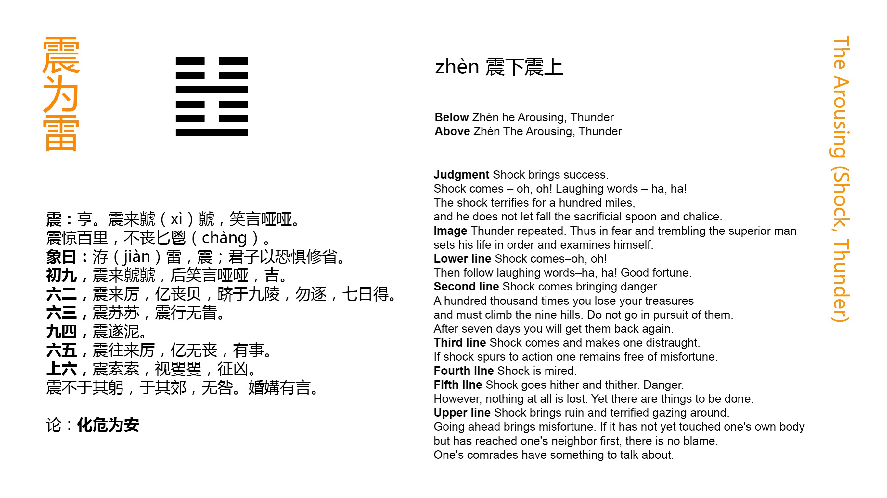

# Zhèn ䷲

* Thunder, Movement

> Chinese: 震 ䷲ zhèn

###### p. 172

**Zhèn ䷲** gives the intimation of ease and development. When (the time of) movement (which it indicates) comes, (the subject of the hexagram) will be found looking out with apprehension, and yet smiling and talking cheerfully. When the movement (like a crash of thunder) terrifies all within a hundred `lǐ` ([里](https://ctext.org/dictionary.pl?if=en&char=里)), he will be (like the sincere worshipper) who is not (startled into) letting go his ladle and (cup of) sacrificial spirits.

###### p. 173

1. The first `NINE`, undivided, shows its subject, when the movement approaches, looking out and around with apprehension, and afterwards smiling and talking cheerfully. There will be good fortune.

> **䷲** changing to [**䷏**](e8b1abyu.md#16.1)

> Matching Line 1 in Adjacent Hexagram: [**䷳**](e889aegen.md#52.1)

2. The second `SIX`, divided, shows its subject, when the movement approaches, in a position of peril. He judges it better to let go the articles (in his possession), and to ascend a very lofty height. There is no occasion for him to pursue after (the things he has let go); in seven days he will find them.

> **䷲** changing to [**䷵**](e5bd92e5a6b9guimei.md#54.2)

> Matching Line 2 in Adjacent Hexagram: [**䷳**](e889aegen.md#52.2)

3. The third `SIX`, divided, shows its subject distraught amid the startling movements going on. If those movements excite him to (right) action, there will be no mistake.

> **䷲** changing to [**䷶**](e4b8b0feng.md#55.3)

> Matching Line 3 in Adjacent Hexagram: [**䷳**](e889aegen.md#52.3)

###### p. 174

4. The fourth `NINE`, undivided, shows its subject, amid the startling movements, supinely sinking (deeper) in the mud.

> **䷲** changing to [**䷗**](e5a48dfu.md#24.4)

> Matching Line 4 in Adjacent Hexagram: [**䷳**](e889aegen.md#52.4)

5. The fifth `SIX`, divided, shows its subject going and coming amidst the startling movements (of the time), and always in peril; but perhaps he will not incur loss, and find business (which he can accomplish).

> **䷲** changing to [**䷐**](e99a8fsui.md#17.5)

> Matching Line 5 in Adjacent Hexagram: [**䷳**](e889aegen.md#52.5)

6. The topmost `SIX`, divided, shows its subject, amidst the startling movements (of the time), in breathless dismay and looking round him with trembling apprehension. If he take action, there will be evil. If, while the startling movements have not reached his own person and his neighbourhood, (he were to take precautions), there would be no error, though his relatives might (still) speak against him.

> **䷲** changing to [**䷔**](e599ace59791shike.md#21.6)

> Matching Line 6 in Adjacent Hexagram: [**䷳**](e889aegen.md#52.6)

## Notes

**Zhèn ䷲** among the trigrams represents thunder, and, according to [Wén](https://en.wikipedia.org/wiki/King_Wen_of_Zhou)'s arrangement and significance of them, 'the oldest son.' It is a phonetic character in which the significant constituent is [Yǔ](https://en.wikipedia.org/wiki/Rain) (雨), meaning rain, and with which are formed most characters that denote atmospherical phenomena. The hexagram is formed of the trigram Kăn redoubled, and may be taken as representing the crash or peal of thunder; but we have seen that the attribute or virtue of the trigram is 'moving, exciting power;' and thence, symbolically, the character is indicative of movement taking place in society or in the kingdom. This is the meaning of the hexagram; and the subject is the conduct to be pursued in a time of movement -- such as insurrection or revolution -- by the party promoting, and most interested in, the situation. It is shown how he ought to be aware of the dangers of the time, and how by precaution and the regulation of himself he may overcome them.

The indication of a successful issue given by the figure is supposed to be given by the undivided line at the bottom of the trigram. The subject of it must be superior to the subjects of the two divided lines above. It is in the idea of the hexagram that he should be moving and advancing; -- and what can his movement be but successful?

The next sentence shows him sensible of the danger of the occasion, but confident and self-possessed. The concluding sentence shows him rapt in his own important affairs, like a sincere worshipper, thinking only of the service in which he is engaged. Such a symbol is said to be suggested by [Wén](https://en.wikipedia.org/wiki/King_Wen_of_Zhou)'s significance of **Zhèn ䷲** as 'the oldest son.' It is his to succeed to his father, and the hexagram, as following [**Dǐng ䷱**](e9bc8eding.md), shows him presiding over the sacrifices that have been prepared in the caldron. This is too fanciful.

What is said on line 1 is little more than a repetition of the principal part of the [**Tuàn**](https://en.wikipedia.org/wiki/Ten_Wings). The line is undivided, and gives the auspice of good fortune.

'The position of peril' to the subject of line 2 is suggested, as [Appendix II](appendix02s1.md) says, by its position, immediately above 1. But the rest of the symbolism is obscure, and [Zhū Xī](https://en.wikipedia.org/wiki/Zhu_Xi) says he does not understand it. The common interpretation appears in the version. The subject of the line does what he can to get out of danger; and finally, as is signified by the central position of the line, the issue is better than could have been expected. On the specification of 'seven days,' see what is said in the treatise on the [**Tuàn**](https://en.wikipedia.org/wiki/Ten_Wings) of hexagram 24. On its use here [Guǎn Zǐ](https://en.wikipedia.org/wiki/Guanzi_(text)) says: -- 'The places of a diagram amount to 6. The number 7 is the first of another. When the movement symbolised by Kăn is gone by, things will be as they were before.'

Line 3 is divided, and where an undivided line should be; but if its subject move on to the fourth place, which would be right for him, the issue will not be bad.

The 4th line, however, has a bad auspice of its own. It is undivided in an even place, and it is pressed by the divided line on either side, hence its subject is represented as supinely sinking in the mud.

Line 5 is divided, in an odd place, and that in which the action of the hexagram may be supposed to be concentrated. Hence its subject is always in peril; but his central position indicates safety in the end.

Line 6 is weak, and has to abide the concluding terrors of the movement. Action on the part of its subject is sure to be evil. If, however, he were to take precautions, he might escape with only the censures of his relatives. But I do not see anything in the figure to indicate this final symbolism. The writer, probably, had a case in his mind, which it suited; but what that was we do not know.

# [震 ䷲](e99c87zhen_cn.md)
