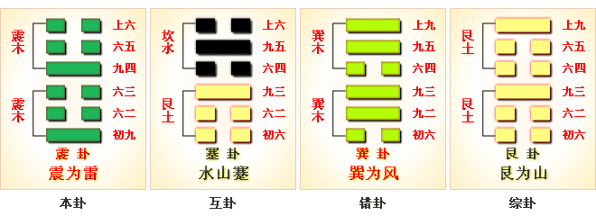
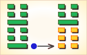
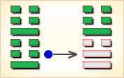
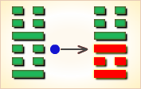
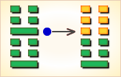
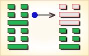
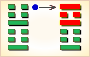

# 震 ䷲


震（zhèn）卦，代号为`4:4`。主卦和客卦都是`4`卦。主客双方都处于事物发展初始阶段，素质不佳，态度随和；双方都在震动，合在一起，还是震动。

双方的力量有时相互抵消，而有时相互加强。震为雷（震卦）临危不乱，震为雷，两震相叠，反响巨大，可消除沉闷之气，亨通畅达。

平日应居安思危，怀恐惧心理，不敢有所怠慢，遇到突发事变，也能安然自若，谈笑如常。

《震》卦的震，是借雷震的震，但自不当仅指雷震的震，它有一种震动、震撼、震惊、震慑综合的意思，也即指超过一般人承受压力而造成的骇异局面。 

- 卦序：51

> 震，亨，震來虩虩，笑言啞啞。震驚百里，不喪匕鬯。
>《彖》曰：震，亨。震來虩虩，恐致福也；笑言啞啞，後有則也；震驚百里，驚遠而懼邇也，出可以守宗廟社稷，以為祭主也。
>《象》曰：洊雷震，君子以恐懼脩省。

> 初九，震來虩虩，後笑言啞啞，吉。
>《象》曰：震來虩虩，恐致福也；笑言啞啞，後有則也。

> 六二，震來厲，億喪貝，躋于九陵，勿逐，七日得。
>《象》曰：震來厲，乘剛也。

> 六三，震蘇蘇，震行无眚。
>《象》曰：震蘇蘇，位不當也。

> 九四，震遂泥。
>《象》曰：震遂泥，未光也。

> 六五，震往來厲，億无喪，有事。
>《象》曰：震往來厲，危行也。其事在中，大无喪也。

> 上六，震索索，視矍矍，征凶。震不于其躬，于其鄰，无咎。婚媾有言。
>《象》曰：震索索，中未得也；雖凶无咎，畏鄰戒也。

### 全卦内容

此卦由雷下雷上组成。卦辞的“震：亨。震来虩虩，笑言哑哑；震惊百里，不丧匕鬯”，是说作为震动的《震》卦，它本身亨通。《震》卦之震，虽然其来有如猛虎到来的恐惧之状，但圣贤君子却能谈笑风生，泰然处之；《震》卦之震，虽然它能震惊百里，但君子圣贤却能在宗庙里祭祀时不会因震而惊失祭器或在征途中因震惊而失魂落魄而丢失装有箭镞的袋子。

1. “初九”爻辞的“震来虩虩，后，笑言哑哑，吉”，是说在震来之初，虽能使人感到震惊，但君子却能无所畏惧而笑言哑哑，这就很吉祥。
2. “六二”爻辞的“震来，厉，亿丧贝；跻于九陵，勿逐，七日得”，前半句是说震动刚来之时，是很凶厉的，预料难免有财富丧失；后半句是说在此震动初来之时，最好登上一些山岳暂时躲避一下，对于造成的损失，不要去追逐，用不了七日，它就会失而复得，亦《周易》一贯的“君子用罔”而 不“用壮”的明智之举。
3. “六三”爻辞的“震苏苏，震行无眚”，是说震动虽然能使一些人感到恐惧不安，但震乃本是一种常有现象，它本身并没有过失和罪过。含义之下，要怪罪只能怪罪自己的承受能力和适应能力。
4. “九四”爻辞的“震遂泥”，是说震动之凶厉，它连道路也能震成泥土。
5. “六五”爻辞的“震往来，厉；亿无丧，有事”，是说震动过去又复回来的震动，仍然有凶厉的一面；
但它震去又震来，毕竟为强弩之末，预料再不会造成重大损失，宗庙社稷的奉祀还是不会中断的。
6. “上六”爻辞的“震索索，视矍矍，征凶。震不于其躬，于其邻，无咎。婚媾，有言”，第一句是说一个人若在震动面前吓的发抖，连眼睛也惊慌回顾不已，这样的迹象很凶险。第二句是说震动不是发生在本国，而是发生在邻国，那对自己本国将不会有什么灾祸。最后一句是说在震动不安之中，将不利于谈婚嫁迎娶喜庆之事。 

### 起卦

《周易》作者通观震荡的现象论述了《震》本身“无眚”，它乃是一种正常现象，要怨恨，也只能怨恨自己的承受能力；也论述了在震荡中，只有英贤之辈才能“不丧匕鬯”才能“笑言哑哑”，才能从容不迫，而一些平庸无能之辈在震荡中，那只有“震索索，视矍矍”，只有恐慌不安。可以说，这是一篇在评论与鉴别人材的卦。

自然，这一卦毫不例外地应用于国家政权及其国君本身。

起卦前必须客观地、全面地、准确地分析主方和客方的情况，至少符合下列条件之一者，可以参考此卦：

1. 主方与雷很相似，客方也与雷很相似。
2. 主方的阳数是`4`，客方的阳数也是`4`。
3. 主方的行动是阳，素质是阴，态度也是阴；客方的行动、素质和态度也是阳、阴和阴。

切勿用任何随机数方式起卦，否则此卦不能作决策工具。

### 结构和卦爻辞

图的左边是震卦的结构图，右边是其卦爻辞。卦中爻的顺序由下往上，按此顺序，卦辞对应卦名，爻辞对应各条爻。震卦下部的三条爻是主卦，代表主方；上部的三条爻是客卦，代表客方。黑色的爻是当位的爻，对主方有利；灰色的爻是不当位的爻，对主方不利。震卦中，三条爻、一阳、二阴和六阴当位，另三条爻不当位。由于主卦和客卦的爻全部相同，没有有应，没有和谐。

从主卦方面来看，下爻与中爻是当位的爻，都是潜在的对主方有利的因素，主方应当坚持积极主动，寻求开拓发展，继续改善素质。上爻不当位表明主方态度随和，有可能受到客方制约，是潜在的对主方不利的因素。由于上爻是对中爻的补充，随着主方素质的改善，首先会在态度上变得强硬起来，这潜在的不利因素将变成潜在的有利因素，所以，主方的首要事项是尽可能地积极主动，尽可能快速地改善素质，这样态度也能迅速强硬起来，可能制约客方。

从客卦方面来看，客卦的下爻和中爻不当位，对主方不利。由于客卦的状态决定于客方，主方决定不了，所以主方不必考虑改变客卦的状态，但是要有应对客方变化的准备。综合起来看，当前主方应当保持积极主动，越积极主动越好，在竞争中取胜。卦辞以雷为喻从总体上说明主客双方关系处于激烈震荡状态，但是没有明显的实质性结果，“震惊百里，不丧匕鬯。”就像六条爻是一个整体一样，六条爻辞也是一个不可分割的整体。爻辞巧妙地与爻结合在一起，对完全抽象的爻作比较具体的说明，并且根据爻在卦中的状态，加了判断词。删去判断词，就可以看出六条爻辞是一首围绕震雷的散文诗：

```
（一阵）雷声震撼，引来笑声四起。
（一阵）雷声猛烈，登上高地去躲避，
有人丢失了很多钱，不用去寻找，
7天之内就能够得到丢失的钱。
（又一阵）雷鸣，人们从熟睡中惊醒，
雷声过后，没有损失。
（又一阵）雷鸣，振下了墙上泥。
阵雷往来猛烈，大家都没有损失，事务照常进行。
雷鸣使人颤抖，惊惧四顾。震雷不伤及自己，
却伤及邻居，多像婚姻交好之事中的争执。
```

### 卦辞
```
〖原文〗亨；震来虩虩，笑言哑哑；
震惊百里，不丧匕鬯。
〖译文〗进展顺利，尽管雷声震撼，
仍然笑声四起，百里都受到震动，没有人丢失筷子或汤勺。
〖解说〗这是4:4卦的卦辞。“亨”（hēng），顺利。
“虩”（xì），恐惧的样子。
“哑哑”（yāyā），象声词，形容笑声。
“匕”（bǐ），古代指勺、匙之类的取食用具。
“鬯”（chàng），古代祭祀用的酒，用郁金草酿黑黍而成。
匕鬯，泛指饮食用具。
主方和客方都处于关系的开始阶段，
相互了解很少，态度都很随和，所以事情进展顺利。
有时主客之间可能发生冲突，
然而他们都没有想严重损害对方，
就如同惊雷阵阵，仍然喜笑颜开，“笑言哑哑”。
他们可能在很广泛的领域都不一致，
然而，双方都没有受到严重损失，“震惊百里，不丧匕鬯”。
```

### 解释
```
震：亨。郑玄曰：震为雷。雷，动物之气也。
雷之发声，犹人君出政教以动国中之人也。故谓之震。
人君有善声教，则嘉会之礼通矣。
震来虩虩（xìxì，恐惧的样子），
虞翻曰：临二之四，天地交，故“通”。
虩虩谓四也。来应初命，四变而来应已。
四失位多惧，故“虩虩”。之内曰来也。
笑言哑哑，虞翻曰：哑哑笑且言，谓初也。
得正有则，故“笑言哑哑，后有则也”。
震惊百里，不丧匕鬯。
虞翻曰：谓阳从临二。
阴为百二十，举其大数，故当震百里也。
坎为棘、匕。上震为鬯。坤为丧。
二上之坤，成震体坎，得其匕鬯，故“不丧匕鬯”也。
郑玄曰：雷发声闻于百里，古者诸侯之象。
诸侯出教令，能警戒其国。
内则守其宗庙社稷，为之祭主，不亡匕与鬯也。
人君于祭之礼，匕牲体荐鬯而已，其余不亲也。
升牢于俎，君匕之，臣载之。
鬯，秬酒，芬芳条鬯，因名焉。
《彖》曰：震，亨，震来虩虩，恐致福也。
虞翻曰：惧变承五应初，故“恐致福也”。
笑言哑哑，后有则也。
虞翻曰：则，法也。坎为则也。
震惊百里，惊远而惧迩也。
虞翻曰：远谓四，近谓初。
震为百，谓四出惊远。初应惧近也。
出可以守宗庙社稷，以为祭主也。
虞翻曰：谓五出之正。
震为守，艮为宗庙社稷，长子主祭器，故“以为祭主也”。
干宝曰：周木德，震之正象也。为殷诸侯。
殷诸侯之制，其地百里。
是以文王小心翼翼，昭事上帝，聿怀多福，
厥德不回，以受方国，故以百里而臣诸侯也。
为诸侯，故主社稷。为长子，而为祭主也。
祭礼荐陈甚多，而经独言不丧匕鬯者，
匕牲体，荐鬯酒，人君所自亲也。
《象》曰：洊雷震，君子以恐惧修省。
虞翻曰：君子谓临二。二出之坤四，体以修身，坤为身。
二之四，以阳照坤，故“以恐惧修省”。
老子曰：修之身，德乃真也。
```

### 一阳
```
〖原文〗震来虩虩，后笑言哑哑，吉。
〖译文〗雷声震撼，引来笑声四起，吉利。
〖解说〗这是第一爻的爻辞，阳，
表示主方积极主动地谋取和扩大自己的利益，
比如说，创新、创业、投资、进攻、求职、示爱，等等。
与卦辞比较，在“笑言哑哑”之前多了一个“后”，
这表明“笑言哑哑”是“震来虩虩”的后果。
主方采取了积极主动，客方也采取了积极主动，
双方可能有所冲突，如“震来虩虩”，
然而，双方都很随和，这些冲突只是促使相互了解，
没有损害，所以“后笑言哑哑”。
这也有利于主方的发展，吉。

〖结构分析〗这条爻是阳爻在阳位，
当位，然而与四阳不有应。
当位表明主方积极主动，
有可能利于主方开拓发展，
是潜在的对主方有利的因素；
不有应表明客方也是积极主动，
与主方有冲突，
这潜在因素没有成为真正的对主方有利的因素。
由于这种潜在因素的存在，主方应当更积极主动，
逼使客方被动，对主方很有利，所以爻辞说“吉”。
```

### 二阴
```
〖原文〗震来厉，亿丧贝，
跻于九陵；勿逐，七日得。
〖译文〗雷声来得很猛烈，
丢失了很多钱，登到高地上去躲避；
不用去寻找，丢失的钱，7天之内就能够得到。
〖解说〗这是第二爻的爻辞，
阴，表示主方的素质不佳。
“厉”（lì），猛烈，如“严厉”。
“贝”（bèi），古代用贝壳做的货币。
“跻”（jī），登，上升：跻于世界先进之列。
“陵”（líng），大土山：山陵。
“逐”（zhú），追赶，“逐鹿”。
主方的素质不佳，在客方主动行动的冲击下，
主方紧张，唯恐遭受损失，“亿丧贝，跻于九陵”。
由于客方的素质也不佳，而且态度随和，
实际上，主方不至于受到损失，“勿逐，七日得”。

〖结构分析〗这条爻是阴爻在阴位，
当位，然而与五阴不有应。
当位表明主方素质不佳，促使主方积极主动地谋取发展，
向客方寻求利益，是潜在的对主方有利的因素；
不有应表明客方的素质也不佳，主方不能从客方取得利益，
这潜在因素没有成为真正的对主方有利的因素，
所以爻辞中没有判断词，只是说“亿丧贝”，“勿逐，七日得。”
```

### 三阴
```
〖原文〗震苏苏，震行无眚。
〖译文〗雷声震动以后都苏醒了，
雷声震动已经过去，没有损失。
〖解说〗这是第三爻的爻辞，
阴，表示主方态度随和。
“苏”（sū），昏迷中醒过来，苏醒。
“眚”（shěng）眼睛长白翳；灾祸。
主方随和地对待客方的积极主动，受到冲击以后，
恢复平静，保持清醒的思维，
在主客双方的激烈活动中，主方没有受到损失。
“震行无眚”是在“苏苏”的条件下出现的，
主方必须思维清醒，态度不能过于随和。

〖结构分析〗这条爻是阴爻在阳位，
不当位，并且和六阴不有应。
不当位，表明主方态度随和有可能受到客方制约，
是潜在的对主方不利的因素；
不有应，表明客方也是态度随和，不求制约主方。
```

### 四阳
```
〖原文〗震遂泥。
〖译文〗泥被雷声震动下来了。
〖解说〗这是第四爻的爻辞，
阳，表示客方积极主动地谋取和扩大自己的利益，
比如说，创新、创业、投资、进攻、求职、示爱，等等。
由于主方素质不佳，
在客方积极主动的冲击下，难免受到一些影响。
不过，这影响很轻微，仅仅像是墙上的泥被震动下来了。

〖结构分析〗这条爻是阳爻在阴位，
不当位，并且和一阳不有应。
不当位表明客方积极主动，
有可能损害主方利益，
这是潜在的对主方不利的因素；
不有应表明主方也是积极主动，
主方保护自己的利益免受损失。
```

### 五阴
```
〖原文〗震往来厉，意无丧有事。
〖译文〗猛烈的雷声一阵又一阵，
大家都没有损失，有正常进行的事务。
〖解说〗这是第五爻的爻辞，
阴，表示客方的素质不佳。
主客双方都积极主动，造成“震往来厉”，
由于客方素质不佳，对主客双方都没有造成损失，
主方和客方的事务正常进行。

〖结构分析〗这条爻是阴爻在阳位，
不当位，并且和二阴不有应。
不当位表明素质不佳的客方有可能向主方索取利益，
是潜在的对主方不利的因素；
不有应表明主方的素质也不佳，
客方不可能从主方获得利益，
```

### 六阴
```
〖原文〗震索索，视矍矍，征凶；
震不于其躬，于其邻，无咎；婚媾有言。
〖译文〗雷鸣使人颤抖，惊惧四顾，探索有凶险；
震雷不伤及自己，伤及这些邻居，无所怪罪；
婚姻交好之事有争执。
〖解说〗这是第六爻的爻辞，
阴，表示客方态度随和。
“索索”，恐惧貌，颤抖貌。
“矍”（jué），惊慌地看着：矍然（惊视的样子）。
“矍矍”，惊惧四顾貌。
“躬”（gōng），自身，亲自：反躬自问。
主客双方都积极主动，相互之间有冲突，客方态度随和，
主方不应当过于冒失，“征凶”。
由于双方素质都不佳，有些冲突并不造成主方损失，
而可能给客方带来损失，主方不应当受到怪罪。
主客双方态度都随和，似乎可以和谐相处，如同婚姻交好，
然而，由于各有自己的利益考虑，
并且都积极主动，可能相互之间有争执。

〖结构分析〗这条爻阴爻在阴位，
当位，然而与三阴不有应。
当位表明客方态度随和，
有可能受主方制约，
是潜在的对主方有利的因素；
不有应表明主方的态度也随和，
不能制约客方，
这潜在因素没有成为真正的对主方有利的因素。
由于这只是潜在因素，主方不能指望过高，
如果主方勉强制约客方，可能对主方有损失，
所以爻辞说“征凶”。
主方之所以不能利用这潜在的有利因素制约客方，
是由于主方的态度也随和，
而主方的态度随和是主方素质不佳的表现，
这是当前的客观存在，主方不应当受到怪罪，
所以爻辞说“无咎”。
```

### 爻辞解释
```
震①：亨。震来虩虩②，笑言哑哑③；
震惊百里,不丧匕鬯④。
初九，震来虩虩，后，笑言哑哑，吉。
六二，震来⑤，厉，亿丧贝⑥；
跻于九陵⑦，勿逐，七日得。
六三，震苏苏⑧，震行无眚⑨。
九四，震遂泥⑩。
六五，震往来⑪，厉；亿无丧⑫，有事⑬。
上六，震索索⑭，视矍矍⑮，征凶⑯。
震不于其躬，于其邻⑰，无咎。婚媾，有言⑱。

①震：六十四卦卦名之一。
乃论述“震动”以及如何对待这些所谓“震 动”之卦。
②虩虩（xì 细）：
《广韵》一书注为虎警貌，为恐怖之义。
③哑哑：笑貌。
④不丧匕鬯：“匕”，古指勺匙一类用具；也指箭镞。
“鬯”（chàng 唱），古指祭祀用的香酒；也指装箭镞用的袋子。
此处“不丧匕鬯”，不知是指在震动中从容不迫的祭祀神灵时，
没有失落掉祭祀的用具和洒掉香酒，还是在震动中，
不落拓失魄的丧失掉装有箭镞的袋子，确切含义不明。
不过此一句主要指从容不迫，满不在乎，乃谈英雄本色之义。
⑤震来：震动刚来之时。
⑥亿丧贝：“亿”，古称万万为亿，又称十万为亿；
古又通“臆”，预料、揣度之义；
王弼又在此注为“噫”，语助词。除此之外，
“亿”在古代还没有别的注释。
通观起来，此处还是作“臆”讲为妥。
“贝”，古货币，此处泛指钱财。
“亿丧贝”，指预料丧失惨重。
⑦跻于九陵：“跻”（jī 击），登，升。
“九陵”，古无此专辞，古舜葬于九嶷山，
不知是否指此又《书.禹贡》有“九山刊旅”，
此“九山”泛指九州之山，
不知此“九陵”是否借此或类此“九山”，
而泛指天下高山同巨岳含义不明。
不过“跻于九陵”当指登上九陵之上去。
⑧震苏苏：“苏”，古通“疏”。
“震苏苏”，言在震动中恐惧不安。
⑨震行无眚：“眚”，过失；罪过。
“震行无眚”，乃言震本乃为一种正常现象，
它本身并没有过失和罪过。
⑩震遂泥：“遂”，古指道路。
此句指震动得连道路也震撼为泥土。
⑪震往来：震动往去而又复来。
⑫亿无丧：预料不会再丧失什么。
⑬有事：“事”，指侍奉宗庙社稷。
“有事”，指国家政权还存在。
⑭震索索：恐惧貌。
亦犹《履》卦“履虎尾，愬愬”的“愬”字一用。
⑮视矍矍（jué 决）：惊惶回顾貌。
⑯征凶：迹象很凶险。
⑰震不于其躬，于其邻：“躬”，自身。
“邻”，此处指邻国。
此句言震动之祸发生在别的国家不发生在本国。
⑱婚媾，有言：指在震动不安中不宜于谈婚嫁迎娶。
```

### 另解
```
震：白话中读做“辰”。
辰①：亨，辰来朔朔②，芺言亚亚，
辰敬百里，不亡匕觞③。
【注释】
①辰：卦名。日月星的统称。
②朔朔：击鼓阵阵。
朔：古代祭祀前首先敲击的一种小鼓。
③匕：金勺子。觞：装酒的器皿。
【白话】亨通顺达，辰来击鼓阵阵，谈笑自若，
辰经过了百里，手中祭神的酒器都没有丢失。
【讲解】辰，通行本作“震”。
郑康成说：“震为雷。雷，动物之气也。
雷之发声，犹人君出政教以动中国之人也，故谓之震。
人君有善声教，则嘉会之礼通矣。
雷发声闻于百里，古者诸侯之象。
诸侯出教令，能警戒其国。
内则守其宗庙社稷，为之祭主，不亡匕与也。
人君于祭之礼，匕牲体荐而已，其余不亲也。
升牢于俎，君匕之，臣载之，酒，芬芳条，因名焉。”

初九：辰来朔朔，后芺①言哑哑，吉。
【注释】①芺：假借为“笑”。
【白话】辰来阵阵击鼓，击鼓后嬉笑颜开，吉善。
【讲解】这条爻辞通行本作：
“初九：震来虩虩，后笑言哑哑，吉”，
按照《象传》的解释，是用恐惧小心的态度行事而得幸福。
干宝将此爻辞解释为文王的故事。
他说：“得《震》之正，首《震》之象者。
‘《震》来虩虩’，里之厄也。‘笑言哑哑’，后受方国也。”

六二：辰来厉，意①亡贝，齍②于九陵，勿遂七日，得。
【注释】
①意：假借为忆，想起。
②齍（zī）：盛谷类的祭器。
【白话】辰星出现危险，
想起了丢失在九陵山上的朋贝和祭器，
没有超过七天，又觅得了那些丢失的朋贝和祭器。
【讲解】干宝说：“六二木爻，《震》之身也。
得位无应，而以乘刚为危。
此托文王积德累功，以被囚为祸也。故曰‘震来厉’。
亿，叹辞也。贝，宝货也。产乎东方，行乎大涂也。
此以喻纣拘文王，闳夭之徒，乃于江淮之浦，
求盈箱之贝，而以赂纣也，故日‘亿丧贝’。
贝，水物，而方升于九陵。
今虽丧之，犹外府也，故曰‘勿逐，七日得”。
七日得者，七年之日也。
故《书》曰：‘诞保文武受命，惟七年。’是也。”

六三：辰疏疏①，辰行②无省③。
【注释】
①疏疏：稀少。
②辰行：辰星运行。
③省：减少。
【白话】辰星虽然稀疏，但辰星运行而没有减少。
【讲解】古人意识到星辰稀少，
是因星辰运转所出现的天象，
通行本作“震苏苏，震行无眚”，
《象传》解释为“震苏苏，位不当也”。
虞翻说：“死而复生，称苏。
三死坤中，动出得正，震为生，故‘苏苏’。
坎为生，三出得正，坎象不见，故‘无眚’。
《春秋传》曰：晋获秦，六日而苏也。”
王弼说：“不当其位，位非所处，故惧苏苏也。
而无乘刚之逆，故可以惧行而‘无眚’也。”

九四：辰遂泥①。
【注释】①泥：阻滞，阻塞。
【白话】辰星运行前进受到阻塞。
【讲解】九四爻阳刚处于六二、
六三、六五、尚六这四阴爻之中，
形成大坎卦之形，坎为雨水，
雨水降于坤土之中，形成泥水，所以说“辰遂泥”。
泥路难行。所以《象传》说：“震遂泥，未光也。”
王弼说：“处四阴之中，居恐惧之时，
为众阴之主，宜勇其身以安于众。
若其震也，遂困难矣。
履夫不正，不能除恐，使物安己，德‘未光也’。”

六五：辰往来厉，意无亡，有事①。
【注释】①事：祭祀活动。
【白话】辰星往来出现，危险，
仔细考虑还是没有什么丢失，但有祭祀活动。
【讲解】自然界的一切大的变化都要引起古人的注意。
古人在注意自然界的变化的基础上探讨宇宙之谜。
他们在探讨宇宙之谜、解释自然现象的过程中，
形成了自己的宇宙观、形神观。

上六：辰昔昔①，视懼懼，正②凶。
辰不于其③，于其邻，往无咎，闽诟④有言⑤。
【注释】
①昔昔：运行貌。
②正：象征。
③窮：躬，身也。
④闽诟：婚媾，婚姻。
⑤言：假借为訚。訚：谦和而恭敬的样子。
【白话】辰星昔昔运行，
看起来非常可怕，象征着灾难降临。
辰星（陨石）没有落到身边，落到了邻居家中，
继续前进而没有灾难，婚姻美满谦和而恭敬。
【讲解】辰卦记载了多种天体运行的状况，
以及人们观察天体运行的心态，
为我们研究古代天文学提供了比较可靠的文献资料。
这条爻辞通行本作“上六：震索索，视矍矍，征凶。
震不于其躬于其邻，无咎。婚媾有言。”
虞翻说：“上谓四也。欲之三，隔坎，故‘震索索’。
三已动，应在离，故‘矍矍’者也。
上得位，震为征，故‘征凶’。
四变时，坤为躬，邻谓五也。
四上之五，震东兑西，故称‘邻’。
之五得正，故‘不于其躬于其邻，无咎’。
谓三已变，上应三，震为言，故‘婚媾有言’。”
```

### 易象

震仰盂。即震卦所代表的是两阴爻在上，一阳爻在下，表示一种向上，向外发展的趋势，故其正象为雷。秋冬之间潜于两阴之下的阳气，春天到来，便开始向上，向外发展，震动其上之阴气，如春天万物开始发生一样，跃跃欲试，驱阴邪震万物而萌发，如春天的蛰雷。 



### 断易天机

震卦震上震下，为震宫本位卦。震即雷，空闻其响，不见其形。主求谋难遂，官爵难成。

### 邵雍

重雷发响，奋发图强；先难后易，先苦后甜。

得此卦者，奋发振作，大可有为，但表面风光，内恐有难，宜谨言慎行，以免损失。

### 傅佩荣

- 时运：运势正强，谨慎免咎。
- 财运：所积财物，皆得售出。
- 家宅：保护宅基，祭祷为宜；佳偶。
- 身体：肝火太盛，不宜劳累。

```
这个卦是同卦，下震上震，相叠。
震为雷，两震相叠，反响巨大，
可消除沉闷之气，亨通畅达。
平日应居安思危，怀恐惧心理，
不敢有所怠慢，遇到突发事变，
也能安然自若，谈笑如常。

《象传》：重雷发向，千里传声，
有惊无险之象，亦有变动之意。
```

运势：表面昌盛风光，内里正处多事之秋，动荡不安之境。

- 事业：处于不顺利、甚至面临危险的局面，对此务必提高警惕，有备方可无患，一旦出现突发事件，可以泰然处之，并且可以由此引吸取教训，一方面使损失减少，另一方面可以迅速复原，使事业迈上新的高度。
- 经商：在激烈的商场竞争中，随时可能出现问题，陷入困境。冷静、从容地应付到来的现实，坚持不偏不激的中正原则，以刚毅的态度，从容不迫地去战胜困难。经过一番危机后，一定可以获得巨大利益。
- 求名：很可能会遭到挫折。不必灰心，而应自我反省，找出问题的症结所在。
- 婚恋：恋爱和家庭都可能出现变故，应以冷静态度处理，会有理想的结果。
- 决策：处于人生的转折关头。应正确地总结过去，为开拓新的事业奠定基础。在前进的道路上应随时心怀恐惧，勤勤恳恳，坚持正确原则，在困难中前进，命运亨通。

### 张铭仁
```
雷：表示奋发、震动有冲动不安稳的现象。
六冲纯卦，主大好大坏之卦象。
此卦要注意意外血光，有被惊吓之情形发生，
运动比赛可为吉论。
雷通常表示，声势浩大，却是有声无形虚象之意。
与人交往最忌此卦，表面热心却只是虚应一番，
无诚心，不能用真诚来对待，否则会很失望。

解释：受惊，害怕。

特性：心直口快，喜怒形于色，
缺乏耐性，工作不稳定，爱变化，
理财能力差，自立自强。
```

运势：表面似盛泰，但正处于多事之秋，宜慎重，勿自视过高，无益也。有动荡、不安、惊惧之象耳。

- 家运：家中常有变动惊惧、不平等、多争吵，影响家运进展，宜审慎处理家务事也。
- 疾病：注意肝、神经系统、足疾，病情反复。
- 胎孕：临产妇得之无碍。
- 子女：子女多有性刚者，但皆争气，奋发，并有少年劳苦老来福之象，有成有福。
- 周转：抱持可有可无之心态，因此卦有被反悔之象。
- 买卖：不可有始无终，否则难成。
- 等人：会来，而且会提早到。
- 寻人：此人临时起意而出走，但亦会马上回来。
- 失物：可能是受某些事惊吓而遗失，令你惊惶失措，尝试于会发声的东西或电器处寻找。
- 外出：大胆出行，不必理会小的灾祸。
- 考试：可榜登科甲。
- 诉讼：反覆难平，宜收敛脾气，心平气和。
- 求事：不利。
- 改行：改行吉利，为变动之时机也。
- 开业：吉利，可依计划而行。

### 初九。震来虩虩，后笑言哑哑，吉。

《象》曰：震来虩虩，恐致福也。笑言哑哑，后有则也。


初九：雷声传来，吓得浑身发抖，后来听到雷声，仍谈笑如常，吉利。

《象传》说：雷声传来，吓得浑身发抖，是因为相信敬畏重大的天象可以免罪得福。后来听到雷声仍能谈笑如常，是说后来对这类事情有了些经验。

### 邵雍

吉：得此爻者，好运到来，先惊后喜。

### 傅佩荣

- 时运：好运新来，先苦后乐。
- 财运：用心经营，得利可乐。
- 家宅：谨慎为宜；先忧后喜。
- 身体：先危后安。

### 初九变卦：震为雷 变卦 雷地豫卦



初九爻动变得[第16卦：雷地豫](e8b1abyu_cn.md)。

这个卦是异卦，下坤上震，相叠。

坤为地，为顺；震为雷，为动。

雷依时出，预示大地回春。

因顺而动，和乐之源。此卦与谦卦互为综卦，交互作用。

### 六二爻辞

六二。震来厉，亿丧贝。跻于九陵，勿逐，七日得。

《象》曰：震来厉，乘刚也。


六二：雷电交加，十分危险，惊慌之中丢失了钱币，翻山越蛉，走了很远的路程去寻找也没有找到。筮者告诉他：“不必追寻了，七八日内，这损失可得补偿。”

《象传》说：雷电交加之时，翻越九重山，爻象显示其人触犯雷电，处境危险。

### 邵雍

凶：得此爻者，多难之时，或有争诉，小心为妙。做官的有遭奸邪之辈陷害之忧。

### 傅佩荣

- 时运：患得患失，不必过虑。
- 财运：有得有失，危机意识。
- 家宅：注意防盗；夫妻不睦。
- 身体：病势可忧，七日可愈。

### 六二变卦：震为雷 变卦 雷泽归妹



六二爻动变得[第54卦：雷泽归妹](e5bd92e5a6b9guimei_cn.md)。

这个卦是异卦，下兑上震，相叠。

震为动、为长男；兑为悦、为少女。

以少女从长男，产生爱慕之情。

有婚姻之动，有嫁女之象，故称归妹。

### 六三。震苏苏，震行无眚。

《象》曰：震苏苏，位不当也。


六三：出门时遇到电闪雷鸣，感到疑惧不安。继续前进，不会有灾祸。

《象传》说：出门时遇到电闪雷鸣，感到疑惧不安，因为六三阴爻而居阳位，像人处境不利。

### 邵雍

凶：得此爻者，多忧愁，多灾难，宜谨慎，可免祸。做官的不宜进取。

### 傅佩荣

- 时运：加倍谨慎，可以免咎。
- 财运：销路不佳，另行设法。
- 家宅：小心地震；门户不当。
- 身体：由危而安。

### 六三变卦：震为雷 变卦 雷火丰



六三爻动变得[第55卦：雷火丰](e4b8b0feng_cn.md)。

这个卦是异卦，下离上震，相叠。

电闪雷鸣，成就巨大，喻达到顶峰，如日中天。

告戒：务必注意事物向相反方面发展，盛衰无常，不可不警惕。

### 九四爻辞

九四。震遂泥。

《象》曰：震遂泥，未光也。


九四：雷电下击，接触到地面。

《象传》说：其人猝闻惊雷，吓得坠入泥中，说明其人见识不广，胆量不大。

### 邵雍

凶：得此爻者，一筹莫展，前进有阻。做官的有被贬职之危。

### 傅佩荣

- 时运：欲振乏力，退而自保。
- 财运：挥金如土，难有积蓄。
- 家宅：阳气阻塞；辛苦成家。
- 身体：腹部积滞，宜泄除之。

### 九四变卦：震为雷 变卦 地雷复



九四爻动变得[第24卦：地雷复](e5a48dfu_cn.md)。

这个卦是异卦，下震上坤，相叠。

震为雷、为动；坤为地、为顺。

动则顺，顺其自然。

动在顺中，内阳外阴，循序运动，进退自如，利于前进。

### 六五。震往来厉，亿无丧，有事。

《象》曰：震往来厉，危行也。其事在中，大无丧也。


六五：巨雷轰鸣，危险在前。只要小心谨慎，不至于酿成灾祸，亦无损于事。

《象传》说：巨雷轰鸣，危险在前，喻指人的行动将有危险。但是其事合符义理，故能没有大的损失。

### 邵雍

凶：得此爻者，不吉之时，或有手足受损之忧。做官的守常者无忧。

### 傅佩荣

- 时运：患难已过，可成大事。
- 财运：小损大利，不必多忧。
- 家宅：祭祷防祟。
- 身体：修身养性。

### 六五变卦：震为雷 变卦 泽雷随



六五爻动变得[第17卦：泽雷随](e99a8fsui_cn.md)。

这个卦是异卦，下震上兑，相叠。

震为雷，为动；兑为悦，动而悦就是“随”。

随指相互顺从，己有随物，物能随己，彼此沟通。

随必依时顺势，有原则和条件，以坚贞为前提。

### 上六。震索索，视矍矍，征凶。震不于其躬，于其邻，无咎。婚媾有言。

《象》曰：震索索，未得中也。虽凶无咎，畏邻戒也。


上六：雷电交加，其人行动谨慎，警戒四顾，因为行路艰难，危险四伏。但是雷电不会击在他身上，而是落在邻人的头上。因为他本人没有什么过错，而其他邻人却犯有罪责。

《象传》说：雷电交加，行动谨慎，因为内心虚空，精神紧张。虽然凶险但毕竟没有灾祸，因为对于邻人的遭遇有所警戒，从而能远恶近善。

### 邵雍

凶：得此爻者，须谨防意外，或夫妻有刑克，亲邻遭难。做官的要谨防被贬职之忧。

### 傅佩荣

- 时运：位高必危，静守为宜。
- 财运：须防过贪，谨守小成。
- 家宅：邻居有事；近时媒来。
- 身体：安心养目。

### 上六变卦：震为雷 变卦 火雷噬嗑



上六爻动变得[第21卦：火雷噬嗑](e599ace59791shike_cn.md)。

这个卦是异卦，下震上离，相叠。

离为阴卦；震为阳卦。

阴阳相交，咬碎硬物，喻恩威并施，宽严结合，刚柔相济。

噬嗑为上下颚咬合，咀嚼。

# [Zhèn ䷲](e99c87zhen.md)
