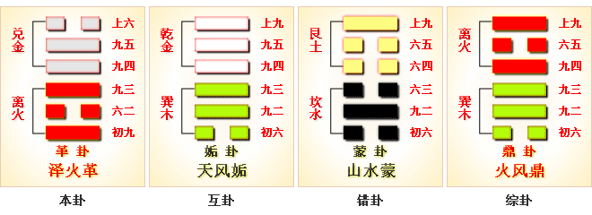

# 革 ䷰ gé

- No.49

> 革，已日乃孚，元亨，利貞，悔亡。
>《彖》曰：革，水火相息，二女同居，其志不相得，曰革。已日乃孚，革而信之，文明以說，大亨以正，革而當，其悔乃亡。天地革而四時成，湯武革命，順乎天而應乎人，革之時大矣哉。
>《象》曰：澤中有火，革，君子以治曆明時。

> 初九，鞏用黃牛之革。
>《象》曰：鞏用黃牛，不可以有為也。

> 六二，已日乃革之，征吉，无咎。
>《象》曰：已日革之，行有嘉也。

> 九三，征凶，貞厲。革言三就，有孚。
>《象》曰：革言三就，又何之矣。

> 九四，悔亡，有孚，改命吉。
>《象》曰：改命之吉，信志也。

> 九五，大人虎變，未占有孚。
>《象》曰：大人虎變，其文炳也。

> 上六，君子豹變，小人革面，征凶，居貞吉。
>《象》曰：君子豹變，其文蔚也；小人革面，順以從君也。

二阴虽交，志不相合。体积阴柔，爻象刚健，可以革变。兑上离下，
> 中虚。

务上下积阴，变改之兆。成物之体，故曰革。《易》云：“君子豹变，小人革面。”与兑为飞伏。
> 丁亥水，戊申金。

诸侯当世，见元士。九五、六二为履正位。天地革变，人事随而更也。
> 更者变也。

建丁亥至壬辰，
> 小雪清明。

水土配位。
> 土水入卦。

积筭起壬辰至辛卯，周而复始。五星从位起镇星，
> 土星入卦。

室宿从位降丁亥。
> 二十八宿，室宿入卦，革丁亥土。

分气候三十六，其数起元首。
> 分阴阳之象数，吉凶生矣。

上金下火，金积水而为器，
> 器能盛纳于物。

火变生而为熟。生熟禀气于阴阳，革之于物，物亦化焉。
> 五行类五色，五色类万物。禀和气，气节顺。刚即逆，逆即反，反即败。

《易》云：“巳日乃孚。
> 孚犹信也。

阴阳更始，动以见吉凶。
> 震主动也。

动以柔当位，刚会之，光大，革变于丰。
> 外卦兑入震，为丰卦。

# [Gé ䷰](e99da9ge.md)
