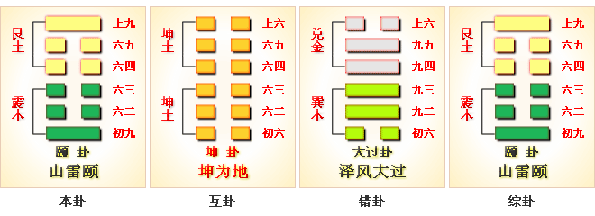

# 颐 ䷚


颐（yí）卦展示在像“颐”的形势下各种变化的可能性。

“颐”指面颊，腮。代号为`4:1`，表示主卦是震卦，卦象是雷，阳数是`4`；客卦是艮卦，卦象是山，阳数是`1`。

客方的消极被动给了主方积极发展的机会，客方像山，只要不触及客方利益，主方就可以在广阔原野上尽情发展，不过，主方也不能指望从客方得到什么，主方必须着力于“自求口实”。

这个卦是异卦，下震上艮相叠。震为雷，艮为山。山在上而雷在下，外实内虚。

图中，红色表示当位的爻，天蓝色表示不当位的爻，箭头表示有应。

- 含义：颐养
- 卦象：上艮（山）下震（雷）
- 卦序：27

> 頤，貞吉，觀頤，自求口實。
>《彖》曰：頤，貞吉，養正則吉也。觀頤，觀其所養也；自求口實，觀其自養也。天地養萬物，聖人養賢以及萬民，頤之時大矣哉。
>《象》曰：山下有雷，頤，君子以慎言語，節飲食。

> 初九，舍爾靈龜，觀我朵頤，凶。
>《象》曰：觀我朵頤，亦不足貴也。

> 六二，顛頤，拂經。于丘頤，征凶。
>《象》曰：六二征凶，行失類也。

> 六三，拂頤，貞凶，十年勿用，无攸利。
>《象》曰：十年勿用，道大悖也。

> 六四，顛頤，吉，虎視眈眈，其欲逐逐，无咎。
>《象》曰：顛頤之吉，上施光也。

> 六五，拂經，居貞吉，不可涉大川。
>《象》曰：居貞之吉，順以從上也。

> 上九，由頤，厲吉，利涉大川。
>《象》曰：由頤厲吉，大有慶也。

### 卦象 山雷颐 纯正以养

《象》曰：太公独钓渭水河，手执丝杆忧愁多，时来又遇文王访，自此永不受折磨。

### 卦意

这个卦是异卦（下震上艮）相叠。震为雷，艮为山。山在上而雷在下，外实内虚。春暖万物养育，依时养贤育民。阳实阴虚，实者养人，虚者为人养。自食其力。有了丰盈厚实的蓄积才能得到充分的颐养，故受之《颐》。颐，养也。有所养，中正而吉祥。但观颐养之道当自求口食自己养活自己，如不劳而获和掠夺争抢天下将会是怎样呢。故凡事得靠个人自身努力，自身奋斗，不得用不光彩不正当手段谋求财物。

《彖》辞说：颐，就是养的意思。有所养，中正吉祥，原因在于养正必吉也。所谓观颐就在于观其所养也，从而才能根据一切需要而作出相应的行动。所谓自求口食在于观其自养也，从而才能根据所需而作相应的自我调整和规划。天和地是不断地养育着万物的，而圣人应当根据天地规则养贤养能养天下也，因此如何颐养天下其义大矣哉，如能苟得其养则无物不长而取之不尽矣。故无故不得挥霍无度和乱搞排场，当从月令、量多少、以成岁事，制国用、明法度、而图不穷。这就是《颐》之意义所在。

《象》辞说：山下有雷，含地而化，故万物苟得其养而生生不息，这是《颐》之象。君子观之，思物业唯艰，唯含弘广大则不失其养，从而当慎言语、节饮食、颐养天下。

### 爻辞

初九，舍尔灵龟，观我朵颐，凶。
《象》曰：观我朵颐，亦不足贵也。

1. 初九阳刚得正，有灵明之质，惟其上应六四，随同求养于卦主上九，即以阳实能自养之身，却求养于人，失其颐养之道。爻辞以阳刚上九之立场而责之曰：怎可舍弃你如灵龟般休美之本质，而仰观于我，以纵其口腹之欲呢？必有凶灾。◎尔，你也。◎灵龟，喻阳刚休美之质，可不求养于外者也。◎观朵颐，谓贪口腹之欲，失其本心之灵明者。 朵，颐垂下动貌。
2. 项安适曰：上九卦主故称我，群阴从我求养，固其所也。初九本无所求，乃亦仰观于我，有灵而不自保，有贵而不自珍，宜其凶。
3. 李士鉁曰：灵龟伏气不食，无求于世，无求则无欲，故能灵也。初体震动，不自养而求养于人，嗜欲深者天机浅，丧其灵明之美质，仰观上九，贪口腹之欲，失本体之明，故凶。
4. 苏轼曰：养人者阳也，养于人者阴也。马其昶曰：孟子曰，养心莫善于寡欲，寡欲即静也。今初居震体，妄动失位，不自养而求养于人，故凶。
5. 象传曰：初九求养于人而仰观于上九者，乃说明初九贪口腹之欲，失其灵明之本质，已不值得尊重。
6. 马振彪曰：舍尔灵龟，是不能自修保全其德之美也；观朵颐，是不能安身以静，有动而竞争求禄之意也，福不至而辱来，故凶。人无以饥渴之害为心害，乃足贵也。老子言知足不辱，知止不殆。初九之凶，辱而且殆，由于不知足止故也。

六二，颠颐，拂经；于丘颐，征凶。
《象》曰：六二征凶，行失类也。

1. 六二柔顺中正，本应随众求养于艮体颠顶之上九。惟六二与六五皆居中有为，却因不相应而不能自食其力，若同求养于上九，则有违经常之道。而初九有阳刚之才，横亘于地下如山丘，六二比之，故下求初九之颐养，而不随众求养于上九，若往前求养于上九，则有三、四、五阴阻之，将有凶险。◎颠，顶也，指上九。◎拂经，谓违逆经常之道。◎丘，谓初九一阳亘于地下，有丘象。
2. 来之德曰：颠，顶也。玩四，颠颐之吉，上施光也，则颠指上明矣。
3. 马其昶曰：上九为卦主，唯二、四与上无比应之义，故于二、四皆颠颐，明此两爻当为上所颐也。又论经常之道，二、五皆居中有为，今不相应而同养于上，而违乎常经，故二、五两爻同曰拂经。然五吉而二凶者，五比由颐之上，而二比初也。
4. 象传曰：六二若往前求养于上九，将有凶险者，乃因其所遇皆阴，同性非类，失却与初九阴阳相比，而可获养之机会。
5. 尚秉和曰：阴阳相遇方为类，今六二不遇阳，故曰失类。

六三，拂颐，贞凶；十年勿用，无攸利。
《象》曰：十年勿用，道大悖也。

1. 六三阴居阳位，失正而不中，多欲妄动，当颐养之时，恃与上九有应而求养不已，有违养正则吉之道，故戒其应自我反省，改过迁善，谨守正道，以防凶灾。惟其非养正之才，终究无法施展才用，若用之，则将劳而无获，毫无所利。◎拂颐，谓颐养时有违养正则吉之正道。◎十年，终竟之辞，言其结果也。
2. 李士鉁曰：六三不中不正，恃上九独与之应，急求其养。盖求养不以道，阴险谄媚，有应以济其欲，则必凶矣。阴以应阳为美，独豫初六与颐六三，反以应阳而凶。
3. 王夫之曰：易屡言十年，要皆终竟之辞。筮不占十年以后，春秋传谓筮短龟长以此，盖圣人不终绝人，而天道十年一变，得失吉凶通其变，使民不倦，其意深矣。筮之短愈于龟之长。马振彪曰：天不变，道亦不变，盖以理言。若吉凶得失之数，未有十年不变者，在人自为之，故曰圣人不终绝人。
4. 象传曰：六三虽历经十年之久，仍无法施展才用者，乃因其当颐养之时，违背养正则吉之正道。
5. 郑汝谐曰：十年勿用，无攸利，乃戒之也。因六三有多欲妄动之心，故示之以自反之理，此作易之本意也。

六四，颠颐，吉；虎视眈眈，其欲逐逐，无咎。
《象》曰：颠颐之吉，上施光也。

1. 六四阴柔得正，与初九有应，惟初九乃草莽英雄，不能养正，故求养于同体艮颠之上九，而获吉祥。然六四之求养于上九，犹人民之求养于君王，其嗷嗷待养，专注不二，贪利而欲速，乃理所当然。民之所欲，君王能速予满足，则无咎害。◎眈眈，专一注视貌。◎逐逐，贪利欲速貌。
2. 李士鉁曰：六四居阴则静，得位则正，体艮则止。与初为应，初不能养，故颠颐以求养于上。圣人不禁人之欲，而有以节之，故荀子曰，使欲必不穷乎物，物必不屈乎欲，两者相持相长，是礼之所起也，故礼者养也。欲不逞而得养，何所咎乎？
3. 惠士奇曰：四虎视，视上也；初观颐，亦观上也。朵颐动于欲，逐逐则得其欲。管子云，民之所欲，饮食也，足其所欲，则能用之矣。
4. 马振彪曰：论语言，富与贵，人之所欲也；礼运言，饮食、男女之大欲存焉。所欲得养，惟在上者能施之，故吉而无咎。
5. 象传曰：六四之求养于上九，而获吉祥者，乃因上九能满足民之所欲，恩惠能广及大众。
6. 马其昶曰：君民本同一体，民之嗷嗷待哺，非其咎也。上之施泽能光明普被，则民安其生。贾子曰，天下嗷嗷，新主之资也，抚我者后，虐我者仇。故古人多以虎喻民也。

六五，拂经，居贞吉，不可涉大川。
《象》曰：居贞之吉，顺以从上也。

1. 六五虽居君位，惟阴柔失正，下无应与，以其上承上九阳刚，犹如不能养民之国君，反需倚赖上九之颐养，以兼养天下，实有违国君应养贤及万民之常理。故其以阴柔之质，应安居养民，固守正道，则可获吉祥。切不可涉险犯难，以图大有作为。
2. 刘沅曰：六五居尊能自养者也，但阴柔失正，无养人之才，而待养于上。以君待养于臣，似拂其养之常理。然养贤以及万民，君道之正，故顺从上九之善以养天下，守正则吉。
3. 杨万里曰：上九位臣而德师，六五贞固顺从，而天下自得其善矣。此正圣人养贤以及万民之事。
4. 象传曰：六五以阴柔之质，能安居养民，固守正道，而获吉祥者，乃因其能顺从上九之贤，以养天下之民，而得以实现君道。
5. 程颐曰：上有阳刚之贤，必笃于委信，则能抚益其身，泽及天下。居贞吉，谓能坚固顺从于上九之贤，以养天下也。
6. 邱富国曰：豫五不言豫，权由乎四也；颐五不言颐，权由乎上也。豫五柔乘刚，故贞疾；颐五柔承刚，故居贞吉。

上九，由颐，厉吉，利涉大川。
《象》曰：由颐厉吉，大有庆也。

1. 上九阳刚居上，以阳乘阴，有臣贤于君，君倚赖之以养天下之象，如此位高任重，当心怀危惧，谨慎从事，而后可获吉祥。亦利于涉险犯难，以成就大事。◎由颐，由之以颐也，即天下万民赖之而获养。
2. 王弼曰：上九以阳处上，而履四阴，阴不能独为主，必宗于阳也，故莫不由之以得其养。
3. 刘沅曰：由，从也。天下之养，皆从上九养之。厉者，君知而顺我，恐其权尊而逼；民仰于我，恐其恩膏不逮，心怀危惧也。
4. 象传曰：天下万民赖上九而获养，其能心怀危惧，谨慎从事，而获吉祥者，乃因君民均获其养，君庆得人，而其庆心志得以实行。
5. 郑康成曰：君以得人为庆。刘沅曰：君民皆待养于己，故言大有庆，庆其得君而志行，非徒自喜也。
6. 王宗传曰：豫之九四，天下由之以豫，故曰大有得；颐之上九，天下由之以颐，故曰大有庆也。此可比较由豫、由颐之相似笔法。
7. 吴曰慎曰：初九、六二、六三皆自养口体，私而小者也；六四、六五、上九皆养其德以养人，公而大者也。公而大者吉，得颐之正也；私而小者凶，失颐之贞也，可不观颐而自求其正也。

### 详细释义
```
【原文】颐①：贞吉。
观颐，自求口实②。
【译文】 颐卦：占卜得吉兆。
研究颐养之道，在于自食其力。

【注释】
①颐，卦名。
本卦为异卦相叠，震下艮上。
上卦为艮，艮为山，下卦为震，震为雷，
雷出山中，正是春暖之际，天地养育万物之时。
在《易经》看来正喻圣人依时养贤育民，贤人修德养身。
所以卦名曰颐。颐，《尔雅·释诂》：“颐，养也。”
②口实，口粮，自求口实，犹言自谋口粮。

【原文】《彖》曰：颐，“贞吉”，养正则吉也。
“观颐”，观其所养也。“自求口实”，观其自养也。
天地养万物。圣人养贤以及万民。颐之时大矣哉。
【译文】《彖辞》说：
颐卦卦辞讲，“贞正吉利”，
意思是依循正道颐养人我则吉利。
“观审颐养”，就是观察所颐养的对象。
“自食其力”，就是观察他怎样养活自己。
天地养育万物，圣人颐养贤人，养育万民。
颐养物我不失其时，这是多么伟大。

【原文】《象》曰：
山下有雷①，颐。
君子以慎言语，节饮食。
【译文】《象辞》说：
本卦上卦为艮为山，下卦为震为雷，
雷出山中，万物萌发，这是颐卦的卦象。
君子观此卦象，思生养之不易，
从而谨慎言语，避免灾祸。节制饮食，修身养性。

【注释】①山下有雷，古人认为天暖之时，
雷生于地，震动万物，萌发生长。
```

### 一阳
```
【原文】初九：舍尔灵龟，观我朵颐①，凶。
《象》曰：观我朵颐，亦不足贵也。
【注释】①舍，放置。
灵龟，李镜池说：“代指财宝，财富。
这原是占卜用的，十分贵重。”
朵颐，李镜池说：“颐颔丰满，圆鼓鼓的，
像花朵一样。这是丰衣足食的象征。”

【译文】初九：自己储藏着大量的财宝，
还要羡嫉人家的财物，必遭凶险之事。
《象辞》说：羡嫉人家的财物，这不是高尚的行为。

【解析】舍弃自己的铁饭碗，
而羡慕他人的事业会有凶险。
原因是每个人的境遇和能力是不同的，
忘却自身的实力而从事高远，
忘却自己的有利条件，
而追随他业是不符实际的，是得不到有效发展的。
一个人不要只会羡慕他人的富贵荣耀，
而要用自己的智慧自己的有利条件去创造财富。
```

### 二阴
```
【原文】六二：颠颐，拂经于丘①。颐征②，凶。
《象》曰：六二征凶，行失类也。
【注释】
①颠，高亨说：
“借为填，塞也。填颐，纳食物子腮中。”
拂，李镜池说：“借为刜，声通。
刜，击也（《说文》），斫也（《广雅·释言》）。”
经，《广雅·释言》：“径也”，指阡陌。
拂经，这里指垦荒开田。
②颐，颐养。征，征伐，攻击。
颐征，犹言为了生计而去抢劫别人。

【译文】六二：为了糊口，就得在山坡上开荒种地。
为了生计而去抢劫别人，这是凶险之事。
《象辞》说：六二爻辞说抢劫则凶，因为这种行径违反道义。

【解析】颠，填也。
要填饥糊口，就得自力更生。
不开垦于丘园而想得到颐养，
不从正道而攫取和征往必有凶险。
原因是不开垦于丘园，
而想获得颐养无非是做坏事的勾当，
这就叫“行失类也。”
行失其类，必然凶险，受民打击而已。
```

### 三阴
```
【原文】六三：拂颐①，贞凶。
十年勿用，无攸利。
《象》曰：十年勿用，道大悖也。
【注释】① 拂，违背。颐，这里指颐养之道。
【译文】六三：违背养生正道，
靠歪门邪道过活，占问得凶兆。
十年都得倒霉，永无好处。
《象辞》说：十年都得倒霉，
因为这种行为大有悖于道义。
【解析】违背自力更生自求口食的颐养之道，
不用说是凶险的，原因是道不正则行不顺，
是以十年无有作为，何利之有，道大相径庭也。
人不应当欲望吞噬本性，骄侈靡乱心志，
一旦迷离则万劫不复矣。
```

### 四阴
```
【原文】六四：颠颐①，吉。
虎视眈眈，其欲逐逐②，无咎。
《象》曰：颠颐之吉，上施光也③。
【注释】
①颠，声假为填。颠颐，犹言糊口。详前注。
②释文》：“逐逐，荀作悠悠”。安然自得之貌。
③光，借为广。上，君上。施，施舍。

【译文】六四：所求不过糊口，
害人之心不可存，吉利。
虎视眈眈，防人之心不可无。
这样就可以安享天年，悠然自得，无灾祸。
《象辞》：所求不过糊口，之所以吉利，
因为君上施舍甚广，足以养民。

【解析】虎视眈眈，凶狠贪婪貌也。
其欲逐逐，贪利欲速貌也。
养家糊口，十分吉祥。
人们追逐于名利，看齐于荣华富贵，
本身很正常不过，也没有过错。
但世界远不是风平浪静的世界，
而是虎视眈眈、追利逐逐、竞争激烈的世界。
因此我们必须规范社会行为，尊重养生之道，
合乎人类规则，不要自犯其咎。
故为政之道当以天下为重，
保障社会制度，规范社会体系，
使老有所养，幼有所教，病有所医，居有其屋，
不断促进社会稳定、健康、合理发展和公正、公平、持续发展。
当今天下，我们必需建立社会保障制度，
努力做到每一成员的权力公平、机会公平、规则公平、分配公平，
从而才能颐养天下，
才能最大限度地拉平社会成员生活水平的差距，
才能维护社会的稳定和长治久安。
```

### 五阴
```
【原文】六五：拂经①，居，贞吉。不可涉大川。
《象》曰：居贞之吉，顺以从上也。
【注释】①拂，借为刜。经，即径，阡陌。
拂经，指开荒种地。详前注。

【译文】六五：开荒种地，平居度日，
占问得吉兆。筮遇此爻，不可涉水渡河。
《象辞》说：平居守正，之所以吉利，
因为其人安分循道，服从君上。

【解析】违背颐养之道，停居不前可获吉祥。
切不能涉险犯难，违法犯罪。
原因是涉险犯难违法犯罪，就会害人害己得不偿失。
是以当居之以吉，顺天应民，以从上也。
```

### 六阳
```
【原文】上九：由颐①，厉，吉。利涉大川。
《象》曰：由颐，厉，吉，大有庆也。
【注释】①由，遵循。颐，颐养之道。

【译文】上九：遵循生活正道，先艰难而终吉利。
筮遇此爻，有利于涉水渡河。
《象辞》说：遵循生活正道，先艰难而终吉利，
因为善良之人终得善报。

【解析】一切都可得到颐养，贵在艰苦努力，虽厉终吉。
妄想寻找捷径和不劳而获是不可能的，是会招天谴的。
因此要遵循颐养之道自力更生不断努力。
如能遵循这个原则，不管走到哪儿都是可行的。
人间正道是自己动手来丰衣足食，如此虽厉终吉，
没有什么可阻挡的，是以大有庆也。
如果动歪脑筋则相去千里矣，何以安其心？
```

### 另解
```
颐①：贞吉，观颐，自求口实②。
【白话】吉善之占，观察下巴，自求足食。
【注释】
①颐：卦名，下巴，引申为休养。
②实：富足，充实。
【讲解】颐卦下卦辰卦，上卦根卦，
根宫第七卦，帛书第十五卦。
颐卦，从人们养身、养生的饮食之道出发，
告诫人君养贤、养民、养生、养形、养德、养性以利天下。

初九：舍尔灵龟，观我朵颐①，凶。
【白话】舍弃你自己的灵龟不养不卜，
而去观看我吃东西的样态，所以凶恶危险。
【注释】①朵：读为朵。朵颐：欲食之貌。
【讲解】颐养贵在自求口实，
舍弃自我修养的原则，就不会成功。
龟卜贵在所卜之灵龟，舍所卜之龟灵，
而观他人的举动，就不会达到占卜的预期目的。

六二：曰颠颐，柫经于北颐①，正②凶。
【白话】颠倒颐养之道，
违背常道犹如违背颐养之道，征伐凶恶。
【注释】
①柫经于北颐：反常如背颐道。
柫，通拂，违反。经，常。北，背，违背。
②正：通征，征伐。
【讲解】传统文化观念认为，女人不能够自处，
必须追随男人，阴柔不能独立，必须随从阳刚。
六二阴柔不能够自养，
反求下之初九阳刚以养，是以上求养于下。
天子养育天下，诸侯养育国民，臣食君上的俸禄，
民赖司牧养育，都是以上养下。
六二以上求养于下，有背于常理，所以断为凶占。

六三：柫颐①，贞凶，十年勿用，无攸利。
【白话】违反颐养之道，贞问得凶恶之占，
十年不能使用，没有什么好处。
【注释】①柫颐：违背颐养之道。
【讲解】颐养之道，只有正才能吉，
六三以阴柔之爻而处不中不正之位，又在动荡之极，
是柔邪不正的震动，其颐养如此，
违背了颐养的正道，所以贞凶。

六四：颠颐，吉，虎视沈沈①，其容笛笛②，无咎。
【白话】其象为“颠颐”“虎视沈沈，其容笛笛”，
其占为“吉”“无咎”。
【注释】
①沈沈：深远貌。
②笛笛：迅疾貌。
【讲解】六二“颠颐”而“正凶”，
六四“颠颐”而“吉”。
表明违背颐养之道，颠倒颐养法则，
有吉，有凶，不必为坏事。
上可以养下，下亦可以养上，上下互养，因时而异。

六五：柫经①，居，贞吉；不可涉大川。
【白话】违背颐养常规，居住则贞问吉善，
但不利于出门渡大河。
【注释】①柫经：违背常规。
【讲解】六五阴爻不正，
阴柔之质，才不足以养天下，
但能依赖于尚九刚阳之贤的辅助，
依然可以泽及天下，所以吉善。

上九：由①颐，厉，吉，利涉大川。
【白话】辅助颐养，虽危厉，仍得吉占，利于渡大河。
【注释】①由：辅助。
【讲解】尚九以阳刚的品德，居于帝王师傅的重要地位，
天下由他辅助以致养，必须常怀危厉怵惕之心，
方能吉善，方能渡大河，成大业。
```

### 名家点评

颐，贞吉。观颐，自求口实。

1. 颐，养也，象口中含物以自养。颐卦下震动、上艮止，有口腮下动上止以嚼物之状，故颐卦象征颐养之意，含有自养、养人、待养三义。颐养之道须能谨守正道，则可获吉祥；观察颐养之方，则应观察其所养之人，是否合乎正道，并从其自养口腹之需求，而明其贪廉、贤不肖。◎自，从也。◎口实，口腹所需求之食物。
2. 程颐曰：天地造化，养育万物，各得其宜者，亦正而已矣。观人之所颐，与其自求口实之道，则善恶吉凶可见矣。
3. 郑康成曰：颐，养也。观颐，观其养贤与不肖也。颐中之物曰口实。自二至五，互有二坤，坤载养物，人所食之物皆存焉。观其求可食之物，则贪廉之情可别也。
4. 马其昶曰：颐有自养、养人、待养三义，初阳在下当自养，上九位在上当养人，其四阴爻，则皆待养于人者也。
5. 李士鉁曰：颐卦上覆下承，以象辅颊，中有四画，以象众齿。
6. 序卦传：物畜然后可养，故受之以颐，颐者，养也。

彖曰：颐，贞吉，养正则吉。观颐，观其所养也。自求口实，观其自养也。天地养万物，圣人养贤以及万民，颐之时大矣哉！

1. 彖传曰：颐养之道能谨守正道，则可获吉祥者；乃谓其所养之人，均为谨守正道之贤明者，故得吉祥。观察颐养之方，则应观察其所养之人是否为贤明。而从个人口腹之所需求，则可观察其人之自养，而知其贪廉、贤不肖。
2. 宋衷曰：君子割不正不食，况非其食乎？是故所养必得贤明，自求口实必得体之宜，是谓养正也。
3. 马其昶曰：观颐，观其所养之人何如也。何由知其人，亦观其人之自养，则其贤不肖可知矣。
4. 刘沅曰：养体匪正，则为饮食之人；养贤匪正，则有覆餗之凶。圣人知天下之不可无养，又虑人失养之正，故详示极赞颐养之道，天地、圣人、民物无非养之所在。
5. 天地孕育万物而长养之，使之欣欣向荣；圣人则之，颐养贤人而照顾万民，使之安居乐业，颐养之时其功效是多么弘大啊！
6. 翟玄曰：天地以元气养万物，圣人以正道养贤及万民。
7. 李舜臣曰：重道义之养而略口体，此养之大者也；急口体之养而轻道义，此养之小者也。养其大体为大人，养其小体为小人。
8. 李士鉁曰：动于春夏，止于秋冬，天地之所以养物；动于日出，止于日入，人物之所以养生。下动上止，有以卑养尊之象；始动终止，有以少养老之象。

《象》曰：山下有雷，颐；君子以慎言语，节饮食。

1. 大象传曰：颐卦下震雷、上艮山，故有山下有雷之象。山下有雷则山止静、雷响动，上止而下动，犹如口之嚼食，故象征颐养之意。
2. 刘表曰：山止于上，雷动于下，颐之象也。
3. 君子者应效法颐卦雷动于下，山止于上之养正之道，当慎发言语以养德，节制饮食以养身。
4. 孔颖达曰：先儒云，祸从口出，患从口入，故于颐养而慎节也。
5. 张洪之曰：言语出而不可复入，饮食入而不可复出，故蒙之养正察其微，颐之养正先乎近。王衍以清谈误国，何曾以侈食丧家，皆不知慎节者也。
6. 程颐曰：慎言语以养其德，节饮食以养其体。于天下，则凡命令政教出于身者，慎之则无失；凡货资才用养于人者，节之则无伤。

### 《彖》曰

```
颐贞吉，养正则吉也。
观颐，观其所养也；
自求口实，观其自养也。
天地养万物，圣人养贤以及万民。
颐之时大矣哉！

【白话】《彖传》说：
“颐卦象征颐养，坚守正道可获吉祥。”
说明坚守正道实施颐养因而获得吉祥。
“通过观察万物养育的现象”
说明通过观察的方法，
来了解世间万物是如何自我生存的。
“用自己的努力来养口果腹。”
说明万物自我生存的方法彼此如同。
天地养育着万物，
作为圣人以德养育着天下贤能之士和广大民众，
可见因时制宜进行颐养之道是太重要了。
```

### 《象》曰
```
山下有雷，颐；
君子以慎言语，节饮食。
观我朵颐，亦不足贵也。
六二征凶，行失类也。
十年勿用，道大悖也。
颠颐之吉，上施光也。
居贞之吉，顺以从上也。
由颐厉吉，大有庆也。
```

### 新解
```
【原文】
（震下艮上）
颐①：贞吉。观颐②，自求口实③。
初九：舍尔灵龟④，观我朵颐⑤。凶。
六二：颠颐⑥，拂经于丘⑦。颐征⑧，凶。
六三：佛颐⑨，贞凶。十年勿用，无攸利。
六四：颠颐，吉。虎视眈眈⑩，其欲逐逐⑪。无咎。
六五：拂经，居贞吉。不可涉大川。
上九：由颐⑫，厉，吉。利涉大川。

【注释】
①颐（yí）是本卦的标题。
颐的意思是养育，同饮食营养有关。
全卦内容主要讲养生之道。
“颐”是卦中多见词，又与内容有关，所以用它作标题。 
②观：观察，研究。
③口实：口中的食物，口粮。
④舍：放置。
灵龟：用于占卜，所以十分贵重。
这里代指财宝，财富。
⑤朵颐：朵，动的意思，
颐动即为咀嚼之意，指饮食之事。
⑥颠：用作“填”，意思是塞。
⑦拂经：开垦荒地。
⑧颐征：为了生计而去抢劫粮食。
⑨拂：违背。
⑩眈眈：盯得紧的样子。
⑪逐逐：动得快的样子。
⑫由：遵循。


【译文】
颐卦：占得吉兆。研究养生之道，要靠自己解决粮食问题。
初九：你自己放着大量财物，还来窥伺我的衣食。凶险。
六二：要解决生计问题，就得在山坡上垦荒开田。
为了生计而去抢劫粮食，凶险。
六三：违背养生之道，占得凶兆。十年都很倒霉，没有什么好处。
六四：解决生计问题靠自己，吉利。
像老虎一样盯住别人的衣食，想一下子扑过去抢夺。没有灾祸。
六五：垦荒开田，有利于定居的占问。不能渡大江大河。
上九：遵循养生之道，先艰难后吉利。有利于渡过大江大河。
```


 
### 《断易天机》解

颐卦艮上震下，为巽宫游魂卦。颐为修养、调养，雷震于山，为春来之兆，万物开始生养，因此颐卦为发展之兆，多主吉。

### 北宋易学家 邵雍 解

养正养育，谨言节食；观察实务，自知审慎。

得此卦者，对于言语及饮食，均须谨慎。宜守正道，谨言慎行，心怀阴谋者会招灾祸。

###  台湾国学家 傅佩荣 解

- 时运：生机显达，谨言慎行。
- 财运：内外升降，未必流通。
- 家宅：小心防火；贤妇从夫。
- 身体：上寒下热，五日乃愈。

### 传统解卦
```
这个卦是异卦（下震上艮）相叠。
震为雷，艮为山。山在上而雷在下，外实内虚。
春暖万物养育，依时养贤育民。
阳实阴虚，实者养人，虚者为人养。自食其力。

大象：形如口腔之象，取其饮食之道，
须慎言，注重日常生活。
```

运势：处事欠缺周详考虑，不宜心怀阴谋，要守正道而善方吉。

- 事业：凡事得靠个人追求，自己奋斗，而不能依赖他人。更不得用不光彩的手段谋求财物。只要遵循正道，自食其力，谨言慎行，一定会有好的机遇。这时，经过一番艰苦奋斗，能够成功。
- 经商：不得急于求成，应谨慎小心，循序渐进，诚以待人，真诚与他人合作，因时制宜，不断追求新的开拓方向，必要时可适当冒险。
- 求名：以丰富自身知识为目的，知足安乐，刻苦努力，成功的希望极大。
- 婚恋：不可急于求成，关键在于加强自己的修养。一旦选中应全力追求，尤其不可三心二意。
- 决策：注意道德修养，乐于尽力而为地去帮助他人，救人急难，不贪求不应得到的财物。因此，能受到他人的尊重，也能不断得到外来的援助，个人事业十分顺利，成功的可能性很大。尤其不可粗心大意，牢记成就大阻力也大的道理。

### 台湾 张铭仁 解卦
```
颐：表示养也，主小吉带一点凶。
养跟饮食有关，也表示养育、教育的意思，
对情势需要充分了解，不要贸然的就下任何的决定。
颐，又与口有关，故需慎防小人口舌之灾。

解释：静卧，不向前冲。

特性：有欠缺考虑、鲁莽妄动之害。
若有怀阴谋，与人互相猜疑或争端者更不利。
要守正道而善行之，凡事切忌任性非为。
 ```

运势：先苦后甜，失败后成功型，物质金钱运佳，乐善好施，贵人多助。不断提升修养自己，容易得到社会好的名声。

- 家运：陷于痛苦深渊，有身败名裂之象，宜改进言行，冷静反省，力求幸福才是。
- 疾病：占病为凶，久病者险，为肠胃、咽喉、手足之疾。
- 胎孕：宜求香火保佑。
- 子女：过份溺爱反有害。尤其须注意儿女健康，以免日后因身体虚弱而不能获福。
- 周转：是否成功，要看自己是否有诚心。
- 买卖：守旧为宜，不宜谋求新事，否则不利。
- 等人：难来，中途有碍。
- 寻人：不久相逢。东北或东之向。
- 失物：尽快去找，似被物件上下夹着。
- 外出：应慎重，不宜过多外出。如无充分准备，仓促出行，将可能会遇到凶险。
- 考试：尚可。
- 诉讼：我告他人终不能成，宜速和解。
- 求事：不成。
- 改行：不宜，勿勉强。
- 开业：开业者不利，须再待时。

## 初九爻详解
### 初九爻辞

初九。舍尔灵龟，观我朵颐，凶。

《象》曰：观我朵颐，亦不足贵也。

 ### 白话文解释

初九：自己储藏着大量的财宝，还要羡嫉人家的财物，必遭凶险之事。

《象辞》说：羡嫉人家的财物，这不是高尚的行为。

### 北宋易学家 邵雍 解

凶：得此爻者，为争夺财利而起祸，大凡心底善良守正道者可无忧。做官的会受贿，失其廉。

### 台湾国学家 傅佩荣 解

- 时运：舍己观人，徒慕虚名。
- 财运：经营不顺，别人获利。
- 家宅：六神无主；婚姻不谐。
- 身体：饮食致病。

### 初九变卦：山雷颐 变卦 山地剥


初九爻动变得[第23卦：山地剥](e589a5bo_cn.md)。

这个卦是异卦，下坤上艮相叠。

五阴在下，一阳在上，阴盛而阳孤；高山附于地。

二者都是剥落象，故为“剥卦”。

此卦阴盛阳衰，喻小人得势，君子困顿，事业败坏。

## 六二爻详解
### 六二爻辞

六二。颠颐，拂经；于丘颐，征凶。

《象》曰：六二征凶，行失类也。

### 白话文解释

六二：为了糊口，就得在山坡上开荒种地。为了生计而去抢劫别人，这是凶险之事。

《象辞》说：六二爻辞说抢劫则凶，因为这种行径违反道义。

### 北宋易学家 邵雍 解

凶：得此爻者，大起大落，是非不一，凶者病致死。做官的须防被贬职。

### 台湾国学家 傅佩荣 解

- 时运：侥幸得成，终究是凶。
- 财运：不合常理，难免耗损。
- 家宅：未得其正；妇道可议。
- 身体：头昏眼花，小心调养。

### 六二变卦：山雷颐 变卦 山泽损


六二爻动变得[第41卦：山泽损](e68d9fsun_cn.md)。

这个卦是异卦（下兑上艮）相叠。

艮为山；兑为泽。

上山下泽，大泽浸蚀山根。

损益相间，损中有益，益中有损。

二者之间，不可不慎重对待。

损下益上，治理国家，过度会损伤国基。

应损则损，但必量力、适度。少损而益最佳。

## 六三爻详解
### 六三爻辞

六三。拂颐，贞凶。十年勿用，无攸利。

《象》曰：十年勿用，道大悖也。

### 白话文解释

六三：违背养生正道，靠歪门邪道过活，占问得凶兆。十年都得倒霉，永无好处。

《象辞》说：十年都得倒霉，因为这种行为大有悖于道义。

### 北宋易学家 邵雍 解

凶：得此爻者，运势低迷，荒诞无稽，甚至有生死离别之伤。做官的有丧名失节之患。

### 台湾国学家 傅佩荣 解

- 时运：无路可走，闭门思过。
- 财运：久难成事，无利可图。
- 家宅：家宅不安；十年方婚。
- 身体：痼疾难治。

### 六三变卦：山雷颐 变卦 山火贲


六三爻动变得[第22卦：山火贲](e8b4b2bi_cn.md)。

这个卦是异卦（下离上艮）相叠。

离为火为明；艮为山为止。

文明而有节制。

贲卦论述文与质的关系，以质为主，以文调节。贲，文饰、修饰。

## 六四爻详解

### 六四爻辞

六四。颠颐，吉。虎视眈眈，其欲逐逐，无咎。

《象》曰：颠颐之吉，上施光也。

### 白话文解释

六四：所求不过糊口，害人之心不可存，吉利。虎视眈眈，防人之心不可无。这样就可以安享天年，悠然自得，无灾祸。

《象辞》：所求不过餬口，之所以吉利，因为君上施舍甚广，足以养民。

### 北宋易学家 邵雍 解

吉：得此爻者，会得到好人的帮助，营谋遂意。做官的会得到祖上的恩惠，幸宠有加。

### 台湾国学家 傅佩荣 解

- 时运：养精蓄锐，可图功名。
- 财运：看清市场，买卖获利。
- 家宅：尚可称正。
- 身体：少欲则安。

### 六四变卦：山雷颐 变卦 火雷噬嗑


六四爻动变得[第21卦：火雷噬嗑](e599ace59791shike_cn.md)。

这个卦是异卦（下震上离）相叠。

离为阴卦；震为阳卦。

阴阳相交，咬碎硬物。

喻恩威并施，宽严结合，刚柔相济。噬嗑为上下颚咬合，咀嚼。

## 六五爻详解
### 六五爻辞

六五。拂经，居贞吉。不可涉大川。

《象》曰：居贞之吉，顺以从上也。

### 白话文解释

六五：开荒种地，平居度日，占问得吉兆。筮遇此爻，不可涉水渡河。

《象辞》说：平居守正，之所以吉利，因为其人安份循道，服从君上。

### 北宋易学家 邵雍 解

吉：得此爻者，会有依靠，事可成，但不可乘船涉险。做官的会因人而功可成，位可保。

### 台湾国学家 傅佩荣 解

- 时运：固守为宜，急进难成。
- 财运：行商不利，可以做贾。
- 家宅：山居较宜；从一为吉。
- 身体：安居静养，劳累难治。

### 六五变卦：山雷颐 变卦 风雷益


六五爻动变得[第42卦：风雷益](e79b8ayi_cn.md)。

这个卦是异卦（下震上巽）相叠。

巽为风；震为雷。

风雷激荡，其势愈强，雷愈响，风雷相助互长，交相助益。

此卦与损卦相反。

它是损上以益下，后者是损下以益上。二卦阐述的是损益的原则。

## 上九爻详解
### 上九爻辞

上九。由颐，厉吉。利涉大川。

《象》曰：由颐厉吉，大有庆也。

### 白话文解释

上九：遵循生活正道，先艰难而终吉利。筮遇此爻，有利于涉水渡河。

《象辞》说：遵循生活正道，先艰难而终吉利，因为善良之人终得善报。

### 北宋易学家 邵雍 解

吉：得此爻者，营谋有成，无往不利。做官的爵禄荣重。读书人会取得佳绩。

###  台湾国学家 傅佩荣 解

- 时运：谨慎努力，可以成功。
- 财运：辛苦经营，才有收获。
- 家宅：合家平安。
- 身体：虽危无碍。

### 上九变卦：山雷颐 变卦 地雷复


上九爻动变得[第24卦：地雷复](e5a48dfu_cn.md)。

这个卦是异卦（下震上坤）相叠。

震为雷、为动；坤为地、为顺。

动则顺，顺其自然。

动在顺中，内阳外阴，循序运动，进退自如，利于前进。

# [Yí ䷚](e9a290yi.md)
