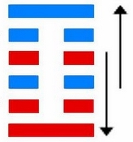

# 颐 ䷚ yí

- No.27

> 頤，貞吉，觀頤，自求口實。
>《彖》曰：頤，貞吉，養正則吉也。觀頤，觀其所養也；自求口實，觀其自養也。天地養萬物，聖人養賢以及萬民，頤之時大矣哉。
>《象》曰：山下有雷，頤，君子以慎言語，節飲食。

> 初九，舍爾靈龜，觀我朵頤，凶。
>《象》曰：觀我朵頤，亦不足貴也。

> 六二，顛頤，拂經。于丘頤，征凶。
>《象》曰：六二征凶，行失類也。

> 六三，拂頤，貞凶，十年勿用，无攸利。
>《象》曰：十年勿用，道大悖也。

> 六四，顛頤，吉，虎視眈眈，其欲逐逐，无咎。
>《象》曰：顛頤之吉，上施光也。

> 六五，拂經，居貞吉，不可涉大川。
>《象》曰：居貞之吉，順以從上也。

> 上九，由頤，厲吉，利涉大川。
>《象》曰：由頤厲吉，大有慶也。

六位上下，周而复始，内外交互，降入纯阴。
> 见坤象居中。

地之气，萃在其中。
> 上下阳位包阴。

积纯和之气，见浩然之道，明矣。土木配象，吉凶从六虚。
> 六虚即六爻也。

与震为飞伏。
> 丙戌土，己酉金。

六四诸侯在世，元士之初九见应。建始辛亥至丙辰，
> 小雪，清明。

积筭起丙辰至乙卯，周而复始。土木入艮震。
> 分土木二象，入卦筭吉凶。

五星从位起太白，
> 金星西方，入八月卦上冲。

虚宿从位降丙戌土，
> 二十八宿，分虚宿入颐六四丙戌土上。

分气候三十六。
> 起数二十八，推六爻吉凶之位。

山下有雷，止而动，阴阳通变分气候。内外刚而积中柔，升降游魂，下居六四位，特分，复归于本，
> 游魂返居六四，入卦周始，爻位迁次明矣。

吉凶起于六四，次环六位，星宿躔次也。极则反本，降入归魂山风蛊卦。

# [Yí ䷚](e9a290yi.md)
