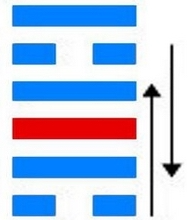
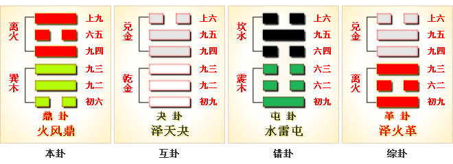
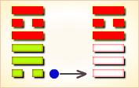
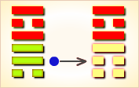
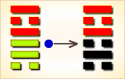
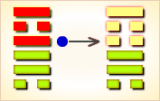
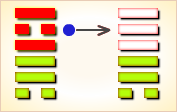
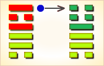

# 鼑 ䷱



鼎（dǐng）卦的代号是`3:5`，主卦是`3`卦巽卦，阳数是`3`；客卦是`5`卦离卦，阳数是`5`。鼎卦的含义是稳定图变。鼎卦是异卦，下巽上离，相叠。燃木煮食，化生为熟，除旧布新的意思。鼎为重宝大器，三足稳重之象。鼎卦上接井卦和革卦，它是言谈改革的第三卦。鼎卦利用“鼎颠趾，利出否；得妾以其子”，和给鼎重从装上“黄耳金铉”“玉铉”的形象来谈改革后的可喜收获，同时也提出由于改革不慎而带来“鼎折足”的可怕结局。鼎，不仅是一种炊具，也是一种政权的象征，自古每有“ 问鼎”“定鼎”之说，《周易》把鼎卦列为改革之卦。

图中，红色表示当位的爻，天蓝色表示不当位的爻，箭头表示有应。

- 卦序：50

> 鼎，元吉，亨。
>《彖》曰：鼎，象也。以木巽火，亨飪也。聖人亨以享上帝，而大亨以養聖賢。巽而耳目聰明，柔進而上行，得中而應乎剛，是以元亨。
>《象》曰：木上有火，鼎，君子以正位凝命。

> 初六，鼎顛趾，利出否。得妾以其子，无咎。
>《象》曰：鼎顛趾，未悖也。利出否，以從貴也。

> 九二，鼎有實，我仇有疾，不我能即，吉。
>《象》曰：鼎有實，慎所之也。我仇有疾，終无尤也。

> 九三，鼎耳革，其行塞，雉膏不食。方雨虧悔，終吉。
>《象》曰：鼎耳革，失其義也。

> 九四，鼎折足，覆公餗，其形渥，凶。
>《象》曰：覆公餗，信如何也。
>《繫辭》：易曰：「鼎折足，覆公餗，其形渥，凶。」言不勝其任也。

> 六五，鼎黃耳金鉉，利貞。
>《象》曰：鼎黃耳，中以為實也。

> 上九，鼎玉鉉，大吉，无不利。
>《象》曰：玉鉉在上，剛柔節也。

### 结构与卦爻辞

鼎是`3:5`卦的卦名，是一个代表双方关系状态的形象。
`3:5`是鼎卦的代号，表示其主卦是`3`卦巽卦，卦象是风，特性是顺从；
客卦是`5`卦离卦，卦象是火，特性是光明而依赖。
客方积极主动，光芒四射，主方顺从客方，向光明的地方前进。

“鼎”，古代烹煮用的器物，一般是三足两耳：铜鼎。这里，“鼎”是一个形象比喻，象征当前的双方关系。鼎，烹饪食物供主客双方享用，当前形势对双方都有利。主客双方的态度都强硬，在双方之间也有矛盾。

1. 主方与风（木）很相似，客方与火（日）很相似。
2. 主方的阳数是`3`，客方的阳数是`5`。
3. 主方的行动是阴，素质是阳，态度也是阳；客方的行动、素质和态度也是阳、阴和阳。

鼎卦下部三条爻是主卦，代表主方。上部三条爻是客卦，代表客方。黑色的爻是当位的爻，是潜在的对主方有利的因素。灰色的爻是不当位的爻，是潜在的对主方不利的因素。箭头表示主卦和客卦中相应的一对爻是处于阴阳和谐状态，有应。箭头方向是从阴爻到阳爻。有应时，对主方有利的潜在因素成为真正的对主方有利的因素，对主方不利的潜在因素成为真正的对主方不利的因素，状态比较稳定；不有应时，潜在因素只是潜在因素，比较容易发生变化。

先看主卦。下爻是阴爻，表示主方消极被动，不利于保护和扩充主方利益，是潜在的对主方不利的因素，并且与客卦下爻有应，受客方控制，对主方不利。中爻是阳，表示主方素质良好，有可能被客方利用，对主方不利。上爻是阳，表示主方态度强硬，可以压抑客方，保护自己的良好素质，对主方有利。

再看客卦。下爻是阳爻，表示客方积极主动，有可能损害主方利益，对主方不利。中爻是阴爻，表示客方素质不佳，促使客方侵害主方利益，对主方不利。上爻是阳爻，表示客方态度强硬，制约主方，对主方不利。

综合双方情况，由于客卦决定于客方，主方不能改变，主卦中爻和上爻不需改变，主方能够改变的只是主卦下爻，变阴爻为阳爻。但是，主方的现况是由历史造成的，按事物自身发展规律，主方经历了从乾卦到巽卦的质变，阳数从7坠落到3，从上升过程转变到衰落过程，要返回往日的极盛时期，几乎不可能。不过，可以阴中有阳，在一定程度上采取主动措施，保持活力，防止进一步衰落。目前比较现实的做法，不是与客方对立斗争，而是与客方合作，顺从客方，依靠自己素质上的优势，利用客方积极进取的精神和智慧，共同发展，共同受益。鼎卦把这种关系形象地比喻为鼎。

爻辞是一首完整的围绕主题“鼎”的散文诗：

```
鼎的脚歪了，颠倒下来，
这有利于把渣滓清除掉，
（好象是）得到妾和妾的孩子。
鼎中有食物，我的仇人有病，
不能到我这里来（我自己享用）。
鼎耳正在更换，其行为受阻塞，
没有鸡肉和油脂可以食用。
鼎的脚折断了，
把先生的美食弄翻了，其形状很难看。
鼎有了提黄色鼎耳的金钩。
鼎又有了玉钩。
```

### 全卦内容

此卦由木下火上组成。卦辞的“鼎：元吉，亨”，是说作为革故鼎新的《鼎》卦，它有很大的吉祥，它很亨通。

1. “初六”爻辞的“鼎颠趾，利出否；得妾以其子，无咎”，前半句是说原来的鼎，颠翻了鼎足，这倒利于倒出鼎中原来腐臭的食物；后半句是说把它刷洗干净，重新装进新的食物，这倒好像又找了一个小妾又生了一个儿子一样，这倒并没有什么灾祸。
2. “九二”爻辞的“鼎有实，我仇有疾；不我能即，吉”，前半句有承接上爻之义，是说倒掉了原来鼎中陈腐恶臭的食物，又刷新干净重新装进了新的食物，这样“鼎有实”的变革，倒引起了我仇辈的嫉恨；后半句是说我的仇辈虽然在嫉恨我，但他又不能把我怎么样，这样倒很吉祥。
3. “九三”爻辞的“鼎耳革，其行塞；雉膏不食，方雨亏。悔，终吉”， 前一句是说由于鼎耳的变形或毁坏，使举鼎器塞不进鼎耳，以致使鼎不能使用；由于鼎不能用，不能用它来烹饪食物，使得肥美的野鸡不能食用，倒被正在下的雨霉坏了。后一句是说这鼎不能用，倒促使变革，开始看起来很后悔，但结果却很吉祥。这里的“终吉”实就是后几爻的“鼎黄耳金铉”与“ 玉铉”。
4. “九四”爻辞的“鼎折足,覆公餗，其形渥，凶”，是说当鼎足折断了，鼎被毁坏了，被烹饪的食物被颠翻，其鼎中的食物倒出来沾污了鼎的全身，这样就很凶险。此一爻当喻国家的政权从根基遭到了破坏。
5. “六五”爻辞的“鼎黄耳金铉，利贞”，是说鼎通过革故鼎新之后，鼎又换上了黄色的金耳，也从新配上了用金子制成的举鼎用的“铉”，这样变革很宜于坚守贞正。
6. “上九”爻辞的“鼎玉铉，大吉，无不利”，是说鼎又重新配上了玉制的举鼎器，这样将意味着很大的吉祥，也意味着无不顺利或无不适宜。实际上这一爻不过是一个重复，不过更多了一些赞誉之辞，也是为了填充六个爻位，它本身并没有多大实际意义。 

### 元吉，亨。
```
很吉利，顺利。
〖解说〗由于主方随从客方行动，
同时，客方很聪明，并且依赖主方，
所以，形势对主方非常有利，一切都会进行得很顺利。
```

### 初六：鼎颠趾，利出否，得妾以其子，无咎。
```
大鼎翻倒鼎趾朝上，
颠倒下来，有利于清除渣滓无用之物；
就如娶妾和妾生了孩子，无所怪罪。
〖解说〗这是第一爻的爻辞，
阴，表示主方的行动消极被动，
比如说，防守、退却、不想冒险、
不想探索或开辟新的发展领域、只求保持现状，等等。
主方消极被动，如同“鼎颠趾”。
鼎的脚歪了，颠倒下来，鼎里的东西都倒出来了，
主客双方关系中的问题都暴露出来了。
暴露出来，便于解决。
结果，主方得到客方的理解和支持，“得妾以其子”。
“妾”指客方，“其子”指与客方合作取得的成果。
“无咎”，如果主方把问题都摆出来，
从而得到解决，主方不应当受到怪罪。
反之，如果主方不把问题摆出来解决，
则主方应当受到怪罪。

〖结构分析〗第一爻的位置是阳位，
这条爻是阴爻，阴爻在阳位，
不当位，不过与四阳有应。
不当位表明主方消极被动，
主方的利益有可能受到损失，
是潜在的对主方不利的因素；
有应表明客方积极主动，
正好可以利用主方的消极被动取得发展，
这潜在因素成了真正的对主方不利的因素。
由于主方的消极被动是历史形成的现实，
不能怪罪主方，所以爻辞说“无咎”。
```

### 九二：鼎有实，我仇有疾，不我能即，吉。
```
鼎中盛满食物，我不想见的人有顾虑，不能到我这里来，吉利。
〖解说〗这是第二爻的爻辞，
阳，表示主方素质良好，比如说，
主方有资金、有地位、有权力、有实力、有技术，等等。
“鼎有实”，鼎中有食物，
这食物指主方的良好素质，客方有求于主方，态度强硬。
“仇”指客方，仇视，不想见的人。
第五爻是阴爻，表示客方素质不佳，比如说，
资金缺乏、地位底下、实力薄弱、教育程度低，等等。
“疾”，疾病，指客方的不佳素质。
因为客方素质不佳，力量薄弱，不可能与主方对抗，
主方态度强硬，客方心有顾虑，
“我仇有疾，不我能即”，这对于主方是吉利的。

〖结构分析〗第二爻的位置是阴位，
这条爻是阳爻，阳爻在阴位，
不当位，不过，与五阴有应。
不当位表明主方素质良好，
有可能在与客方交往中受到损失，
是潜在的对主方不利的因素；
有应表明客方素质不佳，
正好需要主方的良好素质弥补自己的不足，
这潜在因素成了真正的对主方不利的因素。
然而，由于客方需要从主方弥补自己素质的不足，
客方依赖主方，主方可以利用客方的依赖，
取得更多利益，所以爻辞说“吉”。
```

### 九三：鼎耳革，其行塞，雉膏不食；方雨亏悔，终吉。
```
鼎耳丢失，其移动受阻塞很困难，
没有鸡肉和油脂可以食用；刚刚下过雨乌云就散去，
受到亏损而悔恨，最终吉利。
〖解说〗这是第三爻的爻辞，
阳，表示主方态度强硬。
同时，第三爻是对第二爻的补充，
第二爻是阳，第三爻也是阳，这表示主方的素质很好。
另一方面，第六爻也是阳爻，
客方的态度也强硬，主方与客方有冲突。
“鼎耳”，象征主方的态度，为了主方利益，
主方需要改变态度，避免过于傲慢，
避免过于粗暴，“鼎耳革”。
主方的强硬态度，受到客方对抗，
影响到双方关系，造成主方行动困难，“其行塞”。
在双方关系中主方很难获益，“雉膏不食”。
如果主方改变强硬的态度，表现得比较灵活，
比较柔和，会后悔所遭受的损失，“方雨亏悔”。
这样，由于主方改变了态度，最终，
双方关系对于主方来说是吉利的，“终吉”。
“终吉”的前提条件是，“鼎耳革”，革，取消，除掉；
如果主方不改变态度，则没有“鼎耳革”，也就没有“终吉”。

〖结构分析〗第三爻的位置是阳位，
这条爻是阳爻，阳爻在阳位，
当位，不过与六阳不有应。
当位表明主方态度强硬，
有助于维护主方利益，
是潜在的对主方有利的因素；
不有应表明客方态度也强硬，
抵制主方的强硬态度，
这潜在因素没有成为真正的对主方有利的因素。
由于主方素质良好，强硬态度有强大的实力支撑，
而客方素质不佳，强硬态度没有实力支撑，
最终是主方压制住客方，维护主方利益，
所以爻辞说“方雨亏悔，终吉”。
```

### 九四：鼎折足，覆公餗，其形渥，凶。
```
鼎折断鼎足，把王公的美食弄翻了，
鼎身沾满污物很难看，有凶险。
〖解说〗这是第四爻的爻辞，
阳，表示客方的行动是阳，
客方积极主动地谋取和扩大自己的利益，
比如说，创新、创业、投资、进攻、求职、示爱，等等。
客方的积极主动行动，冲击了消极被动的主方，
打乱了主客双方关系的格局，使得关系的状态显得很混乱，
在混乱形势下，主方的利益受到损害，“鼎折足，覆公餗，其形渥”。
“覆公餗”中的“公”指主方。这种状态对于主方来说有凶险，“凶”。
主方应当迅速行动，适应新环境，与客方共同建立新的关系。

〖结构分析〗第四爻的位置是阴位，
这条爻是阳爻，阳爻在阴位，
不当位，并且与一阴有应。
不当位表明客方积极主动谋求发展，
有可能损害主方利益，是潜在的对主方不利的因素；
有应表明主方消极被动，正好是客方发展的好机会，
这潜在因素成了真正的对主方不利的因素。所以爻辞说“凶”。
```

### 六五：鼎黄耳金铉，利贞。
```
鼎配上了黄色鼎耳的金钩，利于坚持下去。
〖解说〗这是第五爻的爻辞，阴，表示客方素质不佳，
比如说，资金缺乏、地位底下、实力薄弱、教育程度低，等等。
“铉”（xuàn），古代举鼎器具，状如钩，铜制，用以提鼎的两耳。
客方受益于主方的良好素质，主方又受惠于双方关系，
主客双方关系有良好发展，如同鼎有了提黄色鼎耳的金钩。
这种状态应当保持下去，“利贞”。

〖结构分析〗第五爻的位置是阳位，
这条爻是阴爻，阴爻在阳位，
不当位，不过与二阳有应。
不当位表明客方素质不佳，
有可能谋求从主方得到补益，是潜在的对主方不利的因素；
有应表明主方素质良好，正好可以满足客方需要，
这潜在因素成了真正的对主方不利的因素。
然而，由于客方依赖主方，
主方可以获得更多利益，所以爻辞说“利贞”。
```

### 上九：鼎玉铉，大吉，无不利。
```
鼎配备了玉制的吊环，很吉利，没有不利的地方。
〖解说〗这是第六爻的爻辞，
阳，表示客方态度强硬。
同时，主方的态度也强硬，主客双方有矛盾。
由于主方实力远大于客方，客方不得不表现得比较柔和。
玉比金光滑，比金柔和，“鼎玉铉”象征主客关系有了改善，
结果双方关系中有了提鼎耳的“玉铉”。
这样的变化对主方非常有利，“大吉”，“无不利”。

〖结构分析〗第六爻的位置是阴位，
这条爻是阳爻，阳爻在阴位，
不当位，又与三阳不有应。
不当位表明客方态度强硬，
有可能压抑主方，是潜在的对主方不利的因素；
不有应表明主方态度也强硬，
这潜在因素没有成为真正的对主方不利的因素。
再考虑主方和客方的素质，
主方素质良好，客方素质不佳，
主方的强硬态度有强大的实力支撑，
客方的强硬态度缺乏有力支持，
在这阳对阳的冲突中，相对地说，客方弱于主方，
客方被主方制约，按主方的意图行事，
所以爻辞说“大吉，无不利”。
```

### 火风鼎 稳重图变 中下卦

莺鹜蛤蜊落沙滩，蛤蜊莺鹜两翅扇，渔人进前双得利，失走行人却自在。

### 详细解释

鼎①：元吉，亨。
初六，鼎颠趾②，利出否③；
得妾以其子④，无咎。
九二，鼎有实⑤，我仇有疾⑥；不我能即⑦，吉。
九三，鼎耳革⑧，其行塞⑨；
雉膏不食⑩，方雨亏⑪。悔，终吉。
九四，鼎折足⑫，覆公餗⑬，其形渥⑭，凶。
六五，鼎黄耳⑮金铉⑯，利贞。
上九，鼎玉铉⑰，大吉，无不利。
```
①鼎：六十四卦卦名之一。
改革之卦之三。乃以鼎为例言谈除旧鼎新之卦。
②鼎颠趾：鼎的足被颠翻了。
③利出否：利于倒出鼎中原有的腐臭的食物。
④得妾以其子：指鼎颠翻倒掉了旧的腐臭的食物，
又重新装进了新的食物，
它如同又找了一个妾重新生了一个儿子。
⑤鼎有实：实接上爻“得妾以其子”，
说鼎中又装进了新的食物。
⑥我仇有疾：“疾”，古通“嫉”。
此句为遭到了我仇辈的嫉恨。
⑦不我能即：不能把我怎么样。
⑧鼎耳革：“革”，变形。
鼎的耳部发生了变化，此处指变形不能用。
⑨其行塞：鼎的耳部变形或毁坏，
举鼎器插不进去，不能用。
⑩雉膏不食：“雉”（zhì），野鸡。
“膏”，肥美。此句指肥美的野鸡肉不能食用。
⑪方雨亏：“方”，正在；正当。
“亏”，毁坏，如《诗.鲁颂. 閟宫》的“不亏不崩”。
“方雨亏”指野鸡肉正在被雨霉坏。
⑫鼎折足：鼎的足被折断了。
⑬覆公餗：“餗”（sù 诉），食物。
此句为倒翻了鼎中的食物。
⑭其形渥：“渥”（wò 卧），沾湿。
此句指倒出的食物弄脏了鼎身。
⑮鼎黄耳：用金子制成的鼎耳。
⑯金铉：“铉”（xuàn 旋），举鼎的器具。
状如钩，铜制。使用时，以之提鼎两耳。
或谓木棍亦称铉。“金铉”，言为用金制成的举鼎器。
⑰玉铉：用玉制成的举鼎器。
```

### 卦辞解释
```
郑玄曰：鼎，象也。卦有木火之用。
互体乾兑。乾为金，兑为泽，泽钟金而含水，
爨以木火，鼎烹熟物之象。
鼎烹熟以养人，犹圣君兴仁义之道以教天下也，故谓之鼎矣。
元吉，亨。
虞翻曰：大壮上之初，一屯旁通。
天地交，柔进上行，得中应乾五刚，故“元吉，亨”也。
《彖》曰：鼎，象也。以木巽火，亨饪也。
荀爽曰：震人离下，中有乾象。
木火在外，金在其内，鼎镬亨饪之象也。
虞翻曰：六十四卦，皆观象系辞，
而独于鼎言“象”，何也？
象事知器，故独言象也。
《九家易》曰：鼎言象者，卦也，木火互有乾兑。
乾金兑泽。
泽者，水也。爨以木火，是鼎镬享饪之象。
亦明三公之位，上则调和阴阳，下而抚毓百姓，
鼎能熟物养人，故云“象也”。
牛鼎受一斛，天子饰以黄金，诸侯白金。
三足，以象三台，足上皆作鼻目为饰也。
羊鼎五斗，天子饰以黄金，诸侯白金，大夫以铜。
豕鼎三斗，天子饰以黄金，诸侯白金，大夫铜，士铁。
三鼎形同，亨饪煮肉，上离阴爻为肉也。
圣人亨以享上帝，而大亨以养圣贤。
虞翻曰：圣人谓乾。初四易位，体大畜。
震为帝，在乾天上，故曰“上帝”体颐象，
三动噬嗑食，故“以享上帝”也。
大享谓天地养万物，圣人养贤以及万民。
贤之能者，称圣人矣。
巽而耳目聪明，
虞翻曰：谓三也。三在巽上，动成坎离，
有两坎两离象，乃称“聪明”。
日月相推而明生焉，故“巽而耳目聪明”。
眇而视，不足以有明。闻言不信，聪不明。
皆有一离一坎象故也。
柔进而上行，得中而应乎刚，是以元亨。
虞翻曰：柔谓五得上中，应乾五刚。
巽为进。震为行。非谓应二刚，与睽五同义也。
《象》曰：木上有火，鼎。
荀爽曰：木火相因，金在其间。
调和五味，所以养人。鼎之象也。
君子以正位凝命。
虞翻曰：君子谓三也。
鼎五爻失正，独三得位，故以正位凝成也。
体姤，谓阴始凝，初巽为命，故“君子以正位凝命”也。
```

### 帛书易

鼎：元吉，亨。
```
鼎：卦名，古代炊具，后用作政权的象征。
鼎卦，大吉大利，办事亨通顺畅。
【讲解】鼎卦卦图下体巽木，上体离火，木生火炊鼎煮熟食物。
君主用鼎养贤礼士。鼎又是法象的器皿，权力的象征。
革卦义取去故，鼎卦义取取新。鼎新而用人得当，革故而法纪严明。
```
初六：鼎填止，利出不？得妾以其子，无咎。
```
填止：安放固定。填：同“置”，安放。止：固定。
将鼎安放固定，是否利于出行？
外出得到一个奴隶以及这一奴隶的小孩，没有灾难。
【讲解】初六阴柔之爻而居阳刚之位，处于鼎下，
阴中虚，应在鼎体之中，今在鼎下，象鼎颠倒之形。
鼎颠倒，则可以倒出鼎中渣物，吐故以便纳新，所以没有灾咎。
```
九二：鼎有实，我㐜有疾，不？我能节，吉。
```
㐜：假借为“仇”。
鼎中装满了食物，我的仇人有疾病吗？
我能节制饮食，因而吉善美好。
【讲解】九二阳刚之爻居于阴柔之位，
得中不正，阳爻朴实不虚，所以有鼎中有实的卦象。
```
九三：鼎耳勒，其行塞，雉膏不食，方雨，亏悔，终吉。
```
勒：假借为“革”。塞：阻塞，障碍。雉膏：肥野鸡肉。
鼎耳朵脱离了，出门打猎受到了阻碍，
家中的野味留下不吃，因天正下着大雨，
鼎耳毁坏留下了悔恨，但终将吉善美好。
【讲解】鼎的意义，中间空虚便于装盛食物。
而九三处于下体的上面，以阳刚之爻居于阳刚之位，
守实与尚九阳刚相敌无应，没有办法接纳食物。
加上鼎耳朵也塞阻不通，所以说“鼎耳勒，其行塞”。
虽然有好吃的食物但无法烹煮，因而不得食用。
雨水是阴阳交和的产物。
虽然体阳爻，而统属阴卦，千万莫全任刚亢，
务必通和，方雨阴柔则阳刚悔亏，终于吉善。
```
九四：鼎折足，复公，其刑屋，凶。
```
复：倾覆。假借为，菜。
刑屋：屋诛的刑罚，诛于屋下。
鼎折断了脚，倒了王公大人的食品，
被诛于屋下，凶恶危险。
【讲解】九四阳刚之爻居阴柔之位，处上体离卦之下，
与初六阴柔之爻相应，上承六五，下施九三，
责任重大，非己所能信任，因而有鼎折足之象。
```
六五：鼎黄耳，金铉，利贞。
```
黄耳：铜耳。铉：抬鼎用的横杠。
黄铜铸成的鼎耳朵，
配上镶黄铜的扛鼎横杠，利于贞问。
【讲解】六五阴柔之爻居上体离卦之中，
能够贯通义理，纳于刚正，所以说“鼎黄耳，金铉，利贞”。
```
尚九：鼎玉铉，大吉，无不利。
```
玉铉：比金铉珍贵。
用镶玉的横杠扛鼎，大吉没有什么不好的。
【讲解】尚九阳刚之爻居于鼎卦的终点，
鼎以上出为宗旨，所以尚九得鼎的利益。
尚九用阳刚之爻处阴柔之位，刚而能柔，
就象玉体一样，刚中有柔，柔中有刚，刚柔相济，阴阳调和。
```



```
这个卦是异卦，下巽上离，相叠。
燃木煮食，化生为熟，除旧布新的意思。
鼎为重宝大器，三足稳重之象。
煮食，喻食物充足，不再有困难和困扰。
在此基础上宜变革，发展事业。

《象传》：木之上有离火，为燃炊烹饪之象，
鼎有去旧立新，改过迁善之意。
```

运势：时运仍佳，事业可成，但诸事不宜迟滞，及防有诉讼之累。

- 事业：具备开拓事业的各种条件。耳聪目明，头脑冷静，应以端正的态度为人处世，严于律己，慎终如始，刚柔兼备，与有才德的人合作，勿妄进失度，则会无往不利。
- 经商：经过一番奋斗，已经可以比较顺利地发展自己的商业活动，遇到困难也能够克服。如果坚持商业道德，参与正常竞争活动，无轻举妄动和邪思，刚中自守，商业可大发展，但若不量入为出，坐吃山空，必败业。
- 求名：首先应积功累德，严于律己，不陷入与他人的怨仇之中，柔而上行，循序渐进。得到知人者的善用，更是前途广大。
- 婚恋：个人条件比较理想，顺利，但勿不切合实际。
- 决策：天资聪颖，反应敏捷，头脑灵活，具备随机应变，随时应变和随势应变的能力。因此，前程远大，即使暂时不受重视，无出路也无防，最终可实现抱负。

鼎卦离上巽下，为离宫二世卦。鼎为鼎定、和美之意，多主吉，但对诉讼、求官不利。

因败致功，因人成事；万事通达，平步青云。

得此卦者，时运正佳，能得到朋友的帮助，取得不错的成就。与人合伙共事更佳。

- 时运：功名日进，贵不可言。
- 财运：自然得利，不劳而获。
- 家宅：小心火灾；正配内助。
- 身体：肝火上冲，顺气以治。

```
鼎：表示三足而立，三人而行，平稳之势。
另表拜神、礼佛的香炉，主吉象。
事业投资应与人合伙为佳，诸事可在平稳中发展。
唯对感情、婚姻略有凶象，
出现三人行的机率很高，有外遇出轨的迹象。
只是大家会很理智的来寻求解决。

解释：极为旺盛。

特性：因人成事，得利于他人之助，多有长辈照顾提拔。
交游广阔，喜欢热闹，人多之处更能表现其才能。
```

运势：能解决困难，取得事物之稳定而名利双收，会有不错的成就，最好找外人来共事、合伙。

- 家运：生平幸福之运，吉也。
- 疾病：病情有变，但无大碍，为胆石，心脏，消化系统病。
- 胎孕：不安，不久便产。男女将来皆豪杰，母宜保。
- 子女：子女均才能出众，将成大功立大业之趋势也。
- 周转：可成。
- 买卖：有大利可得。
- 等人：一定会来。
- 寻人：南方或东南方。不必操心，会自己回来。
- 失物：过一段时间后可寻回，惟已变形。
- 外出：无重大事情不宜外出。为发展事业外出顺利。
- 考试：登科上榜。
- 诉讼：由小事引起，宜和解了事。
- 求事：大利，有上辈提拔。
- 改行：有得天独厚的条件，速进行。
- 开业：吉利通达之象。

### 初六：鼎颠趾，利出否。得妾以其子，无咎。《象》曰：鼎颠趾，未悖也。利出否，以从贵也。

初六：将鼎倾覆，鼎足向上，筮遇此爻，利于清除恶人。以无子而纳妾。因纳妾而得子，没有灾祸。《象传》说：将鼎倾覆，这不是悖乱之举。清除朝中恶人，这是听从了上面的旨意。

平：得此爻者，因人成事，多喜事，或结婚，或生子，忧者喜，贱者贵。做官的会因功得晋升。

- 时运：因祸得福，荣封之喜。
- 财运：小损大利，以商为家。
- 家宅：修整有吉；妾生贵子。
- 身体：腹下泻症，即可痊愈。



初六爻动变得[第14卦：火天大有](e5a4a7e69c89dayou_cn.md)。

火天大有䷍是异卦，下乾上离，相叠。上卦为离，为火；下卦为乾，为天。火在天上，普照万物，万民归顺，顺天依时，大有所成。

### 九二：鼎有实，我仇有疾，不我能即，吉。《象》曰：鼎有实，慎所之也。我仇有疾，终无尤也。

鼎中有食物。筮遇此爻，家里有饭吃，仇家有疾病，再没有什么东西困扰我，吉利。《象传》说：家里有饭吃，家境优裕，犹宜重其身家，慎其出处。仇家有疾病，我可以安亨清福，终于没有灾祸。

吉：得此爻者，虽有收获，但须防忧。做官的秉公执政，须防小人的谗言之扰。

- 时运：功名正盛，小心中伤。
- 财运：袋中有财，须防盗窃。
- 家宅：富家防窃；不宜娶女。
- 身体：实热之症。



九二爻动变得[第56卦：火山旅](e69785lv_cn.md)。

火山旅䷷是异卦，下艮上离，相叠。此卦与丰卦相反，互为“综卦”。山中燃火，烧而不止。火势不停地向前蔓延，如同途中行人，急于赶路。因而称旅卦。

### 九三：鼎耳革，其行塞，雉膏不食。方雨，亏悔，终吉。《象》曰：鼎耳革，失其义也。

鼎耳脱落了。筮遇此爻，打猎无所获。野味莫吃光，老天要下雨，不知何日能出猎，坐吃山空，食物将匮乏，节约渡难关，终于得吉利。《象传》说：鼎耳脱落，意在说其人行动失宜。

平：得此爻者，先难后易，老者多福，年轻人多不如意。做官的会遇到阻力，但最终的结果会好。

- 时运：妄意改变，难免有悔。
- 财运：目前滞销，须待三年。
- 家宅：须防突变；可能悔婚。
- 身体：小心失聪。



九三爻动变得[第64卦：火水未济](e69caae6b58eweiji_cn.md)。

火水未济䷿是异卦，下坎上离，相叠。离为火，坎为水。火上水下，火势压倒水势，救火大功未成，故称未济。《周易》以乾坤二卦为始，以既济、未济二卦为终，充分反映了变化发展的思想。

### 九四：鼎折足，覆公餗，其形渥，凶。《象》曰：覆公餗，信如何也。

鼎足太轻，不堪重负，以致折断，倾覆王公的珍馐美味，弄得汁液满地，形容狼藉。这是凶险之兆。《象传》说：倾覆了王公的珍馐美味，这是喻指其人德薄而位尊，力小而任重，以致败坏军国大事，其结果如何呢？

凶：得此爻者，多灾之时，或生足疾。做官的有被贬职之忧。

- 时运：小损大刑，千万小心。
- 财运：有去无回，小心性命。
- 家宅：栋折之患；男女足疾。
- 身体：足上生疮，难保完整。



九四爻动变得[第18卦：山风蛊](e89b8agu_cn.md)。

山风蛊䷑是异卦，下巽上艮，相叠。与随卦互为综卦。蛊本意为事，引申为多事、混乱。器皿久不用而生虫称“蛊”。喻天下久安而因循、腐败，必须革新创造，治理整顿，挽救危机，重振事业。

### 六五：鼎黄耳金铉，利贞。《象》曰：鼎黄耳，中以为实也。

豪华之鼎，上面装配有铜耳、铜铉。筮遇此爻吉利。《象传》说：豪华之鼎，上面装配着铜耳、铜铉，这样的食鼎，理应盛着佳霉美味。

吉：得此爻者，时运不错，多获利。做官的多吉兆，多升迁。

- 时运：守住大贵，自然吉祥。
- 财运：信息通达，可获大利。
- 家宅：富贵之家；联姻贵族。
- 身体：保护胸耳。



六五爻动变得[第44卦：天风姤](e5a7a4gou_cn.md)。

天风姤䷫是异卦，下巽上乾，相叠。乾为天，巽为风。天下有风，吹遍大地，阴阳交合，万物茂盛。姤（gòu）卦与夬卦相反，互为“综卦”。姤即媾，阴阳相遇。但五阳一阴，不能长久相处。

### 上九：鼎玉铉，大吉，无不利。《象》曰：玉铉在上，刚柔节也。

金属之鼎配以玉石之铉。占得此爻，大吉，无所不利。《象传》说：上九爻辞讲玉石之铉配在金属之鼎上面，表明刚柔相接，上下安份，没有凌乱侵夺的现象。

吉：得此爻者，安稳利达，谋求遂意。做官的闲职者复职，离退者功成身退。

- 时运：和善待人，无往不利。
- 财运：美玉待沽，自然有利。
- 家宅：地位甚高；金玉之盟。
- 身体：耳痛之症。



上九爻动变得[第32卦：雷风恒](e68192heng_cn.md)。

雷风恒䷟是异卦，下巽上震，相叠。震为男、为雷；巽为女、为风。震刚在上，巽柔在下刚上柔下，造化有常，相互助长。阴阳相应，常情，故称为恒。

# [Dǐng ䷱](e9bc8eding.md)
