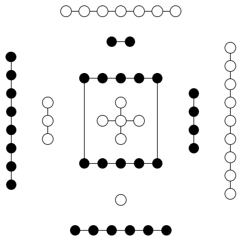
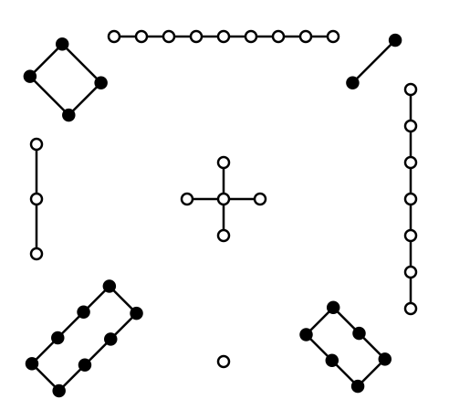

# APPENDIX VIII

<a id="p-14"/>

It is a moot question who first multiplied the figures from the trigrams universally ascribed to [Fú Xī](https://en.wikipedia.org/wiki/Fuxi) to the 64 hexagrams of the `Yì Jīng`([易经](https://ctext.org/book-of-changes/yi-jing)) The more common view is that it was king [Wén](https://en.wikipedia.org/wiki/King_Wen_of_Zhou); but [Zhū Xī](https://en.wikipedia.org/wiki/Zhu_Xi), when he was questioned on the subject, rather inclined to hold that [Fú Xī](https://en.wikipedia.org/wiki/Fuxi) had multiplied them himself, but declined to say whether he thought that their names were as old as the figures themselves, or only dated from the twelfth century B.C. I will not venture to controvert his opinion about the multiplication of the figures, but I must think that the names, as we have them now, were from king [Wén](https://en.wikipedia.org/wiki/King_Wen_of_Zhou).

No Chinese writer has tried to explain why the framers stopped with the 64 hexagrams, instead of going on to `128 figures of 7 lines`, `256 of 8`, `512 of 9`, and so on indefinitely. No reason can be given for it, but the cumbrousness of the result, and the impossibility of dealing, after the manner of king [Wén](https://en.wikipedia.org/wiki/King_Wen_of_Zhou), with such a mass of figures.

[The 73rd paragraph of Section I](appendix03s1.md#p-374), with but one paragraph between it and the two others which we have been considering, gives what may be considered a third account of the origin of the lineal figures: -- 'Heaven produced the spirit-like things (the tortoise and the divining plant), and the sages took advantage of them. (The operations of) heaven and earth are marked by so many changes and transformations, and the sages imitated them (by means of the [Yì Jīng](https://ctext.org/book-of-changes). Heaven hangs out its (brilliant) figures, from which are seen good fortune and bad, and the sages made their emblematic interpretations accordingly. The Ho gave forth the scheme or map, and the Lo gave forth the writing, of (both of) which the sages took advantage.'

The words with which we have at present to do are 'The `Hé`([河](https://ctext.org/dictionary.pl?if=en&char=%E6%B2%B3), that is, the Yellow River) gave forth the Map.' This map, according to tradition and popular belief, contained a scheme which served as a model to [Fú Xī](https://en.wikipedia.org/wiki/Fuxi) in making his 8 trigrams. Apart from this passage in the [Yì Jīng](https://ctext.org/book-of-changes), we know that Confucius believed in such a map, or spoke at least as if he did. In the '[Record of Rites](https://ctext.org/liji)' it is said that '*the map was borne by a horse*;' and the thing, whatever it was, is mentioned in the [Shū Jīng](https://ctext.org/shang-shu) as still preserved at court, among other curiosities, in B.C. 1079. The story of it, as now current, is this, that `a dragon-horse` issued from the Yellow River, bearing on its back an arrangement of marks, from which [Fú Xī](https://en.wikipedia.org/wiki/Fuxi) got the idea of the trigrams.

<a id="p-15"/>

All this is so evidently fabulous that it seems a waste of time to enter into any details about it. My reason for doing so is a wish to take advantage of the map in giving such a statement of the rules observed in interpreting the figures as is necessary in this Introduction.



The map that was preserved, it has been seen, in the eleventh century B.C., afterwards perished, and though there was much speculation about its form from the time that the restoration of the ancient classics was undertaken in the [Hàn dynasty](https://en.wikipedia.org/wiki/Han_dynasty), the first delineation of it given to the public was in the reign of [Huī Zōng](https://en.wikipedia.org/wiki/Emperor_Huizong_of_Song) of the Sòng dynasty (A. D. 1101-1125). The most approved scheme of it is the following: -- It will be observed that the markings in this scheme are small circles, pretty nearly equally divided into dark and light. All of them whose numbers are odd are light circles, `1, 3, 5, 7, 9`; and all of them whose numbers are even are dark, -- `2, 4, 6, 8, 10`. This is given as the origin of what is said in [paragraphs 49 and 50 of Section I](appendix03s1.md#fr_262) about the numbers of heaven and earth. The difference in the colour of the circles occasioned the distinction of them and of what they signify into `yīng` and `yáng`, the `dark` and the `bright`, the `moon-like` and the `sun-like`; for the `sun` is called the `Great Brightness`(`Tài Yáng`[太阳](https://g.co/kgs/me9gT6)), and the `moon` is called the `Great Obscurity`(`Tài Yīng`[太阴](https://en.wikipedia.org/wiki/Moon)). I shall have more to say in the next chapter on the application of these names. [Fú Xī](https://en.wikipedia.org/wiki/Fuxi) in making the trigrams, and king [Wén](https://en.wikipedia.org/wiki/King_Wen_of_Zhou), if it was he who first multiplied them to the 64 hexagrams, found it convenient to use lines instead of the circles: -- the whole line (<font size="5">⚊</font>) for the bright circle (○), and the divided line (<font size="5">⚋</font>) for the dark (●). The first, the third, and the fifth lines in a hexagram, if they are 'correct' as it is called, should all be whole, and the second, fourth, and sixth lines should all be divided. `Yáng` lines are strong (or hard), and `Yīn` lines are weak (or soft). The former indicate vigour and authority; the latter, feebleness and submission. It is the part of the former to command; of the latter to obey.

<a id="p-16"/>

The lines, moreover, in the two trigrams that make up the hexagrams, and characterise the subjects which they represent, are related to one another by their position, and have their significance modified accordingly. The first line and the fourth, the second and the fifth,. the third and the sixth are all correlates; and to make the correlation perfect the two members of it should be lines of different qualities, one whole and the other divided. And, finally, the middle lines of the trigrams, the second and fifth, that is, of the hexagrams, have a peculiar value and force. If we have a whole line (<font size="5">⚊</font>) in the fifth place, and a divided line (<font size="5">⚋</font>) in the second, or vice versa, the correlation is complete. Let the subject of the fifth be the sovereign or a commander-in-chief, according to the name and meaning of the hexagram, then the subject of the second will be an able minister or a skilful officer, and the result of their mutual action will be most beneficial and successful. It is specially important to have a clear idea of the name of the hexagram, and of the subject or state which it is intended to denote. The significance of all the lines comes thus to be of various application, and will differ in different hexagrams.

<a id="p-17"/>

I have thus endeavoured to indicate how the lineal figures were formed, and the principal rules laid down for the interpretation of them. The details are wearying, but my position is like that of one who is called on to explain an important monument of architecture, very bizarre in its conception and execution. A plainer, simpler structure might have answered the purpose better, but the architect had his reasons for the plan and style which he adopted. If the result of his labours be worth expounding, we must not grudge the study necessary to detect his processes of thought, nor the effort and time required to bring the minds of others into sympathy with his.

My own opinion, as I have intimated, is, that the second, account of the origin of the trigrams and hexagrams is the true one. However the idea of the whole and divided lines arose in the mind of the first framer, we must start from them; and then, manipulating them in the manner described, we arrive, very easily, at all the lineal figures, and might proceed to multiply them to billions. We cannot tell who devised the third account of their formation from the map or scheme on the dragon-horse of the, Yellow River. Its object, no doubt, was to impart a supernatural character to the trigrams and produce a religious veneration for them. It may be doubted whether the scheme as it is now fashioned be the correct one, -- such as it was in the [Zhōu dynasty](https://en.wikipedia.org/wiki/Zhou_dynasty). The paragraph where it is mentioned, goes on to say -- 'The [Luò Shū](https://zh.wikipedia.org/wiki/河圖洛書#洛書的形成) produced the writing.' This writing was a scheme of the same character as the [Hé Tú](https://zh.wikipedia.org/wiki/河圖洛書#河圖的形成), but on the back of a tortoise, which emerged from the [river Luò](https://en.wikipedia.org/wiki/Luo_River_(Henan)), and showed it to [the Great Yǚ](https://en.wikipedia.org/wiki/Yu_the_Great), when he was engaged in his celebrated work of draining off the waters of the flood, as related in the [Shū Jīng](https://ctext.org/shang-shu). To the hero sage it suggested `the Great Plan`, an interesting but mystical document of the same classic, `a Treatise`, according to [Gaubil](https://en.wikipedia.org/wiki/Antoine_Gaubil), of `Physics, Astrology, Divination, Morals, Politics, and Religion`, the great model for the government of the kingdom. The accepted representation of this writing is the following: --

<a id="p-18"/>



But substituting numbers for the number of marks, we have:

| 4 | 9 | 2 | 
| :-: | :-: | :-: |
| 3 | 5 | 7 | 
| 8 | 1 | 6 | 

This is nothing but the arithmetical puzzle, in which the numbers from `1 to 9` are arranged so as to make `15` in whatever way we add them. If we had the original form of '[the River Map](#p-15),' we should probably find it a numerical trifle, not more difficult, not more supernatural, than this magic square.

<a id="p-26"/>

1. Two things have to be considered in this chapter: -- the authorship of the Appendixes, and their contents. The Text is ascribed, without dissentient voice, to king [Wén](https://en.wikipedia.org/wiki/King_Wen_of_Zhou), the founder of the [Zhōu dynasty](https://en.wikipedia.org/wiki/Zhou_dynasty), and his son [Dàn](https://en.wikipedia.org/wiki/Duke_of_Zhou), better known as the [duke of Zhōu](https://en.wikipedia.org/wiki/Duke_of_Zhou); and I have, in the preceding chapters, given reasons for accepting that view. As regards the portion ascribed to king [Wén](https://en.wikipedia.org/wiki/King_Wen_of_Zhou), the evidence of the third of the Appendixes and the statement of [Sī Mǎ Qiān](http://en.wikipedia.org/wiki/Sima_Qian) are as positive as could be desired; and as regards that ascribed to his son, there is no ground for calling in question the received tradition. The Appendixes have all been ascribed to Confucius, though not with entirely the same unanimity. Perhaps I have rather intimated my own opinion that this view cannot be sustained. I have pointed out that, even if it be true, between six and seven centuries elapsed after the Text of the classic appeared before the Appendixes were written; and I have said that, considering this fact, I cannot regard its two parts as a homogeneous whole, or as constituting one book in the ordinary acceptation of that name. Before entering on the question of the authorship, a very brief statement of the nature and number of the Appendixes will be advantageous.

<a id="p-27"/>

2. They are reckoned to be ten, and called the [Shí Yì](https://en.wikipedia.org/wiki/Ten_Wings) or `Ten Wings`. They are in reality not so many; but the Text is divided into two sections, called the Upper and Lower, or, as we should say, the first and second, and then the commentary on each section is made to form a separate Appendix. I have found it more convenient in the translation which follows to adopt a somewhat different arrangement.

[The first Appendix](appendix01s1.md), [in two sections](appendix01s2.md), embraces the first and second `wings`, consisting of remarks on the paragraphs by king [Wén](https://en.wikipedia.org/wiki/King_Wen_of_Zhou) in the two parts of the Text.

[The second Appendix](appendix02s1.md), [in two sections](appendix02s2.md), embraces the third and fourth `wings`, consisting of remarks on the symbolism of the [duke of Zhōu](https://en.wikipedia.org/wiki/Duke_of_Zhou) in his explanation of the individual lines of the hexagrams.

[The third Appendix](appendix03s1.md), [in two sections](appendix03s2.md), embraces the fifth and sixth `wings`, which bear the name in Chinese of 'Appended Sentences,' and constitute what is called by many 'the Great Treatise.' Each wing has been divided into twelve chapters of very different length, and I have followed this arrangement in my sections. This is the most important Appendix. It has less of the nature of commentary than the previous four wings. While explaining much of what is found in the Text, it diverges to the origin of the trigrams, the methods pursued in the practice of divination, the rise of many arts in the progress of civilisation, and other subjects.

[The fourth Appendix](appendix04s1.md), also [in two sections](appendix04s2.md), forms the seventh `wing`. It is confined to an amplification of the expositions of the first and second hexagrams by king Wăn and his son, purporting to show how they may be interpreted of man's nature and doings.

[The fifth Appendix](appendix05s1.md) is the eighth `wing`, called 'Discourses on the Trigrams.' It treats of the different arrangement of these in respect of the seasons of the year and the cardinal points by Fû-hsî and king Wăn. It contains also one paragraph, which might seem to justify the view that there is a mythology in the [Yì Jīng](https://ctext.org/book-of-changes).

<a id="p-28"/>

[The sixth Appendix](appendix06s1.md#section-i), [in two sections](appendix06s1.md#section-ii), is the ninth `wing`, -- 'a Treatise on the Sequence of the Hexagrams,' intended to trace the connexion of meaning between them in the order in which they follow one another in the Text of king [Wén](https://en.wikipedia.org/wiki/King_Wen_of_Zhou).

[The seventh Appendix](appendix07s1.md) is the tenth `wing`, an exhibition of the meaning of the 64 hexagrams, not taken in succession, but promiscuously and at random, as they approximate to or are opposed to one another in meaning.

3. Such are the Appendixes of the [Yì Jīng](https://ctext.org/book-of-changes). We have to enquire next who wrote them, and especially whether it be possible to accept the dictum that they were all written by Confucius. If they have come down to us, bearing unmistakeably the stamp of the mind and pencil of the great sage, we cannot but receive them with deference, not to say with reverence. If, on the contrary, it shall appear that with great part of them he had nothing to do, and that it is not certain that any part of them is from him, we shall feel entirely at liberty to exercise our own judgment on their contents, and weigh them in the balances of our reason.

None of the Appendixes, it is to be observed, bear the superscription of Confucius. There is not a single sentence in any one of them ascribing it to him. I gave in the first chapter, the earliest testimony that these treatises were produced by him. It is that of [Sī Mǎ Qiān](http://en.wikipedia.org/wiki/Sima_Qian), whose '[Historical Records](https://en.wikipedia.org/wiki/Records_of_the_Grand_Historian)' must have appeared about the year 100 before our era. He ascribes all the Appendixes, except the last two of them, which he does not mention at all, expressly to Confucius; and this, no doubt, was the common belief in the fourth century after the sage's death.

<a id="p-29"/>

But when we look for ourselves into the third and fourth Appendixes -- the fifth, sixth, and seventh `wings` -- both 
The third and fourth Appendixes evidently not from Confucius of which are specified by [Qián](https://ctext.org/book-of-changes/qian), we find it impossible to receive his statement about them. What is remarkable in both parts of the third is, the frequent occurrence of the formula, 'The Master said,' familiar to all readers of the Confucian Analects. Of course, the sentence following that formula, or the paragraph covered by it, was, in the judgment of the writer, in the language of Confucius; but what shall we say of the portions preceding and following? If he were the author of them, he would not thus be distinguishing himself from himself. The formula occurs in [the third Appendix](appendix03s1.md) at least twenty-three times. Where we first meet with it, [Zhū Xī](https://en.wikipedia.org/wiki/Zhu_Xi) has a note to the effect that 'the Appendixes having been all made by Confucius, he ought not to be himself introducing the formula, "The Master said;" and that it may be presumed, wherever it occurs, that it is a subsequent addition to the Master's text.' One instance will show the futility of this attempt to solve the difficulty. The tenth chapter of Section I commences with [the 59th paragraph](appendix03s1.md#fr_263): --

> 'In the [Yì Jīng](https://ctext.org/book-of-changes) there are `four things` characteristic of the way of the sages. We should set the highest value on its explanations, to guide us in speaking; on its changes, for the initiation of our movements; on its emblematic figures, for definite action, as in the construction of implements; and on its prognostications, for our practice of divination.'

This is followed by seven paragraphs expanding its statements, and we come to the last one of the chapter which says, -- 'The Master said, "Such is the import of the statement that there are `four things` in the [Yì Jīng](https://ctext.org/book-of-changes), characteristic of the way of the sages."' I cannot understand how it could be more fully conveyed to us that the compiler or compilers of this Appendix were distinct from the Master whose words they quoted, as it suited them, to confirm or illustrate their views.

[In the fourth Appendix](appendix04s1.md), again, we find a similar occurrence of the formula of quotation. It is much shorter than the third, and the phrase, 'The Master said,' does not come before us so frequently; but in the thirty-six paragraphs that compose the first section we meet with it six times.

<a id="p-30"/>

Moreover, the first three paragraphs of this Appendix are older than its compilation, which could not have taken place till after the death of Confucius, seeing it professes to quote his words. They are taken in fact from a narrative of the [Zuǒ Zhuàn](https://en.wikipedia.org/wiki/Zuo_Zhuan), as having been spoken by a marchioness-dowager of [Lǔ](https://en.wikipedia.org/wiki/Lu_(state)) fourteen years before Confucius was born. To account for this is a difficult task for the orthodox critics among the Chinese literati. [Zhū Xī](https://en.wikipedia.org/wiki/Zhu_Xi) attempts to perform it in this way: -- that anciently there was the explanation given in these paragraphs of the four adjectives employed by king [Wén](https://en.wikipedia.org/wiki/King_Wen_of_Zhou) to give the significance of the first hexagram; that it was employed by [Mù Jiàng](https://en.wikipedia.org/wiki/Carpentry) of [Lǔ](https://en.wikipedia.org/wiki/Lu_(state)) (also called [Lǔ Bān](https://en.wikipedia.org/wiki/Lu_Ban)); and that Confucius also availed himself of it, while the chronicler used, as be does below, the phraseology of 'The Master said,' to distinguish the real words of the sage from such ancient sayings. But who was `the chronicler`? No one can tell. The legitimate conclusion from KO's criticism is, that so much of the Appendix as is preceded by 'The Master said' is from Confucius, -- so much and no more. I am thus obliged to come to the conclusion that Confucius had nothing to do with the composition of these two Appendixes, and that they were not put together till after his death. I have no pleasure in differing from the all but unanimous opinion of Chinese critics and commentators. What is called `the destructive criticism` has no attractions for me; but when an opinion depends on the argument adduced to support it, and that argument turns out to be of no weight, you can no longer set your seal to this, that the opinion is true. This is the position in which an examination of the internal evidence as to the authorship of the third and fourth Appendixes has placed me. Confucius could not be their author. This conclusion weakens the confidence which we have been accustomed to place in the view that '[the ten wings](https://en.wikipedia.org/wiki/Ten_Wings)' were to be ascribed to him unhesitatingly. The view has broken down in the case of three of them; -- possibly there is no sound reason for holding the Confucian origin of the other seven.

<a id="p-31"/>

I cannot henceforth maintain that origin save with bated breath. This, however, can be said for the first two Appendixes in my arrangement, that there is no evidence against their being Confucian like the fatal formula, 'The Master said.' So it is with a good part of [the fifth Appendix](appendix05s1.md); but the concluding paragraphs of it, as well as the seventh Appendix, and the sixth also in a less degree, seem too trivial to be the production of the great man. As a translator of every sentence both in the Text and the Appendixes, I confess my sympathy with P. Regis, when he condenses the fifth Appendix into small space, holding that the 8th and following paragraphs are not worthy to be translated. 'They contain,' he says, 'nothing but the mere enumeration of things, some of which may be called `Yáng`, and others `Yīn`, without any other cause for so thinking being given. Such a method of procedure would be unbecoming any philosopher, and it cannot be denied to be unworthy of Confucius, the chief of philosophers.'

I could not characterise Confucius as 'the chief of philosophers,' though he was a great moral philosopher, and has been since he went out and in among his disciples, the best teacher of the Chinese nation. But from the first time my attention was directed to the [Yì Jīng](https://ctext.org/book-of-changes), I regretted that he had stooped to write the parts of the Appendixes now under remark. It is a relief not to be obliged to receive them as his. Even the better treatises have no other claim to that character besides the voice of tradition, first heard nearly 400 years after his death.

4. I return to the Appendixes, and will endeavour to give a brief, but sufficient, account of their contents.

The first bears in Chinese the name of `Tuàn Zhuàn`(彖传), '[Treatise on the Thwan](https://ctext.org/book-of-changes/tuan-zhuan),' `tuàn` being the name given to the paragraphs in which [Wén](https://en.wikipedia.org/wiki/King_Wen_of_Zhou) expresses his sense of the significance of the hexagrams. He does not tell us why he attaches to each hexagram such and such a meaning, nor why he predicates good fortune or bad fortune in connexion with it, for he speaks oracularly, after the manner of a diviner. It is the object of the writer of this Appendix to show the processes of king [Wén](https://en.wikipedia.org/wiki/King_Wen_of_Zhou)'s thoughts in these operations, how he looked at the component trigrams with their symbolic intimations, their attributes and qualities, and their linear composition, till he could not think otherwise of the figures than he did. All these considerations are sometimes taken into account, and sometimes even one of them is deemed sufficient. In this way some technical characters appear which are not found in the Text. The lines, for instance, and even whole trigrams are distinguished as `kāng and gāo`(亢, 高), `hard or strong` and `weak or soft`. The phrase `Guǐ Shén`, `spirits`, or `spiritual beings`, occurs, but has not its physical signification of 'the contracting and expanding energies or operations of nature.' The names `Yīn` and `Yáng`, [mentioned above](#p-15), do not present themselves.

<a id="p-32"/>

I delineated, on p. 11, the eight trigrams of [Fú Xī](https://en.wikipedia.org/wiki/Fuxi), and gave their names., with the natural objects they are said to represent, but did. not mention the attributes, the virtutes, ascribed to them. Let me submit here a table of them, with those qualities, and the points of the compass to which they are referred. I must do this because king [Wén](https://en.wikipedia.org/wiki/King_Wen_of_Zhou) made a change in the geographical arrangement of them, to which reference is made perhaps in his text and certainly in this treatise. He also is said to have formed an entirely different theory as to the things represented by the trigrams, which it will be well to give now, though it belongs properly to [the fifth Appendix](appendix05s1.md).

### Fú Xī's TRIGRAMS

| 1 | 2 | 3 | 4 | 5 | 6 | 7 | 8 |
| :-: | :-: | :-: | :-: | :-: | :-: | :-: | :-: |
| ☰ | ☱ | ☲ | ☳ | ☴ | ☵ | ☶ | ☷ |
| qián | duì | lí | zhèn | xùn | kǎn | gèn | kūn |
| Heaven,<br>the sky | Water,<br>collected as in<br>a marsh or lake | Fire, as in<br>lightning;<br>the sun | Thunder. | The wind,<br>wood. | Water, as in rain,<br>clouds, springs,<br>streams, and defiles.<br>The moon. | Hills, or<br>mountains. | The earth. |
| South | South East | East | North East | South West | West | North West | North |
| Untiring<br>strengh; power | Pleasure;<br>complacement<br>satisfaction. | Brightness;<br>elegence. | Moving,<br>exciting power. | Flexibility;<br>penetration. | Peril;<br>difficulty. | Resting; the act<br>of arresting. | Capacionsness;<br>submission. |

<a id="p-33"/>

The natural objects and phenomena thus represented are found up and down in the Appendixes. It is impossible to believe that the several objects were assigned to the several figures on any principles of science, for there is no indication of science in the matter: it is difficult even to suppose that they were assigned on any comprehensive scheme of thought. Why are `Duì`(兑) and `Kǎn`(坎) used to represent `water` in different conditions, while `Kǎn`, moreover, represents the `moon`? How is `sun` set apart to represent things so different as `wind` and `wood`? At a very early time the Chinese spoke of '[the five elements](https://en.wikipedia.org/wiki/Wuxing_(Chinese_philosophy)),' meaning `water, fire, wood, metal, and earth`; but the trigrams were not made to indicate them, and it is the general opinion that there is no reference to them in the [Yì Jīng](https://ctext.org/book-of-changes).

Again, the attributes assigned to the trigrams are learned mainly from this Appendix and [the fifth](appendix05s1.md). We do not readily get familiar with them, nor easily accept them all. It is impossible for us to tell whether they were a part of the jargon of divination before king [Wén](https://en.wikipedia.org/wiki/King_Wen_of_Zhou), or had grown up between his time and that of the author of the Appendixes.

King [Wén](https://en.wikipedia.org/wiki/King_Wen_of_Zhou) altered the arrangement of the trigrams so that not one of them should stand at the same point of the compass as in the ancient plan. He made them also representative of certain relations among themselves, as if they composed a family of parents and children. It will be sufficient at present to give a table of his scheme.

### King Wén's TRIGRAMS

| 1 | 2 | 3 | 4 | 5 | 6 | 7 | 8 |
| :-: | :-: | :-: | :-: | :-: | :-: | :-: | :-: |
| ☲ | ☴ | ☳ | ☶ | ☵ | ☰ | ☱ | ☷ |
| lí | xùn | zhèn | gèn | kǎn | qián | duì | kūn |
| Second daughter. | Oldest daughter. | Oldest son. | Youngest son. | Second son. | Father. | Youngest daughter. | Monther. |
| South | South Eest | Eest | North East | North | North West | West | South West |

<a id="p-34"/>

There is thus before us the apparatus with which the writer of the Appendix accomplishes his task. Let me select one of the shortest instances of his work. The [fourteenth hexagram](e5a4a7e69c89dayou.md) is <font size="10">䷍</font> , called `Dà Yǒu`, and meaning `Possessing in great abundance`. King [Wén](https://en.wikipedia.org/wiki/King_Wen_of_Zhou) saw in it the symbol of a government prosperous and realising all its proper objects; but all that he wrote on it was '[**䷍ Dà Yǒu**](e5a4a7e69c89dayou.md) (indicates) great progress and success.' Unfolding that view of its significance, the Appendix says: --

> 'In `Dà Yǒu` the weak (line) has the place of honour, is grandly central, and (the strong lines) above and below respond to it. Hence comes its name of "Possession of what is great." The attributes (of its constituent trigrams, khien and lî) are strength and vigour, elegance and brightness. (The ruling line in it) responds to (the ruling line in the symbol of) heaven, and its actings are (consequently all) at the proper times. Thus it is that it is said to indicate great progress and success.'

In a similar way the paragraphs on all the other 63 hexagrams are gone through; and, for the most part, with success. The conviction grows upon the student that the writer has on the whole apprehended the mind of king [Wén](https://en.wikipedia.org/wiki/King_Wen_of_Zhou).

I stated, that the name `Guǐ Shén` occurs in [this Appendix](#p-32). It has not yet, however, received the semi-physical, semi-metaphysical signification which the comparatively modern scholars of [the Sòng dynasty]() give to it. There are two passages where it is found; -- the second paragraph on [**䷀ Qián**](e4b9beqian.md#1.2), the [fifteenth hexagram](e8b0a6qian.md), and [the third](e5b1afzhun.md) on [Fāng](https://en.wikipedia.org/wiki/Guifang), [the fifty-fifth](e4b8b0feng.md). By consulting them the reader will be able to form an opinion for himself. The term `guǐ`([鬼](https://ctext.org/dictionary.pl?if=en&char=鬼)) denotes specially the human spirit disembodied, and `shén`([神](https://ctext.org/dictionary.pl?if=en&char=神)) is used for spirits whose seat is in heaven. I do not see my way to translate them, when used binomially together, otherwise than by spiritual beings or spiritual agents.

<a id="p-35"/>

[Zhū Xī](https://en.wikipedia.org/wiki/Zhu_Xi) once had the following question suggested by the second of these passages put to him: -- '`Guǐ Shén` is a name for the traces of making and transformation; but when it is said that (the interaction of) heaven and earth is now vigorous and abundant, and now dull and void, growing and diminishing according to the seasons, that constitutes the traces of making and transformation; why should the writer further speak of the `Guǐ Shén`?' He replied, '*When he uses the style of "heaven and earth," he is speaking of the result generally; but in ascribing it to the `Guǐ Shén`, he is representing the traces of their effective interaction, as if there were men (that is, some personal agency) bringing it about.*' This solution merely explains the language away. When we come to the fifth Appendix, we shall understand better the views of the period when these treatises were produced.

The single character `shén`([神](https://ctext.org/dictionary.pl?if=en&char=神)) is used in explaining the `tuàn`([彖](https://ctext.org/dictionary.pl?if=en&char=彖)) on `Guà`([卦](https://ctext.org/dictionary.pl?if=en&char=卦)), [the twentieth hexagram](e590a6pi.md), where we read: --

'In `Guà` we see the spirit-like way of heaven, through which the four seasons proceed without error. The sages, in accordance with (this) spirit-like way, laid down their instructions, and all under heaven yield submission to them.'

The author of the Appendix delights to dwell on the changing phenomena taking place between heaven and earth, and which he attributes to their interaction; and he was penetrated evidently with a sense of the harmony between the natural and spiritual worlds. It is this sense, indeed, which vivifies both the `tuàn` and the explanation of them.

<a id="p-36"/>

5. We proceed to the second Appendix, which professes to do for the [duke of Zhōu](https://en.wikipedia.org/wiki/Duke_of_Zhou)'s symbolical exposition of the several lines what the `Tuàn Zhuàn`([彖传](https://ctext.org/book-of-changes/tuan-zhuan)) does for the entire figures. The work here, however, is accomplished with less trouble and more briefly. The whole bears the name of `Xiàng Zhuàn`([象传](https://ctext.org/book-of-changes/xiang-zhuan)), 'Treatise on the Symbols' or 'Treatise on the Symbolism (of the `Yì Jīng`([易经](https://ctext.org/book-of-changes/yi-jing))).' If there were reason to think that it came in any way from Confucius, I should fancy that I saw him sitting with a select class of his disciples around him. They read the [duke]((https://en.wikipedia.org/wiki/Duke_of_Zhou))'s Text column after column, and the master drops now a word or two, and now a sentence or two, that illuminate the meaning. The disciples take notes on their tablets, or store his remarks in their memories, and by and by they write them out with the whole of the, Text or only so much of it as is necessary. Whoever was the original lecturer, the Appendix, I think, must have grown up in this way.

It would not be necessary to speak of it at greater length, if it were not that the six paragraphs on the symbols of the [duke of Zhōu](https://en.wikipedia.org/wiki/Duke_of_Zhou) are always preceded by one which is called '[the Great Symbolism](https://ctext.org/book-of-changes/xiang-zhuan),' and treats of the trigrams composing the hexagram, how they go together to form the six-lined figure, and how their blended meaning appears in the institutions and proceedings of the great men and kings of former days, and of the superior men of all time. The paragraph is for the most part, but by no means always, in harmony with the explanation of the hexagram by king [Wén](https://en.wikipedia.org/wiki/King_Wen_of_Zhou), and a place in the `Tuàn Zhuàn`([彖传](https://ctext.org/book-of-changes/tuan-zhuan)) would be more appropriate to it. I suppose that, because it always begins with the mention of the two symbolical trigrams, it is made, for the sake of the symmetry, to form a part of the [treatise on the Symbolism](https://ctext.org/book-of-changes/xiang-zhuan) of the [Yì Jīng](https://ctext.org/book-of-changes/yi-jing).

I will give a few examples of the paragraphs of [the Great Symbolism](https://ctext.org/book-of-changes/xiang-zhuan). The first hexagram <font size="10">䷀</font> is formed by a repetition of the trigram <font size="5">☰</font> `Qián`([乾](https://ctext.org/dictionary.pl?if=en&char=乾)) representing heaven, and it is said on it: -- '*Heaven in its motion (gives) the idea of strength. The superior man, in accordance with this, nerves himself to ceaseless activity.*'

The second hexagram <font size="10">䷁</font> is formed by a repetition of the trigram <font size="5">☷</font>`Kūn`([坤](https://ctext.org/dictionary.pl?if=en&char=坤)) representing the earth, and it is said on it: -- '*The capacious receptivity of the earth is what is denoted by Kūn. The superior man, in accordance with this, with his large virtue, supports men and things.*'

<a id="p-37"/>

The [forty-fourth hexagram](e5a7a4gou.md), called <font size="10">䷫</font>`Gòu`([姤](https://ctext.org/dictionary.pl?if=en&char=姤)), is formed by the trigrams <font size="5">☴</font>`Xùn`([巽](https://ctext.org/dictionary.pl?if=en&char=巽)), representing wind, and <font size="5">☰</font>`Qián`([乾](https://ctext.org/dictionary.pl?if=en&char=乾)) representing heaven or the sky, and it is said on it: -- '*(The symbol of) wind, beneath that of the sky, forms Gòu. In accordance with this, the sovereign distributes his charges, and promulgates his announcements throughout the four quarters (of the kingdom).*'

The [fifty-ninth hexagram](e6b6a3huan.md), called <font size="10">䷺</font>`Huàn`([涣](https://ctext.org/dictionary.pl?if=en&char=涣)) is formed by the trigrams <font size="5">☵</font>`Kǎn`([坎](https://ctext.org/dictionary.pl?if=en&char=坎)), representing water, and <font size="5">☴</font>`Xùn`([巽](https://ctext.org/dictionary.pl?if=en&char=巽)), representing wind, and it is said on it: -- '*(The symbol of) water and (that of wind) above it form Huàn. The ancient kings, in accordance with this, presented offerings to God, and established the ancestral temple.*' The union of the two trigrams suggested to king [Wén](https://en.wikipedia.org/wiki/King_Wen_of_Zhou) the idea of dissipation in the alienation of men from the Supreme Power, and of the minds of parents from their children; a condition which the wisdom of the ancient kings saw could best be met by the influences of religion.

One more example. The [twenty-sixth hexagram](e5a4a7e89384daxu.md), called <font size="10">䷙</font>`Dà Xù`([大畜](https://ctext.org/dictionary.pl?if=en&char=大畜)), is formed of the trigrams <font size="5">☰</font>`Qián`([乾](https://ctext.org/dictionary.pl?if=en&char=乾)), representing heaven or the sky, and <font size="5">☶</font>`Gèn`([艮](https://ctext.org/dictionary.pl?if=en&char=艮)), representing a mountain, and it is said on it: -- '*(The symbol of) heaven in the midst of a mountain forms Dà Xù. The superior man, in accordance with this, stores largely in his memory the words of former men and their conduct, to subserve the accumulation of his virtue.*' We are ready to exclaim and ask, 'Heaven, the sky, in the midst of a mountain! Can there be such a thing?' and [Zhū Xī](https://en.wikipedia.org/wiki/Zhu_Xi) will tell us in reply, '*No, there cannot be such a thing in reality; but you can conceive it for the purpose of the symbolism.*'

From this and the other examples adduced from [the Great Symbolism](https://ctext.org/book-of-changes/xiang-zhuan), it is clear that, so far as its testimony bears on the subject, [the trigrams](Bagua-name-earlier.svg) of [Fú Xī](https://en.wikipedia.org/wiki/Fuxi) did not receive their form and meaning with a deep intention that they should serve as the basis of a philosophical scheme concerning the constitution of heaven and earth and all that is in them. In this Appendix they are used popularly, just as one
```
'Finds tongues in trees, books in the running brooks,
Sermons in stones, and good in everything.'
```

<a id="p-38"/>

The writer moralises from them in an edifying manner. There is ingenuity, and sometimes instruction also, in what he says, but there is no mystery. Chinese scholars and gentlemen, however, who have got some little acquaintance with western science, are fond of saying that all the truths of electricity, heat, light, and other branches of European physics, are in the eight trigrams. When asked how then they and their countrymen have been and are ignorant of those truths, they say that they have to learn them first from western books, and then, looking into the [Yì Jīng](https://ctext.org/book-of-changes/yi-jing), they see that they were all known to Confucius more than 2000 years ago. The vain assumption thus manifested is childish; and until the Chinese drop their hallucination about the [Yì Jīng](https://ctext.org/book-of-changes/yi-jing) as containing all things that have ever been dreamt of in all philosophies, it will prove a stumbling-block to them, and keep them from entering on the true path of science.
