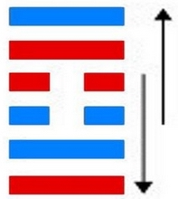

# ䷼ Zhōng Fú

* Inmost Sincerity

> Chinese: zhōng fú 中孚 ䷼

<a id="p-199"/>

**䷼ Zhōng Fú** (moves even) pigs and fish, and leads to good fortune. There will be advantage in crossing the great stream. There will be advantage in being firm and correct.

1.<a id="61.1"/> The first `NINE`, undivided, shows its subject resting (in himself). There will be good fortune. If he sought to any other, he would not find rest.

> **䷼** changing to [**䷺**](e6b6a3huan.md#59.1)

> Matching Line 1 in Adjacent Hexagram: [**䷽**](e5b08fe8bf87xiaoguo.md#62.1)

2.<a id="61.2"/> The second `NINE`, undivided, shows its subject (like) the crane crying out in her hidden retirement, and her young ones responding to her. (It is as if it were said), 'I have a cup of good spirits,' (and the response were), 'I will partake of it with you.'

> **䷼** changing to [**䷩**](e79b8ayi.md#42.2)

> Matching Line 2 in Adjacent Hexagram: [**䷽**](e5b08fe8bf87xiaoguo.md#62.2)

3.<a id="61.3"/> The third `SIX`, divided, shows its subject having met with his mate. Now he beats his drum, and now he leaves off. Now he weeps, and now he sings.

> **䷼** changing to [**䷈**](e5b08fe7959cxiaoxu.md#9.3)

> Matching Line 3 in Adjacent Hexagram: [**䷽**](e5b08fe8bf87xiaoguo.md#62.3)

<a id="p-200"/>

4.<a id="61.4"/> The fourth `SIX`, divided, shows its subject (like) the moon nearly full, and (like) a horse (in a chariot) whose fellow disappears. There will be no error.

> **䷼** changing to [**䷉**](e5b1a5lv.md#10.4)

> Matching Line 4 in Adjacent Hexagram: [**䷽**](e5b08fe8bf87xiaoguo.md#62.4)

5.<a id="61.5"/> The fifth `NINE`, undivided, shows its subject perfectly sincere, and linking (others) to him in closest union. There will be no error.

> **䷼** changing to [**䷨**](e68d9fsun.md#41.5)

> Matching Line 5 in Adjacent Hexagram: [**䷽**](e5b08fe8bf87xiaoguo.md#62.5)

6.<a id="61.6"/> The topmost `NINE`, undivided, shows its subject in chanticleer (trying to) mount to heaven. Even with firm correctness there will be evil.

> **䷼** changing to [**䷻**](e88a82jie.md#60.6)

> Matching Line 6 in Adjacent Hexagram: [**䷽**](e5b08fe8bf87xiaoguo.md#62.6)

## Notes

**䷼ Zhōng Fú**, the name of this hexagram, may be represented in English by `Inmost Sincerity`. It denotes the highest quality of man, and gives its possessor power so that he prevails with spiritual beings, with other men, and with the lower creatures. It is the subject of the '[Doctrine of the Mean](https://ctext.org/liji/zhong-yong/ens)' from the 21st chapter onwards, where Remusat rendered it by `perfection`, `moral perfection`, and Intorcetta and his coadjutors by `True solid perfect`. The lineal figure has suggested to the Chinese commentators, from the author of the first Appendix, two ideas in it which deserve to be pointed out. There are two divided lines in the centre and two undivided below them and above them. The divided lines in the centre are held to represent the heart or mind free from all pre-occupation, without any consciousness of self; and the undivided lines, on each side of it, in the centre of the constituent trigrams **☱** **☴** are held to denote the solidity of the virtue of one so free from selfishness. There is no unreality in it, not a single flaw.

The '[Daily Lecture](https://ctext.org/analects)' at the conclusion of its paraphrase of the [Tuàn](https://ctext.org/book-of-changes/tuan-zhuan) refers to the history of the ancient [Shùn](https://en.wikipedia.org/wiki/Emperor_Shun), and the wonderful achievements of his virtue. The authors give no instance of the affecting, of `pigs and fishes` by sincerity, and say that these names are symbolical of men, the rudest and most unsusceptible of being acted on. The Text says that the man thus gifted with sincerity will succeed in the most difficult enterprises. Remarkable is the concluding sentence that he must be firm and correct. Here, as elsewhere throughout the [Yì Jīng](https://ctext.org/book-of-changes), there comes out the practical character which has distinguished the Chinese people and their best teaching all along the line of history.

The translation of paragraph 1 is according to the view approved by the [Kāng Xī](https://en.wikipedia.org/wiki/Kangxi_Dictionary) editors. The ordinary view makes the other to whom the subject of line 1 looks or might look to be the subject of 4; but they contend that, excepting in the case of 3 and 6, the force of correlation should be discarded from the study of this hexagram; for the virtue of sincerity is all centred in itself, thence derived and thereby powerful.

For paragraph 2, see [Appendix III, Section i, 42](appendix03s1.md#p-361). It is in rhyme, and I have there rendered it in rhyme. The `young ones of the crane` are represented by line 1. In the third and fourth sentences we have the symbolism of two men brought together by their sympathy in virtue. The subject of the paragraph is the effect of sincerity.

The `mate` of line 3 is 6. The principle of correlation comes in. Sincerity, not left to itself, is influenced from without, and hence come the changes and uncertainty in the state and moods of the subject of the line.

Line 4 is weak, and in its correct place. The subject of it has discarded the correlate in 1, and hastens on to the confidence of the ruler in 5, being symbolised as the moon nearly full. The other symbol of the horse whose fellow has disappeared has reference to the discarding of the subject of 1. Anciently chariots and carriages were drawn by four horses, two outsides and two insides. Lines 1 and 4 were a pair of these; but 1 disappears here from the team, and 4 goes on and joins 5.

Line 5 is strong and central, in the ruler's place. Its subject must be the sage on the throne, whose sincerity will go forth and bind all in union with himself.

Line 6 should be divided, but is undivided; and coming after 5, what can the subject of it do? His efforts will be ineffectual, and injurious to himself. He is symbolised by a cock -- literally, `the plumaged voice`. But a cock is not fitted to fly high, and in attempting to do so will only suffer hurt.
