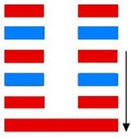

# ䷗ Fù

* Returning

> Chinese: fù 复 ䷗

<a id="p-107"/>

**䷗ Fù** indicates that there will be free course and progress (in what it denotes). (The subject of it) finds no one to distress him in his exits and entrances; friends come to him, and no error is committed . He will return and repeat his (proper) course. In seven days comes his return. There will be advantage in whatever direction movement is made.

<a id="p-108"/>

1.<a id="24.1"/> The first `NINE`, undivided, shows its subject returning (from an error) of no great extent, which would not proceed to anything requiring repentance. There will be great good fortune.

> **䷗** changing to [**䷁**](e59da4kun.md)

> Matching Line 1 in Adjacent Hexagram: [**䷖**](e589a5bo.md#23.1)

2.<a id="24.2"/> The second `SIX`, divided, shows the admirable return (of its subject). There will be good fortune.

> **䷗** changing to [**䷒**](e4b8b4lin.md)

> Matching Line 2 in Adjacent Hexagram: [**䷖**](e589a5bo.md#23.2)

3.<a id="24.3"/> The third `SIX`, divided, shows one who has made repeated returns. The position is perilous, but there will be no error.

> **䷗** changing to [**䷣**](e6988ee5a4b7mingyi.md)

> Matching Line 3 in Adjacent Hexagram: [**䷖**](e589a5bo.md#23.3)

4.<a id="24.4"/> The fourth `SIX`, divided, shows its subject moving right in the centre (among those represented by the other divided lines), and yet returning alone (to his proper path).

> **䷗** changing to [**䷲**](e99c87zhen.md)

> Matching Line 4 in Adjacent Hexagram: [**䷖**](e589a5bo.md#23.4)

5.<a id="24.5"/> The fifth `SIX`, divided, shows the noble return of its subject. There will be no ground for repentance.

> **䷗** changing to [**䷂**](e5b1afzhun.md)

> Matching Line 5 in Adjacent Hexagram: [**䷖**](e589a5bo.md#23.5)

6.<a id="24.6"/> The topmost `SIX`, divided, shows its subject all astray on the subject of returning. There will be evil. There will be calamities and errors. If with his views he put the hosts in motion, the end will be a great defeat, whose issues will extend to the ruler of the state. Even in ten years he will not be able to repair the disaster.

> **䷗** changing to [**䷚**](e9a290yi.md)

> Matching Line 6 in Adjacent Hexagram: [**䷖**](e589a5bo.md#23.6)

## Notes

**䷗ Fù** symbolises the idea of returning, coming back or over again. The last hexagram showed us inferior prevailing over superior men, all that is good in nature and society yielding before what is bad. But change is the law of nature and society. When decay has reached its climax, recovery will begin to take place. In Po we had one strong topmost line, and five weak lines below it; here we have one strong line, and five weak lines above it. To illustrate the subject from what we see in nature, -- [**䷖ Bō**](e589a5bo.md) is the hexagram of the [ninth month](../month.jpg), in which the triumph of cold and decay in the year is nearly complete. It is complete in the [tenth month](../month.jpg), whose hexagram is [**䷁ Kūn**](e59da4kun.md); then follows our hexagram **䷗ Fù**, belonging to the [eleventh month](../month.jpg), in which was the winter solstice when the sun turned back in his course, and moved with a constant regular progress towards the summer solstice. In harmony with these changes of nature are the changes in the political and social state of a nation. There is nothing in the [Yì Jīng](https://ctext.org/book-of-changes) to suggest the hope of a perfect society or kingdom that cannot be moved.

The strong bottom line is the first of **☳ Zhèn**, the trigram of movement, and the upper trigram is **☷ Kūn**, denoting docility and capacity. The strong returning line will meet with no distressing obstacle, and the weak lines will change before it into strong, and be as friends. The bright quality will be developed brighter and brighter from day to day, and [month to month](../month.jpg).

The sentence, `In seven days comes his return`, occasions some perplexity. If the reader will refer to hexagrams [44 ䷫](e5a7a4gou.md), [33 ䷠](e981afdun.md), [12 ䷋](e590a6pi.md), [20 ䷓](e8a782guan.md), [23 ䷖](e589a5bo.md), and [2 ䷁](e59da4kun.md), he will see that during [the months denoted by those figures](month.jpg), the 5th, 6th, 7th, 8th, 9th, and 10th, the `yīn` lines have gradually been prevailing over the `yáng`, until in [**䷁ Kūn**](e59da4kun.md) (hexagrams 2) they have extruded them entirely from the lineal figure.

Then comes our **䷗ Fù**, as a seventh figure, in which the `yáng` line begins to reassert itself,
and from which it goes on to extrude the `yīn` lines in their turn. Explained therefore of the months of the year, we have to take a day for a month.
And something analogous -- we cannot say exactly what -- must have place in society and the state.

The concluding auspice or oracle to him who finds this **䷗ Fù** by divination is what we might expect.

The subject of line 1 is of course the undivided line, meaning here, says [Guǎn Zǐ](https://en.wikipedia.org/wiki/Guanzi_(text)), `the way of the superior man`. There must have been some deviation from that, or `returning` could not be spoken of.

Line 2 is in its proper place, and central; but it is weak. This is more than compensated for, however, by its adherence to line 1, the fifth line not being a proper correlate. Hence the return of its subject is called excellent or admirable.

Line 3 is weak, and in the uneven place of a strong line. It is the top line, moreover, of the trigram whose attribute is movement. Hence the symbolism; but any evil issue may be prevented by a realisation of danger and by caution.

Line 4 has its proper correlate in 1; different from all the other weak lines; and its course is different accordingly.

Line 5 is in the central place of honour, and the middle line of **☷ Kūn**, denoting docility. Hence its auspice.

Line 6 is weak; and being at the top of the hexagram **䷗**, when its action of returning is all concluded, action on the part of its subject will lead to evils such as are mentioned. `Ten years` seems to be a round number, signifying a long time, as in [hexagram **䷂**, line 2](e5b1afzhun.md#3.2).
